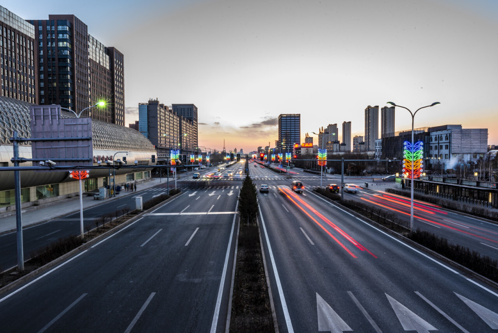
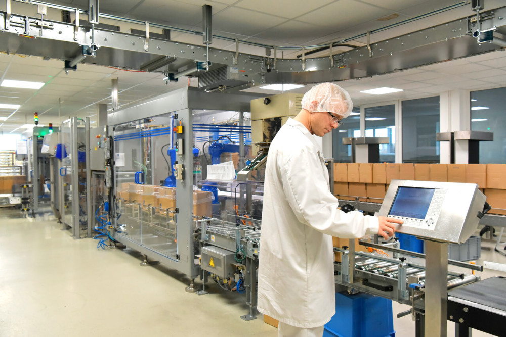

# 省会城市“卡位战”：三城增速超9%，合肥险胜济南，“抢六”成悬念

本文来源：时代周报 作者：丁远泓

各省份上半年GDP出炉后，它们的“中心”——省会城市，表现如何？

截至8月4日，已有23个省会城市均交出过去半年的经济“成绩单”。

这些省会城市致力于进行产业转型升级，稳步朝高质量发展继续前进；一提再提“稳就业”，以增加居民收入；发布一轮接着一轮的“促消费”政策，让消费成为拉动经济增长的“强引擎”。

而他们的努力也得到了体现。

从经济体量来看，广州继续领跑省会城市，成都这个在去年步入“2万亿俱乐部”的城市，也首次在半年的时间节点突破万亿GDP，杭州和武汉则紧随其后。

从实际增速来看，今年上半年，共有14个省会城市的经济增长速度不低于与全国经济增速，长春、呼和浩特、西宁的增速更是在9.0%以上，远远“跑赢”大盘。

这些“成绩”优秀的城市，具体写下了什么“答案”？

**3城实际增速超9.0%**

已经公布经济运行情况的23个省会城市中，有3个城市以高经济增速“突出重围”：长春、呼和浩特、西宁的实际增速均高于9.0%。

虽然这3个城市均在今年上半年实现高速增长，但具体情况存在不同。

3城中经济总量最高的长春，在去年2022年1-6月GDP同比下降9.9%。

也就是说，长春能在2023年上半年实现同比增长9.1%，主要是基于2022年的负增长。甚至，长春2023年上半年GDP总量为3359.97亿元，未能恢复至2021年同期水平（3435.5亿元）。

_长春市内景象 图源：图虫创意_

而呼和浩特和西宁的高经济增速，一个很重要的原因，是这2个城市的工业发展势头强劲。

以经济增速最高的西宁为例，过去半年，其GDP达到924.15亿元，按可比价计算，同比增长9.8%，高于全省3.0个百分点。

虽然第三产业的占比最高，但西宁的第二产业发展最快。分产业看，第一产业增加值为15.00亿元，增长4.5%；第二产业增加值为341.36亿元，增长17.8%；第三产业增加值为567.79亿元，增长6.1%。

其规模以上工业增加值同比增长甚至达到26.5%，增速高于全省16.9个百分点。主要贡献地，是西宁经济技术开发区。

西宁市统计局数据显示，西宁经济技术开发区规模以上工业增加值在今年上半年，同比增长37.5%，拉动全市规上工业增加值增速26.8个百分点；而区外规模以上工业增加值同比下降0.9%。

西宁经济技术开发区作为西宁传统产业向“三个千亿级产业集群和一个创新高地”的重要“跳板”，“三大产业集群”规上工业产值占开发区比重超过90%。

这与西宁目前的发展目标相符：以光伏、锂电、特色化工和合金新材料3个千亿级产业集群为主导，低碳产业、特色产业和新兴产业全面更迭升级的现代产业体系。

西宁的产业结构得到了优化，现代产业体系发展已有所成效。

2023年上半年，西宁市电气机械和器材制造业同比下降29.3%，化学原料和化学制品制造业同比下降15.1%，而计算机、通信和其他电子设备制造业同比增长151.0%，电力、热力生产和供应业同比增长9.4%。

_可以控制的智能车间 图源：图虫创意_

呼和浩特的工业生产同样增势强劲。

2023年上半年，呼和浩特GDP达到1769.2亿元，按不变价格计算，同比增长9.2%。其中，第二产业增加值616.2亿元，增长14.3%，增速高于第一产业和第三产业。

在此基础上，呼和浩特规模以上工业增加值同比增长达到19.0%，全市在统的28个行业大类中有22个行业增加值同比实现增长，增长面达78.6%。

与部分工业产业由国有企业主导的城市不同，在呼和浩特工业发展中，民营企业占据“大头”。其规模以上工业企业中，民营企业户数占比能达到73.7%。

今年1-5月，呼和浩特市工商联通过帮助企业解决再投资困难、搭建企业与地区联系平台，收集到呼和浩特市民营企业扩大投资项目8个，推动、引进区外招商引资项目4个，其中落地建设项目5个，在谈签约项目7个。

呼和浩特市2023年政府工作报告指出，要全面推行市场准入负面清单制度，支持民营企业进入公共服务和公用事业领域，释放民营经济发展潜能。

不仅如此，7月份，国家层面发布了一系列促进民营经济发展壮大的政策。这意味着，呼和浩特的民营工业企业，还能有更多机会发展。

**3城排名上升**

在尚未公布“成绩”的4个省会城市中，郑州和长沙的“抢6”大战备受关注。去年上半年，两城之间的差距还不到30亿元。

相较于2022年同期，目前已经有3个省会城市在今年上半年完成了排名的上升：除了呼和浩特超过兰州，排第22名外，还有合肥和沈阳。

 _GDP增长 图源：图虫创意_

其实济南、福州、合肥之间的排位之争，一直都没有“定数”。

2022年上半年，排名为济南、福州、合肥，2022年年底变为福州、济南、合肥，而在今年上半年，合肥成为三者中GDP最高的城市，其次为济南和福州。

这3个城市的排名“争夺赛”仍在继续，主要原因是他们的GDP体量相差不大：2023年上半年，济南与福州的差距为59.54亿元，而合肥与济南的GDP差距更是仅有0.8亿元。

Co-
Found智库秘书长张新原在接受时代周报记者采访时表示，合肥能够超越济南和福州的原因之一，是合肥在科技创新和前沿技术产业方面投入了大量资源，并成功打造了一批知名企业和科研机构，带动了经济增长。

这也与合肥上半年的经济运行情况相符。

2023年上半年，合肥市规上工业增加值同比增长7.7%，较一季度、去年同期分别加快5和3.2个百分点。从产业看，汽车及零部件、光伏及新能源产业增加值分别增长133.2%和92.2%，合计拉动规上工业增加值增长12.6个百分点。

其实近几年合肥一直在“创新”上努力。

2021年，合肥出台了《合肥市科技创新条例》，从法制层面优化了科技资源配置。树立“科技即产业”的发展理念，成立了市委科技创新委员会。

2022年，合肥净增国家高新技术企业1834户，总数达6412户、实现两年翻番。培育国家科技型中小企业8200余家、增长近七成。这一年，合肥跻身全球科技集群第55位、全球科研城市第16位，分别提升18位和4位。

不止是增加值，相关的投资也还在继续增加。

今年上半年，合肥市经济数字化转型、能源绿色转型的相关领域投资快速增长，信息传输、软件和信息技术服务业投资同比增长71.4%，创近25个月新高；光伏及新能源产业、节能环保产业投资分别增长64.1%和15.7%。

_研发人员在车间工作 图源：图虫创意_

相较于合肥以“微弱”的优势超过济南，沈阳对石家庄的超越则是“夺回”原本的位置。

在2021年，石家庄的经济体量比沈阳少139.4亿元，到了2022年上半年，石家庄超过沈阳50.1亿元。

而在2023年上半年最新公布的数据中，沈阳GDP为3725.8亿元，高出石家庄10.4亿元，完成了“反超”。

除了本身经济体量不低，张新原指出，沈阳的“反超”，还与这座城市正在谋求建设国家中心城市与重点建设沈阳都市圈有关。“这两项举措，标志着沈阳已经进入全新的城市发展阶段。”

2022年，沈阳发布《沈阳建设国家中心城市行动纲要》，明确沈阳“一枢纽四中心”功能定位，即国家现代综合枢纽、国家先进制造中心、综合性国家科学中心、区域性金融中心和区域性文化创意中心。

而在今年年初，沈阳市委副书记、市长吕志成在央视财经频道《对话》节目中透露，沈阳都市圈已正式获批，成为全国第九个、东北第一个国家级都市圈。

这个都市圈在东北三省中的“地位”不容小觑。今年上半年，沈阳都市圈地区生产总值6566亿元，占东北三省比重24.5%。

发展都市圈，不仅是协助周边城市“同城化”发展，也能为沈阳带来利好。

毕竟，中国东北振兴研究院副院长李凯曾指出，沈阳都市圈建设的主要矛盾，就是要明确沈阳经济的核心地位，要不断扩大沈阳的经济规模、人口规模，成为东北经济增长的策源地。

《沈阳市全面振兴新突破三年行动方案(2023—2025年)》也明确提出，2023—2025年，沈阳将锚定加快建设国家中心城市，聚焦实现“三个一”的目标，即GDP突破10000亿元，一般公共预算收入突破1000亿元，人口规模突破1000万人。

接下来的半年，各个省会城市还将继续“拼经济”。

