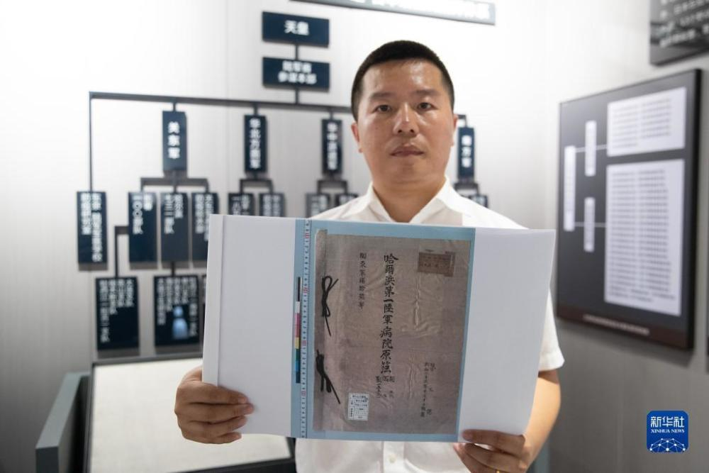
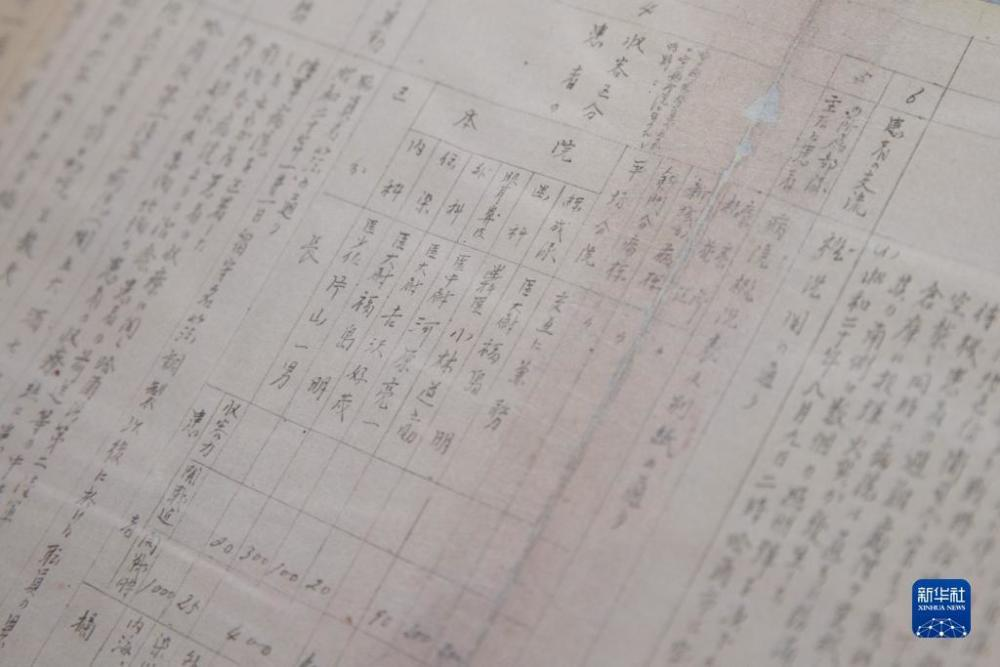
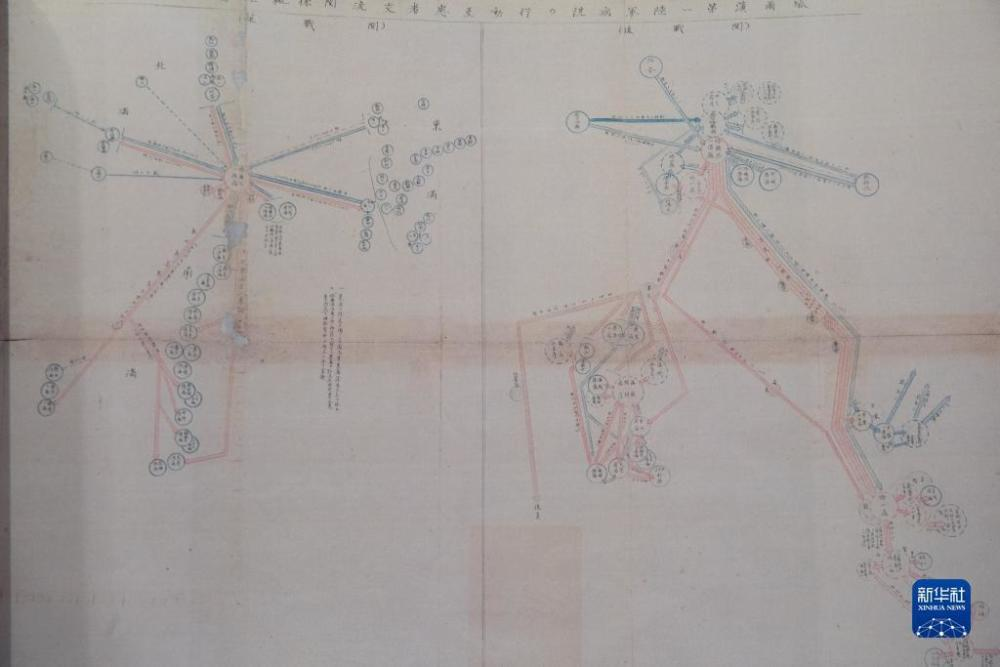
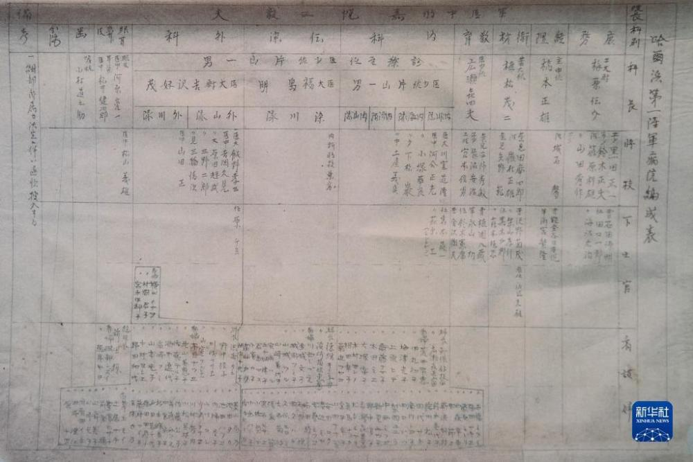
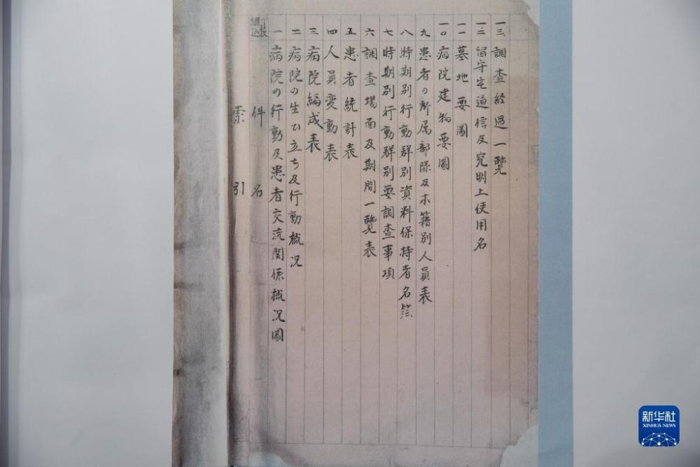

# 侵华日军731部队犯罪协同机构原始档案首次公布

_8月5日，在黑龙江省牡丹江市举办的侵华日军细菌战罪证陈列展上，研究人员展示《日军哈尔滨第一陆军病院原薄》（影印件）。_

8月5日，在黑龙江省牡丹江市举办的侵华日军细菌战与毒气战学术研讨会上，侵华日军第七三一部队（简称731部队）罪证陈列馆向社会首次公布《日军哈尔滨第一陆军病院原薄》。这份档案对于全面认知日军陆军病院的整体形态、业务流程，深化日军陆军病院参与活体解剖犯罪研究具有重要意义。

这份档案目前在黑龙江省牡丹江市举办的侵华日军细菌战罪证陈列展上展出。

新华社记者张涛摄

（来源：新华网）

