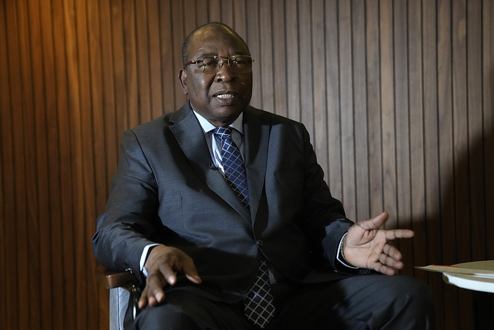

# 尼日尔总理回应在政变中被赶下台：对外交手段解决问题抱“渺茫希望”

_当地时间2023年8月1日，法国巴黎，尼日尔总理乌胡穆杜·穆罕默杜接受美联社采访。视觉中国 资料图_

尼日尔总理乌胡穆杜·穆罕默杜8月5日表示，他对通过外交手段解决危机抱有“渺茫的希望”。

据路透社8月5日报道，穆罕默杜在尼日尔近日爆发的军事政变中被赶下台。这场政变深深影响了西萨赫勒地区（western
Sahel）。这里是世界上最贫穷的地区之一，却对一些大国具有“战略意义”。

西非国家经济共同体（西共体）领导人就尼日尔政变设立了期限，要求该国军人在8月6日之前恢复宪法秩序。西共体各国的国防部长还制定了军事行动计划，如果尼日尔军方8月6日前不恢复民选总统巴祖姆的职务，就将采取行动。

身在法国首都巴黎的穆罕默杜在接受路透社采访时强调，直到最后一刻，干预仍有可能成功——政变发生时，他身处意大利首都罗马。

“我们希望总统巴祖姆获得释放，恢复官职，所有被宣称解散的机构都将恢复。”穆罕默杜说，他与巴祖姆还保持联系，担忧后者的处境。

另据《环球时报》报道，在距离西共体要求尼日尔政变军人在一周内释放遭扣押的巴祖姆并恢复其总统职权的最后时限越来越近的情况下，以西共体和多个西方国家支持的民选总统方，与布基纳法索、马里支持的尼日尔军方依旧剑拔弩张，双方仍未进行有效谈判。

尼日利亚国际问题专家奥洛奇称，马里、布基纳法索与尼日尔共享边界。此外，支持尼日尔军方的几内亚在马里西南边，这使得尼日尔军方很容易在撒哈拉沙漠以南广阔的萨赫勒地区进行合作。虽然上述国家的整体军事实力不强，但在外籍雇佣军的支援下，综合实力不容小觑。

路透社也提到，西共体的军事行动计划引发了地区陷入进一步冲突的担忧——有关区域曾陷入长期的宗教叛乱，数千人因此身亡，另有数百万人被迫背井离乡。

西共体7月30日还下令对尼日尔实施经济封锁，决定“立即”暂停与尼日尔的“所有商业和金融交易”。据法新社报道，穆罕默杜7月30日回应说，制裁会对尼日尔造成巨大伤害，他呼吁为这个依赖外国援助的穷国找到解决办法。“（尼日尔经济）‘每年的下半年’通常都是在欧盟、世界银行、特别是国际货币基金组织以及法国开发署提供的预算援助下完成的。”他说。

