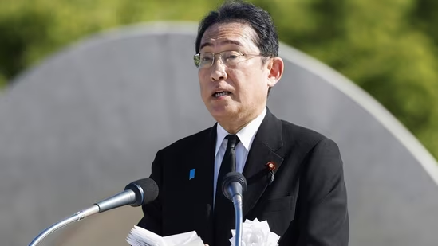

# 岸田出席广岛原子弹爆炸遇难者悼念活动，俄媒：他没提是美国投放的

【环球网报道】日本首相岸田文雄6日在广岛出席广岛原子弹爆炸遇难者悼念活动并发表讲话。塔斯社注意到，岸田在讲话中没有提一点，即正是美国于1945年向广岛投放了原子弹。

根据日本首相官邸网站所发布实录，岸田当天在演讲中称，“78年前的今天，一颗原子弹夺走超过10万人的宝贵生命，使这座城市化为灰烬，也在一瞬间让很多人的梦想和美好未来化为乌有，一些幸存者也经受着难以言表的痛苦。作为首相，我在此向遇难者致以深切哀悼，向那些至今仍受核爆后果影响的人表示真诚慰问”。

_2023年8月6日，岸田在广岛出席广岛原子弹爆炸遇难者悼念活动。图源：《印度斯坦时报》网站_

根据实录，岸田还称“核武器对广岛和长崎造成的悲剧绝不能重演”，并提到国际社会在核裁军途径、“俄罗斯构成的核威胁”等问题上日益扩大的分歧等话题。

俄新社注意到，岸田在讲话中没提美国，反而提到俄罗斯。塔斯社也称，岸田在讲话中并未提及，正是美国于1945年向广岛投放了原子弹。塔斯社还称，日本官员通常在公开发表演讲时不会提到是美国当年向广岛和长崎投放了原子弹，日本首相往年在原子弹爆炸受害者悼念活动上也没有直接提美国。

新华社2022年8月所发布一篇报道称，为敦促发动侵略战争的日本尽快投降，美国于1945年8月6日和9日分别向广岛和长崎投放原子弹。长期以来，日本把自己描绘成二战特别是原子弹轰炸的“受害者”，却很少提及遭到原子弹轰炸的历史背景，更没有提及日本二战期间对中国及亚洲其他国家带来的残酷伤害。

