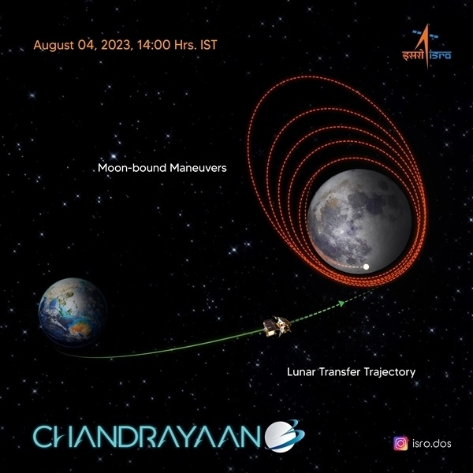

# 挑战人类首次南极登陆 印度月船3号再次变轨成功：正式奔月

7月中旬印度成功发射了月船3号探测器，此前已经有5次近地变轨，8月5日夜间实施了近月变轨，印度ISRO航天组织已经宣布成功。

**这意味着月船3号已经开始进入环月轨道，这是整个探月过程中的关键一步。**

后续月船3号还会在月球轨道上实施几次变轨，降低高度，最终在8月23日到24日择机登陆月球。

这个过程将是挑战难度最高的一次，2019年发射的月船2号探测器就是着陆失败，导致坠毁的。

相比上一次，印度这次登月挑战的还是更高难度的月球南极，此前中国、美国及俄罗斯都没有做到
**，因此成功了就是人类首次，意义重大，对印度来说更是赶超其他航天国家的宣传机会，他们志在必得。**

据介绍，“月船三号”由着陆器、推进舱和月球车组成。着陆器将于8月17日分离，预计8月23日17时47分(印度时间)在月球表面着陆。按计划，月球车将在月球表面工作14个地球日，届时将对月球表面进行分析。

