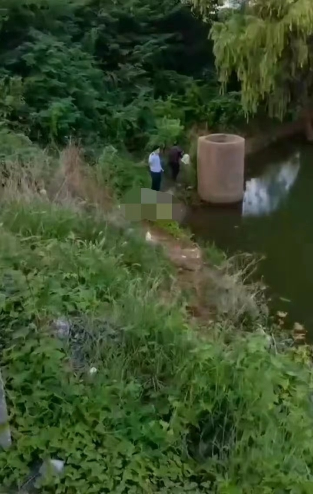

# 湖南岳阳发生一起溺亡事故致三死一伤，街道办：是否喝酒待鉴定

8月6日凌晨，湖南岳阳湘阴县发生一起溺亡事故，有3女1男在左宗棠文化广场文星塔附近坠河，疑似三死一伤。

多段网传的事发现场视频显示，一辆白色小车停在路边，现场聚集很多身穿蓝色衣服的救援人员，应急救援车辆停在现场，社区、街道等工作人员赶到，并且有很多群众围观。有一段视频显示，一名男性死者遗体已被打捞上岸，民警正在现场进行处置。

据目击者蒋先生介绍，8月6日早上7点多他经过现场时救援人员还在打捞，周围群众议论说一共坠河4个人，当地有多人称其中一男一女有感情纠纷，行车途中发生过争吵。但该消息截至发稿未得到官方证实。

湘阴县文星街道办事处一工作人员告诉记者，目前可以确认是三死一伤，幸存女子已经被送到医院治疗，“他们都是三十多岁的年轻人，听说是都喝了酒，但具体有没有喝酒还要等警方的鉴定，目前派出所还在调查中。”该工作人员还透露坠河的四人中三人是湖南籍，一人是外省人。

随后记者致电湘阴县公安局瓦窑湾派出所，一工作人员表示该事件还在调查中，具体情况目前无法透露。

潇湘晨报记者 王芊

