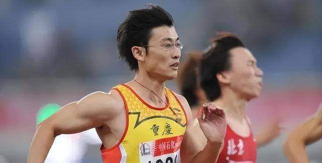
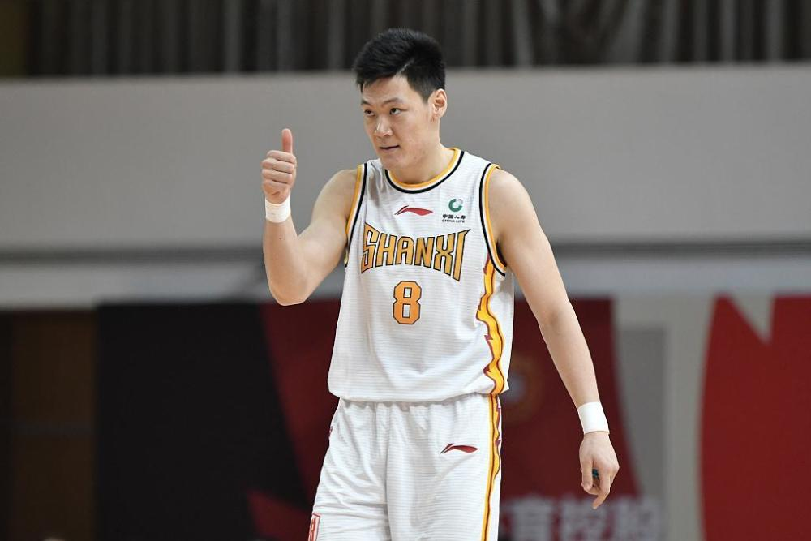
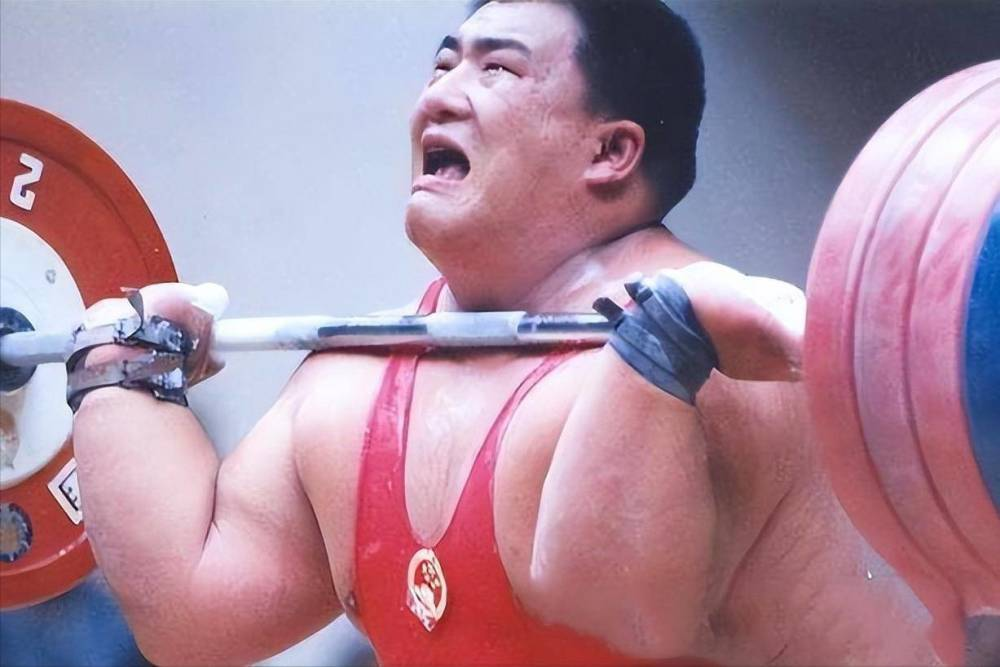
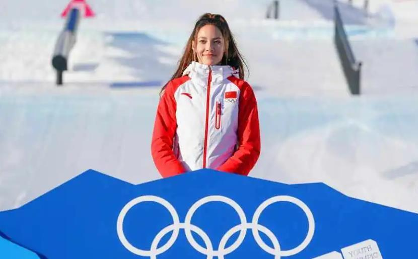

# 群英荟萃｜参加大运会的运动员 都是高考升入大学的吗

成都大运会期间，我们一同来研究：中国大学生运动员培养机制和欧美有哪些差异、背后输送逻辑是怎样的、有哪些方面可以值得借鉴、这些孩子未来的发展如何等话题。第二期，从“为什么”的角度，我们来看看中国和国外（尤其是美国）大学生运动员的输送逻辑又有何区别。

上一期，我们介绍了中美大学生运动员的培养机制。

**简而言之，就是中国学校体育从无到有，名校已经慢慢开始撑起半边天。而美国的学校体育，无论是从质还是量上，都已经相当成熟。**

值得肯定的是，随着体教融合的发展，中国的学校体育水平提升很快。但和国外，尤其是美国的学校体育来说，我们还是处在发展的阶段。细细说来，无论是名校+体院衍生出的体育特长生，还是更具有声量的成名的运动员入学，从体系到数量，我们都无法和美国更加成熟稳定的学校输送逻辑相比。

**国内：考进大学的体育特长生或免试入学的运动员**

我们先来看看中国大学生运动员的输送逻辑。

其实，在国内，大学生运动员主要分为两种：
**一种是从初高中升上来的青少年选手，他们往往会通过“体育特长生”的路径进入大学，除了要保障学业以外，还要努力在赛场拼搏，以求竞技成绩取得突破，他们就是我们传统意义上理解的“大学生运动员”；而另一种，则是现役或者退役的运动员，回到大学“回炉重造”，补的主要是文化知识，这一种是运动员上大学的情况，也可以称为“运动员大学生”。**

**第一种，体育特长生路径，既是大学生，又是运动员。**

这种情况其实在现实中占比越来越多，只是因为这其中缺乏顶级运动员，所以相对来说不为人所熟知。但近些年，这个输送渠道也取得了长足进展。

以“眼镜飞人”胡凯为例，2000年，他就是参加了清华为选拔体育特招生而举行的体育冬令营，第二年以超越当地本科线18分的成绩，顺利进入清华。大多数时间，胡凯在学校内训练，需要完成相应的学业。所以，他的节奏基本上是上午上课，下午训练。

但在当时，有些大赛前，胡凯还是会去专业队。比如十运会前，因为运动成绩优秀，清华田径队与重庆队达成协议，胡凯代表重庆出战。
**胡凯给出了原因：“清华田径队经费不足，比如冬训没有合适的场地。专业队则会给我提供更多比赛机会、运动装备，还有资金。”**

不过，这些年，中国学校体育迅速发展，很多体育学院和大学名校有了更多的经费和场地，也有了更多专业的教练员和体系。高校不断深入探索体教融合模式，为提高人才培养质量打下坚实基础。相应的，从高校里走出的优秀人才越来越多。

以CBA选秀为例，几年以来，越来越多的大学生运动员能够通过选秀进入CBA，并打出不错的成绩。校园篮球已经成为中国篮球人才来源的重要渠道，比如来自北京大学的张宁，今年新科状元来自广工大的陈国豪，众多大学生球员也从中脱颖而出。甚至在国家队层面，也有一些校园出身的球员如祝铭震、王少杰登场。

**第二种，现役或者退役运动员的“回炉重造”，即免试保送入学。**

这种在国内运动员中，尤其是顶级运动员里占比最高。
**现役的，苏翊鸣进清华，张雨霏去东南，马龙去北体大等；退役的，邓亚萍进清华，李宁进北大等……准确来说，他们更适合的称号是“运动员大学生”。**

其实，从1986年，原国家体委、原国家教委联合发布《关于著名优秀运动员上大学有关事宜的通知》，规定奥运会、世界杯、世界锦标赛单项前三名获得者等可免于参加高考进入高校学习开始，多项政策不断出炉，运动员免试进入高校学习的范围不断扩大。

这一看起来似乎“有违教育公平”的举措，在早年间其实有着现实意义的考量——专业运动队长期封闭，运动员训练为主，文化水平不高，一旦退役，就业能力不足。
**多年来，曾经获得国际、国家级比赛冠军，却生活苦难、甚至吃不上饭的运动员比比皆是。如举重冠军才力，获得了几十个冠军，退役后当保安，最终因为没钱看病，33岁就去世了。**
为了给运动员们提供另一种可能，提高文化素质，扩大就业面，这种举措也应运而生。

当然，近些年随着这一体系的不断成熟，大学免试录取运动员，也有了一些基础的判定标准，如需要运动员高中毕业或具有同等学力。此外，随着更多的规则明确下来，困扰多年的“学训矛盾”也有了解决方向，可以学，也可以练，优秀运动员保送大学，运动员和高校也成为了真正的双向奔赴。

**国外：大学生+运动员双重身份，综合兼顾找到平衡点**

美国的大学生运动员，是美国代表团参加国际大赛如奥运会、世锦赛的绝对主力，占比往往高达七成以上。比赛时，他们是运动员，不比赛时，他们是学生。

**这里面的每一个人，相对来说有着双重身份“大学生+运动员”，这身份背后，一个重要的前提是——必须同时完成学业，才能参加体育训练或比赛。**
由此可见，他们的综合素质可见一斑。

拿谷爱凌来说，以“美国高考”SAT1580分（满分1600分）的成绩考入斯坦福大学。值得一提的是，因为NCAA没有自由滑雪项目，谷爱凌不能以学生运动员身份申请藤校，走的是常规申请。把体育成绩作为背景资料，不受项目限制，但是学术成绩要达到要求。

这一年，作为斯坦福大学大一新生，她重新启航——她去学了量子物理，也学了哲学，学了经济学，也学了国际关系，甚至上了中医课和关于睡眠科学的课程。全职大学生一个学年才修36个学分，而谷爱凌在可以自由选择学科的第一年就修了52个学分，最重要的是，她取得了“全A”的成绩。

可她同时也没有落下滑雪。在年初的滑雪赛季，谷爱凌延续了自己的强势状态，在国际雪联自由式滑雪U型场地技巧世界杯卡尔加里站中，她在三天内豪取两枚金牌，将自己的世界大赛金牌总数累积到了20枚。

她也证明了，自己可以在学习和滑雪中间找到平衡点。

**这种“美国模式”，其实更像是国内两种模式的融合。兼顾学业和比赛像一，有着体育成绩背景加分像二，不一样的是，美国的体系更完善，规则也更全面。**

另外一种提及比较多的是日本学校体育，和美国的成熟的输送逻辑相比，这更多的是一种文化认同。

日本的学校体育文化，从小就已经植入孩子心中。
**根据权威数据显示，日本有90%以上的学生都会选择加入至少一个社团，并在放学后参加该社团的训练教学活动。这其中又以体育类社团为主流，占据了60%以上日本青少年的课余时间。**
而这种文化，也带动着日本的青少年们从小就更认同“体教融合”的概念，无论是精神认同，还是实际执行。

日本校园体育赛事的历史悠久，竞技水平也非常高，很多项目的奥运选手就出自在校学生。著名的全国高中棒球选手权大会（甲子园）、全国高中足球选手权大会的高三学生，毕业前就已经被职业俱乐部内定。

有着全国闻名的比赛，学校到职业的路径也早早打通，这样，日本的学生运动员会更容易被发现，也有更大的施展平台了。

