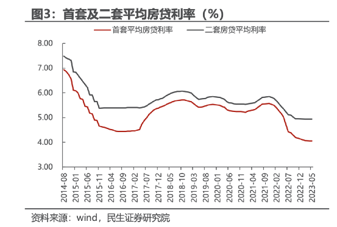
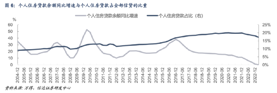

# 20万亿房贷高位站岗，专家直言下调利率银行没动力

 _来源：视觉中国_

作者 | 周纯子

编辑 | 肖望

出品 | 棱镜·腾讯小满工作室

“央行已经开会说要指导银行下调房贷利率，你们银行什么时候开始行动呀？”8月2日，北京白领张薇（化名）在看到新闻推送之后，迫不及待地给自己的银行房贷经理发去信息，询问政策进展。

就在前一天，央行和外管局召开2023年下半年工作会议，其中提到“继续引导个人住房贷款利率和首付比例下行，指导商业银行依法有序调整存量个人住房贷款利率。”这比半个月前央行“支持和鼓励商业银行与借款人自主协商变更合同约定，或者是新发放贷款置换原来的存量贷款”的表态，来得更加直接且明确。

存量房贷利率调整的预期持续发酵，张薇也对此充满期待。不过，她的房贷经理回复她称，目前尚未收到正式文件，“新闻上说的挺热闹，但是没有正式文件的话，咱也没法操作。”

毕竟，居民住房贷款已占银行业信贷投放的17.3%，调降存量房贷利率牵一发而动全身，将对银行业利润产生直接冲击。

近20万亿利率高位站岗的房贷，仍在等待下调的风真正吹来。

**提前还贷当理财**

张薇去年7月在北京购入了首套房，按照彼时“首套房利率为LPR加55个基点，二套房加105个基点”的政策，她的房贷利率最终定为5%。比起前几年她身边同事打折后的房贷利率高出1%，这让她的心里颇不平衡。

万万没想到，不到两个月，LPR再降15个基点，身边朋友的购房利率已经降到4.85%。

招联首席研究员、复旦大学金融研究院兼职研究员董希淼观察到，从2017年加强房地产调控开始，新发放房贷利率由贷款基准利率85折至9折，大幅上行至5.5%左右；2019年至2021年，房贷利率在5.3%至5.6%区间内高位运行。2021年下半年开始，部分地区房贷利率甚至跃升至6%以上，最高超过6.5%。据测算，上述时段发放的存量房贷占比可能超过50%。

而随着贷款市场报价利率（LPR）报价几次下调、首套房贷利率下限调整等政策的出台，新发放的房贷利率也在逐步下降。官方数据显示，今年上半年新发放个人住房贷款加权平均利率为
4.18%，比 2022 年同期低 107 个基点。

存量房贷利率显著高于新发放的房贷利率，加之存款利率一再降低、银行理财甚至出现亏损等因素影响，居民的投资收益率跑输房贷利率，让不少人开始考虑提前还贷，甚至通过套取经营贷、消费贷来置换房贷。

央行公布的数据显示，2023年二季度末，个人住房贷款余额38.6万亿元，同比下降2702亿元。

央行货币政策司司长邹澜在2023年上半年金融统计数据新闻发布会上介绍，今年上半年，个人住房贷款累计发放3.5万亿元，较去年同期多发放超过5100亿元，对住房销售支持力度明显加大。但统计数据显示的个人住房贷款余额总体还略微减少一点，这主要是因为理财收益率、房贷利率等价格关系已经发生了变化，居民使用存款或者减少其他投资提前偿还存量贷款的现象大幅增加。

邹澜解释称，尽管贷款市场报价利率下行了0.45个百分点，但因为合同约定的加点幅度在合同期限内是固定不变的，前些年发放的存量房贷利率仍然处在相对较高的水平上，这与提前还款大幅增加有比较大的关系。提前还款客观上对商业银行的收益也有一定的影响。

此外，当前6月期理财产品的预期年化收益率，已经由2022年初的3.15%，降至1.8%，达到历史最低水平。民生证券研报提到，理财收益与房贷利率的利差总体持续走扩，股票市场总体表现也相对平淡，叠加二季度以来新一轮存款利率调降开启，投资收益率持续走低之下，居民倾向于采用存款、理财等投资偿还房贷。

**选固定利率的人肠子都悔青了**

尽管赶上了LPR大幅加点的时期，但张薇显然还不是最“惨”的。那些当初选择了固定房贷利率的人，如今更是“悔青了肠子”。

按照央行规定，从2020年3月1日起，贷款利率转换为锚定LPR的浮动利率。对于存量贷款，央行让借款人二选一：可以将原合同约定的利率定价方式，转换为以LPR为定价基准加点形成（加点可为负值）；也可转换为固定利率（将当前房贷利率固定下来，以后不再变化）。

虽然当时银行一再建议借款人选择转换为LPR的方式，但仍有一小部分人选择了固定利率，这也意味着，近两年LPR累计下行的45个基点与他们无关，他们无法享受到房贷利率下降的红利。

博主“小暖阳”在社交平台上分享自己选择固定利率的经历：他2016年买房时，执行的是基准利率4.9%的85折，折下来贷款利率是4.165%。在二选一的时候他纠结良久，最终还是选择了固定利率。“当时的想法是，本来利率也挺低，如果跟随LPR浮动，涨跌都有可能，20年的时间太长了，
怕变化大，预期不确定。”

为此，他甚至还在临近办理的最后期限，特意请假跑到银行，又写情况说明又按手印，才将浮动利率成功改为固定利率。

万万没想到，LPR一降再降。“每次看到LPR又降了，人马上就不好了，心里那个悔啊，恨不得抽自己！”他的这篇帖子引发了近700条评论，不少网友纷纷留言：假设当初选择了LPR，现在每个月可以少还几百块钱房贷。

据中泰证券测算，LPR每下调20个基点，对还款额的影响为1.7%。

市场普遍认为，降低存量房贷利率，一方面能够缓解居民提前还房贷的动机，缓解银行的压力，也可以帮银行避免损失掉房贷这类优质资产；另一方面，能降低居民负债端的压力，增加居民可支配收入，提升消费预期。

于是，降低存量房贷的呼声越来越高。

**专家呼吁银行让利于民**

存量房贷利率的调整已有先例。

早在2008年10月，央行决定将个人住房贷款利率下浮幅度由0.85倍下限扩大到贷款基准利率的0.7倍，并提到“金融机构应按原贷款合同约定条款，在综合评估风险的基础上，自主确定已发放商业性个人住房贷款尚未偿还部分的利率水平。”

2009年伊始，主要商业银行公布新的存量房贷优惠政策。以四大行为例，只要2008 年 10 月 27 日前执行基准利率 0.85
倍优惠、无不良信用记录的优质客户，原则上都可以申请七折优惠利率。

民生证券研报提到，考虑到2009年新发放个人住房贷款加权平均利率已在
4.4%左右，相当于当时5年以上贷款基准利率的74%，推算当年新发放的大多数个人住房按揭贷款都已满足 7
折优惠，这也意味着当年大多数存量个人贷款利率都已经实现了下调。

此次存量房贷的调整还能像上一次那样惠及大多数且一降到底吗？不少分析师对此持谨慎态度。

毕竟，与 2008
年末2.98万亿元的个人住房贷款余额相比，当前这一数值已经高达38.8万亿元，占全部信贷的比重也从当初的9.8%上升到如今的17.3%，对银行净息差和利润的影响牵一发而动全身，导致银行并没有太大的动力去降低存量房贷利率。

董希淼对《棱镜》提到，初步测算，利率偏高的存量房贷余额约为15万亿元至20万亿元，如果利率平均下调100个基点，每年将减少商业银行利润1500—2000亿元。

此外，2009年正是信贷高速扩张的阶段，银行尚可以通过其他业务的扩张来弥补存量房贷利率下调带来的冲击。“但是在当前状态下，推动实体经济融资成本稳中有降仍是货币政策的重要目标，商业银行通过发掘其他领域需求维持净息差稳定的难度加大。”信达证券提到。

因此，市场预计本轮存量房贷利率调整的范围可能会明显小于 2009 年，银行根据客户综合资质进行调整的空间也更大，很难再出现类似于 2009 年统一按照 7
折下限设定的情况。

近日，泽平宏观创始人、经济学家任泽平在腾讯财经《年中问计》栏目中就表示，银行要适度地让利，下调存量房贷利率的力度和节奏需要加快。“老百姓房贷都还不起了，几百亿利润的银行还不采取实质行动让利于民，这不合适。”

一个不争的事实是，不论是居民提前还款，还是降低存量房贷利率，对银行而言，都会让原本就不“富裕”的净息差雪上加霜。

存量房贷利率究竟将如何降？考验着监管部门和银行的智慧。

按照央行的前述表态，存量房贷利率的调整主要有两种方式，一是变更合同条款直接降，二是以新换旧间接降。董希淼建议，下一步通过市场利率定价自律机制，商定银行存量房贷利率调整的总体原则；各家银行总行出台具体方案，明确直接降、间接降的条件、标准、流程。

德邦证券认为，为了控制房贷资产下降幅度，银行可能在存量房贷利率调整过程中设置“准入”门槛，为借款人设置条件，可能的条件为与借款人个人征信、财产和收入情况等挂钩以及调整利率后的房贷不能提前偿还等。“也就是说并不是所有的利率高于调整目标的存量房贷都能够得到调整。”

民生证券则认为，存量房贷利率的调降仍需央行进一步引导，关键在于为商业银行提供货币支持或激励。包括设立相关结构性货币政策工具引导存量房贷利率下降、存款利率下调、定向降准等等。

