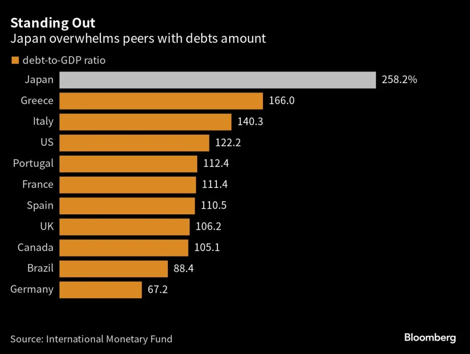

# 9万亿美元“大雷”将被引爆？日本或成下一个信用评级被下调经济体

每经记者：蔡鼎 每经编辑：兰素英

去年英国充满争议的减税措施将该国国债价格推至金融危机以来的最高水平。随后，标普和惠誉两大国际评级机构先后将英国的评级展望下调至负面。

而当下日本的债务问题，比英国更加严重。据国际货币基金组织（IMF）估计，2022年末，日本的债务达到1270.499万亿日元（约9万亿美元），
**相当于该国GDP的约260%，连续7年刷新纪录。** 这让人开始怀疑， **日本是否成为将成为继美国之后，主权信用评级被下调的另一个主要经济体。**

惠誉亚太地区主权评级主管Krisjanis Krustins在发给《每日经济新闻》记者的置评邮件中直言，日本债务高企是日本主权信用评级的主要弱点。

三菱日联金融集团研究咨询公司首席经济学家Shinichiro Kobayashi直言，“
**如果出现日本主权信用评级可能被下调的言论，那么国债上行压力有可能将（日本10年期国债）收益率推高至1%以上。**
”根据日本财务省的计算，如果10年期国债收益率比基准收益率上升1%，到2026财年，日本的偿债支出预计将增加3.6万亿日元。

悬在头顶的“债务炸弹”

据国际货币基金组织（IMF）估计，2022年末，日本的债务达到1270.499万亿日元（约9万亿美元），
**相当于该国GDP的约260%，较上年度增加29万亿日元，连续7年刷新纪录，是发达国家中债务最高的，甚至超过了1944年二战期间的204%。**
更糟的是，根据日本经济新闻下属智库日本经济研究中心的预测， **这一比例预计将继续攀升。**

Krisjanis
Krustins在置评邮件中也对《每日经济新闻》记者进行了类似预测。“我们预计，到2022财年末，日本政府总债务占GDP的比例将到达近247%，在投资级主权国家中将是最高的。”

而与之相比，一直陷于债务危机的希腊和意大利的占比分别为166%和140.3%，美国的占比为122.2%。而债务占比最少的德国的债务仅占GDP的67.2%。

_日本债务占GDP比例已远超希腊（图片来源：彭博社）_

不过，日本政府仍然相对乐观——在日本潜在的经济增长率上升的乐观预测下，日本政府预计到2026财年将实现收支平衡。当前，日本的借贷成本正在飙升。东京时间上周五（8月4日），日本央行决定允许日本国债的收益率超过其之前设定的0.5%~1%上限，这已经引发了收益率的飙升——
**在本周一的亚盘交易时段，日本国债收益率9年来首次上破0.6%。**

_日本10年期国债收益率9年来首次上破0.6%关口（图片来源：CNBC）_

而需要指出的是，日本目前仍在继续支出。日本首相岸田文雄此前承诺到2027财年将国防开支占GDP的比例从目前的1%提高到2%，并将儿童保育的预算增加一倍，达到每年3.5万亿日元（约250亿美元）。但岸田政府尚未就这两项支出计划达成一致。日本政府预计，在2040年4月开始的财政年入，日本将不得不把近1/4的GDP用于社会福利，如护理和养老金。

此外，岸田文雄还计划在未来十年内发行20万亿日元的绿色转型（GX）债券，不过GX债券将通过碳税和碳定价计划来偿还。

到目前为止，日本的财政政策并没有引发像去年英国特拉斯政府减税计划那样的恐慌。

《日经新闻》报道称，各种因素正在抑制日本债务这颗“定时炸弹”的爆发：日本企业持有大量现金，尚未大量举债；日本政府债券的平均期限相对较长，且大部分在国内持有；日本拥有健康的经常账户盈余。报道指出，这其中最大的因素或许是摩根大通日本宏观研究主管Tohru
Sasaki所说的 **（市场）对日本央行超宽松货币政策的“一种沉迷”。**

在前任和现任日本央行行长黑田东彦和植田和男的领导下，日本央行一直将利率控制在零附近甚至负值，而且在大规模的资产购买计划下，日本央行目前持有约一半的日本主权债务。

“ **日本央行无法摆脱政府债务的货币化** ，如果我们今后遇到困难，日本央行可能会购买国债。 **我这么说并不是乐观，而是悲观。** ”Tohru
Sasaki说道。

过去30年，日本信用评级一直处于下降趋势

但不可否认，风险正在迅速聚集。

《日经新闻》报道称，预计日本2022财年预算的22.1%将用于支付利息和偿还债务。考虑到这一点，以及日本日益加重的债务负担，日本财务大臣铃木俊一在今年3月份公开警告称，“
**日本公共财政的严重性已达到前所未有的程度。”日本央行近期也下调了其经济前景评级，并警告称日本的财政状况正变得越来越不稳定。**

“日本债务高企是日本主权信用评级的主要弱点。”Krisjanis Krustins对《每日经济新闻》记者如此表述道。

彭博社报道中称， **过去30年来，日本的信用评级一直处于下降趋势。** 标普在2015年时将日本长期外币发行人违约评级下调至A+。
**在七国集团（G7）中，日本目前的信用评级排名倒数第二，仅高于长期陷于债务危机的意大利的BBB级。**
也就是说，以日本的信用评级，如果纯粹令市场做出选择，日债并不是那么有竞争力。

_日本的主权信用评级为G7国家中第二低（图片来源：彭博社）_

眼下，一些市场人士担心，伴随日本最终退出量宽政策而来的利率上升，日本政府的信用也可能受到质疑，从而使日债融资操作复杂化，带来短期风险。

Krisjanis
Krustins对《每日经济新闻》记者指出，日本的低借贷成本支持了其主权评级。“在通胀没有持续回升的情况下，利率上升可能会推高债务，但由于大部分的债务到期日较长，高债务的情况会逐渐发生。更直接地说，利率上升可能会损害日本央行的财务状况。”

标普全球评级高级董事Kim Eng Tan警告称， **如果日本央行突然加息或收紧货币政策，就会引爆日本的债务危机。** 另外，
**日本人口老龄化和人口减少导致的低增长也是一大风险。如果不大幅提高生产率，劳动适龄人口减少将使日本很难保持或促进经济增长。** Christian de
Guzman也警告称，“对日本来说，最大的社会风险因素就是人口因素。”

野村证券综合研究所首席经济学家、《资产负债表衰退》作者辜朝明表示，
**防止日本债务危机的任务最终可能要由日本央行来承担，以及日本的私营部门能否通过创新来促进经济增长。**

有分析指出， **日本必须实施可靠的财政整顿战略，解决与人口老龄化相关的支出问题，并增加税收收入。**
这种方法对于降低日本债务水平和有效缓解相关风险十分必要。尽管日本有理由相信，其债务负担不可能很快对经济造成重大伤害，但专家们确实发现了潜在的风险。日本政府也确定了四个主要的资金来源：
**削减开支、额外税收和其他预算领域的剩余资金、出售国有资产等行动带来的非税收收入以及税收。**

每日经济新闻

