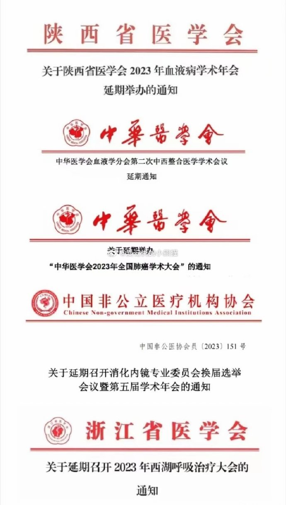
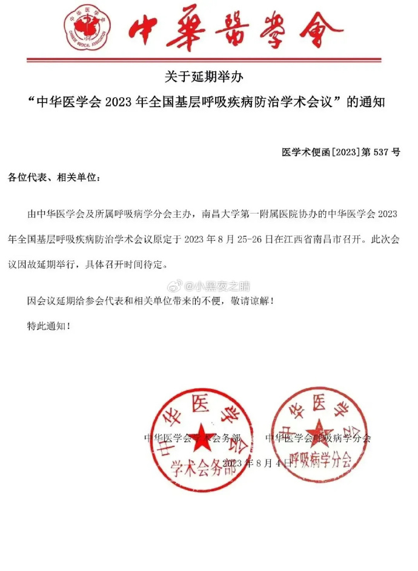
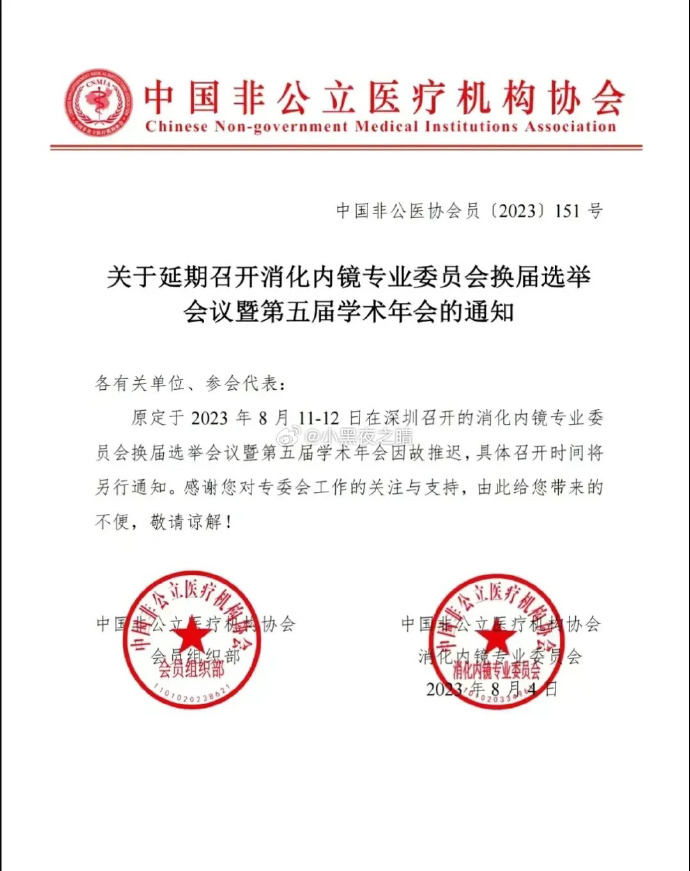
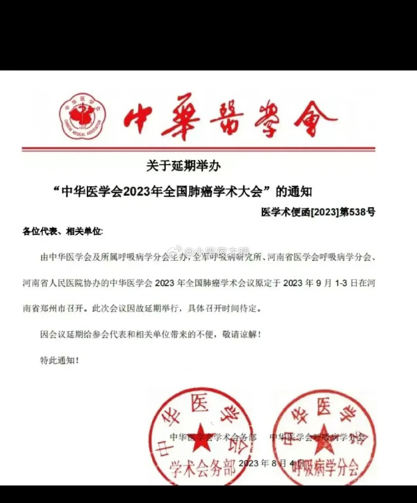
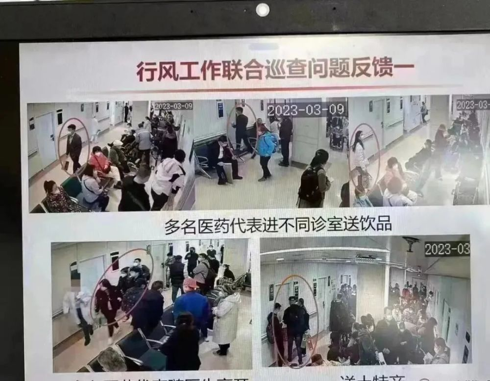

# “史上最强”医药反腐风暴来袭：有药企全体代表居家办公，不强制要求客户拜访

中国基金报 泰勒

大家好，周末医药反腐又刷屏了。一股阴霾笼罩在医药圈：又有代表被抓了......学术会暂停了，甚至还传言办事处被端，还有甚者，医药群都解散了......

**医药反腐风暴来袭：多场学术会议延期**

这个周末，圈内都在讨论医药反腐，随着所谓“史上最强”医药反腐风暴的展开，近期已有多场医药学术会议延期或取消，集中发布通知宣告延期。尽管会议延期的原因各异，但业界大都认为与此次反腐行动有关。

一般来说，药企通过举办学术会议，存在以会议赞助费、专家讲课费、培训费等方式为行贿披上“合法外衣”的情形。

根据塞柏蓝的不完全统计，今年至今，全国已有至少155位医院院长、书记被查，数量已超过去年全年的两倍。除了“落马”的院长、书记之外，被查的科室主任更是众多。

7月25日，据山东省纪委监委网站消息，山东省立第三医院原党委书记吕涌涛涉嫌严重违纪违法，主动投案，接受审查调查。

7月29日，据湖北省纪委监委消息，湖北中医药大学副校长、湖北省中医院原院长何绍斌涉嫌严重违纪违法，目前正接受湖北省纪委监委纪律审查和监察调查。

8月5日，据西藏自治区纪委监委消息，西藏自治区藏医院党委书记唐荣科涉嫌严重违纪违法，目前正接受西藏自治区纪委监委纪律审查和监察调查。

**影响到底有多大？**

据业内人士介绍，解散群、放假、召回代表接受培训，已经成为药企应对目前风暴的三件套。

甚至有药企要求暂时不允许在工作群里讨论工作，两小时后，群解散，直接改成单线联系，全体代表居家办公，不强制要求客户拜访。

还有几家外企解散学术会议项目沟通群，有一家企业还通知不再开会，也不赞助医生开会，代表也可以停止拜访。

医药领域反腐正驶向深水区。7 月 28
日，中央纪委国家监委网站上发布消息表示，中央纪委国家监委召开动员会部署纪检监察机关配合开展全国医药领域腐败问题集中整治。其中提到，要坚持受贿行贿一起查，集中力量查处一批医药领域腐败案件，形成声势震慑。

会议指出要坚持受贿、行贿一起查，集中力量查处一批医药领域腐败案件，包括不合理的学术赞助。近期，广东、广西和浙江等省市的医疗机构已相继印发通知，称将加强反腐自查力度，清退、纠正不合理的报酬和回扣等问题。

据中新网，近日，国家卫生健康委会同教育部、公安部、审计署、国务院国资委、市场监管总局、国家医保局、国家中医药局、国家疾控局、国家药监局，联合召开视频会议，部署开展为期1年的全国医药领域腐败问题集中整治工作。

此前的7月25日，刑法修正案(十二)草案提请十四届全国人大常委会第四次会议审议。草案加大对行贿犯罪惩治力度，增加惩治民营企业内部人员腐败相关犯罪的条款，并提出在食品药品、教育医疗等领域行贿需从重处罚。

德邦证券分析，上周医药大幅调整，位列所有行业倒数第一，主要受医疗反腐政策影响，目前有发酵态势。我们认为医疗反腐对行业中长期发展构成利好，但短期确实有一些不确定性。
**投资策略上中短期回避院内，中长期看好创新、刚需和产品力强的领域。**

展望未来，我们认为医疗反腐或为医药板块 **最后一次调整**
：1）人民对健康的需求不会因反腐而降低，医药的消费属性仍在，医保的支出仍持续增长，23年1-6月医保支出增长达18.2%；2）估值明确底部，目前TTM估值约26倍，考虑到新冠影响，距离22年9月底的估值大底向下空间有限；3）配置低配：根据Q2基金持仓分析，全基持仓7%左右，经过一周的情绪宣泄，我们判断全基医药持仓或在5%以内，严重低配；整体上我们认为医药短期回避政策影响，中长期看好创新发展，当前医药赔率和胜率较高，值得重点配置：

交银国际分析称，今年以来，医疗领域反腐力度较以往更严格，市场对个别公司有所担忧。但是，龙头上市药企/械企在过去多轮反腐行动的监督和惩戒下，已经将合规运营放在首要位置、形成了相对符合监管要求的销售管理系统。

因此我们认为，短期内本轮反腐将打击、清退部分运营不合规的企业，但对合规较严格的龙头药企和械企来说影响有限；长期来看，这将进一步扭转医药行业重销售、轻学术的现状，减少不合理竞争，促使真正具有创新性的产品脱颖而出，利好创新药和创新器械行业的健康发展。

