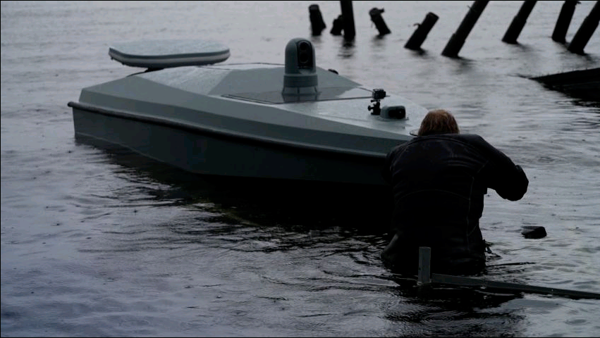
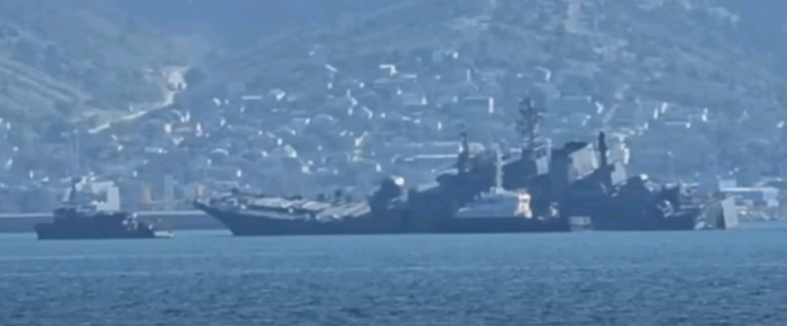

# 俄一大型登陆舰被重创，利用自杀无人艇发动袭击成乌克兰海军亮眼战绩

在不到24小时内，乌军无人艇接连在位于黑海东岸的黑海舰队基地新罗西斯克以及刻赤海峡以南海域发动袭击，造成俄罗斯一艘大型登陆舰和一艘油轮接连被重创。值得注意是，这次乌军无人艇发动袭击的海域明显超过了以往的活动区域，乌海军甚至还将黑海海域的阿纳帕、新罗西斯克、格连吉克、图阿普谢、索契和塔曼6个俄罗斯港口列为打击目标。问题就来了——乌军无人艇的成功战绩是如何做到的？

乌军利用自杀无人艇对俄军目标发动袭击成为乌克兰海军在俄乌冲突中最亮眼的战绩。去年10月，位于克里米亚半岛的俄黑海舰队基地塞瓦斯托波尔就遭到乌军无人艇的成功突袭。不久前，克里米亚大桥也因乌军无人艇的自杀式爆炸而中断交通运输。此外，俄军在黑海南部巡逻的侦察舰也多次遭到乌军无人艇的攻击。但外界之前普遍认为，受航程和适航性等因素限制，乌军无人艇不太可能从乌克兰控制的海岸出发，前往数百公里以外的海域，只能借助其他船只运送到目标海域附近，才能找到机会发动突袭。因此俄罗斯宣布退出黑海粮食协议后，外界普遍认为失去了“伪装商船”的掩护，乌军无人艇的作战半径就要大幅缩水。

_乌军新一代无人艇航程大增_

但实际情况恰恰相反。位于黑海东岸的新罗西斯克，比之前遇袭的塞瓦斯托波尔和克里米亚大桥距离乌军控制的海岸线更远，地图测量距离约420英里（约670公里）。根据不久前乌方接受美国有线电视新闻网的说法，乌军新一代无人艇的航程已经大幅提升，远达800公里。这个数据应该是有相当可信度的。

但除去航程问题，乌军无人艇要成功发动袭击，还受到很多因素制约。例如乌军无人艇需要卫星通信提供的信号实施远程遥控，之前乌军使用的是美国“星链”互联网卫星通信系统，但前不久西方媒体爆料称，美国SpaceX公司拒绝了乌方“在克里米亚半岛附近提供星链接入服务”的请求，最新乌军无人艇疑似换用了其他通信服务商。但不管是SpaceX公司改变主意，还是有新的卫星通信服务商参与其中，这背后都离不开西方国家的全力支持。

_遇袭后被重创的俄军登陆舰_

此外，想要在大海上准确追踪俄军舰艇和油轮的行踪，对于缺乏侦察手段的乌克兰海军来说也是“不可能完成的任务”。因此是在黑海上空飞行的美军无人机及北约成员国的反潜巡逻机一直在密切监控俄方黑海舰队以及其他船只的活动情况，他们会把获取的数据和情报发送给乌克兰，使得乌克兰的无人艇攻击更具有针对性。

当然，乌军无人艇的突袭得手，在很大程度上也与俄军的松懈有关。去年塞瓦斯托波尔遇袭后，俄海军加强了港口防御，乌军后来针对该港的另几次突袭都没有能成功。但可能是新罗西斯克与乌军控制区的距离更远，俄军在当地的防御明显松懈，并没有配备与塞瓦斯托波尔类似的拦阻网。因此在最近的袭击事件后，俄专家才再次提醒说，应该在“军舰和船只停泊某些区域时用围栏围起来”。

俄专家提出的相关防御措施还包括“继续打击乌军无人艇的生产和存储基地”“利用海上巡逻机搜寻无人艇行踪”。但考虑到乌军无人艇在黑海行动的目标并非要夺取制海权，而是在于骚扰、分散、削弱俄军补给克里米亚、并通过克里米亚增援前线的能力，因此俄专家提出的这些措施很难从根本上解决问题，特别是乌军无人艇将油轮等民用船只纳入攻击清单后，俄军舰艇面临的防御需求将“更上一层楼”。未来黑海的“袭船战”恐怕还会一再上演。

