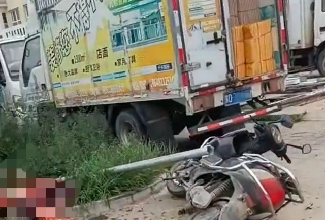

# 内蒙古货车冲进集市：殡仪馆称已致3人死亡，官方表示应是车辆失控

8月7日，网传内蒙古赤峰一地发生严重交通事故，现场多人倒地。

视频画面显示，有多辆电动车倒在地上，一辆白色小车车头受损严重，路上多处有血迹，多人躺倒在地。

据华商报报道，当地派出所工作人员表示，目前此起交通事故已经处理，伤者已送往医院治疗。另据潇湘晨报记者从松山区政府工作人员处获悉，肇事车辆应是失控。

7日，九派新闻记者联系到赤峰市松山区殡仪馆的一名王姓工作人员，他告诉记者，关家营集市上一共有3人死亡。接到交警的电话之后，3名死者的遗体分别送到了松山区和红山区的殡仪馆。

“有2个大概是上午十点多送到了松山，有1个接近十一点的时候送到了红山。”

随后，记者又致电红山区殡仪馆，工作人员称上午确实有接收一具因交通事故死亡的遗体。

**【来源：综合华商报、潇湘晨报、九派新闻】**

