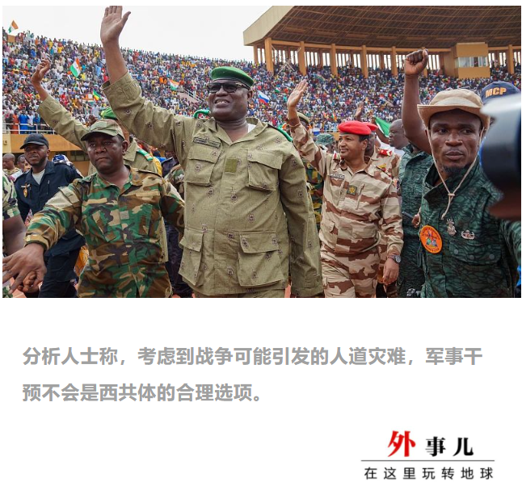
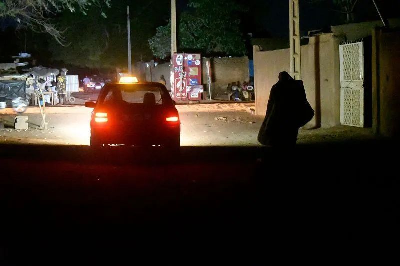

# 军政府宣布关闭领空！“最后通牒”期满，尼日尔会陷入战争吗

战争的阴霾在西非显现。当地时间8月6日，西非国家经济共同体（西共体）要求尼日尔军政府交权的“7日之期”已到。尼日尔军政府拒绝交权并宣布关闭领空应对潜在的外部威胁。按照西共体此前的说法，西共体不排除军事介入尼日尔的可能性。

西共体成员国官员称，他们已经制定好了军事干预尼日尔的计划，包括在何时、何地对尼日尔发动打击。同时，西共体官员强调，军事干预只会是“最后的手段”。分析人士认为，考虑到战争可能引发的人道灾难，军事干预不会是西共体的合理选项。

中国驻尼日尔大使馆8月7日发布紧急通知，考虑到当前尼日尔局势错综复杂，中国驻尼日尔大使馆提醒所有在尼侨胞提高警惕、加强防护、避免外出，做好安全防范；在尼侨胞如无必要留尼事由，请自行离尼赴第三国或回国暂避；近期计划赴尼人员，如无必要，请暂缓前往。如遇紧急情况，请第一时间报警并与中国驻尼日尔大使馆联系。

**尼日尔军政府宣布关闭领空**

据路透社报道，当地时间8月6日，尼日尔军政府宣布关闭领空直到进一步通知。军政府称，来自外部的潜在军事威胁正在上升。

“在外部介入的威胁变得越来越明显的时候，尼日尔的领空将从今天起关闭。”尼日尔军政府代表当地时间8月6日通过国家电视台宣布。

尼日尔军政府代表称，有两个中非国家已经调动了军队，为军事介入做准备。他没有指明这两个国家的名字。“在我们人民的坚定支持下，尼日尔武装部队和所有安全部队做好了保卫领土完整的准备。”他说。

当地时间7月26日，阿卜杜拉赫曼•奇亚尼领导的总统卫队发动政变，扣押了在2021年通过选举上台的总统巴祖姆。奇亚尼随后宣布自己为尼日尔“新领导人”。

尼日尔是西共体的15个成员国之一。当地时间7月30日，西共体成员国领导人在尼日利亚首都阿布贾召开紧急会议，向尼日尔军政府发布“最后通牒”——要求尼日尔政变军人在一周内释放遭扣押的总统巴祖姆并恢复其总统职权。如若不然，西共体将采取一切措施恢复尼日尔的宪法秩序，“这些措施中包括使用武力。”

_当地时间2023年8月4日，尼日利亚阿布贾，西共体举行国防参谋长会议。图/视觉中国_

尼日尔在7日期限内拒绝履行西共体的上述要求。巴祖姆至今仍在扣押中。据巴祖姆的一名不愿透露姓名的朋友8月6日称，巴祖姆和他的家人一起被软禁在自己家中，缺电缺水。政变军人8月5日没收了巴祖姆的电话卡，此前巴祖姆仍能够通过电话与外界联系。

西共体的一个调解代表团日前进入尼日尔，但已于当地时间8月3日离开，西共体称代表团没有能够见到军政府领导人奇亚尼。

据路透社8月6日报道，西共体成员国国防部长已经就可能的军事介入方案达成一致。方案内容包括在何时、何地对尼日尔进行军事打击。

法国方面近日表示支持西共体推翻尼日尔军政府的努力，但没有具体说明是否会以军事手段支持西共体。

巴祖姆被视为法国、美国等西方国家在这一地区的重要盟友。目前，西方国家在尼日尔尚有约2500名驻军，其中，美国约1000名驻军，法国有1000至1500名驻军，德国约有100名驻军，意大利也有少量驻军。

尼日尔军政府日前废除了尼日尔与法国的军事合作协议。但法国外交部长凯瑟琳·科隆纳称，法国目前没有从尼日尔撤回驻军的打算。

路透社称，尼日尔拥有数量可观的石油和铀矿储备，同时在西非的反恐行动中占有重要位置。因此，尼日尔受到多个大国的重视。

**尼日尔民众集会反对军事介入**

据路透社报道，当地时间8月5日至6日，超过100名军政府的支持者在尼日尔首都尼亚美的一个空军基地前拉起了警戒线，他们演奏军乐、吹响非洲乐器呼呼塞拉来表达对军政府的支持和对外部军事介入的反对。

同时，数百名年轻人在尼亚美的一个交通环岛设卡，检查来往车辆、乘客是否为外国干预势力和间谍。此前，军政府就外国干预和间谍发出了警告。

当地时间8月6日，数万名尼日尔人参加了在尼亚美最大的体育场馆举行的集会，表达对军政府的支持。据《纽约时报》报道，集会现场的人们高喊着军政府领导人奇亚尼的名字，同时大声表达对西共体的不满。在社交媒体上，许多尼日尔人把头像换成了尼日尔国旗，表达爱国之情。

_当地时间2023年8月6日，尼日尔首都尼亚美，军政府的支持者举行示威。图/视觉中国_

尼日利亚记者阿里·苏那玛表示：“支持军政府的活动不仅发生在尼亚美，在全国都有。”

苏那玛解释称，尼日尔政府在过去10年中治理不善，学校、医疗的状况很差，民众缺乏公正感和安全感，这些因素都使得一些民众想要政权更替。外部的军事介入不会受到尼日尔民众的广泛欢迎。

据《德国之声》报道，尼日尔军政府的支持者认为，目前尼日尔发生的一切代表着尼日尔同过去的殖民历史彻底决裂，他们认为西共体是西方帝国主义的工具。

“尼日尔人明白，那些帝国主义者想给我们带来灭亡，但他们只会自受其害。”尼日尔一名已退休的老人阿马杜对路透社说。

据《纽约时报》报道
，一些尼日尔人开始为可能到来的危机做好准备。当地时间8月5日，大批尼亚美的居民涌入商店购买米和油。33岁的尼亚美居民阿斯玛那是6个孩子的父亲，他采购了奶粉和大米以应对可能的危机。“如果西共体对我们进行空袭，我们都完了。”他说。

22岁的尼亚美大学学生米娜塔坐大巴车离开尼亚美回家。米娜塔说，她不知道什么时候能够返回学校，“我对未来感到担忧。”

西非地区多年来受到贫穷、极端主义势力、粮食不安全和气候变化的威胁。数百万尼日尔人可能陷入更加贫困和不稳定的局面。

据路透社报道，近年来，极端势力和恐怖主义已经导致尼日尔数千人被杀，数百万人被迫逃离家园。CNN称，若地区局势不稳，恐怖组织可能趁乱发动攻击，使得地区局势进一步恶化。

 _当地时间2023年8月4日，尼日尔首都尼亚美部分地区停电。图/视觉中国_

尼日利亚供应了尼日尔约70%的电力。在这场军事政变发生后，尼日利亚已暂停向尼日尔供电，导致后者的大部分地区陷入停电。

**分析：军事干预不是合理的选项**

西共体上一次批准军事干预是在2017年。当时，冈比亚时任总统贾梅在败选后拒绝交权，西共体进行干预，以塞内加尔军队、尼日利亚军队为首的西共体联军开入冈比亚，迫使贾梅进行了权力交接。但是，西共体从未尝试过用武力应对政变，此前，西共体成员国马里、布基纳法索发生军事政变，西共体没有军事介入。

据美国有线电视新闻网（CNN）报道，分析人士认为，西共体轮值主席、尼日利亚总统提努布希望在尼日尔问题上有所作为，他不想被当作是一个软弱的领导者。

据当地媒体报道，提努布当地时间8月4日致信尼日利亚议员称，如果尼日尔政变领导人“仍然顽固不化”，西共体打算进行军事干预。

但尼日利亚参议院议长阿克帕比奥当地时间8月5日表示，军事干预并不是解决问题的最佳方式，此举将伤害与尼日尔接壤的尼日利亚北方七州，尼日利亚将通过外交和经济措施解决尼日尔危机，因此参议院不支持对尼日尔出兵。

截至8月6日，西共体成员国中，塞内加尔、科特迪瓦和贝宁同意参与西共体授权的军事干预，几内亚表示反对。由政变后过渡政府执政的马里、布基纳法索则完全站在尼日尔军政府一方。

马里和布基纳法索过渡政府已经明确表示如有必要，将出兵保卫尼日尔。马里和布基纳法索的联合声明称，任何针对尼日尔的军事行动将被视为对马里和布基纳法索的宣战。CNN称，俄罗斯瓦格纳集团在马里有军事存在，而法国和美国在尼日尔均有军事基地，有分析人士担忧，若这些势力卷入冲突，可能演变为一场新的代理人战争。

此外，尼日尔的北部邻国阿尔及利亚反对军事干预，该国警告说，西共体联军若入侵尼日尔，将导致这一地区脆弱的局势进一步不稳定。阿尔及利亚不是西共体成员国。

西共体政治事务、和平与安全专员阿卜杜勒-法图近日表示，任何军事选项都将是“最后的手段”。

尼日利亚国防参谋长克里斯托弗·瓜宾·穆萨当地时间8月5日表示，“我们必须恢复尼日尔的民主，无论是通过外交手段还是军事手段。”

穆萨同时表示，西共体成员国希望有一个和平解决方案，西共体不是好战分子。“战争会带来更多破坏，我们（尼日利亚）和尼日尔在文化、宗教等方面都非常相似，一旦开战就好比手足相残。”

塞内加尔安全研究所分析人士奥卢沃勒·奥杰瓦莱(Oluwole
Ojewale)表示，最终外交手段可能会胜过军事干预方案。“我认为西共体会延长最后期限，为外交提供空间。”奥杰瓦莱说，由于潜在的人道主义后果，军事干预难以成为一个合理的选项。

身在法国巴黎的尼日尔总理乌胡穆杜·穆罕默杜8月6日表示，他认为各方仍有可能达成协议，和平解决尼日尔问题。

记者 | 陈奕凯

编辑 | 张磊

