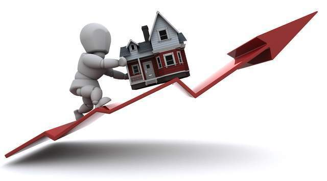

# 新一轮城中村改造要来了，会推高房价吗

寒冬中的楼市，又掀起一阵波澜。

随着中央逐步落子，城中村改造即将拉开新的建设序幕，甚至有人士将其比作“二次棚改”。

2015年，棚改的启动，令房价“涨”声不断。因此本轮城中村改造，也备受多方关注。

那么，这是不是“二次棚改”？中央为何落子城中村改造？又将如何改造？

**二次棚改要来了？**

在近三个月的时间里，城中村改造多次被中央提及。

4月28日，中央政治局召开会议，提出“在超大特大城市积极稳步推进城中村改造”等。

7月21日，国务院总理李强主持召开国务院常务会议，审议通过《关于在超大特大城市积极稳步推进城中村改造的指导意见》。

7月24日，中央政治局召开会议，分析研究当前经济形势，部署下半年经济工作。会议指出，要加大保障性住房建设和供给，积极推动城中村改造和“平急两用”公共基础设施建设，盘活改造各类闲置房产。

这意味着，新一轮城中村改造箭在弦上，落子在即。

本次城中村改造备受关注，有市场人士将城中村改造与之前的棚改相提并论，甚至称之为“二次棚改”。

2015年，在房地产陷入低谷之时，正是因为棚改的启动，通过货币化安置推动大规模棚改，资金最终流入到楼市，推高了各地的房价，令楼市堰塞湖至今高悬。

那么，本次的城中村改造是不是“二次棚改”？

中国民生银行首席经济学家温彬向中国新闻周刊表示，两者之间差异明显。首先是范围不同，此次城中村改造的范围仅限于“超大特大城市”，而不像上一轮的棚改一样，无论城市大小均有涉及。其次是力度不同，上一轮棚改是全国各地集中拆迁，大拆大建；此次是要稳中求进、积极稳妥，成熟一个推进一个。最后是配套措施不同，上一轮棚改很大程度上受货币化因素支撑，而此次城中村改造，要求多渠道筹措改造资金，高效综合利用土地资源，并把城中村改造与保障性住房建设结合好。

中指研究院调查事业部运营总监吴建钦表示，此次城中村改造有三大亮点，一是聚焦在超大特大城市范围，二是强调积极稳步推进、避免过急，三是强调与保障性住房建设结合好，这是现阶段改造的新特征。

这一新特征立足于新的需求因素。

国务院常务会议指出，在超大特大城市积极稳步实施城中村改造是改善民生、扩大内需、推动城市高质量发展的一项重要举措。

据第七次全国人口普查数据，目前全国共有7个超大城市和14个特大城市，超大城市包括上海、北京、深圳、重庆、广州、成都、天津；特大城市包括武汉、东莞、西安、杭州、佛山、南京、沈阳、青岛、济南、长沙、哈尔滨、郑州、昆明、大连。

首都经济贸易大学京津冀房地产研究院院长赵秀池告诉中国新闻周刊，一方面，超大特大城市城中村的配套设施与所处城市有很大差距，居住条件较差，不利于人们生活和城市发展；另一方面，这里又聚集了大量的外来人口、新市民和年轻人，租赁住房的人群较多，利益诉求较多元。因此，超大特大城市城中村改造既有紧迫性，也有复杂性。

吴建钦表示，立足实际需求推进超大特大城市城中村改造可谓有的放矢，但正因为如此，这表明城市发展到了啃硬骨头的时候。

**会推高房价吗？**

对于我国房地产业而言，这一布局影响较为深远。

7月24日，中央政治局会议指出，要切实防范化解重点领域风险，适应我国房地产市场供求关系发生重大变化的新形势，适时调整优化房地产政策，因城施策用好政策工具箱，更好满足居民刚性和改善性住房需求，促进房地产市场平稳健康发展。

“住房存量巨大，未来需求在下降，这是当前楼市供需的基本特征”，浙江工业大学中国住房和房地产研究院副院长范建双向中国新闻周刊表示，首先是人口总量在减少，2022年我国人口141175万人，与2021年相比减少85万；其次是人口老龄化加剧，65岁及以上人口占比从2002年的7.5%上升到2022年的14.86%；第三则是城镇化率不断攀升，我国的人口城镇化率从2003年的40.53%上升到2022年的65.22%。

范建双认为，根据发达国家的历史经验来看，一般城镇化率达到70%后就会停止，甚至出现人口向农村回流的逆城镇化现象。

统计数据显示，截至2022年末，全国常住人口城镇化率为65.22%，离70%已经相差不大，其增长速度已经出现变化。

在2019年，我国常住人口城镇化率提高了1.2个百分点，2020年提高了1.18个百分点，2021年提高了0.83个百分点，而2022年提高了0.5个百分点，我国的城镇化率增长幅度在逐步缩小。

范建双表示，上述因素叠加导致对未来住房需求的不断下降，再加上目前存量住房规模庞大，市场出现了明显的供大于求。

但是在局部市场，仍然存在一定的供应缺口，房地产市场机会仍在。

植信投资首席经济学家兼研究院院长连平告诉中国新闻周刊，相较于以往，当前国内房地产市场大部分地区处于供大于求的状况，当然也有少部分城市住房市场存在供不应求的特点，我国房地产市场分化特征明显。一线和重点二线城市房地产销售、投资等重要指标运行相对平稳，占比较高；但三四线城市房地产市场相对低迷。

统计数据显示，6月份，70个大中城市中，一线城市新建商品住宅价格同比上涨1.3%，二线城市同比上涨0.5%，三线城市同比下降1.4%。比如，北京、上海、天津、南京、杭州等新建商品住宅价格同比处于上涨中。

赵秀池表示，楼市跟着人口走，作为人口基数大、新增人口多的一二线城市，其市场仍有一定的发展潜力。

本次纳入城中村改造的超大特大城市正是我国主要的一二线城市。某种程度上说，超大特大城市城中村改造将是我国房地产业难得的发展空间。

然而，随着城中村改造的推进，会刺激房价上涨吗？

赵秀池表示，城中村改造将会新建大量住房，增加了住房供给，而住房需求没有明显增加，预计房价不会有大的波动。

与此同时，业界认为，不同于上一轮棚改受货币化因素支撑，此次城中村改造要求多渠道筹措改造资金，稳步推进，其对楼市房价的推动作用相对有限。

但是，这仍然存在一定的变量。

**跑出可复制的新模式**

经过了20多年大规模的城镇化建设，很多城中村改造已经逐步推进，剩下的区域大多是利益博弈比较剧烈的地方，最终将导致推进成本高企。

从上述21个超大特大城市来看，据纬房研究院数据显示，其房价的平均水平大多在15000元/平方米以上，少数城市的房价在1万元左右/平方米。从住宅用地的成本来看，其价格空间主要在2000—5000元/平方米。

这意味着，对于一个开发规划面积在百万平方米以上的城中村改造而言，动辄需要上百亿元甚至数百亿元的总体资金。

吴建钦表示，比较容易拆或整治的村庄其实前几轮都逐步开展，目前留下的都是硬骨头，难度也相应更大。

事实上，在本轮楼市调控中，一些有着“旧改王”称号的房地产企业，同样面临着很大的经营难题。

日前，佳兆业集团控股有限公司发布消息称，债权方布洛德峰投资顾问有限公司向香港特别行政区高等法院提出清盘呈请，内容有关未偿还公司债券，涉及本金1.7亿元及利息。

该公司2022年年报显示，截至2022年12月31日，佳兆业集团的现金及银行存款为57.81亿元；总借款为1341.68亿元，其中约1098.92亿元须于一年内偿还。

而截至2022年上半年，佳兆业拥有总土地储备近2740万平方米。此外，“旧改王”佳兆业还有176个城市更新项目未纳入土地储备，占地面积超5394万平方米。

一方面是债务高悬，另一方面是启动资金巨大，对于和佳兆业一样手中有大量旧改项目的房企而言，目前还亟需盘活旗下资产。

吴建钦认为，城中村改造周期长、体量大，涉及的流程多，更需要大规模、低成本、长周期的资金注入。如果没有强有力的财政支撑或社会资本参与，很难形成大规模、可持续的投资。

广东省城规院住房政策研究中心首席研究员李宇嘉对此表示，由于投入非常大，当前国企和城投公司宜主导城中村综合片区改造，一方面是基于公建配套先行和补短板，更重要的是把控一级土地市场，降低改造的安置成本和融资成本，还原改造的公共属性。在公建配套等基础打好后，社会资本才会轻装上阵。

但是对国企来讲，同样也面临着消化周期的难题。对地方性城投公司来讲，也存在债务增加的难题。

国务院常务会议提出，要多渠道筹措改造资金，把城中村改造与保障性住房建设结合好，加大对城中村改造的政策支持，积极创新改造模式，鼓励和支持民间资本参与，努力发展各种新业态，实现可持续运营。

李宇嘉表示，城中村改造需要跑出可复制可推广的新模式来，这包括改造模式、资金来源等多方面，缺一不可。在改革模式上，可以综合改造代替单一开发，运营代替卖房等。而在城中村改造的资金来源上，前期主要是公共资金，比如针对城中村改造设立专项债，并用作资本金等。

中国人民大学中国普惠金融研究院执行主任胡煦告诉中国新闻周刊，由于资金的重要性，从20多年来的城镇化建设来看，其背后都有金融改革的助力，包括当初国开行做基础设施建设、推进地方融资平台就是一种创新。就目前的城中村改造而言，资金端有一定的挑战，金融支持模式也需要探索、需要进行创新。

对于“把城中村改造与保障性住房建设结合好”的要求，温彬表示，要避免房地产化和推升房价，真正体现出社会价值。

吴建钦表示，未来的改造模式将更加多元化，包括考虑到利益诉求的多元化。比如，在当前租购并举的背景下，深圳也在推进城中村统租，这也值得探索。

作者：刘德炳

