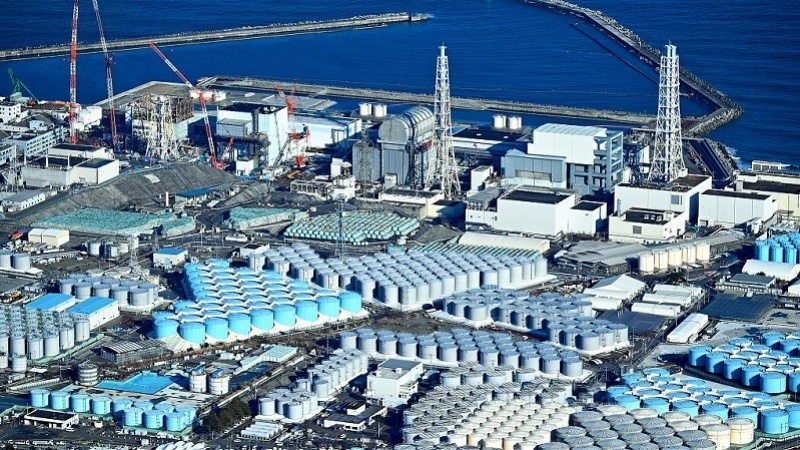

# 日本政府被曝最早8月下旬排放福岛核污染水，首相将赴美向美韩作解释

8月7日，南都记者获悉，日本首相岸田文雄计划于18日赴美，与美国总统拜登和韩国总统尹锡悦分别会晤，解释处理核污水的安全性、科学依据和排放后的措施等。多位日本政府官员透露，预计最早于8月下旬开始将福岛核电站的核污染水排放入海。日本政府将在岸田文雄从美国回国后召开部长会议，以作出最终决定。

_日本福岛核电站。_

据日媒报道，日本福岛县沿岸将从9月开始允许底拖网捕鱼，日本政府计划在捕鱼季节开始前展开核污水排放，因此将预计排放时间定于8月底。此外，岸田文雄正协调与日本全国渔业合作社联合会的代表会面，亲自解释有关核污水排放的相关事宜。

据悉，有日本媒体民调显示，超过80%的日本民众认为日本政府关于核污染水排海的解释不充分。同时不断有日本学者、环保人士发声，认为2011年福岛核事故已造成了放射性物质的泄漏，如今又人为排海增加放射性物质的污染，是不能容忍的。

7月20日，外交部发言人毛宁在例行记者会表示，日本政府近期就福岛核污染水排海问题开展全球公关，试图用专项基金堵住反对排海的日本民众之口，试图把国际原子能机构综合评估报告当作“通行证”，摆出排海势在必行的架势。

“如果核污染水是安全的，就没有必要排海，如果不安全，就更不应该排海。”毛宁指出，日本核污染水排海计划的正当性、合法性和安全性饱受国际质疑。无论日方如何文过饰非，也无法“漂白”排海计划。周边邻国此起彼伏的抗议和日本国内各界的质疑之声都是明证。

采写：南都记者 翁安琪

