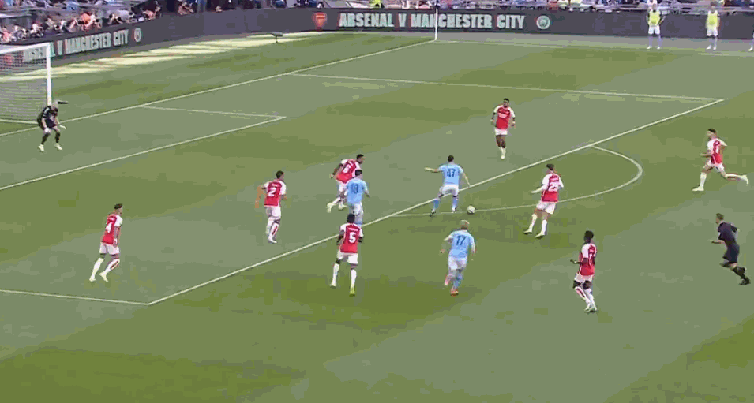

# 社区盾：阿森纳点球胜总分5-2曼城 飞翼绝平德布劳内失点

北京时间8月7日凌晨，2023年社区盾在温布利大球场举行，阿森纳经过点球大战以5-2的总比分击败曼城，后者无缘四冠王！帕尔默替补破门，特罗萨德伤停补时绝平，德布劳内和罗德里关键时刻罚丢点球。

**比赛看点**

1.曼城无缘四冠王，和1999年的曼联一样都是三冠王。

2.阿森纳终结对阵曼城的8连败，自2020年之后再次夺冠，队史第17冠，不过自从2013年以来，只有2018年的曼城在捧起社区盾之后，夺得了新赛季的英超冠军。

3.哈兰德上赛季各项赛事出场57次，打入56球，表现相当出色，但是本赛季首战，他几乎隐身，第64分钟就被帕尔默换下。

**精彩回顾**

第8分钟，托马斯拉拽阿尔瓦雷斯，黄牌。

第14分钟，罗德里弧顶右脚远射，稍稍打偏。

第25分钟，哈弗茨禁区内转身射门被扑出，马丁内利补射又被封堵。

第27分钟，哈弗茨背后踢倒斯通斯，黄牌。

第36分钟，萨卡禁区右侧内切，左脚兜射远角打偏。

第43分钟，罗德里中圈直接右脚吊射，高出横梁。

第44分钟，萨卡禁区右侧倒三角回传，哈弗茨右脚推射被扑出，错失良机。

第52分钟，曼城右侧角球传中，斯通斯头球攻门被扑出。

第63分钟，萨卡回做，赖斯右脚远射打高。

第70分钟，福登中路分球，帕尔默禁区右侧左脚劲射被挡出底线。

**第77分钟，福登转身摆脱托马斯之后分球，蒂尔尼解围，德布劳内头球，帕尔默禁区右侧左脚兜射入网，1-0！曼城取得领先。**

第85分钟，德布劳内左侧角球传中，罗德里前点头球冲顶，被拉姆斯代尔扑出。

第95分钟，沃克和托马斯头碰头，都缠上了绷带。

**第101分钟，特罗萨德禁区内左脚抽射，皮球打在阿坎吉身上折射入网，1-1！阿森纳绝平！**

常规时间结束，两队1-1平，没有加时赛，直接进入点球大战！

第一罚，厄德高进，德布劳内击中横梁，2-1！第二罚，特罗萨德进，B席进，3-2！

第三罚，萨卡进，罗德里被扑出，4-2！第四罚，维埃拉进，5-2！

**球员评分**

**数据统计**

**出场阵容**

曼城（4231）：18-奥尔特加；2-沃克，5-斯通斯，3/迪亚斯，25-阿坎吉；16-罗德里，8-科瓦契奇（64’17-德布劳内）；20-B席，19-阿尔瓦雷斯，10-格拉利什（58’47-福登）；9-哈兰德（64’80-帕尔默）

阿森纳（433）：1-拉姆斯代尔；4-怀特，2-萨利巴，6-加布里埃尔（88’10-史密斯罗），12-廷贝尔（75’3-蒂尔尼）；8-厄德高，5-托马斯，41-赖斯（81’14-恩凯蒂亚）；7-萨卡，29-哈弗茨（88’21-维埃拉），11-马丁内利（75’19-特罗萨德）

