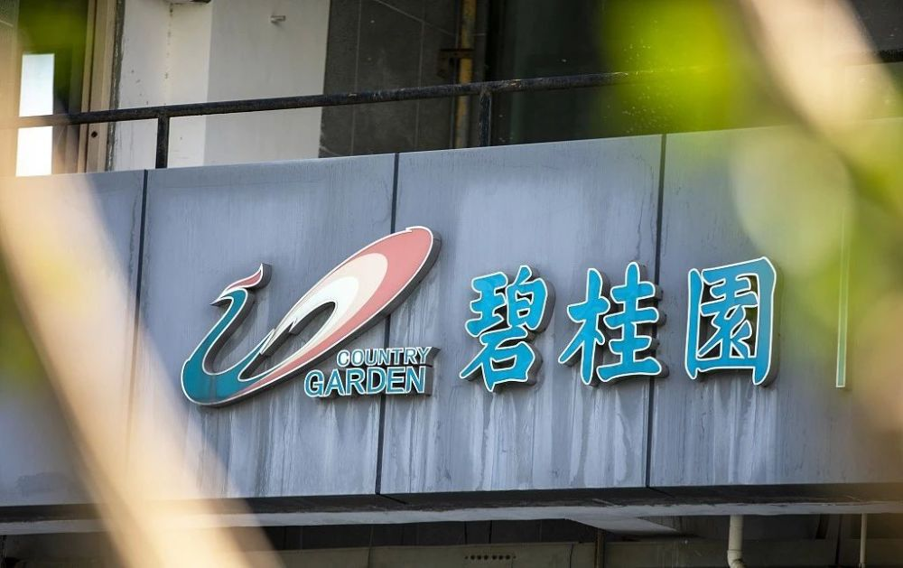
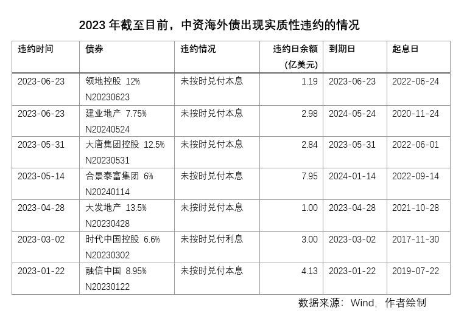

# 1.62亿利息未能按期支付，碧桂园年内还有百亿债务到期

 _来源：视觉中国_

特约作者 | 温世君

编辑 | 肖望

出品 | 棱镜·腾讯小满工作室

8月8日，碧桂园股债纷纷大跌，其中，“21碧地01”盘中成交价较前收盘价跌超33%，临时停牌。上市公司碧桂园（02007.HK）股价下挫14.39%、碧桂园服务（06098.HK）下挫9.68%。

消息面上，据澎湃新闻报道，碧桂园两只原本应于8月7日支付的境外美元债票息未能按期支付。

两只债券为“碧桂园4.2% N20260206”、“碧桂园 4.8%
N20300806”，规模均为5亿美元，在新加坡证券交易所上市交易，发行起息时间均为2020年8月6日，到期时间分别是2026年2月6日和2030年8月6日。

按照一年两次的付息频率，两只美元债此次应付利息分别为1050万美元、1200万美元，合计约1.62亿元。在2022年《财富》世界500强排名中，碧桂园排名第206位，营收639.79亿美元，但如今，筹措千万美元级的现金也是难题。

**碧桂园目前海外发行债券情况（红色为此次未按期支付利息的债券）**

碧桂园方面的态度是积极的。《证券时报》援引消息人士说法称，“两笔美元债券仍处在30天付息宽限期内，公司高度重视债务风险化解，公司目前仍在积极优化资金安排，努力保障债权人的合法权益。”

这是碧桂园首次美元债延期。作者梳理，碧桂园的境外债券利息兑付的高峰是即将到来的9、10月份，年内到期的境内债务达101.9亿元。这对公司的流动性是巨大的考验。

7月31日，碧桂园公告，预期上半年可能录得未经审核净亏损。公司称，主要由于房地产行业销售下行的影响，导致房地产业务结转毛利率下降，物业项目减值增加等。市场情绪本已比较紧张，叠加此次美元债未能按时付息，导致恐慌情绪有所蔓延。

8月8日，除碧桂园股债大跌外，地产债特别是民营地产债普遍放量下跌：“阳光优A”跌超37%， “21旭辉01”跌超12%，“21龙湖04”跌超11%。

地产行业是极度资金密集型行业。销售和回款的节奏关系着地产公司的生死存亡。即便是碧桂园这样的头部企业，如今也有些手脚慌乱。

今年以来地产销售持续低迷。2023年7月，碧桂园合同销售金额降至人民币120.7亿元，而2022年7月这个数据是301.1亿元。2023年1-7月，合计销售金额仅1408.3亿；2022年，这个数字是3500亿。

碧桂园内部人士接受澎湃新闻采访时也坦言，自2021年以来，行业持续低迷，多重不利因素叠加，导致行业销售持续下滑，公开市场融资失效，行业步入了前所未有的困难时期。受近期销售额与再融资环境持续恶化，叠加各类资金监管的影响，公司账面可动用资金持续减少，出现了阶段性流动压力。

“公司一直在坚守，却难言曙光。”该人士称。

实际上，地产周期进入行业低谷，叠加强美元周期的持续，中资地产海外债（美元为主）“借新还旧”的节奏被打乱。中资地产海外债进入艰难时期。

早在2021年，中资地产海外债就开始密集出现违约事件。当年10月26日，国家发改委外资司和国家外汇局资本司就联合召集了包括万科、世茂、建业等8家房企，在京召开了中资房企外债专题座谈会，商讨应对思路。

2022年，随着行业低迷趋势延续，叠加债务周期到期的因素，中资地产海外债违约密集。Wind数据显示，2022年全年出现实质性违约的中资海外债达到102只，其中多为民营房地产企业：禹州地产违约9只，融创中国、正荣地产违约8只，阳光城违约6只，兆佳业违约5只，华夏幸福违约3只，中国恒大违约2只……

**2023年截至目前，中资海外债出现实质性违约的情况**

到了2023年，由于之前风险的集中暴露，能够存续的中资海外债已经是为数不多“优质”发债主体，中资海外债违约事件大幅下滑。

在碧桂园此次事件之前，2023年出现实质性违约的中资海外债有7只。这7只都是民营地产企业。

