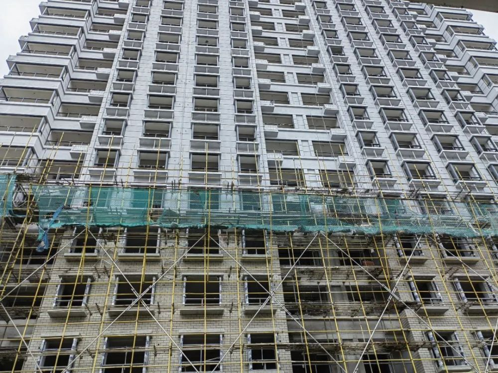

# 69平米的房子，37平米是公摊：楼道宽敞无比，“能停下一辆车”

_目前，国内也有多个地方开始试点“商品房销售按套内面积计价”，在保障消费者权益等方面，取消公摊面积或已是大势所趋。图/IC photo_

**文丨新京报记者 隋坤**

**编辑丨胡杰**

**校对丨李立军**

“69平方米的房子，公摊面积竟然达到37平方米，公摊率超过了50%，这也太离谱了。”西安姬女士买房“高公摊”事件，日前引发关注。

姬女士提供的购房合同显示：房屋性质是公寓，建筑面积预(实)测共69.75平方米，其中套内建筑面积32.71平方米，分摊共有建筑面积37.04平方米。

姬女士的遭遇并不是孤例。近年来，社会上关于房屋买卖的公摊面积争议时有发生。

据悉，坊间流传着多个版本的“公摊标准”，姬女士在电话中对新京报记者说，自己曾询问过相关方面专家，得到的答案是“公摊面积超50%肯定不合规”。但也有不少专家、律师曾对媒体表示，国内尚无公摊面积标准。

以“公摊面积”为关键词在中国裁判文书网搜索，结果显示共有5万余份相关判决文书，其中涉刑事案件近百份，民事纠纷4万余份。

新京报记者整理百余份裁判文书发现，判决中并无“国家规定公摊标准应为多少”的字样。法庭多以合同中约定的公摊面积与实际面积是否有出入为判决标准。

房地产专家表示，在多个国家地区，售房都以套内实用面积计算，按建筑面积计算已不合时宜。目前，国内也有多个地方开始试点“商品房销售按套内面积计价”，在保障消费者权益等方面，取消公摊面积或已是大势所趋。

**楼道宽敞无比，“能停下一辆车”**

购买的房子公摊面积大，姬女士早在收房前就“有所耳闻”。

2022年，交完28万首付的姬女士曾因银行放贷不顺等问题，想转卖房产。姬女士回忆，当她来到西安某中介门店时，工作人员说该小区在当地因公摊面积大而出名，“很难转卖”。

2023年，小区正式交房，姬女士告诉记者，她前来收房时，注意到楼道宽敞无比，“能停下一辆车”。进入家中，她发现房屋面积比购房合同上标注的69平方米的建筑面积相比明显小很多。

_姬女士房屋外的走廊。受访者供图_

姬女士说，自己联系置业顾问刘先生，表示房子公摊面积过大，认为“不合理”。刘先生回复说，小区单价本身就低，公摊面积也早在购房合同中就写得清清楚楚。且“相关部门对商业公寓的公摊面积比例未作明确规定”。

姬女士告诉新京报记者：“当时合同太长，我没仔细看。”

7月29日，新京报记者联系姬女士的置业顾问刘先生。对方表示“了解姬女士的事”，但小区五证齐全，且经过相关部门备案，“完全符合规定”。

据央广网报道，姬女士所购楼盘售楼处工作人员曾如此解释公摊面积大：“小区主打中高端改善型，所以才使用了大门厅、宽走廊、每层公用卫生间和洗手池等提高业主居住舒适度的装修。”

**有无公摊面积标准?**

姬女士买房“高公摊”事件曝光后，公摊面积标准迅速成为舆论关注的热点。

据媒体报道，与商品房预售制一样，公摊面积制度也是同一时期由香港引入内地的。公摊面积没有统一标准，最后只能由开发商说了算。公摊面积又衍生出一系列收费，如物业费、取暖费都是按公摊后的面积收费;与此同时，公摊面积上所产生的一些收益却并未分给业主。因此，围绕公摊面积所产生的纠纷不断。

华东政法大学房地产政策法律研究所所长杨勤法表示，现在国内确实没有公摊面积相关方面的标准，只有市面上约定俗成的比例。

这与西安市雁塔区住建局的回应大体一致。据极目新闻报道，雁塔区住建局值班人员在回应媒体采访时表示：“目前公摊面积的占比没有明文规定。”

_姬女士所购房屋的内部状态。受访者供图_

我国于2001年施行的《商品房销售管理办法》明确规定：商品房建筑面积由套内建筑面积和公用建筑面积共同组成;另据建设部1995年发布的《商品房销售面积计算及公用建筑面积分摊规则》(试行)中的规定，公用建筑面积分摊计算各套(单元)的套内建筑面积乘以公用建筑面积分摊系数，得到购房者应合理分摊的公用建筑面积。

关于公摊面积标准，曾有这样的说法：多层住宅的公摊面积约在建筑面积的10%到13%之间，18层以下的板式住宅公摊面积约在13%到15%之间，点式的楼盘公摊面积大多在15%到17%之间。

但上述说法被杨勤法否认。“现行公摊面积相关的法律概念是在2001年施行的《商品房销售管理办法》，其规定了商品房建筑面积由套内建筑面积和分摊的共有建筑面积组成，但没有对房屋公摊面积的上限进行限定。”杨勤法说。

新京报记者注意到，在裁判文书网展示的相关判决中，法庭多以合同中约定的公摊面积与实际面积是否有出入为判决标准，“公摊超过某比例”并不作为判决标准。

**如何维权**

姬女士事件引发网络热议后，许多网友在社交平台询问，买到公摊面积大的房子该如何维权?

原中国社科院金融研究所金融发展室主任、地产专家易宪容对新京报记者说，签订购房合同时就应该注意公摊面积等关键信息。若事后觉得不满意，可以先尝试与开发商协商退房。

如果开发商不同意退房，业主又该如何维权?杨勤法说，如果购房者买到公摊面积大的房子，首先应该明确一个问题，即房屋开发商是否履行了合理的告知义务，房屋过大的公摊面积是否已在购房合同或其他文件中标明。

《商品房销售管理办法》第十八条第三款明确规定：按套(单元)计价或者按套内建筑面积计价的，商品房买卖合同中应当注明建筑面积和分摊的共有建筑面积。

_姬女士向记者提供的购房合同。受访者供图_

新京报记者注意到，在姬女士事件当中，双方对于“公摊面积是否提前告知”各执一词。

姬女士的置业顾问刘先生对新京报记者说，自己曾履行告知义务。“姬女士的购房合同中已明确标明公摊面积等信息，且在签合同的过程中，我还特意提醒她注意公摊面积等重要信息。”

但姬女士并不认同此说法，她说自己在签合同时询问对方“是否有需要注意的地方”，得到的回答是“没有”。

刘先生告诉新京报记者，各种房型的合同样本均“按照规定”在售楼处前台进行展示，其中也标明了公摊面积等信息。但购买该楼盘的多位业主对新京报记者表示，并不知道售楼处展示合同一事。某男业主说，当初签署购房合同时，开发商工作人员以“合同都是制式的”为理由，只把需要签字的几页给了自己。“其中没有公摊面积的信息，直到收房时我才知道公摊面积这么大。”

杨勤法说，国内法院曾有因“未履行告知义务”，而判开发商“承担一定赔偿责任”的先例。

此外，业主还可以通过请测绘机构重新测绘房屋面积的方式，来为自己维权。在测绘中，若业主发现结果与合同约定面积有差别，同样可以让开发商或者相关部门承担相应责任。

除了上述维权办法，《商品房销售管理办法》第二十条还规定，若当事人未在合同中载明合同约定面积与产权登记面积发生误差时的处理办法，且误差比超过3%时，买受人有权退房。

杨勤法告诉记者，对于业主而言，想要通过援引该条款维护自身权益非常难。首先业主要证明商品房面积误差比绝对值超出3%本身已具备一定困难性;其次，由于公摊面积并非法律概念，该条款中规定的房屋面积究竟为公摊面积还是套内建筑面积，还是二者之和，现实中存在一定争议。

**取消公摊是大势所趋?**

鉴于种种争议，民间对于“取消公摊”的呼声越来越高。

杨勤法说，国内应逐步探索按房屋实用面积售卖，逐步取消公摊概念。“这样的政策在国外已有很多先例，许多国家售房时都是只按实用面积计价。”

据媒体报道，香港已于10年前正式废除了公摊面积制。从2013年起，香港的新房销售必须按照实用面积标注，否则将被罚款100万至500万港元、判处3至7年监禁;针对存量房售卖，政府要求卖家提供以“套内面积”和“建筑面积”计价的双份资料。

在国内，也有一些地区在试点取消“公摊面积”，以套内面积售房。

2002年6月，重庆市通过了《重庆市城镇房地产交易管理条例》，以地方法规的形式要求商品房现售和预售都必须以套内使用面积作为计价依据。这使重庆成为了率先取消“公摊面积”的试点城市。

在2021年全国两会上，全国政协委员周世虹提交了一份“关于取消公摊面积”的议案，其中建议“应该逐步取消房地产市场长期存在的公摊面积和商品房预售制度。”

据合肥日报报道，7月28日下午合肥市召开房地产专题会议，明确提出“为避免公摊面积比例过大，要积极探索商品房销售按套内面积计价”。

“合肥的政策实施后，对市场信心有提振作用，不排除其他城市迅速跟进。”易宪容说，“但取消公摊面积也有其两面性。首先，因为公摊面积中往往包含了宽敞的公共空间，取消公摊可能在一定程度上影响房屋的舒适度;其次，若取消公摊但总房价不降，结果可能造成商品房每平方米的单价进一步上涨。”

易居研究院研究总监严跃进在接受媒体采访时认为，现在条件下，即便取消了“公摊面积”，羊毛还是出在羊身上，开发商也会把房价调高来填补“公摊面积”的费用。他认为，关键在于开发商要把标准、明细公开，比如在购房合同上明确清楚，让购房者感受到货真价实、心里踏实。

中国经济时报评论认为，合肥的试点，将促进购房者放心购房，避免购房者与房地产开发商、物业的纠纷。长期来看，我国房地产市场已经从总量短缺转为结构性供给不足，进入结构优化和品质提升的发展新阶段。为适应房地产市场供求关系发生重大变化的新形势，房地产业要拉回购房者，就必须保障购房者的权益，赢得购房者的信任。

