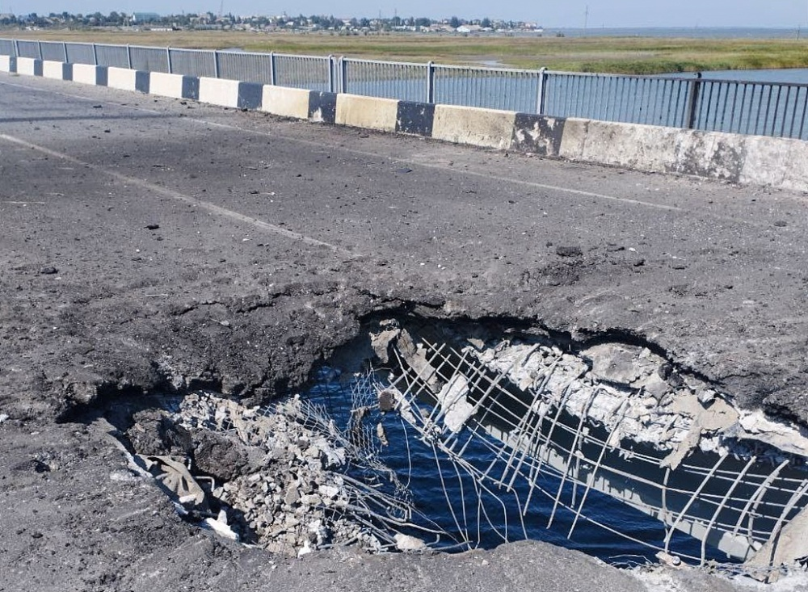
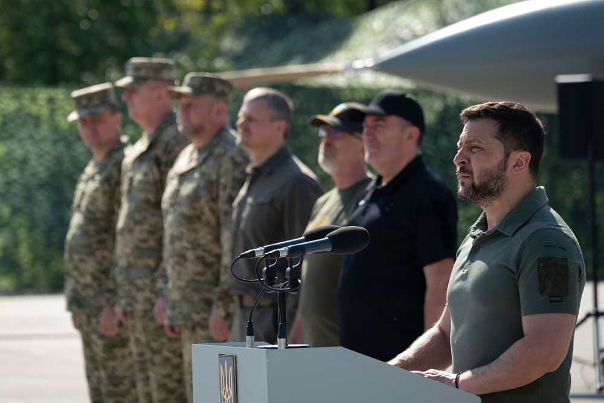

# 乌克兰炸桥扰乱俄关键补给线，美媒：基辅将战争范围推向新方向

【环球时报驻俄罗斯、德国特派特约记者 隋鑫 青木 环球时报特约记者 柳玉鹏
宇扬】为期两天的乌克兰问题国际会议当地时间6日在沙特阿拉伯港口城市吉达闭幕。就在与会各方强调通过国际协商实现乌克兰危机和平解决之际，乌克兰武装部队6日证实，乌军当天下午袭击了连接赫尔松和克里米亚地区的两座大桥。俄官员强调，这两座桥梁都是民用设施，未被用于军事用途。美国《纽约时报》报道称，这是乌方对克里米亚半岛及其周边地区更广泛袭击的一部分，旨在扰乱克里姆林宫的关键补给路线，并将战争范围推向新的方向。在上述两座大桥遭袭之前，来自乌空军的消息称，俄罗斯在一夜之间对乌克兰发动了多轮袭击，涵盖巡航导弹、高超音速导弹等，共计70多枚空袭武器，似乎至少有10枚导弹穿过了乌克兰的防空网络。舆论认为，俄此举是为报复乌克兰利用自杀无人艇对俄海军基地新罗西斯克以及“白鲑鱼”号油轮实施的一系列袭击。德国《法兰克福评论报》7日评论称，乌克兰的反攻已经进行了两个月，但没有达到期望。当前的情况说明他们正在改变策略。不过俄罗斯方面多次强调，俄罗斯在黑海地区拥有所有应对威胁的军事和技术能力，能够保障国家安全。

_当地时间2023年8月6日，俄媒称乌军对两座连接克里米亚的大桥发动导弹袭击。图为格尼切斯克桥上的弹孔。（视觉中国）_

**打击俄基础设施常态化**

据俄罗斯《消息报》7日报道，俄罗斯和乌克兰方面6日均证实，有两座通往克里米亚的桥梁当天遭到了基辅方面的袭击。俄媒报道称，此次遭袭击和破坏的是连接克里米亚半岛和赫尔松地区的琼加尔大桥，以及连接克里米亚半岛和格尼切斯克镇的格尼切斯克大桥。其中，琼加尔大桥在今年6月曾遭到乌方的严重袭击，因维修关闭了数周。有消息称，袭击上述两座大桥的为西方向乌克兰提供的巡航导弹。据俄罗斯官员透露，乌克兰总共发射了12枚导弹，其中9枚被俄防空部队拦截。

赫尔松州代理行政长官萨尔多表示，乌方此次袭击导致其中一座大桥旁的天然气管道发生破裂，附近2万名居民的天然气供应中断。他还称，乌军是在对平民和那些正在通过赫尔松地区的居民进行报复。

俄罗斯军事专家克努托夫表示，6日遭遇袭击的两座大桥对俄军后勤补给非常重要，乌军正在对克里米亚采取之前曾在赫尔松使用的战术，即打击俄军的后方交通线，进而影响俄军的后勤补给，迫使俄军撤退。

德国电视一台7日引述美国专家的观点报道称，在乌克兰打击两座桥梁之后，莫斯科在该地区的军事运输变得更加困难。美国战争研究所称，对俄罗斯重要运输线路的桥梁打击是乌克兰封锁行动的一部分，旨在为未来的决定性反攻行动创造条件。他们可能会在一段不确定的时间内切断俄人员、物资和设备通过克里米亚的运输，这些装备用于俄在扎波罗热西部地区以及顿涅茨克地区的关键防御行动。这一袭击可能会导致重大的物流中断、延误和交通堵塞。同时，乌军部队也在努力，拦截俄在黑海的后勤保障目标。

美国有线电视新闻网（CNN）7日评论认为，在乌克兰总统泽连斯基宣布冲突正在“返回俄罗斯”的背景下，乌克兰在俄罗斯控制的领土内发动袭击已经成为这场战争越来越常见的特征。报道提到，除切断俄方的“重要交通线”外，乌方还对包括莫斯科在内的俄罗斯城市实施了一系列无人机袭击。乌克兰此前还称，将对俄罗斯在黑海的船只和通往克里米亚的重要桥梁发动更多袭击。《纽约时报》称，与此前的态度不同，泽连斯基和其他乌克兰高级官员此次高调承认为两座大桥遭袭负责，他们希望借此让俄罗斯普通民众直面战争。

_当地时间2023年8月6日，乌克兰基辅，泽连斯基会见乌克兰空军。（视觉中国）_

俄罗斯《独立报》6日刊文称，由于在前线的反攻没有取得重大成功，乌克兰转而继续扩大对俄罗斯本土的袭击，包括对俄罗斯的工业、物流和运输设施造成损害。

德国媒体7日也称，乌克兰正在放弃西方（要求使用的）战术。乌克兰武装部队不再在雷区和反坦克障碍的火力下奔跑，而是希望用火炮和远程导弹来削弱俄罗斯。不过西方对此持批评态度，因为这存在风险。今年7月，在乌克兰袭击克里米亚大桥时，德国《柏林日报》就曾批评说，这暴露了泽连斯基的危险策略。

**高调秀导弹，泽连斯基感谢西方军援**

对于乌方针对俄境内民用设施实施的一系列袭击，俄罗斯方面7日并未宣布进行报复性回击，仅通报了一些前线上取得的进展。据俄《观点报》报道，俄国防部发言人科纳申科夫7日表示，过去3天，俄军在库皮扬斯克方向的正面推进11公里，向敌人防御深度推进超过3公里。

据乌克兰独立通讯社7日报道，乌“南方”作战司令部联合新闻中心负责人古梅纽克当天称，未来两天，俄军可能不会对乌克兰发动大规模导弹和无人机攻击，但可能会有定点打击。

就在乌方袭击俄两座桥梁之前，乌克兰独立通讯社6日报道称，俄军当天对乌克兰实施了近期最强大的联合打击之一。俄军使用了无人机、空基和海基巡航导弹以及高超音速导弹等武器。这是对此前乌克兰对俄海军基地新罗西斯克以及“白鲑鱼”号油轮实施袭击的报复性打击。

印度《欧亚时报》报道认为，乌克兰在黑海的军事活动完全由美国和北约协调。北约不仅提供无人机的情报，还可能提供海上无人艇发射平台。北约军事顾问直接参与对黑海基础设施的袭击给整个海域带来威胁。然而，俄罗斯电子战系统已经学会了对抗美国不断监视克里米亚的侦察卫星以及侦察机。

CNN7日称，泽连斯基当地时间6日表示，美国和德国向乌克兰捐赠的防空系统取得了“重大成果”。他表示：“我感谢在防空系统方面为我们提供帮助的每个国家。这些防空系统功能强大，非常有效。”泽连斯基6日还表示，基辅收到了“斯卡尔普”远程导弹，并在社交媒体上展示了其中一枚导弹。泽连斯基在这枚导弹上写下“荣耀属于乌克兰”。据了解，该导弹与英国此前援乌的“风暴之影”实际为同一种导弹，由法英两国共同研制、欧洲导弹集团制造，是目前为止西方向乌供应的射程最远的武器。

**解决冲突，俄方开出新条件**

在乌克兰展示西方军援的同时，俄方也准备加大力量生产武器。据俄塔社7日报道，俄总统普京当天会见俄罗斯国家技术集团负责人切梅佐夫时表示，希望能增加包括“柳叶刀”和“立方体”巡飞弹在内的最新型武器的生产，称它们在战场上表现得非常有效。

在战场之外，俄《消息报》6日称，为期两天的乌克兰问题国际会议并未同意乌方提出的和平计划。总体而言，多个国家未改变基本立场。一些专家认为，如果到今年9月，反攻没有取得任何有意义的进展，西方将减少对乌克兰的支持，转而采取长期冲突战略。

俄外交部发言人扎哈罗娃7日表示，期待参加乌克兰问题国际会议的国家能向俄方通报磋商进程。如果没有俄罗斯的参与并考虑相关利益，任何有关乌克兰危机的会议都没有任何意义。她表示，俄仍然对通过外交手段解决乌克兰危机持开放态度。扎哈罗娃强调，只有基辅停止敌对行动和恐怖袭击，西方国家停止向乌克兰提供武器，乌克兰冲突才有可能得到解决。同时，必须确定乌克兰中立、不结盟和无核化的地位。

俄卫星通讯社7日称，土耳其总统办公室消息人士当天透露，土总统埃尔多安计划在8月与普京举行的会谈中，提议恢复乌克兰问题和平谈判，以尽早实现停火。他说：“总统将在解决冲突方面进行调解，安卡拉一再主张实现可持续的和平，尽快停火，坐到谈判桌前。我们为此继续努力。”

