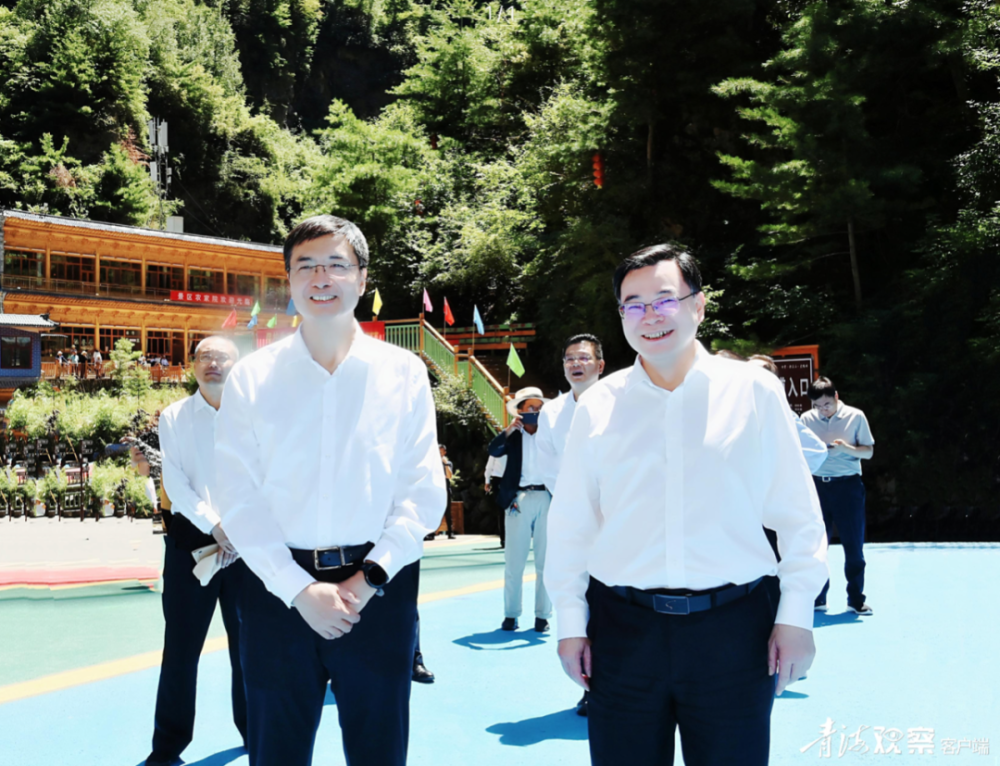
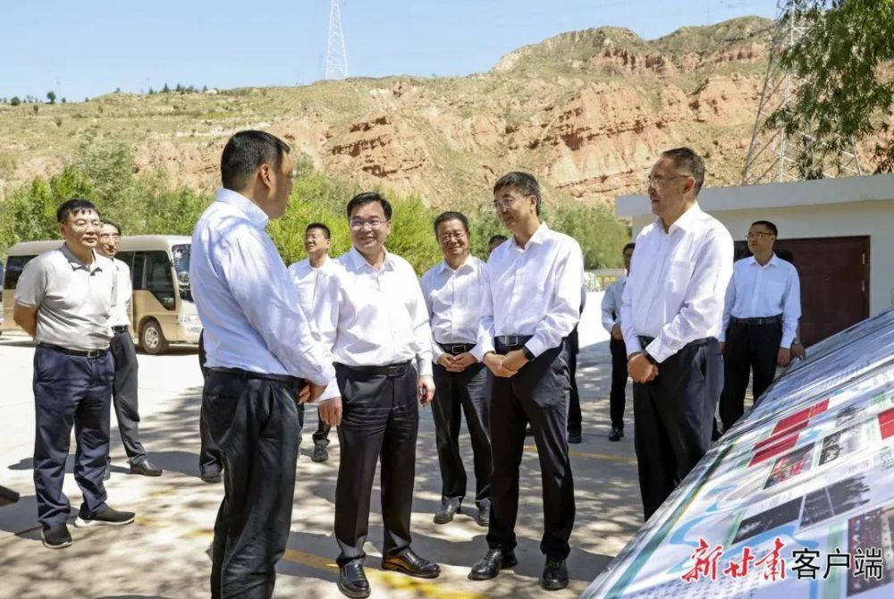

# 事关国家战略！西部相邻省份的两位省委书记，“携手”调研

**撰文 | 余晖**

8月7日，青海省委书记陈刚、甘肃省委书记胡昌升一同调研。

据《青海日报》报道，当天，陈刚、胡昌升一同到了 **隔黄河相邻** 的青海省民和回族土族自治县、甘肃省积石山保安族东乡族撒拉族自治县调研。

调研的主题是“黄河上游生态保护和高质量发展情况”。

政知君注意到，公开报道中，两位省委书记“携手”调研的情况，并不常见。

**事关国家战略**

黄河发源于青藏高原巴颜喀拉山北麓，呈“几”字形流经 **青海** 、四川、 **甘肃**
、宁夏、内蒙古、山西、陕西、河南、山东9省区，全长5464公里，是我国第二长河。

2019年，黄河流域生态保护和高质量发展 **上升为国家战略** 。

2019年9月，习近平总书记在河南郑州主持召开了黄河流域生态保护和高质量发展座谈会。

习近平强调， **黄河流域生态保护和高质量发展，同京津冀协同发展、长江经济带发展、粤港澳大湾区建设、长三角一体化发展一样，是重大国家战略。**

2021年10月，中共中央、国务院印发了《黄河流域生态保护和高质量发展规划纲要》。纲要明确，“保护黄河是事关中华民族伟大复兴的千秋大计”。

从地理位置上看，青海省和甘肃省地缘相接，都是黄河流经的省份。

对于陈刚、胡昌升来说，黄河流域生态保护和高质量发展，是摆在他们案头的重要工作内容之一。

政知君注意到，胡昌升和陈刚，分别是在去年底、今年初担任省委书记的。

胡昌升曾在四川、青海、福建、黑龙江任职，2022年12月，时任黑龙江省省长的胡昌升接替尹弘（现任江西省委书记）担任甘肃省委书记。

陈刚曾在北京、贵州、河北、
中华全国总工会任职。今年1月，时任中华全国总工会党组书记、副主席、书记处第一书记的陈刚接替信长星（现任江苏省委书记）担任青海省委书记。

政知君注意到，这并不是青海省委书记、甘肃省委书记今年的首次见面。

5月30日、31日，青海省党政代表团赴甘肃考察，带队的就是青海省委书记陈刚。

当时，在甘肃兰州，两省份举行了甘青两省深化合作座谈会暨签约仪式，两省份的四位省级党政一把手出席。

**两位省委书记和5位省部级一同调研**

8月7日，青海省委书记陈刚、甘肃省委书记胡昌升 **一同到了隔黄河相邻的青海省民和回族土族自治县、甘肃省积石山保安族东乡族撒拉族自治县** 。

积石山县位于甘肃省西南部，北与青海省民和县隔河相望。

政知君注意到，一同参加这次调研的还有青海、甘肃的5位省部级干部，分别是：

青海省委常委、海东市委书记乌拉孜别克·热苏力汗

青海省委常委、秘书长朱向峰

青海省副省长刘涛

甘肃省委常委、副省长程晓波

甘肃省委常委、秘书长张伟

当地媒体还披露了调研细节。

陈刚、胡昌升先后到了 **民和县禹王峡、积石山县大墩峡** ，察看当地生态环境保护和旅游景区开发情况，了解青甘旅游环线共建共享状况。

**在甘肃一侧，陈刚、胡昌升还俯望青甘两省间又一条省际快速通道** ——大清公路项目现场，并听取项目进展及青甘公路大通道规划建设、综合交通互联互通情况。

在一同调研的过程中，陈刚、胡昌升都提到了青海和甘肃两省份的密切关系。

陈刚提到， **青甘两省地缘相连、山水相依、人文相通、血脉相亲，是同饮黄河水的兄弟省份** ，共同承担着筑牢黄河上游生态安全屏障的重大责任。

胡昌升强调， **甘青同饮黄河水，互为上下游，是“你中有我、我中有你”的一家人** ，共同肩负着黄河上游生态保护的特殊历史使命和重大政治责任。

**兰西城市群**

“加强黄河上游生态修复及综合治理”是此次调研的重点内容之一。

在调研中，陈刚强调，要全面加强黄河上游生态修复及综合治理，保护水资源、防治水污染、改善水环境、修复水生态，牢牢巩固水质达标成果。

胡昌升强调，要深入推进山水林田湖草沙冰一体化保护和系统治理，加强水土流失、荒漠化综合治理、生态保护修复，推动流域生态面貌明显改善，努力筑牢黄河上游乃至国家西部重要生态安全屏障。

政知君注意到，在调研过程中，陈刚和胡昌升都提到了“兰西城市群”。

兰州—西宁城市群是我国西部重要的跨省区城市群。兰州-西宁城市群规划范围包括：

甘肃省兰州市，白银市白银区、平川区、靖远县、景泰县，定西市安定区、陇西县、渭源县、临洮县，临夏回族自治州临夏市、东乡族自治县、永靖县、积石山保安族东乡族撒拉族自治县，青海省西宁市，海东市，海北藏族自治州海晏县，海南藏族自治州共和县、贵德县、贵南县，黄南藏族自治州同仁县、尖扎县，总面积9.75万平方公里。

2018年，国家发改委印发了《兰州—西宁城市群发展规划》。根据规划， **到2035年，兰西城市群协同发展格局基本形成。**

2020年5月，深化甘青合作推进兰州西宁城市群高质量发展工作会议召开，时任甘肃省委书记林铎、时任青海省委书记王建军等出席。

虽然这几年甘肃、青海党政一把手调整，但两省推动“兰西城市群”发展的步伐却从未停止。

此次调研过程中，陈刚强调，要落实两省战略合作框架协议， **推进兰西城市群高质量发展。**

他说，“同甘肃一道在基础设施建设、产业协同发展、旅游提质升级、各民族交往交流交融等方面深化合作，提升区域发展新优势”。

胡昌升强调，要“加强与青海协同发展，健全落实跨区域协调机制，守护好黄河母亲河”。

他还提到， **加快推动兰西城市群建设**
，推进甘青综合交通等基础设施互联互通、公共服务共建共享，完善畅通旅游大环线，带动沿线旅游资源开发，着力打造黄河民族风情精品旅游线路。

**资料 ｜ 青海日报 甘肃日报 新华社 人民网等**

**【版权声明】本文著作权归政知新媒体独家所有，未经授权，不得转载。**

