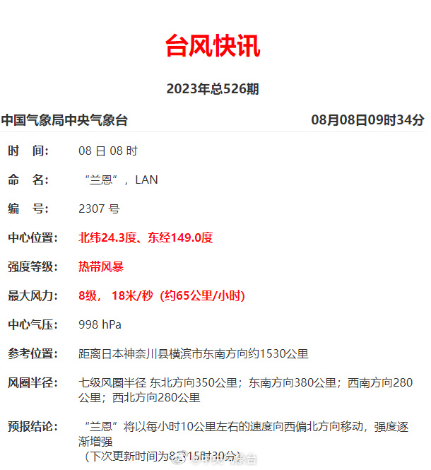
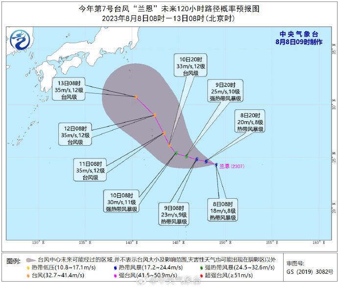

# 今年第7号台风“兰恩”于今天上午在西北太平洋洋面生成

@中央气象台

今年第7号台风“兰恩”（热带风暴级；英文名称：Lan；名字来源：美国；名称意义：风暴（马绍尔语））于今天（8日）上午在西北太平洋洋面生成，上午8点钟其中心位于日本神奈川县横滨市东南方向约1530公里的洋面上，北纬24.3度、东经149.0度，
8级（18米/秒），998百帕。预计，“兰恩”将以每小时10公里左右的速度向西偏北方向移动，强度逐渐加强。

