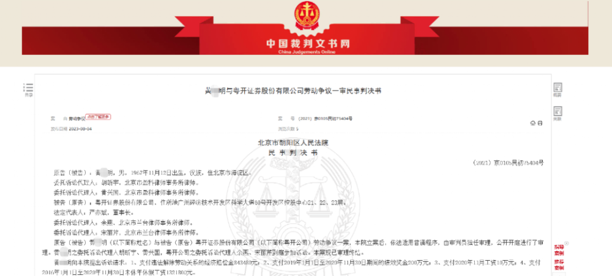
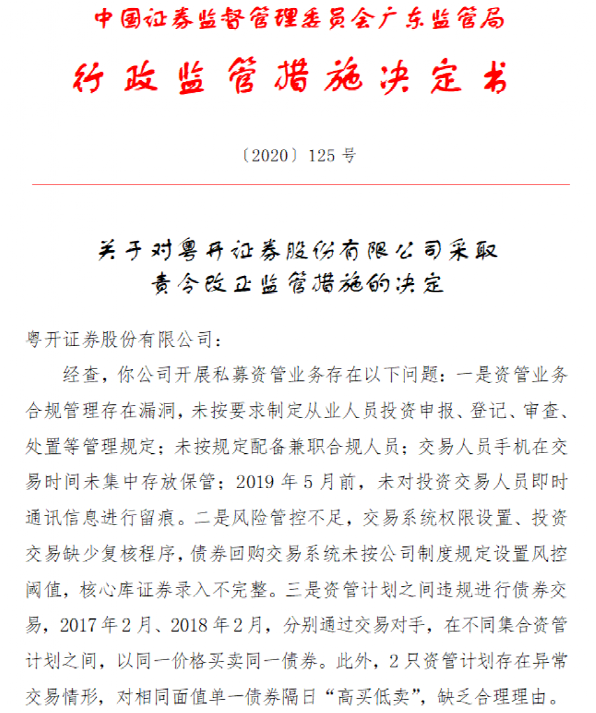

# 券商高管也讨薪！粤开证券原副总裁向前东家追讨绩效奖金200万等

中国基金报 晨曦

又有券商员工讨薪案！这一次力图维权的是粤开证券原副总裁。

日前，中国裁判文书网披露的一份民事判决书显示，在离职后，粤开证券原副总裁黄某明向前东家追讨绩效奖金200万、5年未休年休假工资132万等，并要求支付违法解除劳动关系的经济赔偿金约84万。在职期间，黄某明的月工资为10万余元。

身为券商副总裁，为何被公司解除劳动合同？2020年8月，广东证监局对粤开证券采取责令改正的行政监管措施，理由是粤开证券在开展私募资管业务中存在多方问题。黄某明作为分管副总裁，也被出具警示函。粤开证券以此为由，认为黄某明行为严重失职，给公司造成重大损害，与黄某明解除劳动合同。

曾经的高管与证券公司对簿公堂，法院将如何裁决？来看详情——

**工作多年副总裁被开**

**分管业务被责令改正**

首先来看，当事人黄某明方面的情况：

判决书显示，黄某明于2003年3月入职粤开证券（时为联讯证券），双方签订无固定期限合同，月工资为税前100400元（固定部分），另有浮动奖金。解除劳动合同时间为2020年11月底。也即，黄某明在粤开证券工作时间超过17年。

粤开证券此前披露的高管信息显示，在加入粤开证券前，黄某明曾在中国民族国际信托、中国旅游国际信托、渤海证券等地工作。2013年1月起担任公司金融产品运营官，同年12月出任副总裁，分管证券资产管理业务。

而导致双方“一拍两散”的，是2020年黄某明分管的资管业务遭遇广东证监局开出的罚单。广东证监局认为，粤开证券存在资管业务合规管理存在漏洞、风险管控不足、资管计划之间违规进行债券交易等问题。

基于此，粤开证券被广东证监局责令改正，并被要求采取有效措施完善内部管理，提升风控水平。黄某明作为时任分管副总裁，对违规行为负有管理责任，也被采取出具警示函的行政监管措施。

据粤开证券方面出具的证据显示，在2019年的高管绩效考核中，黄某明被考核为“不合格”，2020年9月底，黄某明的岗位变更为专家顾问岗。2020年11月底，粤开证券向黄某明送达了《解除劳动合同通知书》。

在被解除劳动合同后，黄某明向北京市朝阳区劳动仲裁委提起仲裁，仲裁委部分支持了黄某明关于未休年休假工资、绩效奖金的申请。双方均不服仲裁裁决，遂向法院提起诉讼。

**法院部分支持劳动者诉求**

**公司需支付约80万**

在诉讼请求中，黄某明主张，粤开证券应支付其4项经济补偿，分别为：违法解除劳动关系的经济赔偿金84.35万元、2019年1月至2020年11月的绩效奖金200万元、2020年11月工资10万元、2016年1月至2020年11月未休年休假工资132.18万元。

对于200万绩效奖金的由来，黄某明表示，2015年至2018年其分别获得奖金242.92万元、87.45万元、70.21万元、58.83万元
，2019年超额完成任务，但粤开证券未支付奖金。2019年总利润为1.2亿，归属于高管的总奖励为总利润的10%即1200万元，粤开证券共10位高管，按1/10主张奖金120万，2020年按最低标准80万主张奖金。

对此，粤开证券则主张，因黄某明2019年年度考核结果为不合格，且因其本人原因导致黄达明及粤开公司受到监管机构处罚被扣减50%绩效奖金，其2019年实际应发金额为21.3万元。2020年黄某明不再担任副总裁，且自2020年5月起不再提供劳动，无需支付2020年奖金。

不过，对于粤开证券出具的《离任审计报告》中显示黄某明“个人业绩评价情况2019年度，不合格”等内容，黄某明并不认可。黄某明认为，按照评分规则，自己的考核等级应为“优秀”，离任审计评分缺乏公允性，且相互矛盾。另外对于调岗，无论是副总裁还是顾问，工资结构和数额并无明显变化，仍应享有2020年度绩效奖金。

结合在案证据，法院部分支持了黄某明的诉讼请求。对于2019年绩效奖金，法院综合认为，在进行合规问责扣发绩效前，黄某明绩效奖金应为78.1万元。根据粤开证券的相关合规问责办法扣发50%后，粤开证券应支付黄某明2019年绩效奖金39.05万元。对于未休年休假工资，法院支持金额为40.34万元。两项合计支持79.39万元，略高于前期仲裁支持金额。

对于2020年的绩效奖金，法院则未予认可。法院认为，粤开证券《高管薪酬与考核管理办法》载明，高管考核以年度为考核周期，2020年黄某明任职不足一个完整的考核周期，且考核周期内发生岗位调整。黄某明主张仍然享受高管绩效奖金，但并未举证，故法院不予采信。

关于劳动关系的解除，法院认为，粤开证券以黄某明未能履行职责被监管机构处罚为由解除劳动合同，符合公司相关规章制度，并无不妥，故对于黄某明关于违法解除劳动关系赔偿金的请求不予支持。

**上半年净赚0.53亿**

**推动定增工作落地**

公开信息显示，粤开证券为新三板挂牌券商之一，前身为联讯证券，曾长期处于无实控人状态。2019年，广州开发区控股集团有限公司成为联讯证券控股股东，公司后更名为“粤开证券”，寓意立足粤港澳大湾区。

2020年7月，粤开证券发布高级管理人员任免公告，聘任1名副总裁及首席信息官。同时，一次性公布6名副总裁不再任职的消息，此次劳动争议涉及的黄某明即在其中。彼时，粤开证券并未公布相关任免的具体理由，仅表示“根据公司经营管理需要”。

粤开证券2020年年报显示，当年23名实际领取薪酬的“董监高”获得的税前报酬总额为2428.37万元，其中包含7名原高管在任期间薪酬，人均税前报酬约106万元。至2022年，在粤开证券领薪的“董监高”数量降至16人，税前报酬总额1603万元，人均降至100万元。

7月31日，粤开证券率先披露2023年半年报。数据显示，当期粤开证券实现营业收入3.64亿元，同比减少11.56%；实现归属于挂牌股东的净利润0.53亿元，同比增长175.08%。

具体业务方面，上半年粤开证券实现经纪业务收入1.48亿元，同比减少12.66%。利息净收入1.30亿元，同比减少21.38%。投资收益3981万元，同比减少40.54%。投行和资管略有增长，投行业务收入4963万元，同比增长1.18%，资管业务381万元，同比增长5.23%。

此外，粤开证券在2023年半年报中表示，下半年推动定增工作落地。

粤开证券此轮定增殊为不易。早在2021年4月，粤开证券公布的150亿元定增方案，曾引起市场高度关注，后因多方原因终止。2022年7月，粤开证券重新公布定增方案，募资额大幅缩水至50亿元。同年11月，证监会发布《关于核准粤开证券股份有限公司定向发行股票的批复》，核准公司定增发行30.3亿新股。

粤开证券表示，将关注股票定向发行工作的时间要求，持续做好与投资者、股东的交流工作，及时响应投资者诉求，全力配合投资者的决策程序要求，稳步推进股票发行工作。

编辑：舰长

审核：木鱼

