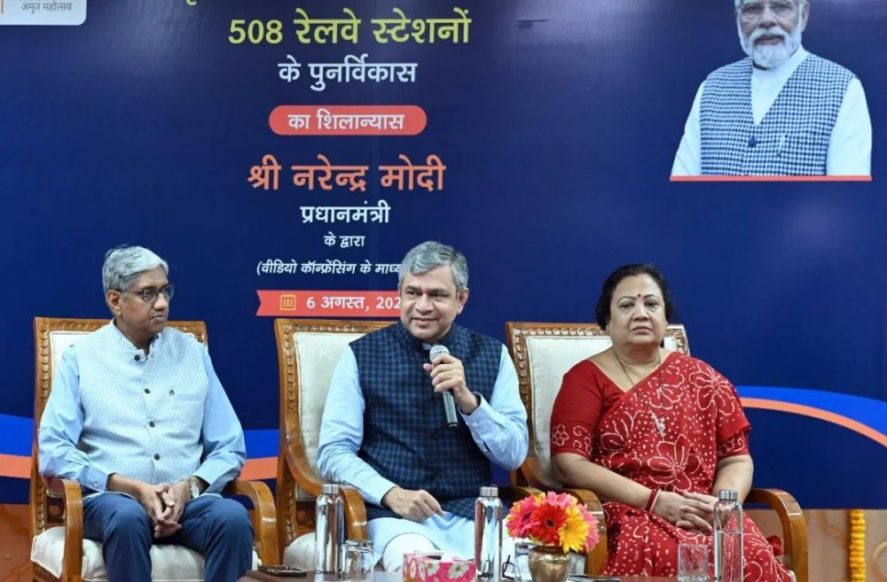
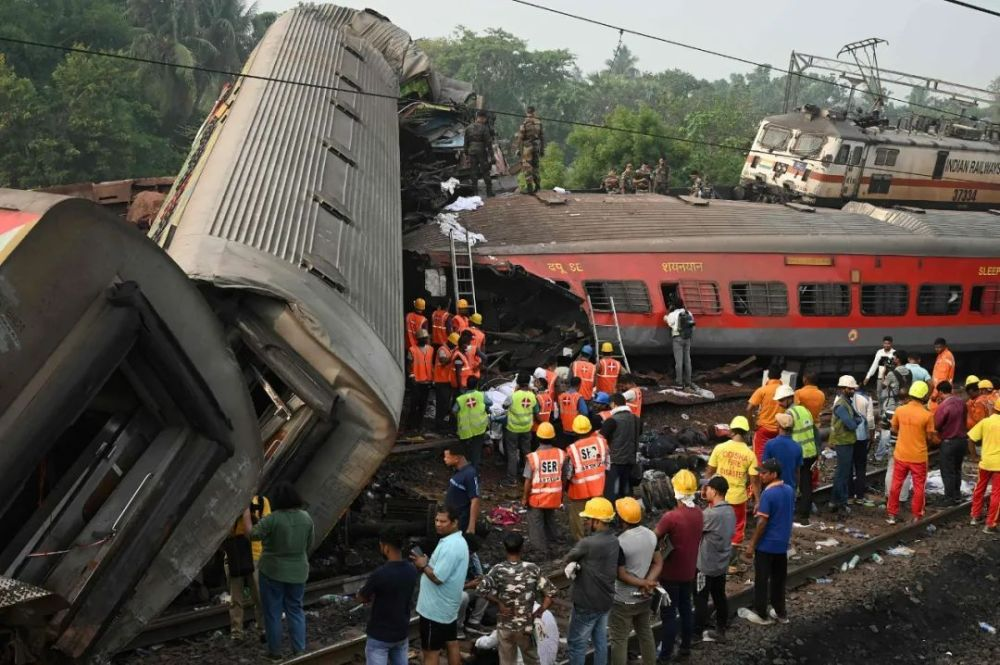

# 印度重建1300多个火车站，莫迪的铁路基建计划有新动作

曾在大选中高喊“让印度铁路提速”，还在两年前提出了“国家铁路计划”，如今印度总理莫迪的铁路基建计划又往前迈了一步。

当地时间8月6日，莫迪以线上视频致辞的形式出席了一场火车站重建项目奠基仪式，正式开启重建27个邦的508个火车站的工程。

事实上，这只是印度“阿姆里特·巴拉特车站计划”（Amrit Bharat Station
Scheme）的一部分。印度“世界一体新闻台”指出，该项目被认为是印度政府近年来规模最大的基础设施项目之一，该项目最终想要在全印范围内重建1309个火车站，预计耗资约30亿美元。

从某种程度上来说，重建火车站也是迫在眉睫之举。近年来，由于印度铁路老化、设备陈旧，铁路事故频发。今年6月，印度发生列车相撞事故，造成数节车厢脱轨。事故造成近300人死亡，另有近900人受伤。英国广播公司（BBC）指出，这是印度本世纪发生的最严重的列车相撞事故。

**莫迪称印度铁路将开启新篇章**

“朝着发展目标前进的印度，正处在其黄金时代的开端，有新的活力、新的灵感和新的决心，从这个角度来看，印度铁路历史上的新篇章也即将开始。”当地时间8月6日，莫迪在线上讲话中说道。

这一天，印度新德里举行了一场规模颇大的火车站重建项目奠基仪式，约有10万来自印度各行各业的人士出席。莫迪在致辞中表示，全印范围内有1300多个主要的火车站会以现代化的方式重新开发，其中508个火车站的重建工作从当天正式开始。

508个火车站分布在27个邦内，预计将在两年时间内实现全面改造。根据印度总理办公室的声明，重建完成后，火车站中将提供现代化的乘客设施，精心设计交通运行线路，实现多式联运一体整合，建筑外观设计还会结合当地文化遗产的风格。

_当地时间2023年8月6日，印度新德里，在全国508个火车站的重建工作的新闻发布会上，印度铁道部长阿什维尼·维什瑙发表讲话。图/视觉中国_

届时这些车站将被改造成充满活力的“城市中心”。据《金融快报》报道，火车站将整合城市的两侧，改善连通性，促进以火车站为中心的整体城市发展。这是朝着建设世界级铁路基础设施迈出的重要一步，既满足人们的出行需求，也保留印度多样化文化遗产。

这只是火车站重建计划的一个开端。印度《经济时报》指出，为了让整体庞大的铁路系统运转良好，印度铁道部门启动了“阿姆里特·巴拉特车站计划”（Amrit
Bharat Station Scheme），计划在全印范围内重建1309个车站。

“这个项目标志着政府的总体规划，战略性展望未来50年。”印度铁道部长阿什维尼·维什瑙（Ashwini
Vaishnaw）表示，重建计划的重点是确保升级后的车站可以在未来50年内满足乘客的需要，实现多模式发展。

维什瑙也承认，重建火车站是一项复杂的工作，需要细致的规划和执行，强调这些转变都需要在不中断铁路运行的情况下进行。

**印度铁路老旧，事故频发**

印度铁路是世界上最繁忙和最古老的铁路系统之一，每天运行超过13000列火车，覆盖印度各地近8000个车站，因而被称为印度的“生命线”。

铁路对印度有着别样的意义。铁路历史学家克里斯蒂安·沃尔玛（Christian
Wolmar）表示，很少有国家是由铁路定义的，但印度的近代史与其庞大的铁路网络发展密不可分。

印度的铁路网络修建于英国殖民统治时期，距今已有160多年。CNN指出，陈旧的基础设施也经常被认为是导致交通延误和大量火车事故的原因。

尽管根据印度政府的统计数据，近年来铁路事故和火车脱轨率一直在下降，但仍时有发生。2021年，印度发生近1.8万起铁路事故，造成1.6万人死亡。

印度铁路最严重的事故发生在1981年，一列客运列车在比哈尔邦脱轨，导致7节车厢坠河，事故造成800多人死亡，有许多人的尸身从未被找到。2005年、2011年、2016年、2017年、2018年以及今年6月份，印度都发生了严重的火车脱轨事故。

_当地时间2023年6月3日，印度巴拉索尔，三列火车相撞事故现场，救援人员聚集在受损车厢周围。图/视觉中国_

此外，与欧洲或亚洲其他国家相比，印度铁路的平均速度也相对较低。CNN指出，一些特别快车的时速可以达到160公里，但全国长途快车的平均时速只有50公里，普通客运和通勤列车的时速约32公里。除非提供更多的运力，否则预计未来30年的交通拥堵情况会加剧。

或许是意识到印度铁路面临的困境，建设铁路一直是莫迪执政期间的关键词之一。2014年大选时，莫迪的口号就是“让印度铁路提速”。2021年，莫迪还宣布了“国家铁路计划”，想要将印度北部、西部和南部的所有主要城市都通过高速铁路连接起来。他本人也频繁地出现在各种“准高铁”线路的开通仪式上。

在过去的9年里，印度政府已经投入了数百亿美元资金用于铁路基础设施现代化项目建设，2023年的铁路预算拨款已经达到了2014年的5倍多。莫迪还宣布了将在2024年实现铁路100%电气化，以及到2030年实现铁路净零排放的计划。

但铁路项目推进期间，仍然存在不少问题。有声音担心铁路建设会给当地生活带来负面影响。2018年4月，由于三个村庄数百名居民对于穿越农田的铁路线不满，当地铁路项目一度被叫停。

铁路的检查和维修工作也缺乏专业人员完成。“经常是临时承包商而非全职工作人员从事轨道和信号维修工作，他们会在这些工作中使用未经训练的人员。”前火车站站长马尼卡拉吉（Manickaraj）对印度媒体“The
Leaflet”进一步解释称，由于雇用的是临时承包商，如果出现劣质工程，或官员对项目表现不满意，唯一补救办法就是取消合同，导致没有人对安全失误负责，缺乏问责制。

繁多的铁路基建项目也没能完全消除印度民众对铁路安全的担忧。据英国《卫报》报道，专家表示，虽然目前重点放在了光鲜的现代化项目上，但安全仍是印度铁路最大的问题，越来越多的列车投入使用满足人们的需求，但劳动力并没有达到同样水平，导致了工作人员面临更大压力，以及更多人为错误的产生，这意味着安全措施匹配的进度一直很缓慢。

