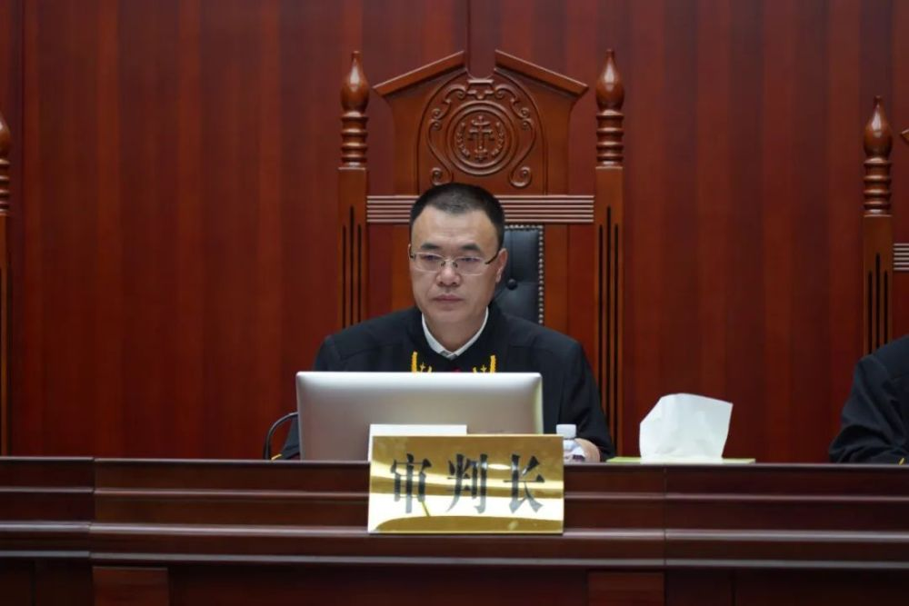

# 受贿超1700万！广西医保局原局长王忠平受审

2023年8月7日上午，广西壮族自治区贺州市中级人民法院一审公开开庭审理了广西壮族自治区医疗保障局原党组书记、局长王忠平受贿一案。

_市中级人民法院党组副书记、副院长刘发明担任审判长_

广西壮族自治区贺州市人民检察院指控，2012年至2022年，被告人王忠平利用担任广西壮族自治区社会保险事业局党委书记、局长，广西壮族自治区医疗保障局党组书记、局长等职务上的便利，为相关单位和个人在企业经营、工程承揽、业务推广等事项上提供帮助，单独或与他人共同非法收受相关单位和个人给予的财物共计折合人民币1707.3198万元。

_市人民检察院党组成员、副检察长周玲出庭支持公诉_

公诉机关认为，被告人王忠平身为国家工作人员，利用职务上的便利，为他人谋取利益，非法收受他人财物，数额特别巨大，提请以受贿罪追究王忠平的刑事责任。

 _被告人_

庭审中，法庭依照法定程序，对被告人王忠平的犯罪事实进行了全面调查，公诉机关出示相关证据，被告人王忠平及其辩护人进行了质证，控辩双方在法庭主持下充分发表了辩论意见，被告人王忠平进行了最后陈述并当庭表示认罪悔罪。庭审最后，法庭宣布休庭，择期宣判。

贺州市部分人大代表、政协委员，贺州市消防救援支队、贺州市医疗保障局、贺州市中级人民法院等单位党员干部90余人旁听了庭审，零距离接受警示教育，提醒告诫广大党员干部要以案为鉴，坚守廉洁自律底线，筑牢拒腐思想防线，做到心有所戒，行有所止。

来源 贺州天平之声

实习编辑 赵司尧

流程编辑 马晓双

