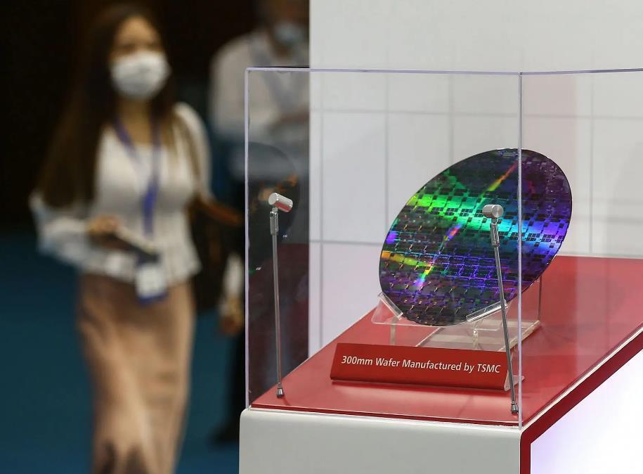
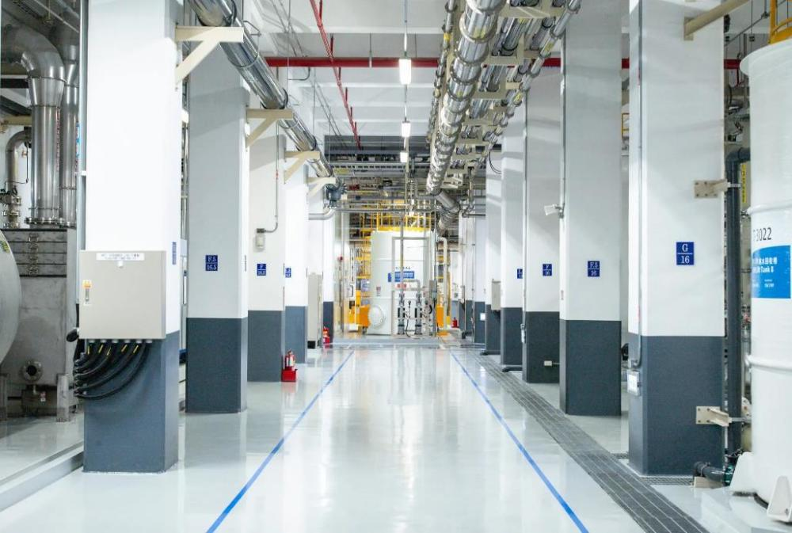
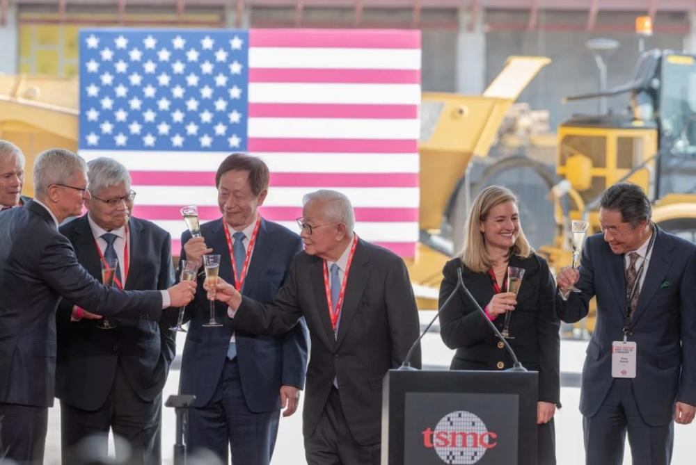

# 台积电创办人张忠谋：中国大陆有办法反击美“卡脖子”

**划重点：**

  * _1_ 从研究生用的教科书中，张忠谋找到了半导体领域的新方向，开创了芯片代工商业模式，帮助台积电成为世界上最大的尖端处理器制造商。
  * _2_ 张忠谋被认为是个严谨、雄心勃勃的创业者，他在正当的时候采取大胆举措，从而创建了台积电，并带领其战胜了三星和英特尔等巨头。
  * _3_ 在张忠谋创建台积电的过程中，他先后将三块拼图“拼”起来，最后抓住中国台湾从劳动密集型和重工业经济向高科技经济转型的机会创立了台积电。
  * _4_ 张忠谋付出了更高代价拿下苹果大单。虽然苹果要求比其他公司更优惠的条款和更低的价格，但这份合同帮助台积电迅速超越竞争对手。
  * _5_ 张忠谋帮助推动了美国的人工智能革命。有了台积电的支持，英伟达成为世界上最重要的人工智能芯片设计公司。
  * _6_ 对于美国对华半导体限制政策，张忠谋认为最终“美国公司将失去更多中国客户，而中国也将找到反击的方法”。

作为世界最大芯片制造商台积电的创始人，张忠谋的一生充满了传奇。他曾因为1美元薪酬之差与半导体领域结缘，在德州仪器等企业的工作历程帮助他打开了新的窗户，最终完成了开创芯片代工模式的拼图，并创立了台积电。张忠谋认为，台积电已经取得了芯片领域的领先优势，让苹果和英伟达甘愿成为其忠诚客户。

对于美国对华半导体限制政策，环球网援引《纽约时报》报道称，张忠谋认为“大陆夺得半导体霸主地位的机会不大”。至于美国欲阻止中企获得尖端半导体技术，张忠谋并不担心美国的政策会切断大陆公司获得尖端半导体技术的渠道。他认为，相反美国公司将失去业务，大陆将找到反击方法。

在一间可以俯瞰中国台北及其周围山脉的办公室里，台积电创始人张忠谋最近找到了一本印有彩色图案的旧书。书名为《超大规模集成电路系统导论》（Introduction
to VLSI Systems），这是一本研究生用教科书，描述了计算机芯片设计的复杂性。现年92岁的张忠谋怀着崇敬的心情举起它。

张忠谋说：“我想让你看看这本书的出版日期，1980年。”他补充称，这个时机很重要，因为这是他芯片帝国拼图中的“最早的一块”。不仅改变了他的职业生涯，也改变了全球电子行业的进程。

张忠谋从这本书中获得的见解看起来很简单：充当计算机大脑的微芯片可以在一个地方设计，但在其他地方制造。这种想法与当时半导体行业的标准做法背道而驰，当时芯片厂商自己设计并制造芯片。

因此，在54岁的时候，当许多人开始更多地考虑退休的时候，张忠谋反而走上了将自己的见解变成现实的道路。这位工程师离开美国搬到中国的台湾，并在那里他成立了台积电。该公司不设计芯片，但它已成为世界上最大的尖端微处理器制造商，为包括苹果和英伟达在内的客户提供代工服务。

如今，台积电已经成为市值高达5000亿美元的芯片巨头，其最先进的芯片被广泛应用于iPhone、汽车、超级计算机和战斗机上。台积电的庞大芯片工厂被称为FAB（芯片厂），这类设施非常关键，以至于美国、日本和欧洲都向台积电示好，以说服台积电在自己的国家建造这些工厂。

 _图1：台积电于2020年中国南京举办的世界半导体大会上展示硅片_

**01 甘愿充当默默无闻的经营者**

张忠谋出人意料的创业之旅帮助中国台湾成为全球半导体制造中心，重塑了电子行业的运作方式，这也让张忠谋及其创建的台积电成了全球关注的焦点。

在自己的职业生涯末期，张忠谋开始反思自己建立起的芯片帝国，他发现自己再也不能躲在幕后。他说：“这并没有让我感觉特别好，我宁愿继续呆在幕后保持默默无闻。”
张忠谋已于2018年退休，但仍会出现在台积电的活动中。

十多名熟悉张忠谋的人表示，他是个严谨、固执、信任公司中最优秀人才的人。最重要的是，他雄心勃勃，在恰当的时候采取大胆举措，从而创建了这家公司，并战胜了三星和英特尔等巨头。当台积电在2008年金融危机后陷入困境时，已经77岁高龄的他重新出山，再次接任首席执行官一职。

《芯片战争》一书的作者、塔夫茨大学弗莱彻学院国际史学副教授克里斯·米勒（Chris
Miller）说：“在芯片行业中，他可能是唯一一个亲眼见证这个行业从无到有诞生的人。他不仅仍处于这个行业中，而且处于行业的中心和最高端，这是非同寻常的。”

要了解科技行业的未来，关键是要通过张忠谋的眼光来理解世界，以及他是如何在别人没有这样做的时候做出最初押注的。与如今的科技大亨不同，比如埃隆·马斯克(Elon
Musk)和马克·扎克伯格(Mark
Zuckerberg)正考虑来一场“笼中大战”，而张忠谋表现出了更多的克制。如果将全球科技巨头之间的竞争比作一系列高风险的扑克游戏，那么张忠谋就是默默经营游乐场的那个安静的人。

_图2：位于台湾新竹的台积电创新博物馆。1987年，当张忠谋创立台积电时，他的脑子里已经清楚地知道了商业模式，并计划让台积电打入全球市场_

**02 在德州仪器三年打开了一扇窗**

张忠谋1931年出生于中国大陆。在18岁之前，他曾辗转在六个城市生活过，经历过10次转学。

1948年，张忠谋与家人来到中国香港。1949年，张忠谋移居美国，就读于哈佛大学，之后转到麻省理工学院学习机械工程。1955年，当他两次未能通过麻省理工学院博士学位的资格考试时，他决定“下海”闯荡。

在1998年出版的自传中，张忠谋写道：“许多年后，我认为没能被麻省理工学院录取是我一生中最幸运的事情！”

张忠谋获得了两份最好的工作要约，分别来自福特汽车公司和不太知名的电子公司Sylvania。福特向他开出了479美元的月薪，让他在底特律的研发中心工作。虽然福特公司的招聘人员口才了得，但张忠谋惊讶地发现，这份工作比Sylvania开出的每月480美元的工资少了1美元。

 _图3：位于台湾新竹的台积电芯片工厂_

当张忠谋打电话给福特，要求提供一份与其能力相匹配的待遇时，这些之前表现十分友善的招聘人员变得充满敌意，并称不会多给一分钱。最终，张忠谋接受了Sylvania的工程工作。在那里，他了解了晶体管，这是微芯片最基本的部件。他说：“那是我半导体事业的开始。回想起来，这是一件非常好的事情。”

在Sylvania工作的三年为张忠谋开启了一扇新的大门，也让他对半导体领域充满了激情。但在Sylvania的经历也让他尝到了许多教训，这为他后来如何管理台积电提供了借鉴。张忠谋在自传中谈到Sylvania最终的崩溃时写道：“从一开始，半导体行业就是一个快节奏、无情的行业。一旦落后，再想追赶就变得相当困难。”

1958年，张忠谋跳槽到新成立的半导体公司德州仪器。这家总部位于达拉斯的公司“年轻且充满活力”，许多员工每周工作超过50个小时，整夜睡在办公室里。四年后，张忠谋获得美国国籍，他认为这种身份对在美国工作非常重要。

随后，张忠谋成为德州仪器半导体业务的重要支柱，且不断取得突破。在20世纪70年代，该公司生产了一种可以合成人类声音的芯片，这促使著名的Speak&Spell玩具诞生，这是一种帮助儿童拼写和发音的手持设备。

20世纪70年代末，德州仪器将重点转向蓬勃发展的计算器、数字手表和家用电脑市场。当时负责半导体业务的张忠谋意识到，他在那里的职业生涯正接近“死胡同”，他认为是时候做出改变了！

_图4：张忠谋在台积电位于亚利桑那州的工厂举行的活动上发表讲话_

**03 将所有拼图“拼”起来**

如果说促使台积电成立的第一块拼图是《超大规模集成电路系统导论》这本教科书，那么第二块拼图则是张忠谋在德州仪器公司工作的最后一段经历。

上世纪80年代初，德州仪器在日本开设了一家芯片工厂。在生产线开始大量生产芯片三个月后，该工厂的“良率”就达到德州仪器在得克萨斯州工厂的两倍。“良率”是指生产中产生了多少可用芯片的关键统计数据。

张忠谋被派往日本解开这个谜团。他发现，关键在于员工，日本工厂高素质员工的流动率低得出奇。不过，尽管德州仪器尽了最大努力，但它在美国找不到同等水平的技术人员。在一家美国工厂，主管职位的最佳候选人拥有法国文学学位，但没有工程背景。先进制造业的未来似乎在亚洲。

1984年，张忠谋加入了另一家芯片公司通用仪器，在那里的工作经历成了第三块拼图。张忠谋遇到了一位企业家，这位企业家后来创办了一家公司，只设计芯片而不制造芯片，这在当时并不常见。张忠谋发现了一种趋势，这种趋势被证明可以持续很长时间。如今，大多数半导体公司设计芯片并将制造业务外包。

这最后一块拼图被发现时，恰逢中国台湾从劳动密集型和重工业经济向高科技经济转型。当地把目光投向发展半导体产业时，鉴于张忠谋在芯片领域获得的声誉，他们邀请张忠谋领导一家加速创新的机构。

因此，1985年，当时54岁的张忠谋离开美国到了中国台湾。他回忆称：“我当时没有计划在台湾待这么长时间。我以为我可能会在几年后回到台湾，我真的没有成立台积电的计划，也没有在台湾设立任何公司的计划。”

张忠谋抵达中国台湾后的几周内，被誉为台湾科技发展教父的李国廷要求他帮助发展商业芯片项目。当张忠谋评估台湾的优势和劣势时，他感觉到了一个机会。他说：“我的结论是，这里比美国更像日本。”
他指的是他在德州仪器日本工厂的经历。

1987年，张忠谋创立了台积电。商业模式在他的脑海中已经非常明确：台积电将为其他公司制造芯片，而不是设计芯片。这意味着，它只需赢得业内人士的支持，然后专注于自己最擅长的领域——制造芯片。

从一开始，张忠谋就计划让台积电进军全球市场。为了营造国际化的环境，内部交流被要求使用英语。

事实证明，张忠谋的远见具有先见之明。随着半导体的生产变得更加复杂而且昂贵，只有少数几家公司能够负担得起这种尝试。制造芯片涉及数百个步骤，这些步骤利用先进的激光和化学操作为电子信号创造微小的路径，为计算机进行最基本的计算。成本更是天文数字。

多年来，在其他人退出的情况下，张忠谋却在逆向前行。如果台积电能够利用规模经济吸引足够多的客户，它就有机会击败英特尔和三星。

1997年，张忠谋任命了一位新的研发负责人蒋尚义。他告诉后者，要将台积电与行业领袖英特尔进行比较。他说：“我们的目标是成为第一，并不放过任何一个机会。”

蒋尚义对此感到大吃一惊。他回答道：“要想成为行业第一，你的花费必须是你下一个竞争对手的三倍。” 这暗示着，保持领先将是一个过于崇高而昂贵的目标。

“可能是三倍，但我真的想花足够的钱，让我们成为第一，”张忠谋表示。他准备保持耐心，即使在2005年辞去台积电首席执行官职务并继续担任公司董事长之后，他也准备保持耐心。

**04 拿下苹果大单**

2009年4月，愤怒的台积电员工（其中许多人刚被该公司解雇）在张忠谋高档公寓楼下的街面上建立了一个“抗议营地”。

随着夜幕降临，抗议者在滑梯和攀登架旁边铺开睡袋，身上挂着一块巨大的标语，上面写着：台积电撒谎。在其20多年的历史中，台积电从未裁员过。然而，在2008年金融危机之后，张忠谋的继任者蔡力行开始解雇员工。

当时77岁的张忠谋决定，他不能再袖手旁观了。他重新出山，再次聘用了蔡力行放弃的人才，并将台积电的支出增加了一倍多。此举正值该行业处于艰难时期，投资者对此提出质疑。台积电前投资者关系主管回忆起自己对这一消息的反应时称：“当我听到这个消息时，我感觉自己的头都撞到墙上了。”

但这场赌注得到了回报。2010年，张忠谋接到一个电话，将推动台积电的增长，并巩固其对三星和英特尔的领先地位。苹果公司高级副总裁杰夫·威廉姆斯(Jeff
Williams)通过张忠谋的妻子张淑芬联系了他。张淑芬是苹果最大的装配商富士康创始人郭台铭的亲戚。

这通电话促使他们几人在周日共进晚餐，第二天就开启了谈判。苹果曾与三星合作生产其为iPhone设计的微芯片，但它正在寻找新的合作伙伴，部分原因是三星已经成为苹果智能手机的主要竞争对手。不与客户竞争的台积电在这份合同中处于有利地位。

谈判持续了几个月时间。张忠谋说：“合同本身非常复杂，这是我们第一次遇到这样的事情。”

苹果一度宣布暂停谈判两个月，张忠谋听说英特尔可能干预了此事。在忧心忡忡的情况下，张忠谋亲自飞往旧金山与苹果首席执行官蒂姆·库克（Tim
Cook）会面，后者让他放心。在2013年的一次采访中，时任英特尔首席执行官的保罗·欧德宁（Paul
Otellini）表示，他拒绝了为iPhone生产芯片的机会，因为苹果支付的价格不够高。

张忠谋没有犯同样的错误。虽然苹果要求比其他公司更优惠的条款和更低的价格，但他明白，合同的规模将帮助台积电迅速超越竞争对手。这是他从比尔·贝恩（Bill
Bain）那里学到的一课，后者创立了贝恩咨询公司。

 _图5：苹果首席执行官蒂姆·库克去年在凤凰城与张忠谋共同出席活动_

贝恩当时是波士顿咨询集团的一名顾问，他在张忠谋隔壁的办公室工作了将近两年。他分析了德州仪器的生产和销售数据，并认为公司生产的越多，表现就越好。

当与苹果的交易完成后，张忠谋借了70亿美元资金，建立起为iPhone生产数百万块芯片的产能。

在接下来的几年里，苹果再次短暂地转向三星生产iPhone芯片，但台积电成为了它的主要芯片制造商。苹果现在是台积电最大的客户，约占台积电收入的20%。

即使现在，在评论台积电的客户时，张忠谋依然持谨慎态度。在他的办公室开始讲述有关苹果公司的故事后，他不禁开始担心自己是否透露了太多。他说：“我不认为我超出了苹果允许我告诉你的范围。”

现任苹果首席运营官威廉姆斯在一份声明中表示，张忠谋“将半导体行业推向了新的前沿”。

2018年，86岁的张忠谋再次选择了退休。当时，台积电已经在其他公司落后的地方取得了成功，大规模生产了带有DNA双螺旋大小电子通道的芯片。这让张忠谋相信，他已经实现了台积电的一个关键宗旨：技术领先。

**05 推动人工智能革命**

在张忠谋办公室的墙上挂着的奖项和与世界领导人的合影中，有一幅是镶框的漫画，描绘了他与芯片公司英伟达创始人黄仁勋之间的亲密关系。

如果说苹果推动了台积电的发展，那么张忠谋领导下的台积电则是帮助英伟达成为世界上最重要人工智能芯片设计厂商的最大幕后功臣。这幅漫画就描述了这个故事。

上世纪90年代中期，当英伟达还是一家初创企业时，黄仁勋给张忠谋写了一封信，询问台积电是否会为其生产芯片。在与黄仁勋通了电话后，张忠谋给出了肯定回答。在谈到黄仁勋时，张忠谋说：“我喜欢他。”

_图6：张忠谋与英伟达首席执行官黄仁勋_

通过抓住这个机会，张忠谋帮助推动了美国的人工智能革命。有了台积电的支持，英伟达成为世界上最重要的人工智能芯片设计公司。像生成式人工智能这样的突破依赖于大量的英伟达芯片来从海量数据中找到模式。

2018年，黄仁勋在张忠谋宣布退休的聚会上发表演讲时说，如果没有台积电，英伟达就不会存在。英伟达目前的市值约为1万亿美元。黄仁勋送给张忠谋的漫画上题词是：“你的事业是一部杰作——贝多芬的第九交响曲。”

对于张忠谋来说，这部杰作的最后音符还没有演奏出来。作为一位年过90岁的老人来说，张忠谋的身体依然健康。但他在几年前心脏植入了支架，这让他再也不能抽烟斗了，那曾经是他照片中的标志。

在自己的办公室里，张忠谋仍然保留着一台彭博终端。他还定期在中国台湾各地公开露面，讨论全球政治和经济议题。

对于美国对华半导体限制政策，环球网援引《纽约时报》报道称，张忠谋认为“大陆夺得半导体霸主地位的机会不大”。至于美国欲阻止中企获得尖端半导体技术，张忠谋并不担心美国的政策会切断大陆公司获得尖端半导体技术的渠道。他认为，相反美国公司将失去业务，大陆将找到反击方法。

随着谈话的结束，张忠谋称，台积电现在仍面临种种挑战，他对自己不能亲自掌舵而感到有些遗憾。但他又表示，自己在2018年选择退休的时机很合理。

“我真的确信，我们已经取得了技术领先地位，”他在谈到当时的情况时说，“而且，我认为我们不会失去它。”（文/金鹿）

