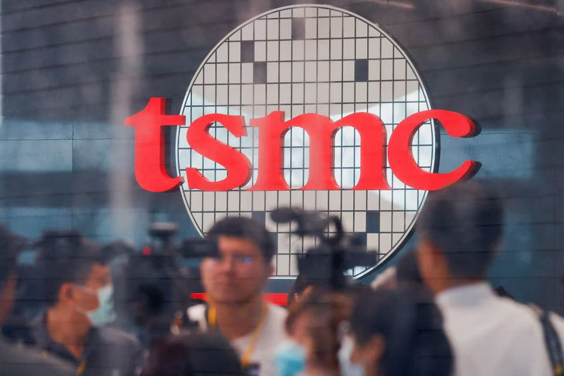

# 台积电被曝决定将在德累斯顿建造工厂，德国政府将提供50亿欧元补贴

【文/观察者网
熊超然】当地时间8月7日，德国《商报》（Handelsblatt）援引政府消息人士的话报道称，台积电董事会预计将在8月8日决定，支持在德国德累斯顿建厂。据报道，德国政府将提供50亿欧元（约合人民币395亿元）来支持该工厂的建设。

对此报道，德国经济部拒绝予以置评，德累斯顿所在的萨克森州政府也拒绝置评。而从2021年以来，台积电就一直在与德国萨克森州围绕在德累斯顿建造一座工厂进行着谈判。

消息人士告诉《商报》，台积电将与合作伙伴博世（Bosch）、英飞凌（Infineon）以及恩智浦（NXP）成立合资企业，一同运营这家工厂。对此，另外三家企业拒绝置评。

报道称，在得到董事会批准后，台积电可能与德国政府就融资事宜签署意向书，最终决定将由欧盟委员会作出。

 _台积电标志 图自路透社_

路透社则称，德国计划未来几年在半导体行业投资约200亿欧元。在欧洲地区，有一些国家希望借由通过《欧盟芯片法案》（EU Chips
Act）提供补贴，降低对亚洲国家的依赖，并在该地区建设产能，而德国就是其中之一。

英特尔近日已宣布，将斥资300多亿欧元在德国马格德堡建设两家芯片制造厂，这是德国有史以来最大的外来投资，并将从德国获得近100亿欧元的补贴。

与此同时，英飞凌也正在德累斯顿建造一座造价50亿欧元的半导体工厂，预计将于2026年投产，而已在德国经营数十年的美国芯片代工大厂格芯（GlobalFoundries）也一直在扩大其在德累斯顿的产能。

就在传出台积电决定在德国建厂的消息之际，近期的新闻报道则显示，台积电在其他地方的建厂进程却并不顺利。

早在2020年，台积电就承诺在美国亚利桑那州凤凰城投资120亿美元建厂，目标是到2024年底在美国本土生产高端半导体。此后，台积电更是“加码”，宣布将原计划的120亿美元投资额增加两倍以上，达400亿美元，其在凤凰城建造的两座工厂，分别计划于2024年和2026年投资生产4纳米和3纳米芯片。据报道，这不仅是台积电在台湾地区以外的最大投资项目，同时也是美国历史上最大的境外直接投资之一。

_台积电在美国亚利桑那州凤凰城所建工厂_

7月20日，台积电董事长刘德音在今年第二季度财报会议上表示，今年的销售额可能下降10%，计划中的亚利桑那州工厂将无法实现明年开始量产的目标。刘德音还称，由于美国当地熟练工人短缺，公司可能不得不从台湾地区临时调入有经验的技术人员，这将使第一家工厂开始量产的时间推迟到2025年。

彭博社分析指出，这一投产时间在2024年美国总统大选之后，而亚利桑那州则是明年大选的关键战场州，这一消息对拜登来说不是好兆头，他的竞选连任之路以其经济立法为核心，所推动的许多产业政策也与共和党相左，因此选情可能会受到影响。

而对于美国政府意图推动“芯片制造本土化”，似乎也面临风险挑战。此前，台积电创始人张忠谋早已断言，“美国要推动半导体本地制造不可能成功”；彭博社也发表过评论文章，以“抱歉，美国，400亿美元买不到芯片独立性”为题，极力看衰台积电此次赴美设厂。

事实上，台积电在美国建厂所遇到的劳动力短缺问题，在德国建厂同样会面临到。英国《金融时报》就报道称，对于台积电可能在德国德累斯顿设厂，当地业界忧心劳工将面临短缺，当地的反移民声浪也不利于吸引外来人才。

萨克森州经济厅厅长马丁·杜利希（Martin Dulig）坦言：
“我们的投资将创造5000至8000个额外的就业机会，不过，德国面临严重的技能短缺和人口老化问题。工作适龄人口将在未来10年内减少20万。”而台积电董事长刘德音此前也表示，“（德国当地）人才供应确实有些差距”。

**本文系观察者网独家稿件，未经授权，不得转载。**

