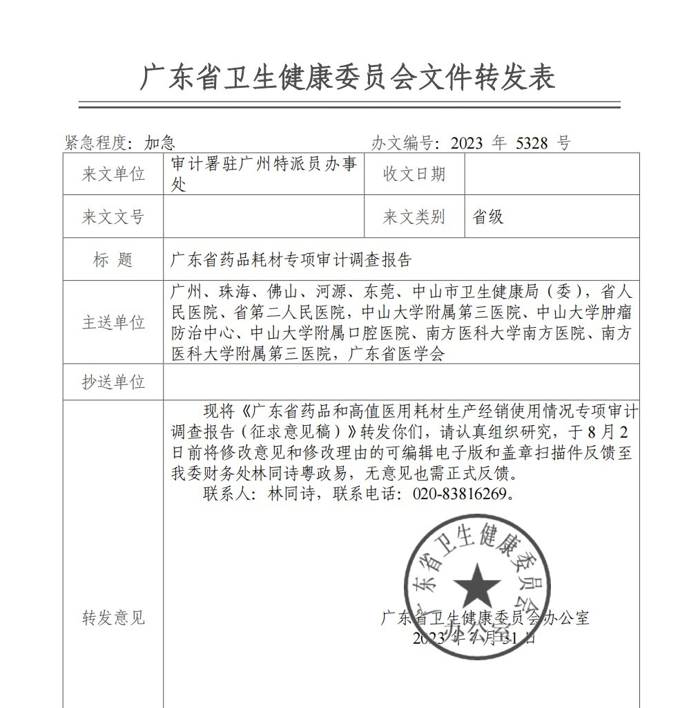

# 国家审计署赴广东调查：药企套取资金40亿，公立医院招标混乱

界面新闻记者 | 李科文

界面新闻编辑 | 谢欣

界面新闻于近日获悉一份由国家审计署出具的广东省药品耗材专项审计调查报告（下简称：审计调查报告），审计调查报告吸显示，自2023年5月底至7月，国家审计署派出的审计组对广东省（不含深圳市，下同）药品和高值医用耗材生产经销使用情况进行专项审计调查。

该报告肯定了广东省认真贯彻落实党中央、国务院关于深化医药卫生体制改革的决策部署，高度重视医药产业高质量发展，积极推进医药领域综合改革，持续优化医药企业营商环境，取得较好成效。

但同时，也指出广东省在医药市场主体管理、政策执行、药品监管等方面还存在“暗箱操作”“脱离实际”“管理缺位”等问题，需要加以纠正和改进。

其中涉及，A股上市公司丽珠集团、一品红和香港上市公司中国中药旗下的一方制药等上市公司。审计调查报告显示，这3家上市药品生产企业虚增销售费用套取资金用于公关等用途，药品公关费用远超研发成本，会计信息严重失真。

就此，界面新闻分别联系丽珠集团、一品红和香港上市公司中国中药，截至发稿均未获回复。

审计调查报告披露，2021年至2023年5月，广东省药品生产总值前50家企业营业总收入
1511.83亿元、总成本707.61亿元、总销售费用446.17亿元，共投入技术开发费用29.5亿元，仅为销售费用的6.61%，售费用中涉及“推广”“咨询”“服务”等内容的第三方服务费用
289.06亿元，占销售费用的64.79%。

其中，2021年至2023年5月，丽珠制药、一品红和一方制药3家药品生产企业向1936家第三方商务推广公司支付费用，假借服务费用等名义套取资金40.77亿元，增加药品综合成本，推高出厂价格。手法丰富套取资金数量之大让人惊讶。

具体来看，一方制药通过第三方商务推广公司套取资金23.9亿元，用于合作医院药房建设费用和用工成本。

一方制药为老牌中药配方颗粒企业，隶属于香港上市公司中国中药旗下。2021年至2023年5月，一方制药以“技术服务费”等名义向966家商务推广公司付款23.9亿元，用于支付全国4586家合作医院药房配药设备费用和配药人员工资等。

上市公司一品红则通过批量注册会议服务公司套取资金16.75亿元。2018年12月至2023年6月，一品红指派广州益瑞企业管理有限公司（以下简称：广州益瑞公司）以“集群注册”方式在广州市南沙区同一地址注册成立962家会议服务公司，公司账户均由广州益瑞公司代为管理，按照广州一品红公司指令用于资金的划转、分配。

2021年至2023年5月，一品红以支付学术会议费、医学服务费等名义将16.75亿元转入上述会议服务公司，广州益瑞公司按其要求将资金进一步分解后转入特定人员账户用于支付各区域医院公关费用。

丽珠制药是通过其员工开设咨询公司套取资金1240.01万元。丽珠集团以医药产品的研发、生产及销售为主业，产品涵盖制剂产品、原料药和中间体、诊断试剂及设备，覆盖了消化道、辅助生殖、精神及肿瘤免疫等众多治疗领域。

2021年至2023年3月，丽珠集团丽珠制药厂累计向2953家商务推广公司支付服务、咨询等费用30.82亿元，其中向8家由丽珠集团员工开设的咨询公司支付咨询费1240.01万元，资金到账后被转入相关员工个人账户用于药品公关。

此外审计组还在广东发现，存在药品耗材经销企业增加中间销售环节，推高药械流通价格。其中涉及，在广东省内高知名度的曹清华牌生产企业康朝药业有限公司、香港上市公司国药控股旗下的国药器械（东莞）有限公司和医疗机构中山大学附属肿瘤医院。

在药品流通方面，曹清华牌薏辛除湿止痛胶囊的直销价格0.32元/粒，其生产企业康朝药业有限公司从2021年至2023年5月，以1.26元/粒的价格向安徽华源医药集团股份有限公司采购上述药品，按其采购规模3.78亿元测算，直接增加采购成本2.82亿元，导致终端售价格从0.59元/粒升至1.71元/粒，加价1.9倍。

在医用耗材流通上，2021年至2023年4月，香港上市公司国药控股旗下的国药器械（东莞）有限公司（以下简称：国药东莞公司）通过与其控制的上海鑫眸商贸中心等2家民营企业的关联交易增加采购中间环节，导致平均采购单价分别为原采购渠道的3.61倍、1.68倍，国药东莞公司由此增加脊柱内固定器等高值医用耗材采购成本296.97万元。

除了药企端，公立医院采购环节也成了推高药械流通价格的黑手。如中山大学附属肿瘤医院，2020年至2023年5月，该院指定工会下属企业广东冠华医疗服务公司为其供应医用耗材1.04亿元，广东冠华医疗服务公司获利748.82万元，耗材平均加价率6.6%。

审计调查报告还披露，医疗机构违规采购或使用医疗器械，潜藏生命健康及资金安全隐患。审计抽查发现，南方医科大学南方医院增城分院（下简称：南方医院增城分院）等3家医疗机构存在事先内定中标人、高价采购大型医用设备等问题，涉及资金7308.28万元（其中设备加价3020.9万元）。

如，2020年南方医院增城分院时任院长组织科室负责人对采购X线计算机断层扫描仪进行可行性论证，内定了广州市塘晫医疗设备有限公司报价的美国GE公司设备。2021年6月，设备采购项目由该公司实际控制的企业以同品牌同型号设备中标，中标金额2949万元，其购入价格为1428.7万元，差价达1520.3万元。

此外，南方医院增城分院截至2023年6月底，在未获得国家卫生健康委员会甲类大型医用设备配置许可的情况下，违规采购一台质子放射治疗系统设备，主要部件尚未装运发货即从政府专项债中支付50%货款1.2亿元。

此外，审计调查发现，大型医疗设备或耗材采购等项目的招投标工作存在投标人与招标人串通投标的情况，损害国家利益、社会公共利益或者他人的合法权益。

审计调查报告显示，2018年至2023年5月，广东省共有491家医疗机构委托国义招标股份有限公司开展了10173个大型医疗设备或耗材采购等项目的招投标工作，项目金额合计223.86亿元，涉及8187家医药经销企业、3.19万次投标。

其中，8951个项目仅有3家企业参与投标，208个项目为单一来源采购，两项合计投标次数2.71万次，占总投标次数的85%。149家企业投标在10次及以上且从未中标，如东莞金拱设备有限公司属于长期陪标企业，累计投标61次从未中标。

审计调查还发现，广东省部分医疗机构违规重复使用一次性手术耗材，存在医疗安全隐患。

如2020年至2023年5月，中山市人民医院等2家医疗机构重复使用一次性超声刀头2409个，涉及1.51万人次，增加手术交叉感染风险，存在医疗安全隐患。按医保部门相关收费标准计算，上述2家医疗机构多收取诊疗费用904.61万元，其中医保基金773.06万元。

审计调查还披露，广东省部分医疗机构存在套用诊疗项目违规收费，套取医保基金570.11 万元。

如2020年至2023年5月，南方医科大学口腔医院将手术中使用的“超声骨刀”套用“超声刀加收”收费项目，违规收取11.15万人次诊疗费用6720.31万元（其中重复收费439人次、42.71
万元），套取医保基金570.11万元。根据广州市医保部门规定，公立医疗机构使用“超声骨刀”不属于收费项目。

