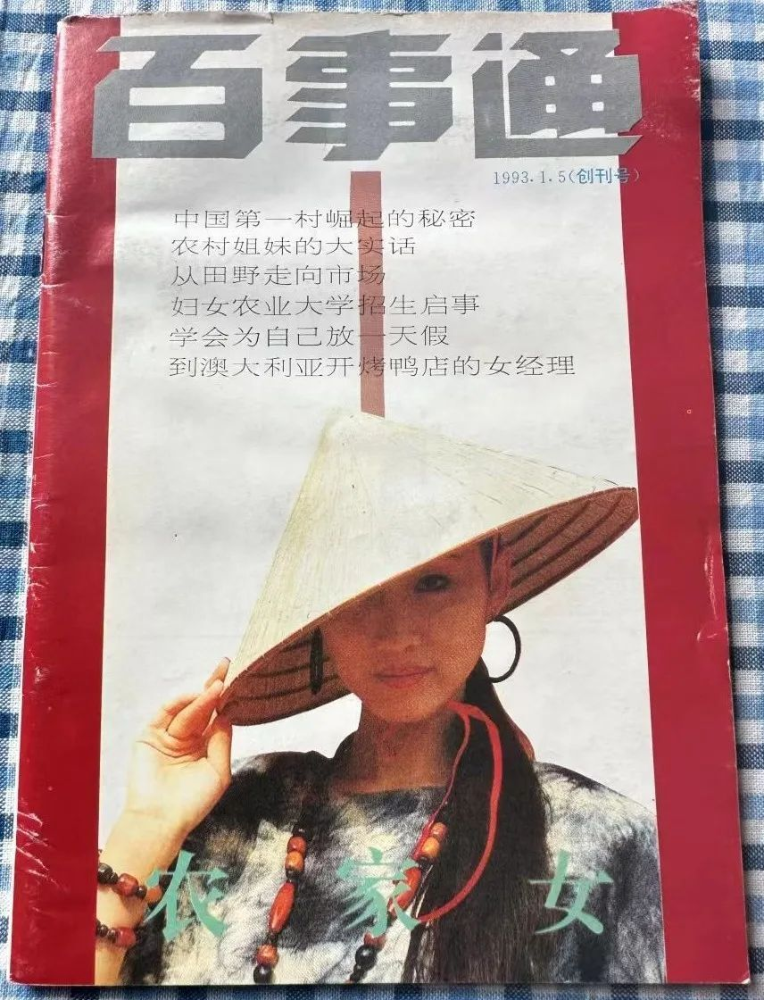
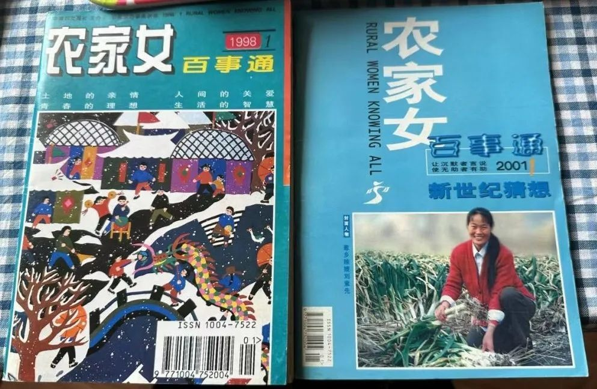
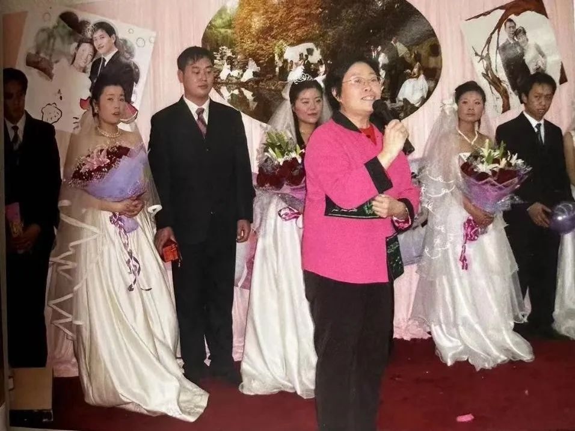
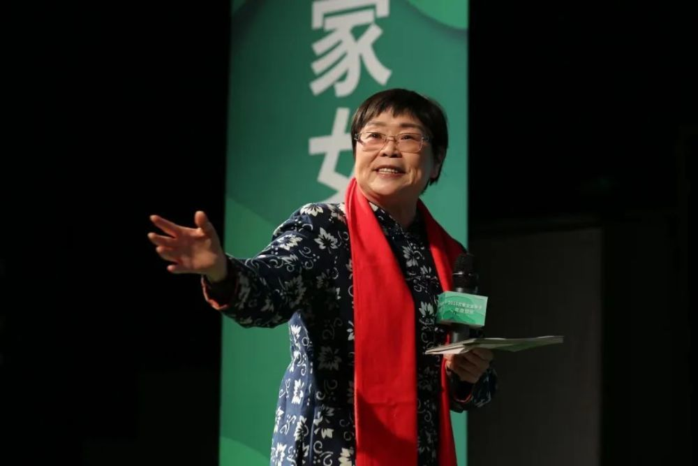
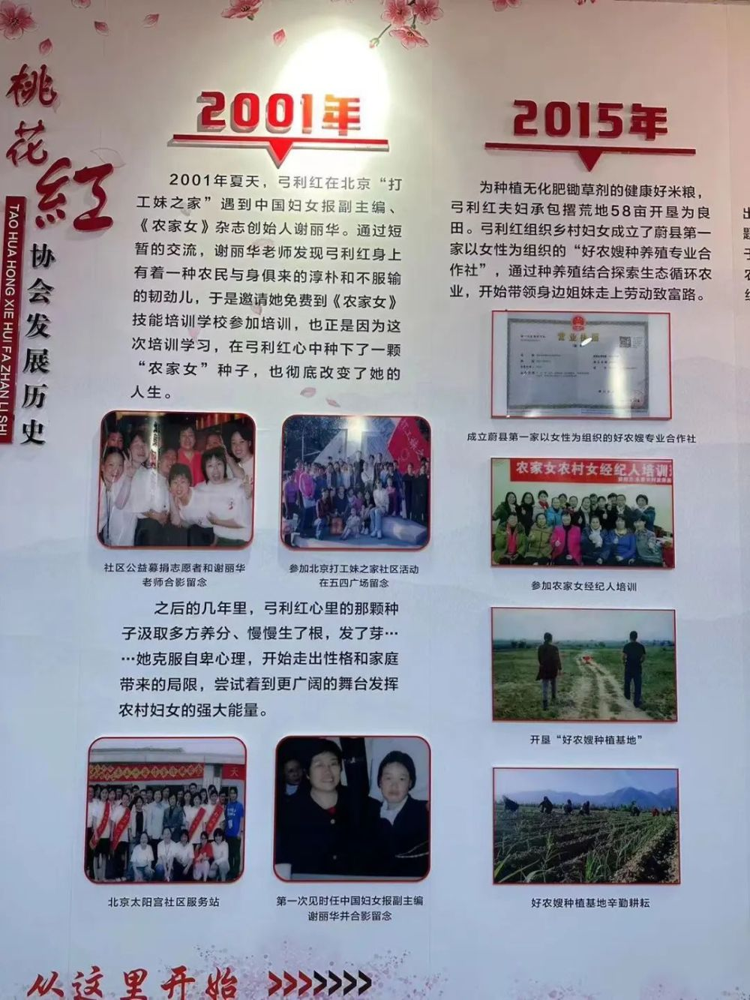
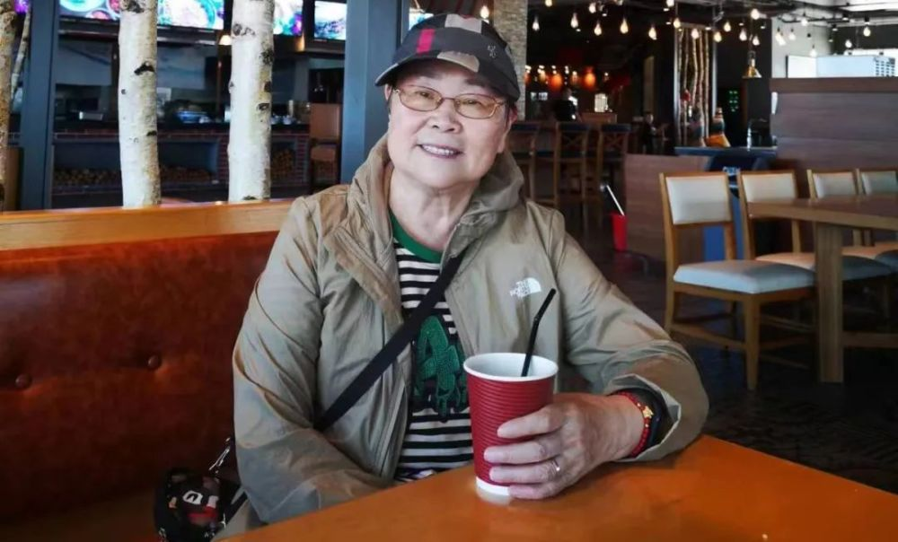

# 她，72岁，创办中国第一本给农村妇女看的杂志，影响一代农家妹

战斗了一生的女性主义者

72岁的谢丽华在听一期女性话题的播客。主播们先讨论了为何一位藏族小伙曾收获无数女性青睐，结论是除了女性天生的母爱外，还因为今天的女人们受够了那些油腻的男人们。

“这个节目里面就觉得中国的男人不配喜欢中国女人。特别尖锐，就你们不配。”

谢丽华坐在沙发上，她说话语速很快，但语调平和，说到“不配”两个字时，她加了点调侃，镜片后面的眼睛里闪露出一丝狡黠。沙发右后方的书架上，摆着一张令人无法忽视的合影，是她和美国前国务卿，曾有可能成为美国第一任女总统的希拉里。照片里，希拉里银衣红唇，旁边的谢丽华五十多岁，短发乌黑而浓密，咧着嘴笑。

 _谢丽华和希拉里的合影 ©荆欣雨_

那是她曾作为战士的岁月，现在想来，也是一生最好的岁月。将近二十年时间里，她带着愚公移山的意志，倾倒出一个人所饱含的最大热情，和一生中绝大部分的爱，创办了中国第一本以农村妇女为主角的杂志《农家女百事通》，她与中国最贫穷、最落后、最受侮辱与最被损害的女人们站在一起，并号召她们开展一场革命：反对父权，走出农村，争取独立和自主。农村妇女读《农家女》，正如今天城市里的女性读上野千鹤子的《厌女》，谈论戴锦华的讲座，听一集女性主义播客。

杂志关注过的议题在当时存在，在今天没有消失，在未来也将持续被讨论：

农村妇女如何脱贫，农村妇女扫盲，农村妇女的“贞洁牌坊”，农村妇女的生命危机干预，农村妇女的生理健康，农村妇女如何参政，什么才是真正的“女人味”，彩礼该取消吗，事业与家庭的冲突，家政工的劳动权益，进城务工人口的户籍问题、子女入学问题......

在当下的舆论场上，面对婚恋生育的枷锁，最具战斗性的女性常常展现出一种毫不妥协的态度，但72岁的谢丽华话锋一转，却给我讲述了一些不那么“正确”的故事：

一位嫁到延庆的农家女一直努力学习技能想要自立，但她最近的处境改善是因为二胎生了个儿子。之前她要为公婆修房子，谢丽华借了她2万；一位农家女丧夫后来北京打工，她想给孩子一个家，对她来说最可行的办法是找一位北京人再婚，她也这么做了，谢丽华觉得这是最现实的解决办法；一对经常争吵的夫妻终于在劝解下离了婚，她去家里回访，迎来的却是女人的哭泣，“她说你让我的家没了，生活也陷入了困境。”

残酷与妥协，正是谢丽华那一代妇女运动领军人物所面对的现实。她们大都出身体制内，深谙“自上而下”的妇女政策，再通过民间社会组织“自下而上”地带领妇女改善自身处境。如今，她们都步入晚年，谢丽华已经退休十二年，几乎不再参与《农家女》的工作。她在自己丰富的晚年生活中践行着微小的女性主义，她坚持经济独立，从不伸手向家人要钱，独自买菜、做饭和做美容，尽量少麻烦下一代。

谢丽华的外孙女曾画过主题为“我的家人”的画，当画到姥姥时，没有妇女运动，没有希拉里，没有农家女，外孙女描绘了一个独坐在沙发上看电视剧的老人。这是谢丽华如今最大的爱好，她看了所有赵丽颖和胡歌的电视剧，夸赞《爱情而已》是“姐弟恋的天花板”。当革命的潮水退去，战斗了一生的女性主义者徒留下一个独自看电视的背影，听起来着实有些落寞。衰老和孤独一起袭来，但对此，谢丽华坦然接受，她说，“不要怕寂寞，人本身就是孤独的。”

rural women knowing all

摆在我面前的是1993年1月创刊的第一期《农家女百事通》杂志，售价八毛钱。它有A4纸一半大小，封面是那种影视剧中常出现的农家女形象，翻开书的扉页，左边是当时仍在世的冰心题词，右边则是时任全国妇联副主席的发刊词，信的开头，她称呼所有潜在的读者：姐妹们。

_1993.1.5创刊的第一期《农家女百事通》杂志 ©荆欣雨_

创办《农家女》之前，谢丽华已在《中国妇女报》工作了八年，做的事就是为妇女发声。经济飞驰的上世纪八九十年代，她目睹的是女性依旧被家庭暴力和落后的性别观念所碾压，在经济上毫无自主权。有一年三八妇女节，报社评选精神文明奖，选出的都是“好媳妇”、“好母亲”：

丈夫车祸后半身不遂，妻子不离不弃，丈夫冬天要吃鱼，妻子要下河摸鱼。为了防止妻子逃走，公婆把家里所有带轱辘的东西都藏起来了，别人告诉她：你得认命，你离婚了，你会被所有人嘲笑。

丈夫蹲监狱了，妻子不离不弃，把家料理好，所谓“浪子回头金不换”。

儿子去世后，儿媳生下遗腹子，辞掉了县里的工作，回到了丈夫家里照顾公公婆婆。

读着女人们的故事，谢丽华感到困惑，“如果我做不到，难道我的品质就不好吗？”她还懵懂地觉得，应该做的是帮助和解放这些女性，而不是给她们花环和桂冠。她去翻历史书，发现中国的地方县志里常有一章专门表扬被写上贞节牌坊的女人们，她读到一个割肉为婆婆治病的儿媳妇，再看看报纸上刊登的蓬头垢面的“好女人”们，意识到历史还在重演，“我说这是抬头看金匾一片，低头看泪水涟涟。”

谢丽华18岁入伍，受到的感召是，“时代不同了，男女都一样，男同志能办到的事情，女同志也能办得到。”在军队，她认识了比自己小四岁的丈夫，他们结婚，生女，退伍回到北京。丈夫说，回北京要以我为中心，她说，我不信这一套。四十岁，她坚持要创办杂志《农家女》，丈夫说，我不反对就是最大的支持。

那次“好媳妇”评选后，由她发起，《中国妇女报》上刊载了长达半年的讨论。她写，我们到底是在评选精神文明，还是封建愚昧？她发出诘问：我们要把中国的女性引向何方？有人来信赞同，也有人来信大骂，问她们是否要鼓励女性当妓女，说我们就喜欢东方女性的美德。讨论越来越激烈，被下令停止，她写了一篇文章作为结语。

“我的题目叫《不是出路的出路》，这些妇女做这些事并不是她们的出路，但是没有别的办法。国家不富裕，社会保障没有，只能让妇女来承担，这么多的荣誉又压着她们不可能反抗，一代一代都是这种价值观传播下去。”

当时，国内有影响力的妇女媒体仅有《中国妇女报》和央视的《半边天》，但农村妇女鲜少受到特别关注，《农家女百事通》填补了这一空缺。起初，谢丽华对销量不自信，试图强调实用性，第一期的封面上方“百事通”三个字赫然突出，“农家女”三个小字藏在下面，内刊中农业学校招生简章占了大量篇幅。后来，她意识到，杂志要贴近农村妇女，听到真正的她们的声音，杂志中刊载的妇女来信越来越多，封面上农家女三个字越来越大，“百事通”逐渐消失了。谢丽华的公公为杂志起了英文名，rural
women knowing all。她带杂志出国，外国人常开玩笑，“我们男人什么都不知道。”

_《农家女百事通》杂志 ©荆欣雨_

最终，世界范围内恐怕都找不到这样一本杂志，它将近一半的内容是由当时普遍教育程度低下的农村女性写作。生平第一次，她们被赋予了书写故事的权利，她们对文明的渴望、对命运的不甘和对愚昧的愤怒被歪歪扭扭地书写在孩子的作业本和账本背面，带着厨房的油烟味，跋涉了千山万水，从全国各地寄到北京，被印刷成文字，被看见，被阅读。

打开一本1997年的杂志，想象你是一位在田间劳作了一天的农村妇女，为丈夫和孩子做完晚饭后终于得以喘息，借着昏暗的灯光翻开杂志，你会读到以下内容：

四川省江油市大埝乡爱国村三社的曹溢淑想请大家帮她出主意，作为女儿，她苦苦支撑家庭数十年，却在母亲去世的葬礼上没有被排上名字，这让她悲愤万分。同时，作为村妇女主任，“要在我村实施《妇女权益保障法》，请问我连自己的合法权益都保障不了，又如何去保障全村妇女的合法权益呢？”

甘肃省酒泉地区金塔县三合乡大柳林五队的陈建萍正为她大姐的境遇苦恼：在外打工的姐夫不但没有给独自在家照顾两个儿子的大姐寄回钱来，还频频出轨。婆婆“劝导”大姐，“男人外面有点事，没什么大不了的。”

夜渐深了，你从姐妹们的故事中抽回思绪，翻看杂志的后半段，会看到编辑部精心准备的内容，覆盖了农村生活的方方面面：

农药管理的紧迫性，心理学家分析婚外情的成因，如何用心理暗示法来帮助孩子学习，花季少女的生殖健康（插画），皮下埋植的最佳时间，新型的物理肥料，大棚空地的利用，高温季节如何注意养鸡饮水，规模养猪的成本核算......

合上杂志，也许有一天，你想，你也会提起笔。

问题到了面前，就要解决

“如果你要进城打工，你一定要带齐所有的证件，包括村委会开具的证明信，乡政府开具的务工证，个人的身份证，还要准备好来回的路费。到了打工所在地，你还要办理临时居住证。千万不要怕麻烦。”——谢丽华《农家女百事通》编者的话

九十年代正值乡村人口向城市流动的高潮，谢丽华曾接待一位专门研究中国妇女问题的美国学者，对方问她，“你认为城市和乡村的妇女最大的差异是什么？”她毫不犹豫地回答，“是经济。”无论是为了摆脱家庭的苦难，还是贫困的痛苦，很自然地，她向农村妇女们发出号召：“致富”很简单，走出来，进城打工。

她的号召契合着一个对廉价劳动从未如此渴望的时代，一代代农家女转变为打工妹，她们离乡离土，将人生抛进一座座陌生的城市，其中的希冀与坎坷，某种程度上，总是一样多。

女孩在6楼外擦玻璃意外坠落，没有保险，没有赔偿，女孩用的是姐姐的身份证，她还不满16岁。

女工们被关在北京郊区的纺织厂里打工，雇主用装满钉子的高墙和狼狗限制她们的自由。有女孩试图逃出来，受伤了。

东单附近有工人打工时被烫伤，没人管。她睡在居民楼一楼通往地下室的斜坡上，几平米，卧了一张床，她的姐姐和姐夫住在对面的公厕里。

1996年，在安贞桥西边的胡同里，谢丽华牵头成立了公益组织“打工妹之家”，为权益受到侵犯的打工妹提供法律支持和紧急救助资金，为了去违法工厂调查取证，志愿者还会伪装成来工厂办事的商人，潜入工厂。

_2002-2005打工妹之家通讯 ©荆欣雨_

“打工妹之家”还组织打工妹们识字、唱歌、学电脑、排练戏剧，进行社会性别培训；过年时，回不了家的姐妹们一起包饺子，春天来临时去香山踏青；她们的照片被洗出来，如明星般挂在活动中心的墙上；不少打工妹在联谊活动上找到了另一半，她们的集体婚礼上，谢丽华就是娘家人。

_2006年打工妹第二届集体婚礼 ©荆欣雨_

那个擦玻璃从六楼掉下的女孩后来成了打工妹之家的工作人员，这也是谢丽华倡导的理念之一：获得帮助后，你也可以帮助别人。

在农村她听说妇女上吊、跳河，就在《农家女》上开版面做自杀调研，后来又开始做危机干预。当城市人口趋于饱和，她又开办农家女实用技能培训学校，旨在让妇女们学完技能返回农村就业。

若是法律、公益和她个人的力量都无法解决，还有最后一种粗暴的，西西弗斯式的帮，给钱。有绝望的母亲写信来，说自己的大女儿外出打工染上肺结核，回家又传染给了二女儿，一家人走投无路，谢丽华试图帮她们寻找免费的看病途径，失败了，她写信寄去1000块钱。有打工妹因为狐臭找不到工作，她索性带回家里当保姆，又出钱给对方做手术。农家女买房、结婚、生孩子，她全借过钱。

当谢丽华的事业从一本杂志铺陈开来时，女儿也逐渐长大，谢丽华求助于婆婆，这位北京电影学院退休的老教授表示，不要来改变她的生活。谢丽华想：我宣传女人自立，为什么在这个时候你又想让别人帮？我一定要自立。

她带着女儿，用一个星期记熟了上下学坐公交的路，又在相熟的饭店存了一笔钱，嘱咐老板，中午女儿来了点菜就行。去饭店要过一个大马路，她又求助于环卫工人，有偿带孩子过马路。谢丽华和丈夫有着各自的事业，常常不在家，女儿靠吃百家饭填饱肚子。

女儿认为自己被母亲忽视了。关于母亲的最早记忆是：她很小很矮，走在母亲后面，想去拉母亲的手，但是被甩开了。记忆来到五年级，母亲创办《农家女》，把她带到办公室住。她肚子疼，但不敢打扰忙乱的母亲，后来发现是月经初潮，她找了个空隙告诉母亲，没有得到什么回应。高中时，放学回家成了她最不愿意做的事情。因为家里没有人，而厨房的台面上总蒙着一层灰。有一段时间，他们总觉得厨房有味道，后来才发现，管道里躺着一只巨大的老鼠尸体。

如果你问那时的谢丽华，事业和家庭哪个更重要，她会毫不犹豫地回答事业。如今回望，对于她的女儿，那是一段被冷落的青少年时光，但对于谢丽华的事业，那是一个虽然时有混乱之象但也生机勃勃的年代，打工妹之家定期开展研讨会，请法律专家进行案例分析，向政府发起倡议，活动常有撒贝宁等重量级人物主持。“当时的氛围就是打工者为北京城市做出这么大的贡献，她的权益和生活也要得到关注。”谢丽华骄傲地回忆，北京出台的家政工权利保障条例，“有些语言采纳了我们给他们的报告。”

“打工妹之家”曾发起倡议，对于这些满怀着希望来到城市建立新生活的务工者，我们不应该称他们为打工妹、农民工、打工者，而是新市民。这样的倡议直到今天，也未曾实现。扪心自问，看着今天满大街的外卖骑手，我们会称他们为新市民吗？

包容性

今年5月，我在北京见到了52岁的农家女王俊霞。她从书架上拿出珍藏的一期1997年的《农家女》杂志，书的封皮已经脱落，边缘泛着黄色。二十几年间，她从宁夏漂泊到内蒙再到北京，数次搬家也不曾丢掉杂志。

杂志上刊载着她的作品——《悲哀的是愚昧的心》。

“我又一次想到结束生命，我觉得这样活着是一种痛苦。那几天，孤独寂寞像雾一样笼罩着我，几次举起农药，但看着熟睡的一双儿女，想起这个家，我犹豫了......

订了两年的《农家女》，我懂得了生命的价值，知识的力量，也看到自己的缺点，丈夫的优点，现在我要说，悲哀的不是无情的命运，悲哀的是愚昧无知的心。”

 _杂志上刊载的《悲哀的是愚昧的心》 ©荆欣雨_

写出这封信的她没有上过一天学。4岁，父亲去世，母亲改嫁，她住在甘肃被炭火熏得漆黑的窑洞里，永远得不到继父的好脸色。但比贫穷更无法忍受的，是她一直不知道学校是什么样子的。家里不同意她读书，她只能悄悄拜托上学的朋友教她写自己的名字。12岁，村里办扫盲班，学期40天，她学了拼音，学会了如何写“韭菜”和“扫帚”。20天后，母亲生病需要人照顾，她再次“辍学”，永远地告别了学校。

她靠着一本在田间小路上捡到的破旧字典，在放驴间隙识字与写作。十七岁，她被迫接受母亲的安排结婚。丈夫无法撑起一个家，出去打工半年没拿回一分钱。村里小学工作的公公订阅了《农家女》，她最喜欢看的就是姐妹的来信。一次夫妻俩吵架，丈夫打了她，怀着悲愤，她拿出字典，在公公学校里用过的试卷背面，开始写作。

匆忙中，王俊霞给《农家女》写的信忘记了落款，只来得及写上公公小学的名字。一个月后，文章发表，村子里的人说，一定是她公公代笔的。看到文章的丈夫向她道歉，后来，他再没打过她。她们一起外出打工，开过裁缝店，承包过煤矿，丈夫提出开大车赚钱，没过几天，丈夫出车祸，去世了。

丈夫去世后，王俊霞决定了却一桩心愿，看了那么多年的《农家女》，她想去看看谢老师。到了北京，谢丽华至今记得见到王俊霞的第一面，“典型的西北妇女，也不怎么爱说话。”她为王俊霞介绍了另一位同样丈夫车祸去世的农家女，鼓励她们互相支持。她和谢老师合了影，决定留在北京打工。

春天，忍受着与孩子分离的痛苦，王俊霞在北京做家政，为了保持识字能力，她始终读《农家女》，所有生字用拼音标注好。秋天，她回到老家收苹果，谢丽华收到她的短信，“人家都是一个人在树上摘，一个人在下面接，我却是一个人爬上爬下，真的体会到了没有男人的日子很难很难。”

后面的故事若放在今天的舆论场上，会受到诸多审视：王俊霞想给孩子一个家，她决定把孩子接来北京，受限于户籍制度，找一个北京人结婚是最好的选择。她去相亲，认识了比她大18岁的小学体育老师老徐，离异，有退休金，即将分得一套回迁房。

闺蜜听说后反对，“你是找老爸还是找老公？”

谢丽华讲了她的一位同事找了比她大30岁的丈夫，两个人生活得很幸福。同时又说，丈夫肯定会先一步去世，那之后的生活可能会有纠纷，她不知道会是什么样。没有建议，没有劝阻，但王俊霞莫名觉得受到了鼓励，她决定和老徐结婚。婚礼那天，谢丽华看着王俊霞的女儿给她盘头，“我也是她的娘家人。”

对于王俊霞的选择，谢丽华觉得非常明智，“她知道自己想要什么，她想给孩子一个家。她一定要解决现实问题，靠她自己在北京真的是很困难，所以我觉得女权主义是有时代性的......这是我们和西方的不一样，它们强调个人主义，我们是从三寸金莲过来的，你得先有生存的可能。”

她同时提醒我，王俊霞始终没有放弃工作。她现在在一家商场里做导购，有独立赚钱的能力。

生活稳定下来后，王俊霞重拾了写作，写自己的童年、家族史和爱情。我问她为什么保持着写作的习惯，“如果你不写点东西，将来你这一生走完什么都没了。”

谢丽华的战斗结束了

当农家女涌向城市成为打工妹，“留下来”，留在城市，成为一个自然而然的目标。但打工是艰辛的，要想留下更是难关重重。但离开就是失败吗？就像谢丽华的感叹，“能找到人生的方向，知道自己要什么是很不容易的。”

2000年左右，为了反抗父亲指定的、能出拖拉机给自己家拉麦子的未婚夫，17岁的弓利红从山东逃到北京打工。花50块钱，中介给她介绍了一份保姆的工作，被雇主侵犯后，绝望之时，“要么死，要么跑出去”，她从三楼跳了下去，活着，骨盆骨折。

有天，她接到通知去派出所，拄着双拐艰难地走了一个半小时后，对方又让她回去等，她返回医院，病床上已住了别人。她又走回去，没人理她，路过的阿姨给了她一瓶水和一袋方便面。晚上，下雨了，她无处可去，“那时候你真的不知道该怎么样活下去。”

后来，谢丽华邀请她来家里，又送她去农家女学校学了一段时间电脑，在那给她过了18岁生日。官司没打成，协调了一万多块钱的赔偿，是她得到的全部正义。她回老家，退了亲，对父亲说，“你就当你女儿死了，这是你的养老钱。”回到北京，她在北大医院找了一份发饭的工作。

白天，她能正常工作，但拒绝接触男性。有次，她穿了件紧身衣服，路过的男同事开玩笑，说领子可以再低点，她和人家大吵一架，回去就把衣服扔了。晚上回到住所熄灯后，她开始陷入黑洞，“我就觉得墙不存在，被窝不存在，感觉自己在一个黑黑的大洞上面，不上不下，什么都没有，那种悬空感特别恐怖。”

她不停换工作，做过餐厅服务员、保姆，都干不长久，最终在残联客房接待部算是稳定下来。在打工妹之家的联谊活动上，她认识一个男孩，恋爱了，男孩说自己老家在桃花镇，弓利红想，那应该是一个种满桃花、世外桃源般的地方。她意识到，她不喜欢北京，她想离开北京。她决定结婚，在桃花镇建立一个属于自己的家。

临走前，弓利红去看望谢丽华，“谢老师应该对我挺失望的”。但当我问谢丽华，她说自己完全没有失望之情，她反而觉得是她们让弓利红失望了，没有帮助她走出阴影。告别时，谢丽华对弓利红说，给你一颗种子，不要把它捧在手心里看花，而是要找一块沃土把它给种下来。弓利红不明白这句话是什么意思，没有一丝留恋，她离开了北京。

这一年是2007年，在经历了八十年代讨论何为“好妇女”带来的性别启蒙，九十年代世妇会的高潮，《农家女》走向农村，把农家女带来城市，新世纪公益组织百花齐放后，谢丽华的妇女解放事业也逐渐迎来了低谷。

一方面，随着法律的逐渐完善，耸人听闻的打工妹受侵犯事件已越来越少，这是好事，而户籍和子女入学的老问题却看不到解决的希望。另一方面，公益组织的资金问题愈发成为一个难题。

这些阻碍，身为领导者的谢丽华当然感受得到。不止如此，身为媒体人，她还要面临纸媒的衰落，更不用说在农村，《农家女》的订阅量始终靠妇联支撑，她粗略估算过，真正跟着她们走的农家女，只有2万左右，这个数字相对于数以亿计的农家女总量，只能说聊胜于无。

谈起最后几年的种种挫败时，谢丽华感到遗憾，但也试图宽慰自己，“我现在也不沮丧了，为什么？我们做的这个事情就是前无古人的事，一个健康社会里边需要的三大基石：政府，企业和我们的社会组织，这个三足鼎立应该是平衡的，但我们的社会组织这块的话，弱小得不能再弱小了，你碰到这些障碍是自然的。”

_©谢丽华_

谢丽华的战斗结束了，但处处可见她的“遗产”。曾经的“打工妹之家”工作人员韩会敏如今经营一家东城区的养老院。二十年前，她即将从法学系毕业，跟着老师参加打工妹之家的活动，那时她有宏大的目标，尽可能地帮助更多的人。现在做养老院，被各种消防和行政的杂事围绕，她每天想的是如何活下去。

养老院的护理员多为外来务工女性，她试图用以前帮助打工妹的方式来尊重她们，“不要让一些家属觉得她们就是伺候人的，没尊严的。从一开始，我就要树立她们的职业形象，她们是有技术有水平的，她们的劳动是要被尊重的。”

在黯然离开北京的弓利红身上，谢丽华的“遗产”以另一种方式存在着。跟着丈夫回到桃花镇后，弓利红才知道，那里是贫困县，荒郊野岭，压根没有桃花。婆婆觉得她是个随时会走的外来媳妇。她搞了几年牛羊养殖，赔得一塌糊涂，孩子大病一场，花光了所有的积蓄，还欠着钱。

她在桃花镇没有任何朋友，也羞于和谢丽华联系。2013年，谢丽华邀请她参加电商培训，回来后，她有了搞种植合作社的念头，而打工妹之家的经验又让她模糊地感觉到，合作社要和公益结合。

回乡后，她创办了“桃花红”合作社，有种植、有电商，还包括养老和儿童公益，在桃花镇，弓利红和几个同样富有干劲的农家女清楚镇上每一位需要帮助的留守老人，她们开办的一家老人餐桌每天提供便宜的包子、炒菜供留守老人享用——餐桌需要厨师，这就为一位家庭妇女提供了就业。在弓利红的土地上，有一块地被圈起来作为“义田”，北京城里的人可以选择购买一块，每年，她们会收到11次快递的菜，也可以带着孩子来亲手采摘——这也是谢丽华的年代没有的“城乡结合”的方式。如果顾客觉得“义田”收获的菜吃不完，可以捐给老人餐桌作为公益。闭环形成了。

 _弓利红创办的“桃花红”合作社 ©荆欣雨_

她说不清这种思路是从何而来的，这是不同于二十年前“进城打工”的新革命，但核心仍是谢丽华所号召的：让农村妇女走向自立。

这几年，每当心情不好时，弓利红喜欢在大棚里拔草，跟植物相处可以缕清很多思绪。有天晚上，她突然就懂了离开北京时，谢丽华跟她说的话，何为“种一颗种子，等待花开”。

“代价”

退休后，出于长久以来对家庭的愧疚，谢丽华为晚年生活制定了442计划：40%时间出去玩，40%时间留给家人，20%时间留给自己。她买了几本菜谱和一个价值不菲的熨衣板，决定做一个顾家的女人。拿起熨衣板，她想体会那种，“洗完衣服，晒干了，闻到太阳味道”的幸福，蒸汽升上来，幸福没感受到，觉得自己好像一下子又老了20岁，还熨坏了丈夫的衣服。

_退休后的谢丽华 ©谢丽华_

当你和一位事业有成的女性主义者聊天时，很难不好奇她找了一位怎样的丈夫。谢丽华的丈夫杨浪同样是一位颇有成就的媒体人，上世纪80年代，他在《中国青年报》作为记者和编辑声名鹊起，之后参与创办了《三联生活周刊》《财经》等一系列刊物。相比较谢丽华一生只做一件事，他的专长领域广泛得很，是地图学家，又在音乐史、历史影像等领域颇有研究，最近，他又写了一本关于墓地的书。

我分别与她们两人聊天，但常感觉他们在隔空辩论。“我不喜欢吃她做的饭。”杨浪说，他宁可自己做。“不会做饭的人才看菜谱，会做饭的人打开冰箱，有一点渣都能攒出菜来。”第二天，谢丽华说，他攒的菜运气好了还行，运气不好很难吃。对于妻子退休后短暂的“贤妻良母”行为，他说，“她就不是这种类型的。就没指着过她。从根上还不互相了解吗？”

他说，她不喜欢看书，缺乏理论基础，她说，他的书扔得到处都是，侵占了她的地盘。回忆往事，杨浪说，办《农家女》杂志需要资源，他介绍过，农家女办写作班，他来讲过课，有农家女创办辣椒酱厂，结果辣酱滞销，他用自己的人情找关系帮着卖。他摆摆手，这些事没必要提，“咱毕竟是男的”，而且当时他所在的《中国青年报》拥有的资源要强于《中国妇女报》，理所应当为妻子的事业帮帮忙。

第二天，我问谢丽华，她说，事业还是她自己做出来的，他也没帮什么，至于他强调中青报更好，是一种虚弱的表现。

有天中午，我造访他们的饭桌。杨浪问起我的毕业院校，当听说我曾在哥伦比亚大学读书，他愉快地谈起自己曾两次造访哥大，还去过普林斯顿，见了不少知名人士，但令他印象最深刻的还是西点军校。一边的谢丽华专心吃着酸菜，没有搭茬。大概过了半分钟，她突然对我说，我有一个哈佛的毕业证书，是关于社会公益的。这回，轮到杨浪专心吃饭了。

他们相识于云南的部队，谢丽华讲，相恋时，她喜欢他多才多艺，文章写得好，拉得一手好手风琴，他喜欢她成熟，强大。人生步入中年，两人的事业都越做越大，越来越忙，四十岁，她要创办《农家女》，杂志出刊，她病倒了，他拿起新杂志，没有夸奖，用笔在上面划出错误，她受不了，大哭，他说，这是我的本能。

当谢丽华提到丈夫时，总是伴随着一个词：代价。她认为，当她选择为农家女付出大部分的精力和爱时，她没有多余的爱分给丈夫和家庭，于是她失去了丈夫的“关爱”和“体贴”，失去了一种相濡以沫的夫妻关系。

这是两个强者的婚姻。他们也会真心实意地夸奖对方，她说，他什么都懂，看个地图能写出一本书，又懂音乐、历史、摄影，“他的知识覆盖了我的，他是wifi，他全覆盖。”他夸她做的事是大善大美，夸她的热情和意志，感叹她的不易。

但四十多岁时，杨浪曾告诉谢丽华，我们之间已经没有了爱情，只是亲情。她独坐在办公室里，在农家女写来的信件中发呆，她想，如果你要做一个彻底的女性主义者，那么理想的伴侣就不可能存在。离婚，就一辈子独身。她没有足够的勇气。

“婚姻本就是一个错，何不将错就错。”讲这个故事时，72岁的老人撇了撇嘴，她当时还想要爱情呢。但她的爱已分出太多给农家女了，她说，没有多余的了。人生中另外一些美好注定要失去了。

步入晚年后，谢丽华看开了，人不能什么都要，她要自由，要广阔天地，就得失去点什么。而他说，妻子忙于事业，他也不必做“小男人”，反而有了大把时间培养爱好，博古通今，多有意思啊。

夫妻俩自洽了，而家庭里的第三个人是理解不了的。高中时，谢丽华的女儿杨吟问杨浪，你们为什么会在一起？

她记得，父亲回答她，“首先你妈妈做这个事情是有大美的，而且她的善心是没有夹杂任何杂质的。在这个前提下，我有责任给她一个衣食无忧的生活，所以我不能离开。”

“他是从美学的角度来探讨的，那从另一个层面来说，他们在生活上就是没啥关系，”女儿说。

“但是我难道就应该失去吗？”

杨吟出生时，谢丽华经历了二十多个小时的顺产转剖腹产，她写道，“我自认为是个能承受痛苦的人，但那一天一夜的折磨让我的心变得狠起来，我说，男人一辈子的苦加起来也比不上女人这一下子的苦。当我知道生的是女儿后，第一个念头就是，我给她带来了痛苦。”

_©谢丽华_

在杨吟长大的过程中，她最被盛赞的一个特质就是独立——直到她也有了女儿。童年的记忆浮现出来，并让她感到疼痛，她记得高中时，有天放学的路上，她摔了一跤，那时没有电话，她只好带着满脸的血，凭着记忆找到了母亲的一位同事家，是对方带她去了医院包扎。

为了让自己舒服点，杨吟开始搜寻母亲爱自己的证据：月经初潮后，报社的阿姨曾送过她一幅画，上面写着你长大了，祝贺你，“那肯定是我妈让人家画的。”母亲创业前，把她转学到了离报社更近的小学，“肯定是知道要忙了，这也是对我的关心。”她摔得满脸是血找到的母亲同事家，是母亲之前带她认过门的，“肯定这也是她的安排。”

知道母亲爱自己，但又真切地感到被忽略，让母女俩的关系曾一度达到冰点，她们会当着所有同事的面吵架，母亲会说，“我的女儿不爱我”。

女儿决定走向母亲的反面，她辞了工作，花心思缓和与自己女儿的关系，买了亲子关系绘本，加入了一些妈妈小组，做心理咨询。每天早上，我都能在朋友圈里准时看到她晒给女儿做的早饭，从五花八门的中式面条到面包培根汉堡，一个月也不会重样。

下一步是重新装修老房子，她找来阿姨擦客厅地砖的缝，才知道缝原本是灰白色的，而不是黑色的。她让父母拿走了所有他们的东西，农家女的一切信件、杂志、照片通通消失了。以前，她最大的愿望是每晚在客厅的餐桌上，一家三口吃晚饭，现在餐桌换成了新的，旁边摆着咖啡机，墙上贴着属于年轻人的艺术画。厨房里，再也不会有一只死去的老鼠了。

有段时间，一个相熟的朋友来北京投奔杨吟，住在家里大半年，她毫无感觉，因为儿时家里总是住着农家女。直到有一天，她猛然意识到，自己的女儿可能并不喜欢陌生人住在家里。女儿的回答验证了她的猜想，她委婉地请对方离开了。

尽管痛苦，但跳出来看，杨吟也明白母亲的难处，“当你结了婚，你有了孩子，你同时做独立女性，对这个女人来讲是很难的。她选择任何一个她都要去放弃另一个，她能事业成功，她已经很牛了，她已经很棒了。但是从她的家庭成员上来讲的话，我觉得要考虑我们的机会成本对吧？我失去了她作为一个妈妈对我的这种亲情的连接，当然也成就了另外的一个（独立的）我，但是我难道就应该失去吗？”

她承认，工作时，她和母亲很像，崇尚效率，并因此有点专制。她还继承了母亲对农家女的爱，从她儿时听着父亲说，“中国农村妇女已经在谢丽华的带领下走向世界了”，她就懂，那是一件伟大的、美的事。去农村做活动，别人听说她是谢老师的女儿，握着她的手说谢谢，她也忍不住流泪。

最近几年，母女关系缓和了很多。有次杨吟正在上厕所，母亲给她发了一条微信语音，说她的工作做得真棒，“我看到了以后我就出不去厕所了，我就哭，浑身就是颤抖，身体物理本能的那种哭。”

女儿的伤痛，谢丽华都知道，她说自己痛苦过，纠结过，但“这是一个既定事实，无法改变了，我还是做自己，我不要做孩子喜欢的，女儿喜欢的，外孙女喜欢的，然后丈夫喜欢的，我干嘛要这么完美？”

但一点后悔没有吗？在打工妹之家二十周年的庆典上，谢丽华告诉打工妹们，出来打工要带上自己的孩子，别让他们做留守儿童。

老房子里唯一留下的，是书架上一张一家三口在紫竹院公园的合影，她们都对着镜头笑，好像这是一个再和睦不过的家庭。杨吟记忆中有一个父母相爱的画面：双卡录音机播放邓丽君的歌，母亲穿了一件黄色的裙子，和父亲拉着手跳舞转圈，她钻到父母中间，一会看爸爸又看妈妈。

如今，杨吟认为自己的勇敢之处在于，作为谢丽华的女儿，她选择了家庭，把自己的女儿放在了第一位。

晚年自由才是真正的自由

在家里，谢丽华大部分时间在独处，她拥有自己独立的书房和卫生间。每隔一段时间，她就要和姐妹们出门旅游，去机场有时是杨浪送，但那就有点受制于人。她反复跟我强调，晚年了也一定要保持经济独立，“你的双手永远不能朝上（要钱）”，那才是真正的自由，她说。

_晚年的谢丽华 ©谢丽华_

她向我讲起身边朋友晚年生活的各种形态。一个朋友的朋友，和丈夫二十多年前就分居了。分居的原因是第三者，没有离婚是为了还在读书的孩子，和男方的大学教授身份。等到孩子考上大学后，男的生病了，半身不遂，小三也跑了。妻子没有再像那些被评为“精神文明”的妇女一样，对丈夫不离不弃，而是卖了丈夫的房子，然后用这些钱把他送进了养老院。每个月探望一次，顺便交费，其余时间过自己的生活。

还有一对老年夫妇，他们一起出去旅游，早上吃早点，一个豆腐脑、一根油条、一个鸡蛋，9块钱，他们也要分开点，因为他们的经济是各自独立的。这还不算夸张，还有酱油醋、洗浴东西也要分开的夫妇。

还有一位朋友送走患癌症的丈夫后，觉得生活已经没意义了，住在儿子家也不舒服。后来，她在海南买了个房子，花2年时间走了出来，每天喝咖啡、唱歌，还买了个电子琴。“我去了见她，连衣裙一天换一件，我就觉得活出来了。”

看到这些，又想到以前见过的各种农家女因为婚姻带来的悲剧，她自然而然地认为，婚姻制度终究是要消亡的。“我觉得婚姻早晚会以各种形式出现，所以我不对家庭过多的抱有希望。”

“因为婚姻的功能越来越消失，过去是传宗接代，没了。另外就是孩子，孩子现在不结婚生孩子也合法化了，是吧？离了婚孩子归到哪边，这都可以，孩子已经不是婚姻的唯一了。感情的事儿，现在我们为了这种第三者，为了小三儿，光是电视剧打得头破血流，你至于吗？”

至于自己的婚姻，她还是那四个字，“将错就错。”她还得意地跟我说，如今，她也学会示弱了。比如她旅行要去迪拜，就会找到机会问杨浪，迪拜咋回事啊？你给我讲讲呗。对方讲完了，她去旅行时拿那些点问导游，还真有不少收获。当然了，发现一些杨浪讲错的，回来后她也闭口不提。

在这个处处靠电子设备的时代，谢丽华依然要求自己自立，只是有时，也会敌不过互联网的种种小陷阱。她的数字电视上稀里糊涂地订阅了好多家视频网站的会员，也不知道怎么取消，就一直被扣着钱。购物网站也是一样，有时浑然不觉就下了单，最后各种网购的咸菜堆满了一整个冰箱。

她想，等自己有一天无法自理了，她会去养老院。甚至身后事，她也想好了，她要捐献自己的遗体，“等你不在了，医院就给你拉走了。”她认为杨浪一定想要葬在万安公墓，那是他最喜欢的散步地之一，“那都是名人。”

写下这些文字时，我又在朋友圈刷到谢丽华的旅游照，她去了迪拜，在高楼间和沙滩上，她举着手拍照，脖子上围着一条艳红的围脖。到迪拜的第一组照片里，最吸睛的一张对准了蔚蓝的沙迦海边，穿着裙子结伴走在沙滩上的女孩们，海风吹起她们的头发和裙摆。杨吟在这条朋友圈下评论，“终于有消息了。”

作者 | 荆欣雨 编辑 | 张瑞 出品 | 腾讯新闻 谷雨工作室

版权声明：腾讯新闻出品内容，未经授权，不得复制和转载，否则将追究法律责任。

