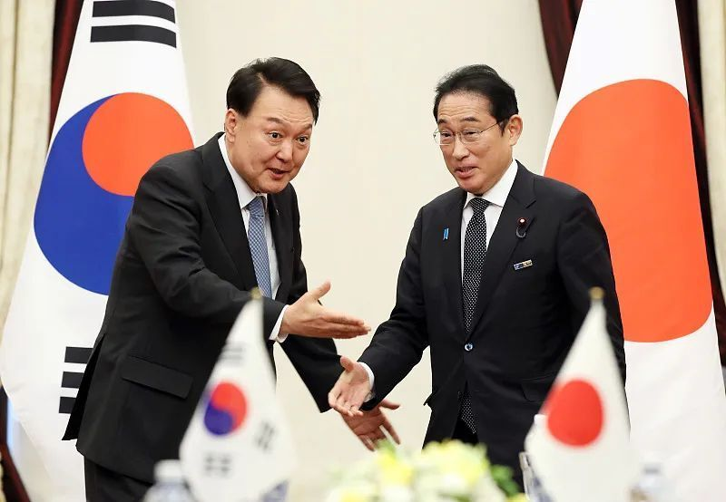
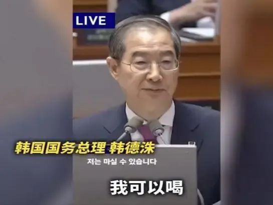

# 日本最早8月下旬核污染水排海 韩国彻底软了：日方说了算

8月7日，多家日媒爆料，日本计划最早于8月下旬开始福岛核污染水排海工作。

日本共同社报道称，日本政府设想，首相岸田文雄先在本月18日于美国举行的日美韩首脑会谈上作出说明，借与美国总统拜登、韩国总统尹锡悦举行三边会谈之机，举行与尹锡悦的双边会谈。

鉴于韩国民间对核污水排海的担忧情绪强烈，岸田文雄将直接寻求尹锡悦的理解。预计岸田文雄将在20日返回日本，而后召开相关阁僚会议，再敲定具体的核污染水排放时间。

据日本广播协会（NHK）7日晚些时候报道，岸田文雄当天回应称，“此前曾多次表示预计将于今年春季到夏季期间开始排海，这一点没有改变，目前具体时间以及工作日程还没有做任何决定。”

令人啼笑皆非的是，美日韩首脑会晤还没有召开，韩国政府7日反倒先一步表示，在福岛核污水排海的时间问题上，日本说了算。

韩联社7日报道称，在当天的记者会上，有记者提问“日方排放核污染水的时间点可否由日韩协商决定”，韩国国务调整室第一次长朴购然应询表示，日本福岛第一核电站核污染水何时排海，应由当事国（日本）定夺，而非韩日协商决定。

朴购然说，个别媒体报道了有关核污染水排海时间的消息，但相关问题还不是（韩日）两国政府磋商的正式议题。

_韩联社报道截图_

报道称，韩日当天上、下午分两次以视频方式举行旨在讨论核污染水排海问题的工作磋商。两国外交部门的副司局长级官员担任首席代表。

当被问及磋商是否讨论了核污染水排放时间时，朴购然称，会议性质本身属于工作磋商，不是讨论高级别政策事项的场合。当天的会议主要讨论韩方提出的技术建议，是为有关问题画上句号的后续磋商。

什么意思呢？就是日韩讨论的不是核污染水能不能排海的原则问题，而是怎么排的技术问题，韩国不会给出时间建议，日本全权决定即可。

长安街知事（微信ID：Capitalnews）注意到，作为距离最近的国家，日本核污染水排海，韩国首当其冲受到影响。然而在这个问题上，韩国政府的态度值得玩味。

就在刚刚过去的7月，韩国政府发布了《福岛核污水10大谣言》，其中介绍称，韩国全年氚排放量为214万亿贝克勒尔，高于日本的175万亿贝克勒尔。

有眼尖的韩国媒体发现，政府列举的韩国数值是去年的，而日本的却是2019年的。媒体质疑韩国政府或在刻意“调包”，让人误以为韩国排放了更多的氚。

朴购然8月3日在记者会上辩解，韩国的全年氚排放量高于日本是事实。他强调，政府只是向国民介绍可靠的各国最新数据，从未试图误导国民或造假统计。即使将比对年度定为2019年，韩国的氚排放量同样高于日本。

_7月12日北约峰会期间，尹锡悦向岸田文雄示意坐下。图源：视觉中国_

对日本政府无视国际社会的反对，执意推进福岛核污染水排海计划，日本民众持续通过集会等方式进行抗议。

当地时间2日，日本民众再次自发来到东京电力公司总部大楼前举行抗议活动，要求日本政府和东京电力公司放弃排海计划，承担起应负的责任。

讽刺的是，连日本民众也抗议的核废水排放计划，韩国政府却反而要“舍己为日”，替日本证明“安全”。

韩国政府此前已经初步认定，经净化的福岛核污染水现已无超标核素。朴购然6月声称，核污染水排海是最现实的处置方法，如果推翻排海决定并向国际原子能机构（IAEA）建议其他处理方式，会违背诚信原则。

韩国政府甚至呼吁不要将福岛核污染水称为“核废水”，担心这种措辞会引发国民“过度和不必要”的担忧，希望有关各方在言辞上保持克制。

这引发了韩国民众强烈不满，有网友反问，“改变了措辞，放射性物质数量就减少了？”

在今年4月的G7气候、能源和环境部长会议发布会上，日方企图在联合声明中塞进G7对福岛核污染水排放进程“表示欢迎”的措辞，远在大西洋沿岸的德国当场反驳，德国环境部长强硬表态，德国不欢迎核污染水排放。

然而，距离日本本土最近处仅约50多公里的韩国，其政府总理韩德洙却化身日本核污染水“代言人”，表示愿意“带头”品尝。

韩德洙6月12日在韩国国会接受质询时表示，如果福岛核污染水经过科学处理符合标准，他可以喝。

这引来韩国最大在野党共同民主党党首李在明痛批：“如果能喝，日本为什么还要排放到海里？韩国总理扮演日本发言人的角色，这合适吗？”

就在日本加速推进核污染水排海之际，韩国在野党和市民团体频频举行大规模集会，予以谴责、表达愤怒。

6月12日，韩国渔民举行“先不打渔了，去首尔！”大规模游行示威活动，约有3000名渔民和市民参加。集会者表示，韩国政府一再对日本核污染水排海计划放任不管，如果排海成为现实，韩国约10万渔民的生计将遭受惨痛打击。

共同民主党7月1日在首尔举行“谴责福岛核污染水海洋排放泛国民大会”，据其统计，当日有近十万人参加大会。

美国全国公共广播电台日前报道，日本核污染水排海计划导致焦虑感在韩国蔓延。韩国盖洛普一项民调显示，八成受访者对排海后果忧心忡忡。不少韩国人担心排海影响海洋环境和海产品安全，正减少购买海鱼并囤积海盐。

中国海关总署进出口食品安全局负责人7月7日称，中国海关禁止进口日本福岛等十个县(都)食品，对来自日本其他地区的食品特别是水产品(含食用水生动物)严格审核随附证明文件，强化监管，严格实施100%查验，持续加强对放射性物质的检测监测力度，确保日本输华食品安全，严防存在风险的产品输入。

7月，国际原子能机构总干事访问韩国、新西兰期间，也多次发表福岛核“处理水”可以饮用、游泳，与别国核电站排水一样没有危险等争议言论。

中国外交部发言人汪文斌回应称，“如果有人认为福岛核污染水可以饮用、可以游泳，我们建议日方把核污染水好好利用起来，供这些人饮用或游泳，而不是排进大海，让国际社会担忧。”

汪文斌说，中方奉劝日方停止政治操弄，早日回到解决各方关切的正道上来。希望日方忠实履行国际义务，停止强行推进排海计划，充分研究论证排海以外的处置方案，切实以科学、安全、透明的方式处置核污染水，并接受严格国际监督。

