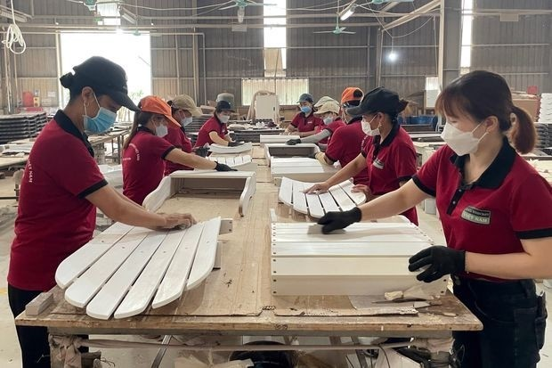
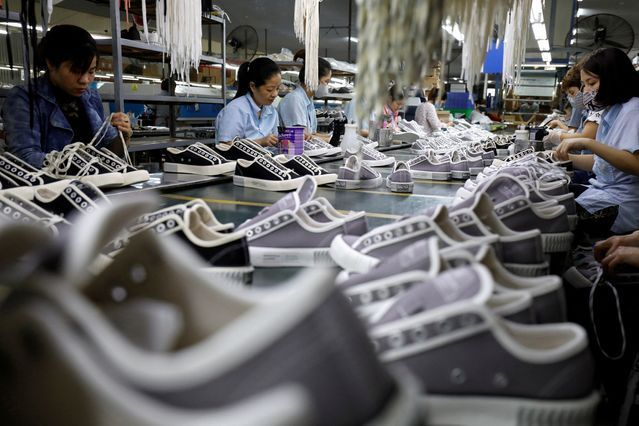

# 来自亚洲的廉价产品还能享受多久？美媒给西方消费者“敲警钟”

（观察者网讯）看着亚洲工厂为了吸引年轻人，升级环境、增加福利、涨工资，西方世界开始焦虑。在他们眼里，生产成本越来越高，在美国等地更难买到廉价商品了。

8月7日，美国《华尔街日报》发表文章《廉价商品时代正面临威胁》，称一家越南服装厂的工作环境快赶上谷歌，不仅设有落地窗和咖啡厅，还有免费瑜伽和舞蹈课，团建活动也非常丰富，“亚洲各地的工厂都在努力吸引年轻工人，这对习惯了廉价商品的西方消费者来说是个坏消息”。

文章援引联合国国际劳工组织的数据称，自2011年以来，越南工厂的月工资已增长逾一倍至320美元，这一增速是美国同期工厂薪水增速的三倍；2012-2021年，中国工厂工资上涨了122%。

_越南胡志明市，一家服装厂内开设咖啡厅（图源：《华尔街日报》）_

该文作者是《华尔街日报》驻新加坡记者乔恩·埃蒙（Jon
Emont），文章从西方视角描绘了中国、越南、马来西亚等地劳动力市场的变化，以此提醒西方消费者们，在家门口买到亚洲产便宜商品的时代可能要结束了。

文章称，亚洲是“世界工厂”和美国人所购大部分商品的来源地，但亚洲国家正面临一个“大问题”——年轻人不愿意进工厂了。

过去30年，全球化制造模式向世界各地的消费者提供了大量廉价产品，如今，习惯了便宜衣服和平板电视的美国人可能很快就会面对更高价格，因为亚洲工厂劳动力“极其便宜”的时代要一去不复返了。

一家开在越南胡志明市的服装企业的英国联合创始人保罗·诺里斯（Paul
Norriss）受访时称：“这个地球上已经没有地方可以满足你的需求了，人们将不得不改变消费习惯，品牌也是如此。”

诺里斯称，服装行业传统劳动力——20多岁的年轻人——如今通常会退出公司的培训项目，留下来的人也干不了几年。他希望通过提升工作场所的条件来改善情况，包括开设咖啡厅，并为员工提供免费的瑜伽和舞蹈课程。

_越南胡志明市，一家服装厂为员工提供免费瑜伽课程（图源：《华尔街日报》）_

文章称，为了吸引年轻人，亚洲工厂不得不提高工资，并采取各种花钱的策略来留住员工，从提高食堂标准到为员工子女建幼儿园。

_一家设在越南的家具制造厂（图源：《华尔街日报》）_

《人口大逆转》作者之一、伦敦经济学家马诺杰·普拉丹（Manoj
Pradhan）警告称：“对于习惯把购物放在可支配收入中某个特定且相对稳定位置的美国消费者来说，我认为这个架构将不得不重新调整。”

文章还提到了代际差异，称亚洲制造业国家的年轻人们比他们父母那辈受教育程度高、更熟悉互联网，这些年轻人不愿意只呆在工厂内。此外，人口结构的变化也有影响，亚洲年轻人们比他们父母那辈生孩子更晚，这意味着他们在20多岁时需要获得稳定收入的压力更小，所以更偏爱去服务业就业，后者比工厂轻松点。

文章称，中国的制造业工厂出现了“招工难”，跨国企业近年来将设在中国的工厂转移到马来西亚、印度尼西亚、越南和印度等国，但新兴的劳动力市场也开始绞尽脑汁招年轻人。

一位25岁的越南高中毕业生辞去了河内郊区一家汽车零部件厂的工作，跑去当摩托车司机。他回忆称，在工厂干活时，上司经常发表让他不爽的言论，让他倍感压力，并表示只有当自己原来每月400美元的工资翻倍时，才愿意回到工厂工作。

_越南胡志明市，一名摩托车司机（中）正在载客（图源：《华尔街日报》）_

一位印尼年轻人高中毕业后在工厂工作，但受不了经理们强迫她加快工作速度，觉得压力很大，所以辞掉工作参加培训，去海外当了保姆。

文章提到，过去，制造商会不断向成本更低的地方迁移，现在可没那么容易了。非洲和南亚一些国家虽然有庞大的劳动力资源，但许多国家政治不稳定，缺乏良好的基础设施或训练有素的劳动力。

比如，服装品牌在将工厂扩张到缅甸和埃塞俄比亚时就受到了当地时局和不稳定因素的冲击，业务中断；而孟加拉国则因为限制性贸易和港口拥堵、运输受阻，导致服装生产在当地难以扩大规模。

_资料图：堆积在孟加拉国港口的货物（图源：《孟加拉国邮报》）_

印度有人口优势，但当地工厂也开始抱怨留不住年轻人。不少印度年轻人更愿意在国家福利计划支持的农田工作，或者去城市灵活就业，也不愿意住在工业中心的工厂宿舍里。

《华尔街日报》提到，这与20年前的劳动力市场大不相同，当时招工很容易。2001年，美国体育用品制造商耐克称，其工厂80%以上的工人在亚洲，主要是22岁左右、单身、在农村长大的青年。如今，耐克中国工厂的员工平均年龄是40岁，在越南是31岁。

泰国一家招聘公司的负责人称，工厂“要么不得不为它们想要的技能多付点钱，要么在它们所需的能力上妥协”。

_越南河内，一家出口鞋厂的工人在工作（图源：路透社）_

在半导体和电子产品制造中心马来西亚，工厂正在适应年轻人喜好，放弃统一服装的要求，并重新设计硬件设施。比如打开隔断，多用玻璃结构，让阳光照进厂里，还播放音乐。马来西亚雇主联合会主席拿督赛胡先称，生产商们试图让工厂变得更有吸引力，“创造一种类似苹果公司的环境”。

实际上，这不是美媒第一次给西方企业和消费者“敲警钟”，但他们紧张的原因时有不同，还炒作过“供应链动荡”和地缘政治冲突等话题。

《纽约时报》曾在2022年5月发文《物美价廉的时代可能要结束了》，当时新冠疫情出现反复，俄乌冲突爆发没多久。文章称过去30年，企业和消费者受益于跨境产品生产，电子产品、服装、玩具和其他商品供应稳定、价格保持在低位，但随着疫情和俄乌战争对贸易和商业关系带来压力，情况正在转变。

该文称，经济学家们在争论，“供应链动荡”和地缘政治冲突是否会导致全球生产的“逆流或重组”，比如，被迁往海外的工厂会迁回美国和其他“政治风险更小”的国家。

如今，饱受通货膨胀困扰的美西方很“操心”，一边担心中国等亚洲国家的低端制造业人手不足、产品价格变高，一边又担心这些国家的高附加值产业发展太快。

本文系观察者网独家稿件，未经授权，不得转载。

