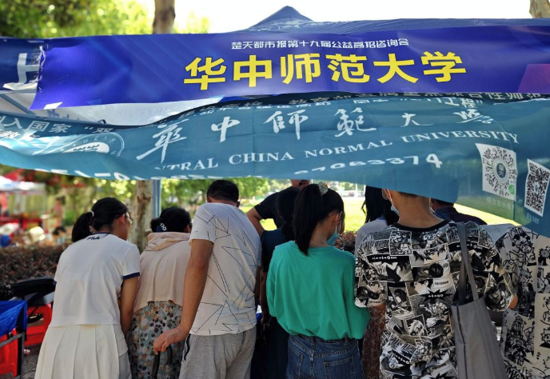
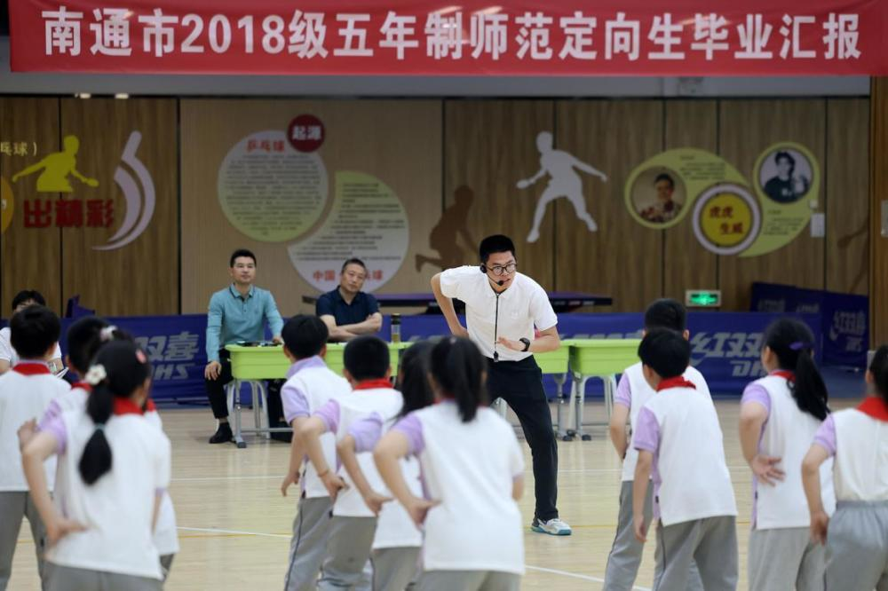
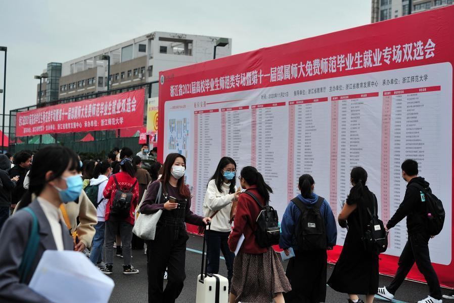
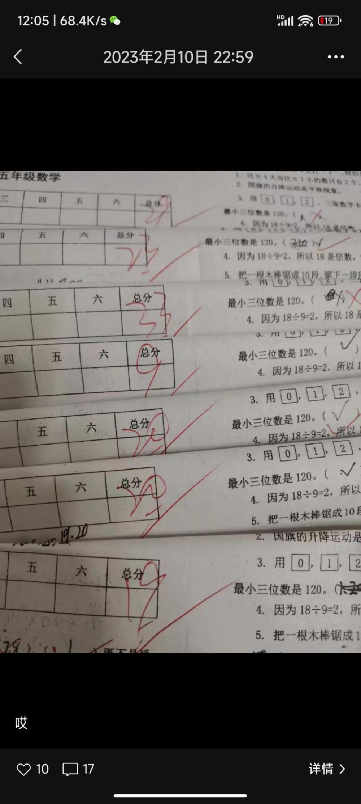

# 生源减少，教师缩编：公费师范的热捧与远虑

_2023年6月10日，武汉，一场高考招生咨询会上的华中师范大学摊位。今年在天津，华中师范大学心理学专业录取最低分以1分差距直逼浙江大学。（视觉中国/图）_

将近一年前的9月2日，林青第一次站上讲台，成为一名老师。讲台下，四十多双眼睛紧盯着，她止不住地心里发慌，不停思索着，下一步应该做什么。

两天前，林青刚以公费师范生的身份，被分配到这所位于广东省河源市东源县最东边的镇中心小学，担任五年级数学老师。而她持有的教师资格证，是幼儿园的。

2018年，林青高考发挥失常，为了尽量上个好一点的大学，她报考了广东第二师范学院公费定向师范生教师专项计划，学前教育专业。

公费师范政策，指对部分师范专业学生提供免费教育，并保证其在毕业后“有编有岗”。作为回报，毕业生需在岗服务至少六年，否则视为违约。林青被录取时排位不高，没想到，接下来几年，公费师范会越来越热门，同一个专业，排位四年提高近万名。部分地区甚至出现部属公费师范专业录取分数直逼复旦浙大的情况。

林青更没想到，自己会被分配到一所小学，原因是，当地幼儿园已无空余编制。

2022年，全国人口自然增长率跌至负数。在生育率普遍下降的背景下，教师缩编已成趋势。2023年1月，在被问到厦门校招教师是否还有编制时，厦门市教育局人事处曾在官网回复，今后厦门中小学招聘的教师均将实行参照事业单位聘用人员管理，但福利待遇参照在编人员管理——传统意义上的编制正在消失。

但还是有更多人被公费师范许诺的未来打动，少有人知的是，这条热门的道路，面临着诸多不确定。

_2022年9月27日，林青任教的课堂。（受访者/图）_

只是一张入场券

上岗前很长一段时间，林青一直在“等通知”。

林青属于“定向师范生”，填报高考志愿时，她需要在广东省当年的招生专业目录中，选择毕业后意向分配的县市，毕业后，由4年前选定的县教育局对其任职学校和岗位做具体安排。

五年前，广二师学前教育专业设有招生指标的有12地市30县市，林青选择了离家最近的河源市东源县。

但毕业时，一切并未按部就班。2022年8月初，毕业一个多月后，林青第一次接到东源县教育局的通知，并前往参加面试和体检，之后再无消息。直到8月31日，开学前一天，林青和十余人一起，被带到东源县黄村镇中心小学，当场接收授课学校、年级和学科的分配情况。她留在了这里，一位同班同学则被分配到村小。

林青了解到，和她们俩被指定岗位不同，定向至其他县市的同学们，均靠面试成绩从高到低依次选择岗位。对此，林青曾提出疑问，得到的回应是，幼儿园已无空余编制。如果不接受即为违约，需退还此前享受的公费教育费用并缴纳违约金。

除了广二师这类省属定向师范学校，公费师范项目更受关注的是北京师范大学、华东师范大学、东北师范大学、华中师范大学、陕西师范大学、西南大学这6所教育部直属师范大学，它们培养的公费师范生也被称作“部属师范生”。

与省属师范生不同，按照2010年5月下发的《教育部直属师范大学免费师范毕业生就业实施办法》，部属师范生毕业后回“生源所在省份”任教，相关部门通过“双向选择”的方式，如组织供需见面会等，为毕业生落实岗位。学生的选岗范围则一般停留在城区，不会下沉到县级。但这不仅意味着部属师范生们有更大的择业自由、更大几率留在条件较好的城区工作，也意味着，他们面临着更多竞争。

升入大四不久，西南大学学前教育专业公费师范生李淼，就开始忙着抓住“双向选择”机会。

2022年秋天，重庆各区陆续发布区内教育事业单位面向应届毕业生的招聘公告。为了留在重庆主城区，李淼先后报名了九龙坡、大渡口、南岸等五个主城区的区招考试。2023年1月15日，李淼迎来了第一场面试，与其他8人共同竞争大渡口幼儿园学前教育教师岗位——名额只有3个。

面试持续了一整个下午。李淼注意到，应聘者中，2人为自己同校的研究生，1人为重庆第二师范学院的普通师范生，其余5人均为自己的同班同学。

李淼和她的同学们都落败了。当场公布的结果显示，入选的前三名均非公费师范生，李淼为第四名。这个结果没有让她太失望，“我当时只拿大渡口区练个手，没有指望能一次就上”。然而，她接下来数场面试，也都以失败告终。

南方周末记者注意到，2022年重庆各区教育事业单位应届毕业生教师招聘报考条件中普遍提到，普通本科生和硕士研究生若要报考，除了需要达到本科以上学历、专业对口、拥有教师资格证书等要求外，另须满足获得国家奖学金、优秀毕业生、三好学生称号，就读的学校、专业符合一定的大学及学科排名要求等多项条件之一。这意味着，公费师范生拥有几乎所有区招考试的“入场券”，但他们拥有的，也只是一张入场券而已，同台竞技的，还有各类履历惊人的对手。

在名校生考教职已成常态的今天，李淼知道，和研究生或是优秀的普通师范生、普通本科生一起面试，自己并没有优势。

日前，教育部出台《关于实施国家优秀中小学教师培养计划的意见》，提出从2023年9月起，由30所“双一流”高校带头选拔、培养一批教育类硕士研究生，并支持优质中小学与“国优计划”研究生签署培养协议，对接就业。这也意味着，公费师范生面临的竞争更激烈了。

接连受挫后，李淼联系了自己的生源所在地，重庆长寿区一所幼儿园。这是部属公费师范生的就业“兜底”政策，如果学生没能自己找好工作岗位，生源所在地会提供“有编有岗”的教职。不过她被告知，经过一轮招聘后，家乡的幼儿园也没有空余编制了。

转机来得突然且偶然。到了2023年3月，因面试前三名中有人放弃，大渡口幼儿园给李淼发来递补通知。这一次，她没有丝毫犹豫。

_2023年5月17日，江苏南通，2018级五年制乡村教师师范定向生小学教育专业课堂教学展示。（视觉中国/图）_

分数直逼浙江大学

公费师范生求职日趋激烈的信号并未传导太远，公费师范热乃至师范热仍在持续升温。

2023年7月15日，天津市考试院公布本科提前批录取最低分，4所在津招收公费师范生的部属师范院校，分数线普遍在650分以上。其中，华中师范大学心理学专业最低分更高达670分，超过同批次在津招生的南开大学、武汉大学，以1分差距直逼浙江大学。

公费师范在全国都受到追捧。2023年6月24日23点45分，河南省高考出分的时间。担心知道成绩后会睡不着，卢海滢本来打算第二天再查，但熬到将近凌晨，她还是没能忍住。总分574分，排位11649。

这个分数不低，高出2023年河南省一本线近三十分，但不足以填报任何一所部属师范院校。

历史上的师范生免费教育可以追溯到百余年前。成立于1897年的上海南洋公学师范院，对所有学生免收学杂费并发放津贴。新中国成立后，这一传统也沿袭了下来。

危机出现在1990年代。当时，国家提出师范教育属于高等教育，不在义务教育范围内，许多师范院校开始收费。2013年发表的一篇论文中，云南民族大学职业教育学院博士王卫东曾提到，免费教育的传统被打破，师范院校的学费优势丧失，使得优秀生源大大减少，毕业后选择从事教职的毕业生也寥寥无几。

直到2007年，教育部等4部门联合发布《教育部直属师范大学师范生免费教育实施办法（试行）》，决定自当年6月起，在6所部属师范院校试点师范生免费教育政策，录取学生将享受免学费、领补助等优惠政策。学生毕业后需回生源所在地任教服务十年以上，如到城镇学校工作，应先到农村义务教育学校任教服务二年。

在西南大学教育学部学前教育学院副院长胥兴春看来，恢复免费师范，主要是为了提高教师职业吸引力。

它的确重燃了考生的热情。政策推出当年，6所部属师范院校在全国共招收了10933名免费师范生，超出计划招生数近两千，重点线上报考人数大大超出预期。教育部官网数据显示，自2007年招生起，截至2017年，6所部属高校已累计招收免费师范生10.1万人。

此后，各省份陆续推出地方政策，在定向区位和服务时间上更加具体严格。2008年，上海师范大学恢复招收免费师范生，成为首个恢复的地方性大学。至今，所有省份均实施了地方师范生公费教育培养政策。2018年3月，教育部等部门颁布《教师教育振兴行动计划（2018-2022）》，将“免费师范生”改为“公费师范生”，学生毕业后回生源所在地任教的时间则由十年改为六年。

目前，公费师范培养学制可大致分为以下四种：初中起点专科制、高中起点本科制、本科起点硕士制、初中起点中本贯通制。此外，有一些特例，如部分省份正在探索的高中起点本硕六年一贯制、中职起点本科制等。专业设置上，专科层次以培养幼儿教师为主，本科、硕士层次范围更广，包括学前教育专业、语数英这类学科教育专业，以及特殊教育专业等。

公费师范在2020年迎来又一利好。2021年起，招收公费师范生的高校可参加教师资格免试认定改革，自行对教育类研究生和公费师范生开展教育教学能力考核。换句话说，只要学生考取了公费师范相关专业，基本就能获得教资和编制。自此，公费师范作为一个“最稳妥的选择”，录取分数亦水涨船高。

以西南大学为例，2020-2022年，该校公费师范在河南省的最低录取分数分别为600、610、577分，分别高出当年文科类专业本科一批最低录取分数线44、52、50分，最低录取名次也从5041名逐年提升至4672名、3958名。

省属师范院校的录取位次亦逐年提升。2022年高考招生季，林青注意到，广东第二师范学院的公费定向师范教师专项计划中，学前教育专业最低排位为36941，比自己高考那年高出万名有余。

查到成绩那晚，卢海滢一宿没睡，哭到凌晨三四点。她的父母、祖父母均在体制内，从高二起，她就把考上部属公费师范院校当做目标。

不过她没有放弃。第二天醒来，她立刻着手找资料，并选定了安阳师范，一所河南省属二本公费师范院校。2023年，她的家乡县城首次被列为这所学校公费师范专业的定向县之一。

从部属师范到省属师范，卢海滢并不觉得亏，在人人热衷考编考公的时代，一个确定的编制，很重要。

_2020年11月21日，浙江金华，浙江省2021届高校毕业生师范类专场暨第十一届部属师大免费师范毕业生就业双选会。（视觉中国/图）_

编制“越来越少了”

然而，教育领域的编制越来越少了。

徐珊珊是华东师范大学2012级学前教育专业毕业生，她已在上海杨浦区一家公办示范幼儿园工作7年。7年前她择业时，整个过程十分“简单”。

大四上学期，徐珊珊进入上海某所示范幼儿园毕业实习。其间，她向园方提出想毕业留校任教，并顺利获得应允。毕业前，徐珊珊参加了一场通过率几乎百分百的点招考试，“走个过场”，便成功入职。但2022年开始，徐珊珊发现，学校招聘的新教师只有以前的半数，从“六七个减少到2023年的三个”。

2023年上半年，徐珊珊带教的上海师范大学实习生，同样在毕业前向园方表达了求职意向，却被拒绝。徐珊珊猜测，这种变化或许和生源减少有关。

胥兴春也注意到，近年来，重庆主城各区公办幼儿园每年新拟聘人数也越来越少，有的区甚至“拦腰折断”。

根据2014年中央编办、教育部、财政部三部门联合发布的《关于统一城乡中小学教职工编制标准的通知》要求，公办小学在编教师与在校学生数量之比应为1∶19，初中师生比为1∶13.5，高中师生比为1∶12.5。这意味着，一旦中小学生源减少，编制名额也会收紧。

不过，教职工编制核定标准并没有将公办幼儿园囊括在内。2023年全国两会期间，全国政协委员滕树静曾表示，由于一直没有出台编制标准，幼儿园教职工专项编制十分紧缺，极大地制约了学前教育的发展。

南方周末记者梳理最近7年的教育发展统计公报发现，自2016年出现首跌后，2017年至2020年，幼儿园入园人数持续下滑，在园幼儿数也于2021年首次减少。小学招生人数则在2020年出现首次下滑，此后两年，小学招生人数持续下降，降速由1.41%提升至4.55%。而初中入学率的变化还未稳定，数据显示，2016年至2019年间，初中学校招生人数持续增长，但增速逐年下降，2020年更首度出现负增长，但又在2021年、2022年继续上涨，增速再次放缓。

卢海滢的母亲在公办小学任教，她已经观察到这种变化。“去年招生季，妈妈非常忙碌，每天往学校跑，接待各种各样的家长，今年相当清闲，坐在学校等一天也不一定有几个家长来咨询。”担心小学、初中编制会在四年后大量减少，在安阳师范学院今年所设的两类公费师范专业，学科教师和小学教育中，卢海滢选择了前者。她计划成为一名高中英语老师。生育率下降的影响还不会那么快波及高中，她想。

不同于学生及一线老师，身为学者的胥兴春并不太担心就业。他解释，各地在拟定公费师范生招生计划时，通常会预测未来四年的师资空缺，以预留编制，保证毕业生的“绝对就业”。到毕业季，各地教育局也会对当年的公费师范毕业生人数及择业情况做统计，由各地财政部门、机构编制部门、人力社保部门合作统筹，提供预算、编制和岗位。

“比如说，重庆今年报3000个（公费师范招生名额），4年以后的编制就已经预先计划出来了，钱也由财政（部门）预算出来了，这些学生是一定会进编，一定会安排就业的，这是任务。”胥兴春说。

以广二师为例，过去四年，公费师范学前教育专业计划招生人数已从2019年的60人减至30人，设岗县市的数量也由2019年的7地市17县市，缩减至2023年的3地3县市。同期，华东师大公费师范在上海的计划招生人数，从2020年的55人变为2023年的46人。

但“绝对就业”的反面，是不能保证就业层次和学校类型均可以按计划1:1落实。胥兴春承认，各地在实践过程中会出现就业岗位和专业不对口的情况，不过从部属公费师范生的教学素养来看，应该足以应对。

“缺什么老师就当什么老师”

编制充足的确不代表结构性师资充足。

2019年发表的论文中，西南大学西南民族教育与心理研究中心主任张学敏提到，2004年至2017年间，我国农村小学历年师生比均高于1:19的国家标准，农村小学的教师编制充足，甚至可以说已经超编。但依然存在科师比配置不合理、教师专业与所教科目不匹配、科目教学专业化水平较低等问题。

林青也遇到了这样的结构性问题。她工作的小学有近千学生，二十多个班级，散布在两栋三层教学楼里，由五六十名教师负责日常的教学工作。单从数量来看，在编教师人数已经达到国家标准，但教师专业、水平与科目不对口的情况普遍。按照林青的说法，“缺什么老师就让你当什么老师”。

学校对新教师专业背景要求宽松。只有幼儿园教师资格证的林青被分到五年级，担任数学老师兼班主任。第一次备课，她靠的是开学当天才拿到的教材以及B站视频。第一次数学单元测试后，她所在班级的学生，均分年级倒数第一。

除了数学，林青还曾被同时任命为科学老师和音乐老师，但因为备课任务太过繁重，这些课程只上过一次就停止了。

公费师范生计划的初衷，是促进教育公平、提升基层教育水平。2010年制定的《教育部直属师范大学免费师范毕业生就业实施办法》中提到，免费师范生一般回生源所在省份中小学任教，鼓励到边远贫困和民族地区任教。前述于2018年出台的履约管理办法中也提到，部属公费师范生需要到农村义务教育学校任教服务至少一年。但自推行以来，乡镇以下学校受到的政策裨益远不如预期。

2011年，《人民日报》曾对首届公费师范生毕业任教情况进行网络统计，数据显示，181名受调查毕业生中，63.5%来自农村，但没有一个人选择将“农村”作为意向工作地点。省级教育部门提供的数据则显示，全国26个省区中，仅有199名毕业生在农村学校任教，而在当年，毕业的公费师范生人数为10597人。徐珊珊提到，她毕业那一年，学生被市区学校“抢着要”，到农村任教1年的服务要求则悄无声息地作罢。

李淼认为，在支援落后地区教育的初衷上，部属公费师范变得“将就”。“大部分师范生留的地方根本不缺老师，真正缺老师的地方没有人去。”她担心公费师范政策会因此被取消。

事实上，关于部属公费师范是否应该取消，一度存在争论。一方面，乡镇的确需要更多优质、稳定的师资；另一方面，乡镇闭塞的环境又不利于教师个人的专业成长。

胥兴春观察到一个现象。近年来，因为重庆主城区编制缩减，西南大学公费师范生尤其本科生，毕业后流向主城外、师资薄弱地区的趋势明显起来。胥兴春认为，这间接达成了最初调整城乡教育格局的初衷，而且是以更易于接受的方式，只是花了更长的时间。

误打误撞的工作给林青带来了意想不到的收获。没有小学教育的专业背景，她只能靠多听公开课，多向其他老师请教来弥补。没有精力备其他课，她就在数学课上延伸课外知识，定期开主题班会，教学生们如何识别、避免性侵犯，如何应对网络诈骗。

作为班主任，她还需要时刻关照学生的心理。“他们有什么想告诉我又不好意思当面说的，可以写给我。”最开始只有一个女生递纸条，到了期末，林青收到了十多张，“你是我五年来最好的一位班主任”。还有一次，一个学生在黑板一角画了一棵苹果树，意思是，“果子代表学生，树干和树杈代表老师”。林青忍不住想，“很多年后我还能是学生眼中很棒的老师吗？”期末考试，她的班级数学均分排名第一。她开始觉得，自己“能改变一点是一点”。

但在今天，年轻的考生和他们的父母，选择公费师范最重要的动机还是确定性。

2023年7月8日，卢海滢查到，她的第一志愿安阳师范已投档，她在社交平台发了一则消息：18岁，祝贺自己拥有编制。

（应受访者要求，林青、李淼、卢海滢、徐珊珊为化名）

南方周末特约撰稿 柯愉乐 南方周末记者 蒋敏玉

