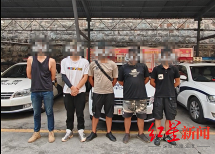

# 男子在汽车行驶中敞开车门挑衅交警：“有本事来抓我”，同伴起哄！一行五人全部归案

8月3日18时许，网络上出现一条公然挑衅攀枝花交警的视频，对社会造成不良影响。

_▲视频截图_

视频里一男子在快速行驶的汽车上敞开车门，蹲在车门旁边，嘴里还叫嚣着“挑战攀枝花交警”“有本事就来抓我”“你一定要来抓我”的挑衅话语，旁边还有人在起哄，行为荒唐，言语极度嚣张。

攀枝花交警很快便锁定嫌疑车辆为浙DR3***的面包车。交警一大队立即通知驾驶员和相关人员到交警一大队进行处理。

_▲五人全部归案_

8月4日16时许，叫嚣“有本事你一定要来抓我”的李某某、发布视频的陈某某、当事驾驶员倪某某以及同车人员李某某、王某一行五人全部归案。交警一大队对该车辆存在的交通违法行为进行依法处罚，对其挑衅交警行为进行严厉批评。

**处理结果：**

倪某某在驾驶车辆行驶过程中未关闭车门的违法行为，处以200元罚款、对于其在驾驶过程中有其他妨碍安全驾驶的行为处以罚款200元记3分处罚。

张某某与王某作为同车随行人员，在车内同伴做出危险且不当举动时，非但不及时劝阻，还起哄、怂恿、纵容，交警一大队对2人进行口头批评教育。

陈某某及李某某，拍摄视频并上传网络造成恶劣社会影响，该行为已触犯《治安管理处罚法》已移交属地派出所进一步调查处理。目前，该案正在进一步办理当中。

郑攀汉 红星新闻记者 江龙 攀枝花公安交警供图

编辑 郭宇 责编 冯玲玲

