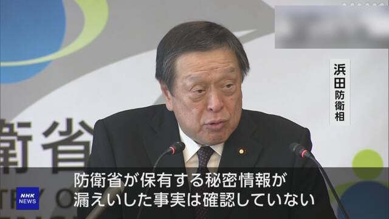

# 美媒炒作“中国黑客入侵日本防卫系统”，日防相：未确认相关情况

（观察者网讯）近期，美媒频繁散布虚假信息、炒作“中国黑客攻击他国机构”的议题。8月7日，美媒《华盛顿邮报》援引所谓“知情美国和日本官员”的话声称，“中国军方黑客曾在2020年入侵了日本防卫省最敏感的计算机系统”。然而，日本防卫大臣和内阁官房长官8日回应指出，日方“没有确认因网络攻击导致防卫省机密信息泄露的情况”。

_日本防相浜田靖一回应，NHK视频截图_

据日本《朝日新闻》、NHK电视台等日媒报道，在8日上午的记者会上，日本防卫大臣浜田靖一表示，“没有确认防卫省掌握的机密信息因网络攻击而泄露的情况”。

被问及是否曾遭受过网络攻击时，浜田靖一回应称，鉴于这一问题有暴露防卫省应对能力的风险，因此他无法做出详细回答。但他重申，迄今为止，“尚未发现防卫省秘密情报泄露的事实。通过各种努力，防卫省有效应对了网络攻击，还没有发生过影响自卫队执行任务的情况”。

在同日的记者会上，日本内阁官房长官松野博一对此事做出回应，并表达了与浜田靖一相同的观点。他指出，对于中日关系，日本政府的一贯方针是，“维持建设通过双方努力建立稳定的关系，与中方继续在所有层面上进行紧密沟通”。

另据路透社报道，关于美国官员是否曾向日本政府通报所谓“中国黑客攻击”事件，松野博一表示，“日本在各种层面上与美国保持密切沟通，不便透露细节”，对此不予置评。

_松野博一8日回应美媒炒作，图自路透社_

日本防卫大臣和内阁官房长官上述表态是对美媒《华盛顿邮报》报道的回应。此前一天（7日），《华盛顿邮报》援引多名所谓“知情美日官员”的话报道声称，“中国军方黑客曾在2020年入侵日本防卫省最敏感的计算机系统”。一名美方官员形容，此次网络攻击“严重得令人震惊”。

报道说，美国国家安全局于2020年秋发现了这一漏洞，并向日本政府通知了事态的严重性。

有知情人士透露，这一事件令美方感到“不安”，以至于美国国家安全局局长保罗·仲宗根和时任白宫国家安全委员会东亚高级主任马修·波廷格赶往东京，向时任日本防卫大臣做了简报。“日本防卫大臣表示非常担心，并安排他们向日本首相发出警告。”

一位前美国高级军官告诉《华盛顿邮报》，在美方指出问题后，日本政府实施了加强网络防御的措施。但美方显然认为这“还不够，并警告日本防御网络漏洞将阻碍美日两国防务机构扩大信息共享。”

报道提到，在拜登政府上台后，美国开始插手日本政府的网络安全防御。其中一个方案是，日本国内商业公司来评估漏洞，而美国国家安全局等网络安全机构将审查结果并就如何弥补漏洞提供指导。同时，两国安全人员还会定期举行技术交流和视频会议，以掌握问题的最新进展。

值得一提的是，近一段时间，美媒、政客已经炮制出不少类似的“中国黑客攻击他国机构”的消息。

7月26日，我外交部发言人毛宁就相关事件回应称，美国政府一方面对包括中国在内的全球各国从事恶意网络活动，另一方面却反复炒作“中国黑客攻击论”，是典型的双重标准和政治操弄。

同日，武汉市应急管理局和公安局分别发布公开声明和警情通报称，经国家计算机病毒应急处理中心和360公司监测发现，武汉市地震监测中心遭受网络攻击，有媒体还报道称，初步证据显示，网络攻击来自美国。发言人对此有何评论？

毛宁表示，根据中方相关机构发布的通报，有外国政府背景的黑客组织，对武汉市地震监测中心实施了网络攻击，严重威胁中国国家安全。我们谴责上述不负责任的行为，中方将采取必要措施维护中国的网络安全。

**本文系观察者网独家稿件，未经授权，不得转载。**

