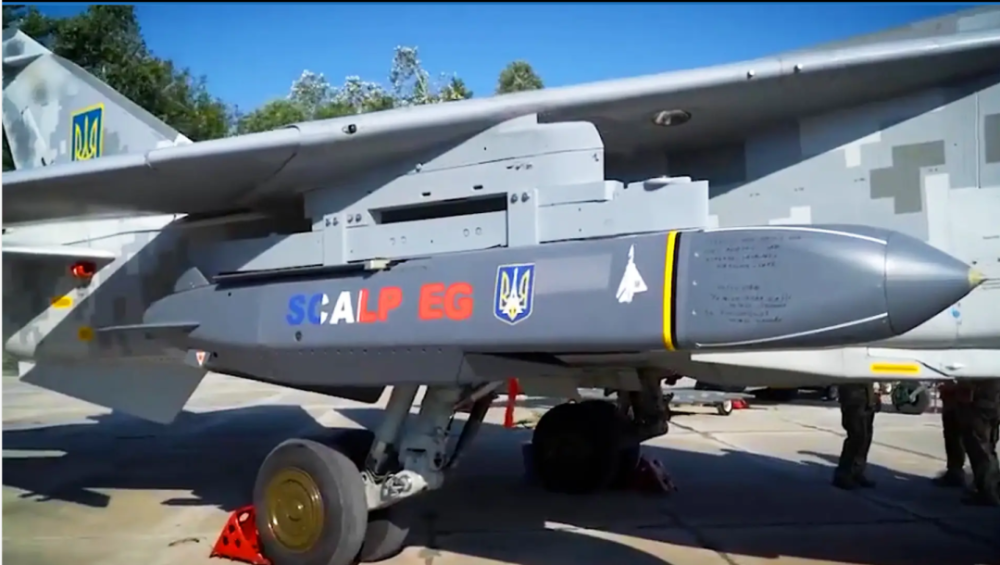
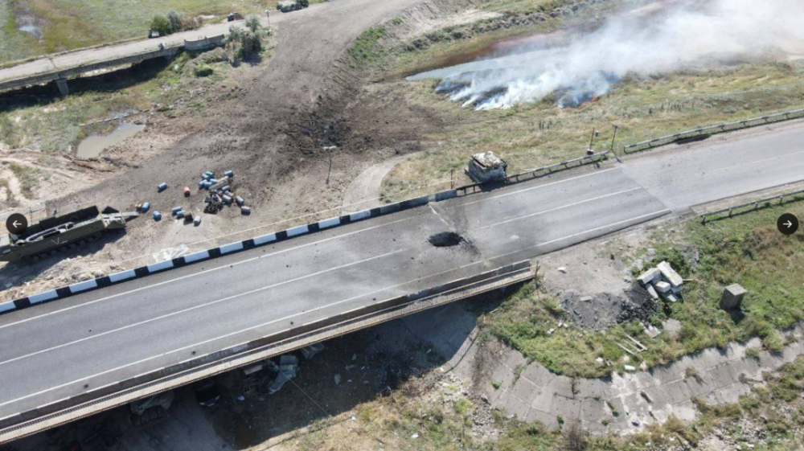
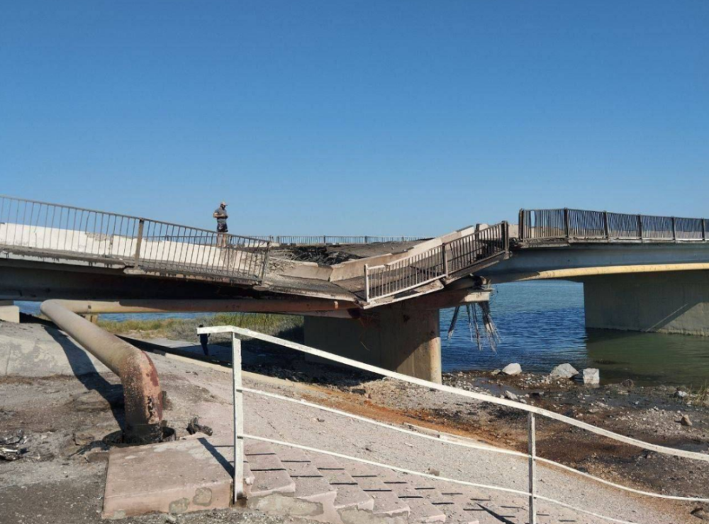
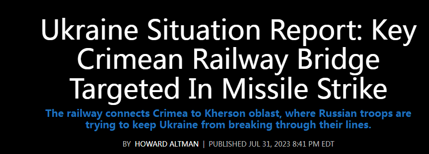
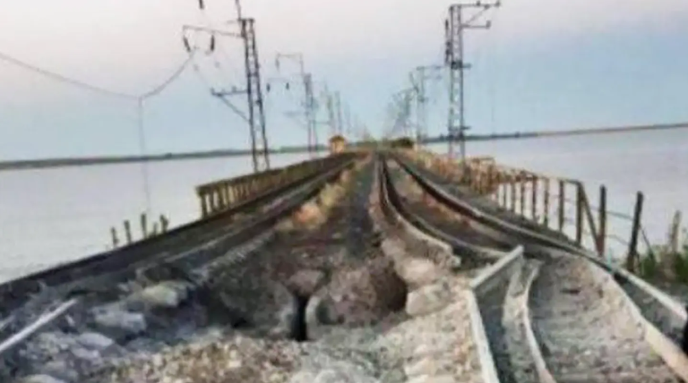
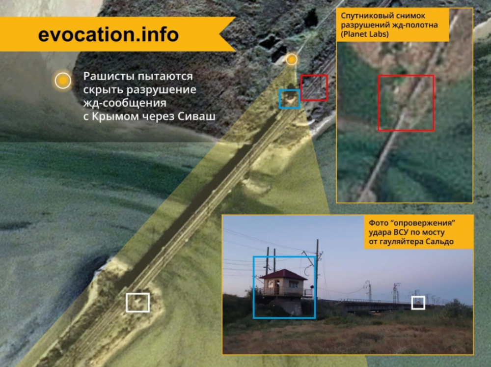
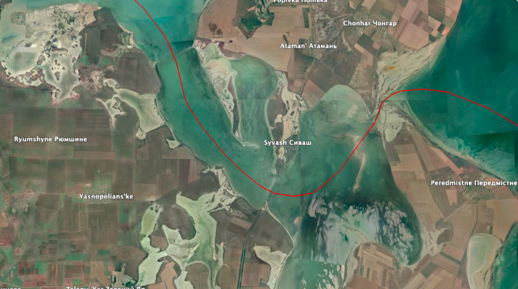
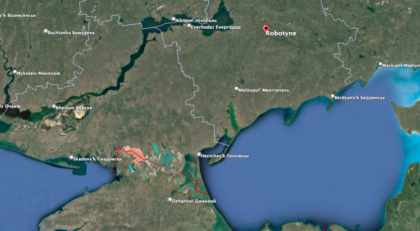

# 这座桥啥来头？乌克兰要用泽连斯基题过字的法版“风暴之影”来炸

多家外媒都在炒作，法国版“风暴之影”巡航导弹被用于袭击俄方控制的重要桥梁，但外界在围观乌军用泽连斯基留言的法国导弹打击连接克里米亚半岛的两座大桥时，外界不禁发出疑问，为何乌军要用打一枚少一枚的远程武器打击这两座桥呢？这两座桥对于俄军有多重要？这又透露出什么危险信号？

据路透社6日报道，当天乌克兰袭击并破坏了连接乌克兰赫尔松州和克里米亚的琼加尔公路桥，另一条连接乌克兰港口城市格尼切斯克和克里米亚东北海岸的一座较小桥梁也遭打击。

西方媒体在报道大桥被炸的画风是这样的。

美国“动力”网站“战区”频道的文章以“法国斯卡尔普-EG巡航导弹正式在乌克兰使用”为题进行了报道。

乌克兰军方报道大桥被炸的画风是这样的：乌国防部在社交媒体上发布了挂载于乌军苏-24翼下的“斯卡尔普-
EG”巡航导弹的图片，还有乌总统泽连斯基在法国导弹上留言的画面，一同发布的还有琼加尔桥和赫尔松州港口城市格尼切斯克附近一座大桥遭到袭击的图片。

当外界在关注法国版“风暴之影”巡航导弹的实战性能时，老刘则更关注乌克兰为什么要用西方国家援助的数量有限的远程弹药打击这两座桥，这两座桥梁有什么战略意义？

老刘在查看公开资料时发现，琼加尔桥已经不是第一次出现在乌军导弹的打击清单之中了。

让我们记住琼加尔这个名字，因为乌军6日对与这个名称相关的重要基础设施的空袭不是第一次，也不会是最后一次。

上一次被炸的是琼加尔铁路桥，被炸的时间是在7月底。

美国“动力”网站“战区”栏目当时的文章称，连接克里米亚与赫尔松州的重要铁路桥成为乌军导弹袭击目标，俄罗斯军队正试图阻止乌克兰突破他们的防线。

虽然目前来看这已经是一篇旧闻，但对比乌军对相关大桥的导弹打击，似乎可以看出一些乌军作战思路的变化。

国外社交媒体上出现的图片显示，连接克里米亚和赫尔松州的琼加尔海峡铁路桥在当时乌军的空袭中受损。图像显示，在一条引道的两组铁轨之间被精确地被炸出一个洞，导致两条铁轨均遭到损坏。当时的卫星图像也显示了该铁道桥的损坏情况。

按照俄方官员当时的说法，这座桥遭到英国援助的“风暴之影”空射巡航导弹的袭击。桥跨本身毫发无伤，乌克兰可能希望保留该桥以供将来自己使用。

“战区”当时援引的社交媒体宣称，虽然俄方官员展示的画面显示，琼加尔大桥“未受影响”，所有来袭导弹都被击落，但卫星图像显示，琼加尔铁路桥明显遭到破坏。

“战区”认为，即使是暂时延误铁路交通的轻微损坏，也可能会给俄罗斯带来严重的后勤问题，因为俄罗斯正在防御乌克兰的反攻，并寻求为其部队提供补给。俄罗斯通过铁路运输大部分作战物资。

通过上述描述，大家普遍了解了琼加尔大桥是连接克里米亚半岛与赫尔松州的重要后勤补给线。那琼加尔大桥到底在哪里呢？

先来看看这张地图。

这是根据谷歌地球的图像，更广阔视角之下该大桥的位置。

从图中可以看出这座大桥对于俄军的重要意义。

但乌军用宝贵的西方巡航导弹打击大桥只是为了迟滞俄军的后勤补给，就这么简单吗？那为什么不干脆把这座桥炸毁了，而只是损坏其中的部分桥面或铁道呢？有分析认为，乌方可能准备反攻拿回这些地区之后，重新利用相关基础设施，因此并不想要把它们完全炸毁。

不过老刘认为，乌军可能正在对自身的作战方案进行调整，比如对莫斯科接连不断的无人机袭扰，用无人艇对俄黑海舰队基地以及俄本土的海军基地实施自杀式攻击……乌军使用西方巡航导弹对上述大桥的“精准”袭击，有可能也是相关作战新模式的一部分，甚至有没有一种可能乌军是在用这些西方提供的远程弹药进行某种试验呢？

比如，通过使用“风暴之影”等武器对琼加尔等几座大桥实施空袭，来评估这些武器对于大桥这类基础设施的打击效能。

毕竟英法这两型巡航导弹的弹头能够穿透坚固的目标，特别适合用来对付桥梁。导弹的引信可以根据需求进行设置，一种方式是以小角度撞击桥面，穿透桥面后击中下面的桥墩爆炸。而简单地在桥面上打洞，是一种不太复杂的选择，而且对方容易进行修复。

所以有没有一种可能，乌军打击琼加尔大桥等，一方面是为了迟滞和延误俄军对相关部队的后勤补给与兵员运送，另一方面则可能是在为打击克里米亚大桥，乃至俄本土的其他高价值基础设施积攒一些经验值呢？

