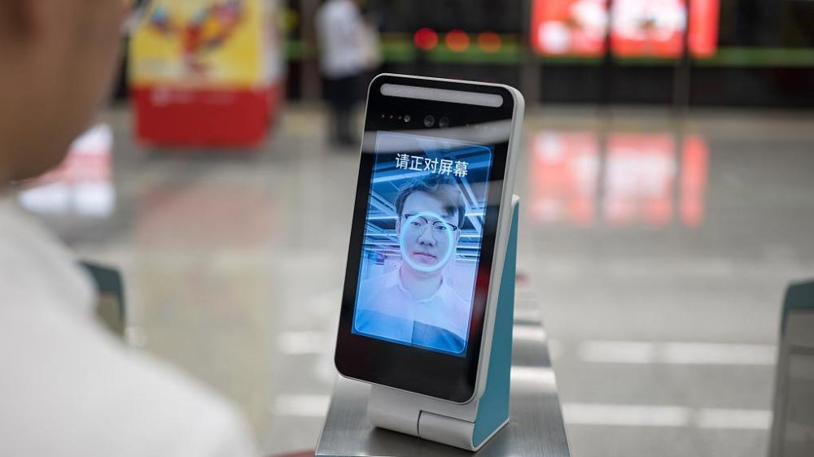

# 限制人脸识别技术过度采集、滥用，国家网信办拟出台规定

“人脸识别技术使用者处理不满十四周岁未成年人人脸信息的，应当取得未成年人的父母或者其他监护人的单独同意或者书面同意。”

“在公共场所使用人脸识别技术，或者存储超过1万人人脸信息的人脸识别技术使用者，应当在30个工作日内向所属地市级以上网信部门备案。”

8月8日，国家互联网信息办公室起草的《人脸识别技术应用安全管理规定（试行）（征求意见稿）》（以下简称《征求意见稿》），公开征求意见。《征求意见稿》共计二十五条内容，详细规定了平台、个人等安装图像采集、个人身份识别设备的前提、条件和程序，要求只有在具有特定的目的和充分的必要性，并采取严格保护措施的情形下，方可使用人脸识别技术处理人脸信息。

《征求意见稿》的二十五条内容，哪些条款是亮点？从过往关于人脸识别的法律法规看，此次《征求意见稿》又做了哪些有益补充？

中国司法大数据研究院社会治理发展研究部部长、中国政法大学知识产权研究中心特约研究员李俊慧向澎湃新闻记者表示，细分条款来看，一、《征求意见稿》细化了人脸识别技术应用的许可授权规则。即：使用人脸识别技术处理人脸信息应当取得个人的单独同意或者依法取得书面同意。法律、行政法规规定不需取得个人同意的除外。

二、划定了人脸识别技术应用的禁止性范围。（1）可能侵害他人隐私的场所不得安装图像采集、个人身份识别设备，（2）在公共场所安装图像采集、个人身份识别设备，应当为维护公共安全所必需，遵守国家有关规定，设置显著提示标识。

三、明确了相关各方对个人图像、身份识别信息的保密和保护义务。（1）在公共场所安装图像采集、个人身份识别设备的建设、使用、运行维护单位，对获取的个人图像、身份识别信息负有保密义务，不得非法泄露或者对外提供。所收集的个人图像、身份识别信息只能用于维护公共安全的目的，不得用于其他目的；取得个人单独同意的除外。（2）组织机构为实施内部管理安装图像采集、个人身份识别设备的，应当根据实际需求合理确定图像信息采集区域，采取严格保护措施，防止违规查阅、复制、公开、对外提供、传播个人图像等行为，防止个人信息泄露、篡改、丢失或者被非法获取、非法利用。

“此外，《征求意见稿》还建立了个人信息保护影响评估机制，明确了不当处理、存储、使用等相关义务内容及需承担的责任。”李俊慧向澎湃新闻记者指出，虽然《征求意见稿》明确了相关主体的责任和义务，这对于限制或遏制相关主体使用人脸识别技术的冲动，保护个人信息将带来积极和正面的影响，但也必须看到，划定使用人脸识别技术的“红线”和“底线”是第一步，更重要的，还是要确保规定得到有效执行，确保不应使用人脸识别技术的主体、场所或场景不使用，如有不当使用，应予承担相应的法律责任。

《征求意见稿》指出，只有在具有特定的目的和充分的必要性，并采取严格保护措施的情形下，方可使用人脸识别技术处理人脸信息。
**实现相同目的或者达到同等业务要求，存在其他非生物特征识别技术方案的，应当优先选择非生物特征识别技术方案。使用人脸识别技术验证个人身份、辨识特定自然人的，鼓励优先使用国家人口基础信息库、国家网络身份认证公共服务等权威渠道。**

对于旅馆客房、公共浴室、更衣室、卫生间及其他可能侵害他人隐私的场所，《征求意见稿》规定，不得安装图像采集、个人身份识别设备。而宾馆、银行、车站、机场、体育场馆、展览馆、博物馆、美术馆、图书馆等经营场所，除法律、行政法规规定应当使用人脸识别技术验证个人身份的，不得以办理业务、提升服务质量等为由强制、误导、欺诈、胁迫个人接受人脸识别技术验证个人身份。物业服务企业等建筑物管理人不得将使用人脸识别技术验证个人身份作为出入物业管理区域的唯一方式，个人不同意通过人脸信息进行身份验证的，物业服务企业等建筑物管理人应当提供其他合理、便捷的身份验证方式。

北京市社会科学院副研究员王鹏在谈及《征求意见稿》亮点时，向澎湃新闻记者指出，“若能实现相同目的，尽量不使用生物特征识别技术，去尝试其他方法，单从这点来说，《征求意见稿》有利于保护个人隐私，可以减少目前社会当中存在的很多问题。尤其是近一段时间，人工智能比较热，出现了AI换脸，网络诈骗等问题，这与生物特征识别技术的过度采集、滥用有一定关系。”

据了解，公众对于人脸识别技术的担忧源于怕个人信息被滥用，甚至泄漏，《征求意见稿》也在相关条款上规避这一风险。

“从化解风险角度来说，有两个维度：一是采集维度，《征求意见稿》之后，此前的过度采集、非告知情况之下的采集会有所收敛；二是使用维度，采集后如何更好地使用，保证信息安全，《征求意见稿》的相关条例更加健全，这有助于保护居民隐私以及良好的市场秩序。”王鹏说。

具体来看，《征求意见稿》第十一条规定，除维护国家安全、公共安全或者为紧急情况下保护自然人生命健康和财产安全所必需，或者取得个人单独同意外，任何组织或者个人不得利用人脸识别技术分析个人种族、民族、宗教信仰、健康状况、社会阶层等敏感个人信息。第十七条规定，除法定条件或者取得个人单独同意外，人脸识别技术使用者不得保存人脸原始图像、图片、视频，经过匿名化处理的人脸信息除外。第十八条规定，使用人脸识别技术处理人脸信息应当尽量避免采集与提供服务无关的人脸信息，无法避免的，应当及时删除或者进行匿名化处理。

河南泽槿律师事务所主任付建向澎湃新闻记者指出，《征求意见稿》是针对人脸识别技术应用在个人信息权益保护的进一步探索，“之前关于人脸识别相关的法律法规主要出现在《中华人民共和国民法典》第一千零三十四条，以及《中华人民共和国个人信息保护法》中，这次《征求意见稿》也加入了对未成年人的保护以及个人信息保护影响的评估。”

据记者了解，关于人脸识别引起的纠纷闹上法庭可以溯源到2019年。案例显示，动物园将入园方式从按指纹改成“刷脸”，因不愿意使用人脸识别，浙江理工大学副教授郭兵将杭州野生动物世界告上了法庭。该案也成为国内消费者起诉商家的“人脸识别第一案”，“脸”受不受保护成为各界关注的焦点。

2021年4月9日，浙江省杭州市中级人民法院对“人脸识别第一案”终审宣判，被告杭州野生动物世界不仅要赔偿原告郭兵合同利益损失，还要删除其面部特征信息以及指纹识别信息。

“此番《征求意见稿》公开及后续正式出台，将在行政管理范畴实现人脸识别技术应用规范和管理的‘有法可依’，对于后续类似案件的审理也将发挥积极的参考作用。”李俊慧说。

