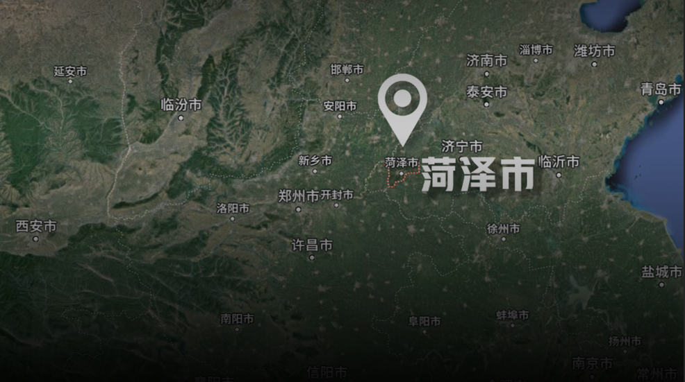
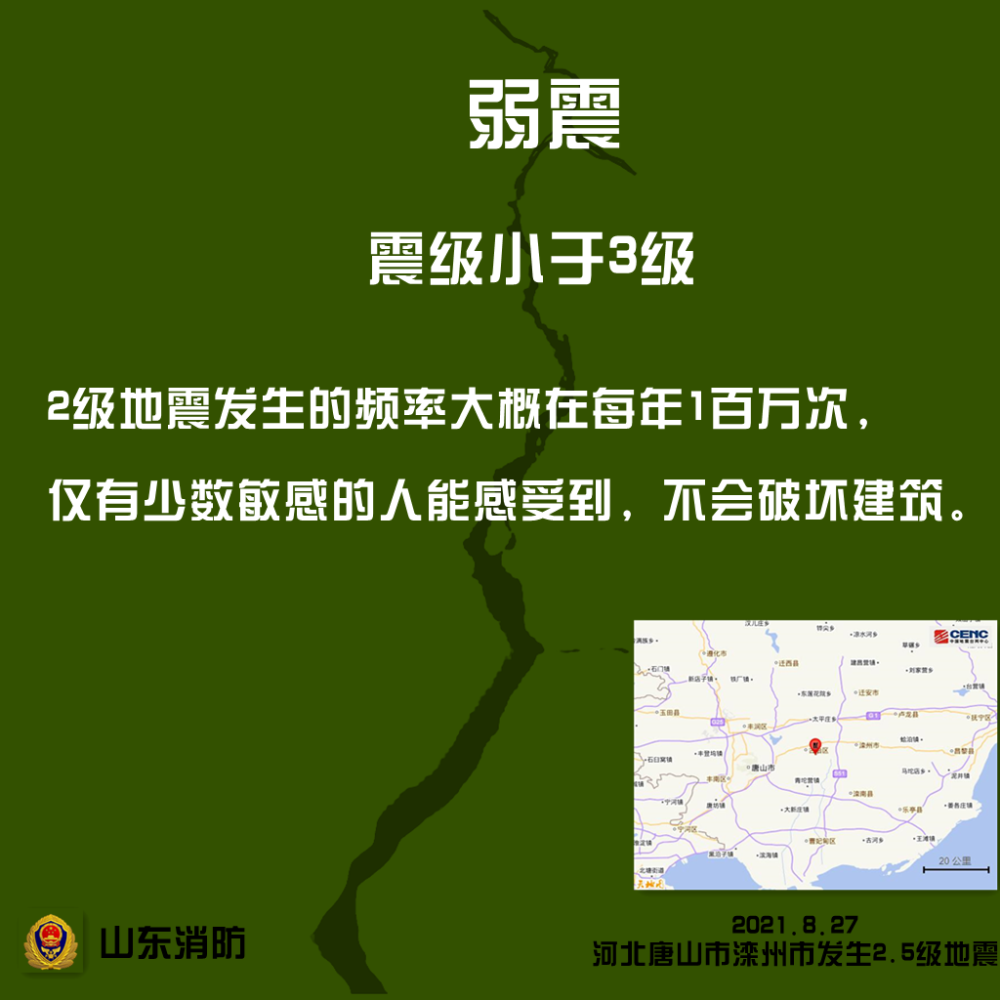
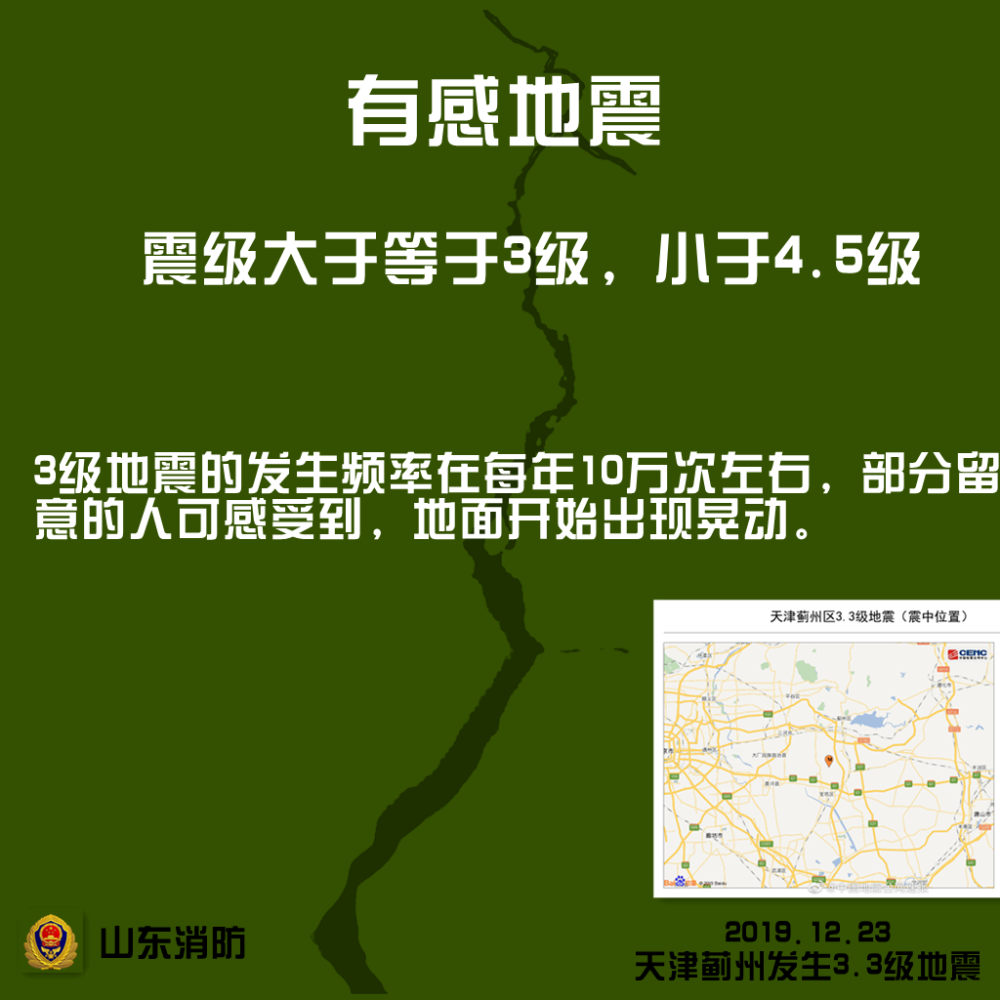
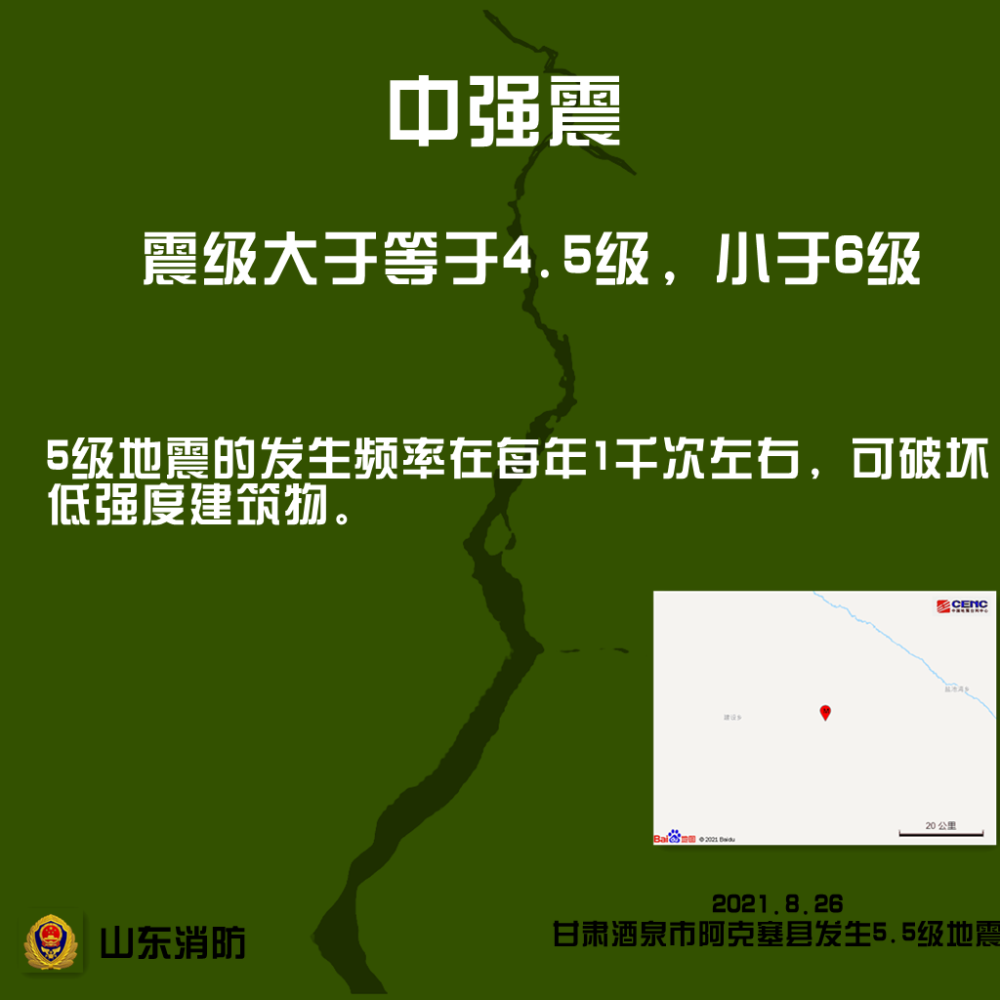
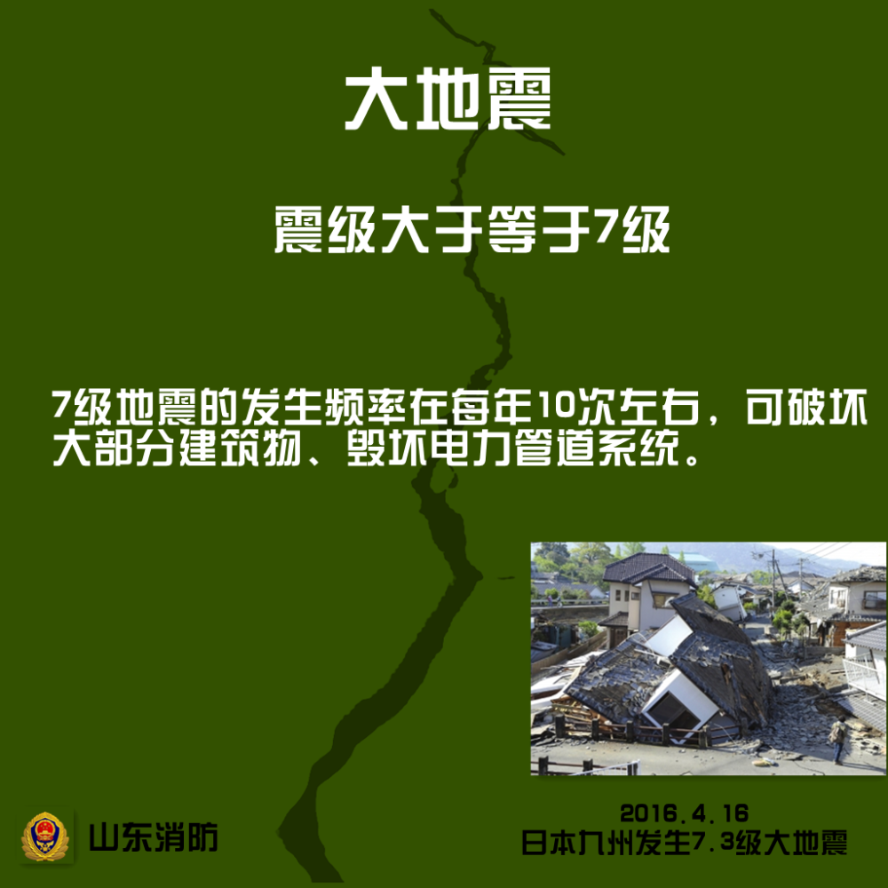
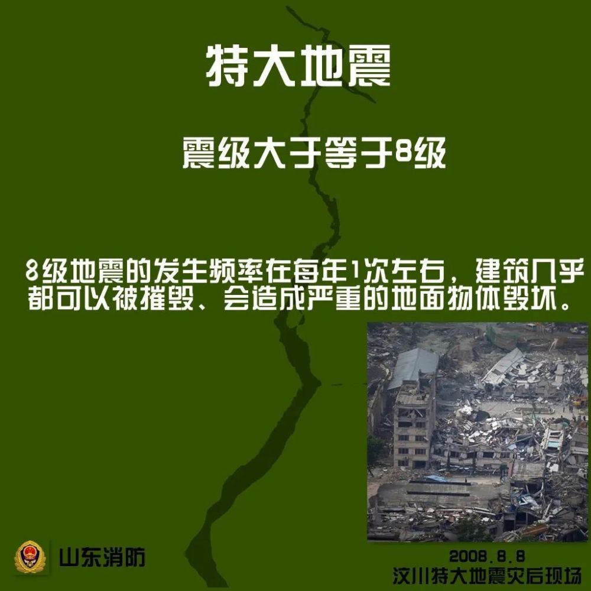

# 今天凌晨，山东菏泽市牡丹区发生2.6级地震

据@鲁震快讯，山东地震台网测定：08月09日03时28分在
**山东菏泽市牡丹区（北纬35.36度，东经115.38度）发生M2.6级地震，震源深度10公里。**

**很多网友留言表示有震感**

**地震知识**

地震按震级可分为七类

地震震级是通过仪器给出地震大小的一种量度，考虑到地震波在传播过程中的衰减，震级的测定需要考虑地震深度和震中距离。

**你感觉到了吗？**

