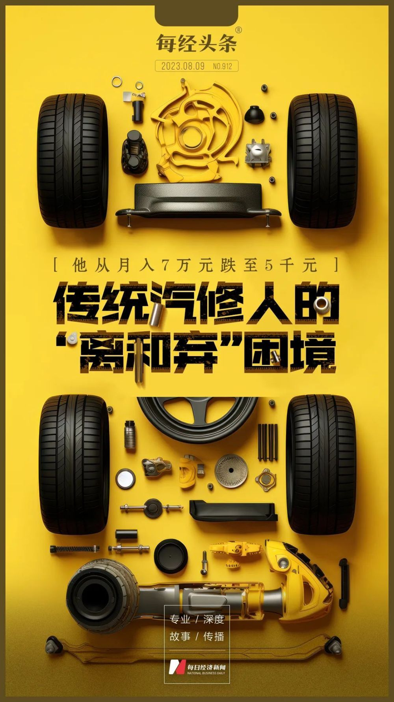
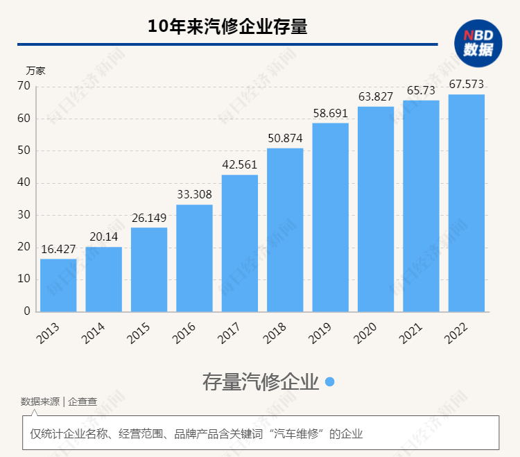
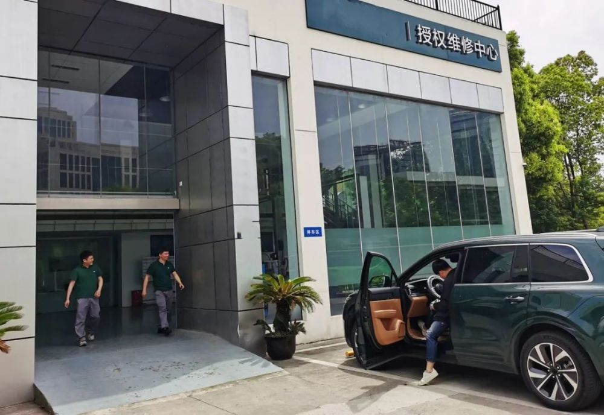

# 他从月入7万元跌至5千元，传统汽修人陷入“离和弃”困境

每经记者：董天意 每经实习记者：李文朋

在酷热难耐的北方夏季，天津的潘师傅正站在滚滚热浪中，向来门店修车的客户热情地招着手。从16岁开始做学徒，到如今有了自己的“忠伟达汽车修理店”，潘师傅用20年见证了国内汽车维修行业发展的起承转合。

但如今，门店好多老客户都已“弃油转电”。面对《每日经济新闻》记者（以下简称每经记者）采访时，潘师傅毫不掩饰地说：“一句话，收入下降了一大截。”

“以前经常修的小客车、大客车，现在都变成纯电的，或者氢燃料的，我完全修不了。”北京张宽养车的老高向每经记者坦言。

“我们也知道新能源汽车是未来趋势，但至少目前修燃油车还能保证收入，转型的风险和重新学习的成本都太高了。”在每经记者的走访过程中，不止一位从业者发出上述感慨。

就像老司机开着老式手动挡车一样，换挡时总会“松油门”并踩下“离合器”，现在的传统汽修人，也面临“离和弃”时刻：该不该松传统油车的油门，投入新能源车行业大军？“离”和“弃”的选择，是一个难题。

众多传统汽修厂曾广泛参与燃油车售后服务的“社会化大分工”，但对转战新能源汽车售后的态度却并不积极。多位受访业内人士向每经记者透露，“上游厂商对资源高度垄断”也是其中的重要原因。

**传统汽修人在焦虑中妥协**

“现在很多人修车，都会提前查好或买好配件，再到店里让我们帮忙修理，有时我忙活了大半天，就只能赚点手工费。”潘师傅对记者说，开店这么多年，生意是一年不如一年，很多维修项目的收费也不断降低。

收入的下降速度让正步入中年的潘师傅越来越焦虑。“修车本身就是个体力活，天气炎热的时候，每次贴着发烫的车，不知道要流多少汗。辛苦一点倒是无所谓，但没想到，随着自己经验的不断积累，收入却不升反降。”他对每经记者说。

确实，当前全球汽车产业的历史性变革，不仅让行业重拾朝气，也正引发产业链条上的“新陈代谢”。

“预计到2025年，乘用车售后市场规模将达到近2万亿元级别，其中有近15%的价值（约3000亿元）来自新能源车的售后维保。”罗兰贝格全球合伙人兼大中华区副总裁时帅表示，如果进一步将价值拆分，新能源汽车售后维保中，有10%~20%左右的份额由“三电”维保所贡献，这是燃油车完全不具备的价值所在。

“相比燃油车，新能源汽车的维修保养频率会降低很多。以前的4S店、连锁汽车维修品牌，以及普通汽修店，主要利润都是来自燃油车的维修及保养，现在随着电车的普及，其盈利的空间及传统汽修人的数量或都将面临大幅减少。”杭州北斗时空研究院副院长朱伟华在接受每经记者采访时表示。

不过，当下很多传统汽修人，还未切身体会到新能源汽车带来的颠覆与危机，毕竟燃油车仍在整个汽车保有量中占据较大份额。

据公安部交通管理局数据，截至2023年6月底，我国汽车保有量约3.28亿辆，约为同期新能源汽车保有量的20倍。但即便如此，在潘师傅的眼中，传统汽修行业也已是“明日黄花”。

一组数据也映射出汽修行业的生存状态。企查查数据显示，2020年-2022年，国内汽车维修相关企业每年注册量都呈下滑趋势，分别注册8.98万家、5.52万家、4.01万家，同比下降24.24%、38.51%、27.3%。

**截至2023年7月底，国内汽车维修相关企业存量仅68万家** （仅统计企业名称、经营范围、品牌产品含关键词“汽车维修”的企业）。

北京张宽养车的老高入行10多年了，身后的奖状、证书一大摞，但他坦言，“以前经常修的小客车，大客车，现在连结构都变了，变成纯电的，或者氢燃料的，我完全修不了。”看到路上越来越多的新能源汽车，老高也想过向新能源车维修转型，只是，用他的话讲，“哪有那么容易”。

**一方面是技术跨界带来的学习壁垒。**
途虎养车相关负责人告诉记者，相比传统汽车，新能源汽车的机械类故障、易损件消耗、油液更换都会明显减少，取而代之的是一些电子类的、通讯类的故障，大量的运作机制是看不见摸不着的，需要通过各种诊断手段才能间接地体现出来。

上述负责人向每经记者进一步表示，新能源汽车需要对“三电”等多方技术有新的能力，现有的技师队伍多为机修师傅，对电气化的原理以及学习能力，受很多条件制约。

**另一方面则是转型所面临的时间成本和收入波动。** “我现在还能干燃油的，就先干着挣点钱，去学电车关键也不认识人，这玩意儿得有师傅带。”老高无奈地说。

在趋势与现实之间，老高选择了后者，这也是新能源汽车冲击浪潮中，大多数传统汽修人的选择。

**传统汽修店 在趋势中“坐以待毙”？**

在大众看来，维保频次低、单次保养项目少，已成为新能源汽车的主要优势之一，但上述特性也引发了传统汽后服务门店的长期焦虑。

“我们店一直都是修油车，虽然目前还能维持，但跟以前相比，生意肯定不一样了。”潘师傅向每经记者表示，现在门店除掉开支，平常每个月就只剩下2万元左右，最低时甚至只有5000元。四五年前差不多是现在平常收入的2倍以上，而更早之前，最多时，一个月利润超过7万元。

在纯电动车的维保环节中，随着发动机一同消失的不仅有机油、机滤、空滤、火花塞等易损件，同时还有传动、刹车系统等一大部分高利润维修项目。据F6大数据研究院发布的《2022汽车后市场维保行业白皮书》，新能源汽车的年均维保费用仅1210元，不足传统汽车年均维保费用的一半。

“电动车的能量回收制动功能也将部分减少制动系统的更换频次。”京东养车相关负责人则告诉每经记者，整体来看，纯电车单车售后维保价值将比同级别燃油车降低约34%。

“现在买电车的不少，我老客户里面有三分之一的人不是已换购纯电动车，就是正准备买。”潘师傅向记者表示，有时候也有客户会来问能不能帮忙修电车，那种跟不上时代变化的感受也让他“头疼”。

更为关键的是，对于新能源汽车中“三电”系统维保等高价值项目，绝大部分传统汽修企业都难以染指。

一方面原因在于能力不足。以动力电池为例，途虎养车相关负责人告诉记者，由于动力电池系统涉及到高压等安全问题，同时不同产品内部结构工作原理也有所不同，导致动力电池的维修难度大、可维修性不足，需要电池厂商亲自搭建专业维修团队以及时响应车主需求。

“目前具备专业新能源汽车检测维修技术和能力的企业整体较少，且严重依附于主机厂、‘三电’厂商，新能源汽车智能化检测、诊断技术和设备较少、功能不足，因而新能源汽车维修的整体智能化水平偏低。”科波拉汽车咨询服务（青岛）有限公司创始人、首席执行官王浩向每经记者表示。

另一方面则是囿于上游厂商对相关资源的高度垄断。京东养车相关负责人告诉每经记者，“三电”系统的维修技术和配件供应，仍掌握在各车企和电池厂家内部，行业内对“三电”系统维修检测也没有特别统一的标准。这或意味着，即便门店拥有新能源汽车维修所需的技术和设备，仍无法应付所有品牌车型。

“目前新能源汽车售后市场的‘尴尬’点在于，车企不开放售后服务的相关技术和数据。”王浩表示，由于零部件、技术支持高度垄断在少数企业手中，且新能源汽车检测诊断技术门槛高、专利壁垒森严，导致大多数售后市场企业被新能源汽车核心业务排除在外。

正是基于上述问题，部分传统汽修厂对转战新能源汽车售后的态度并不积极。除此之外，新能源汽车区域保有量小、技术形式更新快，以及主机厂缺乏长期且稳定的售后战略等，都是当前汽车售后市场企业在转型路口驻足观望的关键原因。

潘师傅的老婆说，以前最多时店里招了五六个人帮忙。如今，忠伟达汽车修理店的修车师傅只剩下潘师傅自己了。

闲下来的时候，潘师傅坐在店门口，看着街上不时驶过的新能源车，心里偶尔会有些落寞。如果他现在转型去学习新能源车相关技术，也许还能跟上时代的脚步。但店里目前正常情况下一个月还有约2万元的利润，如果他放手去学习，门店就只能关门，而家里两个孩子在上初中，4年前买了房子，现在每个月要还4000元左右的按揭贷款，生活开支逐步递增，一家人的收入从哪里来？这是潘师傅不得不权衡的问题。

“我们也知道新能源汽车是未来趋势，但至少目前修燃油车还能保证收入，转型的风险和重新学习的成本都太高了。”在每经记者走访过程中，不止一位从业者发出上述感慨。而在无比明朗的市场趋势中选择“坐以待毙”，或成为当下传统汽修人在新能源汽车浪潮中的真实写照。

**新能源车售后在垄断中维持高价低效**

此前不久的2022年，一则“天价换电池”的消息曾引发全网关注：某新能源车主在驾车途中发生事故，导致大灯与底盘件受损，电池板向内凹陷。在维修过程中，4S店告知其维修价格约54万元，而该车的实际开票价仅为24.9万元，不及维修费用的一半。[1]

事实上，相比传统燃油车市场，新能源汽车的整体售后服务体系仍处于起步阶段。而目前以主机厂、供应链企业、授权门店构成的售后维保体系中，缺少了第三方服务商参与竞争，导致行业定价“非市场化”特征凸显。

中国汽车流通协会消费者研究专业委员会发布的《2022年新能源汽车用户洞察与机遇探索报告》显示，新能源车主一致认为售后服务标准化、规范性有待提升，问题主要集中在维保费用的合理性、问题解决效率等方面。[2]

“新能源汽车的主要零配件都集中在主机厂手里，其对于配件、工时的定价掌握了主导权。目前电动汽车的后市场专修店较少，部分车企也会将车辆高昂的维修成本转嫁给消费者承担。”全国乘用车市场信息联席会秘书长崔东树表示。

“由于大部分新能源汽车主机厂采取订单式生产，零部件供应仍无法完全满足新车生产需求，更别提建立高效、高覆盖率的售后维保体系和备件、物流网络，这也导致其配件的成本普遍偏高，问题解决效率低下等问题。”北京某4S集团门店备件经理告诉每经记者，在以授权经销商体系为主导的燃油车市场，售后维保环节所需配件，一部分来自于主机厂定购配货，另一部分则源于集团内部的外采渠道。而独立汽修门店则在原厂配件之外，还可选择品牌件和第三方替代件，上述多样化采购渠道一方面降低了用户的维修成本，增加了维保门店的利润，同时也有益于车辆的保险费用[3]和二手车保值率。

此外，途虎养车相关负责人也向每记者提到，一些零部件、原厂配件渠道供应的缺乏，使得新能源车主很难找到同等品质、价格更低的替代品，导致维修价格难以市场化。

“投资机构、行业组织等核心推动力量，多将关注重点放在技术、研发、生产制造、消费等宏观层面，对配套体系建设、用户服务保障等具体应用关注不足，导致售后服务标准不健全、不统一。各品牌服务差异大，行业缺乏完善的指导性规范，且监督、评价机制缺失，使售后市场混乱、良莠难分。”王浩说。

**第三方服务商在连锁覆盖优势中获主机厂青睐**

虽然新能源车售后服务行业已行至爆发前夜，但当前以经销商集团、第三方售后服务商，以及诸多“夫妻店”、社区店所构成的汽后维保市场格局，似乎正在被打破。

由于大部分新能源汽车品牌采用直销模式，相比燃油车售后渠道采用的“社会化大分工”方式，其售后维保体系也多由主机厂牵头构建。如特斯拉的“实体服务中心”，理想汽车的“售后服务中心”等均以自营为主。

“主机厂通过自建售后体系，把控售后服务质量和覆盖面，确保高品质服务的高标准落地，从而提高车主的满意度和忠诚度。”途虎养车相关负责人向每经记者表示。

但主机厂主导渠道建设的弊端同样明显，上述途虎养车负责人也提到，若自建售后体系的扩展无法跟上市场需求的增长，可能会导致服务质量下降、投诉增加等问题，进而会影响企业的品牌形象，以及市场竞争力。

_某新能源品牌汽车授权维修中心 每经记者 孙桐桐 摄_

事实上，上述趋势已有所体现。据中国汽车流通协会统计数据，2022年全国新能源厂家自营及授权的门店总数仅为3300家，而同期国内新能源汽车保有量约1310万辆，这意味着每个门店平均要服务近4000辆新能源汽车，渠道承载力远远无法覆盖用户需求。

截至今年6月底，国内新能源汽车保有量已经达到1620万辆。[4]行业预测，到2025年，新能源汽车的年销量或有望达到1700万辆。[5]面对如此巨大的行业风口，包括独立售后服务商，上游供应链厂商，甚至地产商都在凭借自身优势加速入局。

宁德时代相关负责人在接受《每日经济新闻》记者采访时表示，“宁德时代已经为维修人员提供包括电池、电机、电芯维修等培训课程，并推出了宁德时代专业维修等级认证等，目前，已对外开放。”

与此同时，宁德时代已先后与采埃孚、博世汽车售后等产业链巨头达成合作。在与博世的合作中，宁德时代负责通过电池后台预警及报警流程，提前对车辆故障进行云端诊断，主动预判或识别故障，而博世则提供新能源汽车所需的各类技术件和易损件，以及检测设备和高压操作维修等。这也进一步说明了核心部件数据在新能源汽车维保环节中的重要性。

途虎养车、京东养车等独立第三方服务商，则凭借成熟的线下服务网络获得主机厂青睐。以途虎养车为例，其在全国已布局超5000家工场店，下沉门店也已覆盖全国近40%县市，数量超过1300家。目前，途虎养车已经与零跑、极狐等厂商达成战略合作，形成渠道端的互补共建。

7月21日，国家发展改革委等13部门印发《关于促进汽车消费的若干措施》的通知，推动公共领域增加新能源汽车采购数量，提出要降低新能源汽车购置使用成本，支持新能源汽车下乡、确保农村地区电动汽车安全平稳充电等措施。

“国家鼓励新能源车下乡，县级城市的新能源车辆销售和配套维修能力会是近阶段重要发展方向之一。”京东养车相关负责人告诉每经记者，对于车企和电池厂家售后网点的补充，独立第三方售后企业将有望发挥连锁门店的覆盖优势，促进车企和电池厂家的地域拓展。

**新能源车维修人才 奇缺却难打动年轻人**

新能源汽车对传统汽修行业体系的重塑过程，最终还是要落到“人”的层面。

工信部发布的《制造业人才发展规划指南》指出，到2025年，节能与新能源汽车的人才总量预计达到120万人，但人才缺口预计可达103万人。其中，新能源汽车维修领域将面临80%的人才空白。这意味着，在未来几年内，新能源汽修人才将成为市场上最紧缺、最抢手、最有价值的人才之一。

业内专家表示，目前新能源汽车维修人才短缺主要体现在三个方面：

**首先，电池检测及维护技工短缺。** 传统汽车的维修技工无法满足电动车电气化检测、维护维修的需求；

**其次，充电桩故障维修技工短缺。** 充电桩专业人才市场呈现出井喷需求，充电桩安装、检验专业或将成为新工种；

**第三，大数据分析工程师短缺。** 新能源汽车相对于传统燃油车，使用过程中产生了大量的电池相关数据，但能够对这些数据进行分析的专业人才寥寥无几。

王浩向每经记者表示，造成上述现象的原因在于，职业院校培养规模与实际需求数量的差异大，人才质量与市场需求差异更大，而社会化培训良莠不齐，难以从根本上推动健康的新能源汽车售后培训体系建设。

“现在技术正在发展，还没有固化下来形成教材。”朱伟华向每经记者表示，新能源技术的不断进步，导致车型每年都在更新迭代，电车维修技术每年都需要学习新的知识和技能。

另外需要注意的是，巨大的人才需求缺口和行业前景，并不足以打动时下的年轻人，甚至连享受过时代红利的从业者，内心对这一行业都出现了动摇。

“我其实本来打算选汽修，但考虑以后的就业和发展，最终放弃了。”刚刚参加完高考的王佳杰向记者表示，自己对汽车颇有好感，但在选专业方面，经过与家人的认真讨论后，最终转而学习更热门的计算机专业。

目前，从事汽车维修行业的师傅多半是“80后”居多。像“90后”“00后”，去学汽车维修的已经不多。“因为有收入更高的送外卖、直播等行业，门店招学徒很难招到人了，差不多几个月才招到一个。”
某汽修厂经营者向每经记者表示。

潘师傅的老婆告诉每经记者，现在自己的孩子对汽修行业还不太了解，觉得以后做这个也可以。但我们是绝对不会同意的，这个工作很脏，夏天的时候也要钻进车子底下，非常热。

老高则告诉每经记者，不同于他的“子承父业”，他的两个儿子对修车并不感兴趣。在被问到是否会鼓励他们去学修车时，老高沉默了。

“现在也管不了了，他们以后想学啥就学啥。” 老高最后无奈地说。

**策划|** 何强

**统筹|** 范文清

**记者|** 董天意 李文朋（实习）

**编辑|** 易启江 **排版|** 易启江

**视觉|** 帅灵茜 **视频|** 步静

**记者手记 |将“淘汰”与“短缺”互补是汽修行业新课题**

新能源汽车行业发展如火如荼，许多人看到了新兴行业给市场带来的活力，但并不是所有人都在享受着汽车电动化带来的红利。依靠燃油车为生计的传统汽修人当下就陷入迷茫之中。

记者线下走访了近10家汽修店后，看到无论门店老板、中年修车工，还是新学徒，都在体验着时代变迁之下从“熙熙攘攘”到“营收下滑”、从“铁饭碗”到“无人想学”的焦虑与失落。

但“求变”于他们而言，就像是“纸上谈兵”。大多数师傅都表示，也想过去学新能源汽车维修技术，但一是没渠道，二是学起来有知识壁垒，三是没有时间。对于积累了数十年经验的他们，脱产学习无异于中年失业，面对上有老下有小的家庭，在焦虑中妥协成了他们最后的选择。

目前，新能源汽车维修后市场方兴未艾，无论是维修模式、还是维修技术依然处于不成熟的阶段，随着新能源汽车渗透率的不断上升，未来将面临巨大的维修人才缺口。然而，另一方面，我国又有数百万维修工人，这些工人背后又是千千万万个家庭。未来，如何用“淘汰”与“短缺”互补，将成为新能源汽车维修行业要考虑的问题之一。

