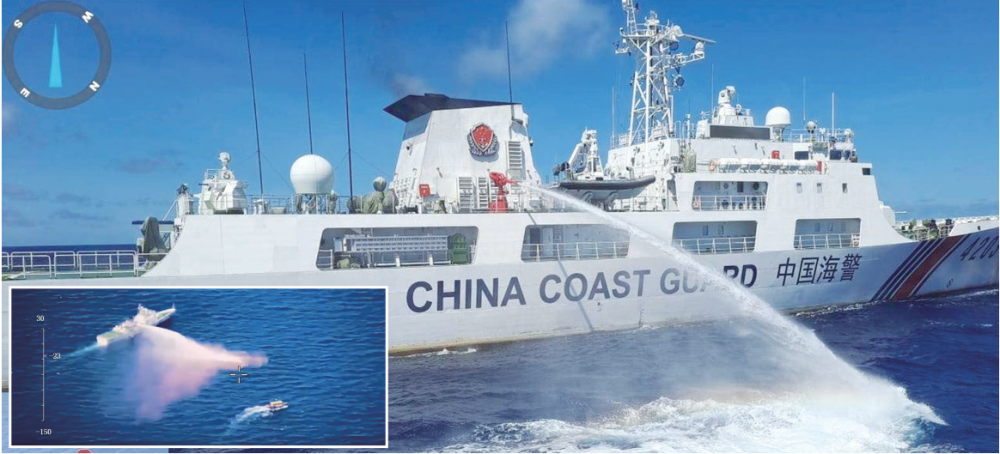

# 公布视频证据体现理性克制，大使出面呼吁启动商谈，中方正告菲方避免局势升级

【环球时报综合报道】中国海警8日发布视频证据，还原5日中国海警依法处置菲律宾非法进入仁爱礁临近海域船只。相关专家对《环球时报》记者表示，视频画面显示，中国在应对这起非法入侵事件时使用的是执法力量而非军舰，且在执法过程中，中国表现出相当的克制和专业。中国驻菲律宾大使黄溪连7日会见菲外交部官员时强调，采取炒作战术和引入第三方势力只会使事态更加复杂化，希望双方尽快启动商谈，共同维护有关海域和平与安宁。然而，在美西方的鼓动下，菲律宾仍然保持强硬态度，宣称将加强在仁爱礁附近的存在。有分析认为，美菲在南海挑动是非的做法，既反映菲方企图借助美方力量逼迫中方让步，并在南海问题上占便宜的“小算盘”，也体现了美方在南海一贯的霸权做法，美国从来没有放弃把南海问题作为落实印太战略和实施中美竞争的抓手。英国《卫报》称，中菲南海纠纷上升成为中美两大超级大国之间冲突的风险正在不断增加。有美国智库表示，美国不应仅仅“通过中美竞争的棱镜看待东南亚地区”，将其片面地视为美方的“地缘政治舞台”。

_8月5日，中国海警对非法进入我国仁爱礁邻近海域的菲律宾船只进行警示性水炮喷射，全程保持理性克制（新华视觉），左下角小图为中国海警公布的现场视频截图。_

**“中方一直有很明确的划线”**

中国海警8日公布的视频证据显示，5日9时40分许，中国海警5201舰对菲“尤娜扎·五月”2号游艇进行警示性水炮喷射，全程保持理性克制。《环球时报》记者注意到，在这段2分40秒长的视频中，中国海警船全程没有改变航向，是在菲律宾船只执意要冲闯仁爱礁附近海域的背景下，中方才发射水炮对其进行警示驱离。

经士智库创始人兼总裁、退役海军上校田士臣8日对《环球时报》记者表示，与菲律宾相比，中国国力相对较强，但中国从未恃强凌弱。他表示，中国在应对这起非法入侵事件时使用的是执法力量而非军舰，执法和使用军舰在冲突性质上完全是两码事。

中国驻菲律宾大使馆官方微信号8日发布消息称，中国驻菲律宾大使黄溪连7日会见菲外交部副部长拉扎罗时阐述了中方在仁爱礁问题上的一贯立场，介绍了近期仁爱礁事件原委。黄溪连强调，今年年初，两国元首就通过对话协商妥善处理分歧达成重要共识。希望菲方与中方相向而行，切实落实两国元首共识，停止一切单方面行动，避免局势升级甚至失控。采取炒作战术和引入第三方势力不仅于事无补，只会使事态更加复杂化。中方已多次向菲方建议就如何管控仁爱礁局势进行商谈，这充分体现中方管控仁爱礁局势的诚意。中方一直在等待菲方反馈，希望双方尽快启动商谈，共同维护有关海域和平与安宁。

1999年5月9日，菲律宾海军“马德雷山”号登陆舰声称船底漏水，在仁爱礁西北侧礁坪“坐滩”，并长期驻守7名士兵。据路透社报道，从2014年年底开始，菲海军利用渔船及其他小型船只，把水泥、钢铁、焊接设备等物资运到“马德雷山”号舰上，以加固船体。中方近年来多次要求菲方拖走该船，并且不得向非法“坐滩”军舰运送用于大规模维修加固的建筑物资。《卫报》8日援引国际智库危机集团中国问题高级分析师阿曼达·萧的话称，中方一直有很明确的划线，将菲方人道主义供给和建筑物资运输船只分得很清楚。从中方表态看，此次是批评菲方运输建筑物资。

**菲海警称“将加强存在”**

据菲律宾ABS-
CBN新闻网8日报道，菲海岸警卫队当天表示，在与中国船只发生新的紧张事件后，他们将加强在“爱尤银礁”（即仁爱礁）附近的存在。菲国家安全委员会助理总干事乔纳森·马拉亚同日表示：“菲律宾没有也永远不会签署任何协议，放弃对爱尤银礁的主权和管辖权。”马拉亚5日曾宣称，菲律宾计划在2023年年底前与美国在南海开展联合巡逻行动。

外媒注意到，菲律宾方面态度强硬，与美国及其盟友的“撑腰”有关。美国五角大楼发言人帕特里克·莱德7日强调“美方与菲律宾盟友站在一起”的立场。美国国务院日前宣称，对菲海警的武装攻击将触发《美菲共同防御条约》。另据菲律宾《马尼拉公报》8日报道，日本当天向菲律宾提供了11
亿日元（约合5500万元人民币）的赠款，用于菲海岸警卫队采购卫星数据通信系统，以“提高其海域意识和海上执法能力”。

中国国防部新闻发言人吴谦8日表示，美国不是南海问题的当事方，无权在这个问题上指手画脚。我们要求美方立即停止利用南海问题搬弄是非、挑拨离间，切实尊重中方在南海的领土主权和海洋权益，尊重地区国家为维护南海和平稳定所作的积极努力。中国军队将坚决履行职责使命，坚定维护国家主权和海洋权益。

中国现代国际关系研究院东南亚和大洋洲研究所副所长骆永昆8日对《环球时报》记者表示，菲律宾企图通过美国的支持和帮助维持其在南海所谓权利。但在南海问题上，菲律宾一方面依靠美国，维护自己利益；另一方面，菲律宾高官也表达了不允许美国在菲基地上部署进攻性武器的态度。看得出来，菲律宾自己也认识到过度依赖美国的危险。如果此次仁爱礁事件继续发酵或南海局势继续升温的话，将对地区国家带来冲击。很大程度上，菲律宾愿意维持同中国相对稳定的关系，因为如果中菲关系破裂的话，那么对菲律宾乃至整个地区的影响都是巨大的。

“美国之音”8日报道称，美菲自1951年签署共同防御条约，近年来多次宣称对菲律宾船只的武装袭击可能会令美国启动这一条约。美国战略与国际研究中心东南亚项目副研究员纳塔勒格瓦称，最近几个月美菲同盟的一个关键发展是，两国试图厘清何种情况下互防条约将生效，“当前的措辞是，如果在太平洋上发生对菲船只或船员的武装袭击，关键字是‘武装袭击’。然而，在使用水炮或激光设备的情况下，是否有资格触发这些事件存在一些模糊性”。

**美在东南亚论调“十分虚伪”**

作为一个非南海声索国和《联合国海洋法公约》非缔约国，美国近年来一直在南海挑拨事端，刻意渲染南海紧张局势制造“安全陷阱”。广西民族大学东盟研究中心研究员葛红亮8日对《环球时报》记者表示，在中美竞争的大背景之下，美国极力把中国宣传为南海地区的“强权国家”，把从上世纪六七十年代开始非法占领中国岛礁的一些东南亚国家视为“受害者”。这种叙事在国际舆论场上最容易获得流量，博得关注。事实上，在美西方的鼓动下，一些东南亚国家在南海地区扩充军备的态势鲜明，美西方推动南海地区的军事化，甚至核武化、北约化的态势也非常明显。美西方企图在南海对中国和东盟国家之间的关系形成更大的政治干扰。

美国亚洲协会8月初发布的最新报告表示，东南亚位于对全球贸易运输至关重要的地理咽喉要道，由于中国在当地影响力不断扩大，拜登政府十分担忧，并将维护“基于规则的国际秩序”视为其制定东南亚区域战略的关键因素。然而报告认为，美国不应仅仅“通过中美竞争的棱镜看待东南亚地区，”将其片面地视为美方的“地缘政治舞台”，而应该“依据其自身优势尊重该地区，成为更可靠、更良性的合作伙伴”。报告还提到，建议美国“淡化”有关“基于规则的国际秩序”的言论，因为东南亚民众认为此类言论“十分虚伪”，将其视为“西方国家强加给非西方国家的规则”。

【环球时报驻菲律宾特约记者 黄栋星 环球时报记者 郭媛丹 丁雅栀 环球时报特约记者 甄翔】

**相关报道：**

国防部发言人就仁爱礁有关问题答记者问：呼吁菲方立即停止一切挑衅

中国使馆就仁爱礁问题发声明：南海不是域外国家挑拨离间的“游猎园”

菲律宾就仁爱礁发声明，我外交部：中国海警操作专业、克制，无可非议

外交部发言人就美国国务院发表关于仁爱礁问题的声明答记者问

中国海警局：中方敦促菲律宾从仁爱礁拖走“坐滩”军舰

