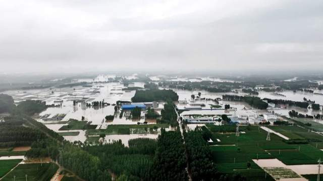
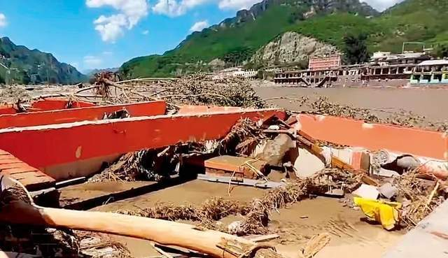
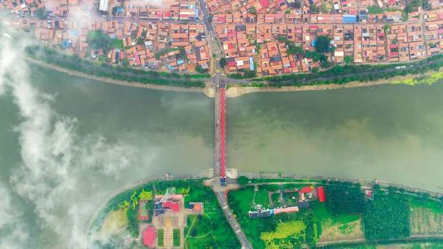
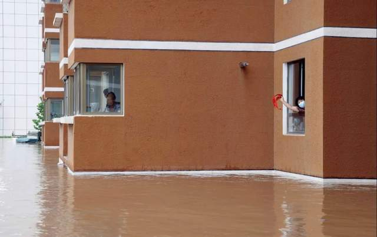
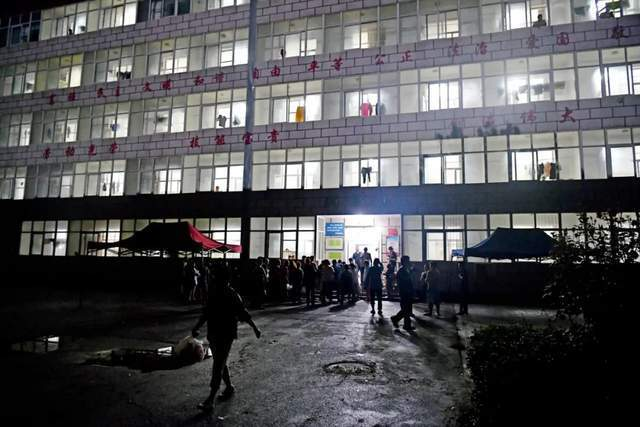
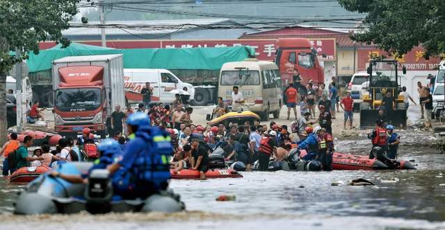
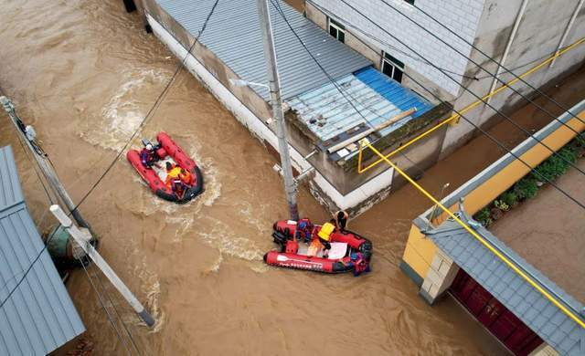

# 华北暴雨警示录：如何应对下一次洪水？

连续下了一天多雨后，7月30日上午10时，刘斌在微信群收到紧急通知，镇上要求野三坡景区的所有商户，当天必须让游客全部撤离。50多岁的刘斌，是河北省涞水县野三坡镇下庄村村民，经营着一家农家乐，他送走游客，赶紧把一楼的家电和贵重物品搬到二楼。

发源于河北涞源的拒马河流经野三坡景区，不少村民的家离河道只有一二十米远。2012年“7·21”北京特大暴雨后，拒马河出现1963年之后的最大洪峰，野三坡景区水路电讯全部中断，15000多名游客滞留景区。但“7·21”的洪水对刘斌影响不大，他的农家乐离拒马河约20米，房后是山坡，阳台和盖起的二层小楼总共接近10米高。那次拒马河涨了约5米，淹到他家时，水都没漫过阳台。

7月31日上午，刘斌把孩子送到百米外地势较高的学校，村里不少人临时转移至此。刘斌和妻子回到家，傍晚约6点，村里突然来了大水，不到1个小时，二楼就被淹了。刘斌看着家具都被冲走，想逃已来不及，穿着短裤和背心，和妻子匆忙爬到了屋顶，又借着一架高梯，越过房顶逃向山里。8月3日，河北保定市涞水县委宣传部发布通报称，野三坡景区全境受灾，波及15乡镇、284村，景区遭受毁灭性损毁。

 _8月1日，河北涿州市，刁窝镇塔照村附近被洪水淹没。摄影/本刊记者 翟羽佳_

7月29日以来，受台风“杜苏芮”和亚热带副高压的影响，华北、黄淮地区遭遇极端强降雨。8月3日，国家气象中心副主任张恒德在新闻发布会上评价，此次京津冀等地区域降雨过程极为罕见，强度超过华北历史上三次极端暴雨过程，分别是1996年“96·8”、2012年“7·21”和2016年7月18日至20日，北京降雨持续时间达83小时。

暴雨对海河流域的城市造成了一系列连锁极端灾害。上游的北京房山区、门头沟区等地山区暴发山洪，中下游的河北省涿州市等平原地区遭遇洪灾。8月5日，永定河廊坊段出现80米决口，下游的天津还在等待子牙新河的洪水入境。

中国工程院院士、国务院郑州“7·20”特大暴雨洪涝灾害调查专家组组长张建云曾在2022年一次分享中提到，受地形、气候影响，华北平原是暴雨洪涝的敏感区和多发区，未来极端天气将增多。多位专家称，此轮华北极端强降雨背后，暴露出北方城市应对极端天气仍缺乏经验。

**超出认知的暴雨和洪灾**

8月1日下午，涿州市东仙坡镇三步桥村的村民在网上发出求助，村里有100多人被困，洪水已经淹没住所的一楼。村民张亮向《中国新闻周刊》回忆，水是从7月31日晚上11点涨起来的，当天下午，村干部发出通知，要求村民抓紧转移至地势较高的镇中学。他和大部村民一样，只是将老人和小孩送到了安置点，自己留在家里观察雨情。

“说是要撤离，但在农村，谁家没有鸡鸭牛羊的，总得留个人在家，怕重要物件冲跑了”。张亮说。但他没想到，到了晚上，洪水突然漫进屋子，水位迅速抬高，他来不及跑，只能匆忙捞了两包方便面，爬到房顶。缺水、缺粮，手机没有信号。30多个小时后，张亮和其他村民才被一支民间救援队转运出来。

7月29日，针对此轮华北极端强降雨，中国气象局已作出预报，并启动重大气象灾害（暴雨）一级应急响应。但现实中，极端暴雨的强度以及带来的危害，几乎超出所有人的预料。

这轮强降雨中，北京降雨量的极值是744.8毫米，在昌平区的王家花园水库，遭遇北京地区140年来最大降雨。8月3日，新华社从河北省防汛抗旱指挥部办公室获悉，7月27日以来，河北全省降雨量7天的降雨折合成水量，达275亿立方米，相当于全省大中型水库总库容的2倍多，共转移约122万人，其中，蓄滞洪区转移85.72万人。

涿州地处保定北部，东临北京大兴区，北接房山区，是此次京津冀地区受洪灾最严重的地区之一。8月1日，河北省涿州市公安局在社交平台发布求救信息，称涿州全域停水，部分停电，需要大量船只转移群众。据涿州市官方消息，7月29日至8月1日上午，涿州全市平均降雨量为355.1毫米，146个村居、超过13万人受灾。

中国科学院地理科学与资源研究所研究员贾绍凤向《中国新闻周刊》介绍说，涿州受灾，部分由地形所致。涿州位于太行山、燕山的交界处，地形呈喇叭口状。此次强降雨过程中，东南气流在此盘踞，暴雨强度最大。同时，涿州位于冲积扇平原，这意味着，多条河流出了山口，“第一站”便是涿州。

7月下旬至8月上旬，本就是涿州暴雨洪水频发的时期。但近100年来，涿州只经历过几次大洪水。2022年，中国水利水电科学研究院发布《涿州文化产业综合项目A01地块建设工程洪水影响评价报告》（以下简称《评估报告》），其中提到，1963年8月2日~10日，涿州境内及西部山区连降大雨，各条河流洪水猛涨，涿州市被水围困，西面和北面淹没的深度约两米，“登城西望，一片汪洋，村庄难辨”，是最大的一次水灾。1996年8月，北拒马河发生1964年以来最大洪水，38个村受淹。再就是2012年“7·21”特大暴雨后，7月22日，上游来水从北拒马河行洪，造成4.8亿元的直接经济损失。

 _（视频截图）河北保定市涞水县野三坡景区遭遇洪水。_

一位熟悉涿州水利的人士向《中国新闻周刊》提到，北京房山的镇江营村临近涿州，位于北拒马河上游，村里有一座年代久远的铁索吊桥横跨北拒马河，曾经历过1986年、1996年、1998年、2012年的洪水，吊桥岿然不动。但8月1日早上，洪水过境，当地人发现，这座桥已不见踪影。“涿州市多年没发过大洪水，大家对洪灾的意识是缺乏的，都心存侥幸。”上述熟悉涿州水利的人士说。

多位救援人员向《中国新闻周刊》介绍，此次救援的挑战也远高于“7·21”和郑州“7·20”特大暴雨时期。8月2日上午，中国皮划艇协会新兴项目委员会主任金绍辉告诉《中国新闻周刊》，前一天凌晨，他们一行人带着皮划艇抵达涿州。“很多道路不通，我们只能哪条路通，就往哪儿走。”金绍辉说。此外，洪水进入平原，行洪速度放缓。水下很多杂物，铁片、树枝，甚至电线等障碍，随时可能阻拦、破坏船艇。部分救援队只能先清理障碍，再想办法救援。

8月2日，此轮京津冀降雨已陆续结束。河北省水利厅副厅长李娜在接受央视采访时提到，由于河道水位回落是有一个过程的，据预测，后期涿州还有3亿~4亿立方米的水要过境。

中国水利水电科学研究院副总工程师程晓陶8月3日对《中国新闻周刊》解释说，连续性强降雨后，许多水仍留在山区土壤里，是一个逐步释放的过程，目前流量减小，还会持续性向下游汇聚，但洪峰已经过去，不会给下游造成像前几天那样的压力。

未来几天，随着海河流域洪水过程演进，天津将面临行洪压力。天津市是海河流域五大河系的入海口，大清河、永定河、子牙新河、蓟运河的洪水都会涌向天津。据报道，8月6日，天津市水文水资源管理中心发布大清河洪水红色预警，河道将超过保证水位。8月8日左右，上游的洪水预计将进入天津滨海新区子牙新河。

海委水旱灾害防御处处长杨志刚日前接受采访时提到，北方堤防长期未经过大洪水检验，尤其是长时间受洪水浸泡的地方，可能会发生坍塌或灌涌等险情。各地防汛部门一定要加强巡查防守，及时消除隐患，切实保障行洪安全。

**涿州的水从哪里来？**

上述熟悉涿州水利的人士介绍，涿州市有两大水系，一是海河流域永定河水系，流经涿州东北角，对涿州市影响不大；另一个是海河流域的大清河水系，其中的小清河、大石河（又称琉璃河）、北拒马河三条主要河流呈扇状结构在涿州市东北部汇成一条河流，被称作白沟河，同样也属于大清河水系。白沟河一路向南，流出约十公里，成为廊坊和保定市的界河。

北拒马河是涿州市最主要的行洪河道之一。拒马河从太行山麓流出后，在河北涞水县分为南北两支。其中，北拒马河东流至北京市房山区，在镇江营村入涿州，又分为北、中、南三个河道。据公开资料，北拒马河在涿州的河道弯曲，漫滩行洪，河道摆动不定，形成了大片洼套，历史上又称“千河套”。套，即河流拐弯的地方，地势较低。当地许多地方以“套”命名，比如刁窝套，其所在区域，便是小清河、大石河、北拒马河的汇聚地，也是小清河分洪区洪水的必经之路，此次洪灾极为严重。大石河发源于北京市房山区的百花山南麓，源短流急，河水出了山便进入涿州。小清河发源于北京市门头沟的九龙山，过房山后，进入涿州。

程晓陶向《中国新闻周刊》表示，这轮暴雨中，北拒马河和大石河洪峰流量非常极端，它们在涿州交汇，造成了严重洪灾。水文监测显示，此次降雨过程中，北拒马河的洪峰流量高达6200立方米/秒，2012年“7·21”特大暴雨时，这一数字是2570立方米/秒。大石河上游的水文监测点被山洪冲毁，最后监测的洪峰流量已达3300立方米/秒，远高于“7·21”时1280立方米/秒的洪峰流量。

8月1日，新华社从河北防汛抗旱指挥部获悉，7月31日起，河北先后启用7个蓄滞洪区，包括大陆泽、宁晋泊、小清河分洪区，兰沟洼、东淀、献县泛洪区，永定河泛区，以减轻京津防洪压力。其中，涿州境内包含了小清河分洪区与兰沟洼蓄滞洪区。《评估报告》介绍，小清河分洪区有两大功能，分泄滞蓄当地四条河流的洪涝水，以及承接永定河100年一遇洪水时的分洪水量，是永定河防洪体系的重要组成部分。

程晓陶解释说，根据《永定河防御洪水方案》，只有当永定河卢沟桥发生流量超过6200立方米/秒的洪水时，超标洪水才能通过小清河分洪闸入大宁水库。过去几天，永定河卢沟桥拦河闸的最大洪峰为4649立方米/秒，不满足启动小清河分洪闸的标准。也就是说，涿州市开启蓄滞洪区，并不是为了承接永定河的来水，而是缓解北拒马河、大石河等本河系河流的来水压力。上述涿州市水利系统人士也向《中国新闻周刊》解释，永定河此次对涿州受灾的影响很小。

水利部海河水利委员会国际合作与科技处处长张存龙对《中国新闻周刊》介绍说，此轮暴雨给防洪调度带来的难度，比1963年还要大。1963年8月的连续暴雨的中心区靠近河流的下游，但这次的中心区都在山区，雨水产流、汇流很快，下游来水也更加凶猛。

_8月5日，天津市独流减河进洪闸水文站工作人员，根据实际水位情况实时调控闸门开启程度，保障上游来水平稳进入独流减河。图/IC_

2012年“7·21”特大暴雨发生后，河北省保定市涞水、涞源成为洪灾的重灾区，涞水县野三坡景区遭受自1986年开放以来最致命的重创。据2012年媒体报道，河北省防汛抗旱指挥部办公室在相关新闻发布会上表示，野三坡景区上游的拒马河干流无水库等拦蓄工程，导致洪水迅猛，河道难以消化如此大的降水，但水库修建须由国家统一规划，种种原因致使当地修建水库搁浅。

7月31日8时，涿州市防汛抗旱指挥部发布紧急通知称，北拒马河防洪进入紧急状态，河道两侧的洼套，因地势低洼，出现缓洪、滞洪，将启用小清河分洪区。

多位了解涿州市水利的受访者均指出，北拒马河上游没有水利工程，是导致涿州市多处被淹的一个重要原因。程晓陶提到，北拒马河上游没有水库拦蓄洪水，导致几条河流的洪峰集中在涿州市交汇，使河道难以承受。“河道行洪能力是有限的，大石河源短流急，如果北拒马河上游有水库拦截，让大石河的洪峰先过去，再把下一个洪峰放过来，就像汽车排队上高速一样，一天可以走很多车。但如今连高架的车也挤过来，就会造成交通堵塞。”程晓陶对《中国新闻周刊》说。

涿州市水利局多位工程师在2010年发表的论文《涿州市防洪体系与抗洪经验探析》中提到，因北拒马河无堤防，往往出现“大水大淹、小水小淹”的局面，加之永定河向小清河分洪形成的小清河和兰沟洼蓄滞洪区，地势低洼，极易造成全市洪水泛滥。

程晓陶介绍说，拒马河在规划上原本是要建水库的，但因跨京冀两地，修建水利工程考验着多部门的协调决策。

2004年，河北水利厅在接受《新京报》采访时提到，在严重缺水的华北地区，拒马河是常年有水的河流。北京曾想在房山区张坊镇修建水库，但河北不同意，核心在于水权的分配和补偿机制尚未建立。彼时，房山区有一则引水工程招标公告，拟将流经北京境内的拒马河水拦蓄后，引入燕山石化，作为工业用水，遭到河北反对，认为这将造成下游断流。

但随着极端天气增加，拒马河没有水库导致的风险在凸显。此轮强降雨中，野三坡景区及其周边村镇再次遭洪水重创。据央视报道，山洪将进入野三坡百里峡景区的路面冲毁，大部分桥梁被冲毁，通讯和电力中断。从路旁房屋的印记来看，山洪超过一人多高。

“处在拒马河下游的县市，近些年日益缺水，我们其实不希望上游修水库。”上述熟悉涿州市水利的人士坦言，这种心理十分矛盾。一方面，发生这么大的洪水后，当地需要水库来调蓄洪峰；但另一方面，不能为了防洪，使农业、工业生产受到威胁，“不是简单非黑即白的事情，需要多学科多领域论证”。不过，程晓陶认为，时隔多年后，此次河北受灾是一个契机，以审视是否需要建水库。

_8月2日，河北涿州市，一些民众被困在小区建筑内。图/澎湃影像_

**待补的防洪工程短板**

水库、河道、堤防、蓄滞洪区，是江河防洪工程体系的组成部分。当洪水来袭，先利用河道与堤防泄洪，运用水库拦蓄洪水，当洪水超过一定标准，再适时启用蓄滞洪区。

7月31日起，根据北拒马河、琉璃河、白沟河的水情，涿州境内的小清河分洪区、兰沟洼蓄滞洪区先后开启。

据上述熟悉涿州水利人士的提到，涿州范围内的蓄滞洪区，过去20多年内都没开启过。《评估报告》提到，新中国成立后，小清河分洪区在1959年、1963年经历两次较大的洪水，最近一次开启，是为了应对1996年洪灾。中国水力发电工程学会副秘书长张博庭向媒体指出，北方城市蓄滞洪区启用不频繁，这使得公众乃至有些地方干部可能都不知道，所在区域属于蓄滞洪区。

专家指出，近些年来，一些北方城市放松警惕，蓄滞洪区无序建设，住在行洪河道、堤坝附近的人，也缺乏防洪意识，比如在盖房时，可能会从土坝上取土，削弱堤坝的防洪能力。此次暴雨带来的教训是，地方要重视蓄滞洪区管理，建好安全区，防洪堤坝要达标。

白沟河是拒马河流域的主要行洪河道，设计标准为20年一遇。但《评估报告》提到，根据《白沟河治理工程（涿州段）初步设计报告》，白沟河右堤现状不能达到防御设计要求，各段堤防堤身单薄、超高不足，建设年代较早，建设时填筑压实要求较低，无法满足一级堤防要求。

公开资料显示，小清河、大石河等在河北境内的河道治理、堤防、安全区建设均未实施，河道防洪标准不足5年一遇。涿州城西的北拒马河南支右堤，基本无正式堤防，如果遇到50年一遇及以上洪水时，部分重要堤防无法有效挡水，涿州部分城区及其东部大部分区域将被洪水淹没。

程晓陶提到，根据城市级别、流域重要性等因素，国家对不同的江河有专业的防洪设计标准，地方不能随意提升。理论上，一个城市在规划时，重要的基础设施、居民区、工厂应尽可能避开易涝的高风险区。但在国内，土地资源紧张，“人和水争地不可避免”，导致一旦受淹，损失严重。

他同时强调，近期华北地区的极端强降雨是小概率事件，为此通过修建过高标准的工程来消除风险，从经济上考量是不合算的，投入高，还要有专业的队伍维护。无论从理论还是实践上，这类高风险区都无法建设非常高标准的防洪工程。

此外，多位熟悉涿州水利的受访者表示，北拒马河、大石河属于中小河流，防洪体系建设以地方投资为主，地方政府想要提升行洪标准，财力也是制约因素。不仅是涿州，因水利设施建设投资高，但难以给地方经济发展带来短期回报，导致不少地方政府对防洪的重要性认识不足。

2021年7月起，海河流域遭遇持续强降雨，漳卫河发生历史罕见夏秋连汛。2022年，水利部海河水利委员会规划计划处处长袁军等人在论文《完善海河流域防洪工程体系的思考——漳卫河“21·7”洪水防御启示》中提到，海河流域骨干堤防达标率仅为65％，河道治理地区差异较大，泄流能力上下游不协调。部分控制性水库带病运行，
洪水调蓄能力不足。此外，河道管理薄弱，因多年未行洪，河道及滩地碍洪设施影响行洪。“21·7”洪水期间，卫河、共渠、卫运河等骨干行洪河道因此出现不同程度的阻水现象，增加了上游河道的防洪压力。

该文章提到，流域内有28处蓄滞洪区，半数以上没有建设进退洪控制设施、口门等工程，靠临时扒口分洪，分洪水量、淹没范围、退洪时机等难以控制，一旦发生流域性大洪水，蓄滞洪区难以启用或无法正常运用。此外，海河流域对于防洪的预防、预警、预演、预案能力薄弱，无法支撑有洪水的防御实战。

如何完善流域防洪工程体系？袁军等人建议，要强化流域统一规划和管理，在治理上，加强重要河道和主要支流防洪达标提升，完成现有124座病险水库除险加固，完善蓄滞洪区的安全建设和通讯预警设施建设等。

**将预警转化为行动**

在工程调控能力有限的情况下，应对极端天气，多位专家指出，社会要增强辨别风险、应急抢险、应急处置能力。其中，及时的预警和有效快速转移是关键。

涿州洪灾中，不少蓄滞洪区的村民被洪水围困，等待救援。据《北京青年报》8月2日报道，7月31日上午开始，北拒马河上游大马村村民便接到通知，洪水会在傍晚18时到达，要求所有村民全部撤离。在相对下游的村子，到17时左右，村干部才开始在微信群发消息，通知转移。更下游位置的沙窝村村民表示，村里通知泄洪的时间是在晚上八九点，没有强制撤离，没有指定安置点，更没有给村民留出充足的转移时间。

此外，有媒体报道，8月1日，保定市白沟新城附近的居民接到紧急通知要求撤离，却排着长队拥堵在出城的高速路收费站口。

_8月1日晚，河北涿州市，职业技术教育中心安置点安置有1700余人。摄影/本刊记者 翟羽佳_

“这说明两个问题：一是在应对极端天气的应急管理上，不同部门间的联动不足；二是目前的应急预案还不够细化，尤其是交通部门没有考虑在紧急撤离的情况下如何减少关卡，提高道路通行能力等现实问题。”北京师范大学国家安全与应急管理学院教授、国家减灾委专家委委员杨赛霓向《中国新闻周刊》分析。她同时强调，面对极端天气致灾的复杂性，任何预案都不可能覆盖一个极端事件中的所有可能场景。在应急处置中，另一个原则也同样重要：给予现场决策一些冗余度，建立容错机制。

在程晓陶看来，面对极端灾害，应急指挥体系内部，气象、水文、水利等各个系统要及时有效沟通。比如，降雨量多大、各条河流的流量是多少等，应急指挥部门整合信息后，要迅速将灾害的严重程度通知给社会。

不过，张存龙提到，与长江流域和黄河流域的水系不同，海河流域的河流大多源短流急，从水源到下游距离短，这对极端天气的预警机制提出极高要求——要准确，还要有预见性，能提前告知下游地区的风险。但洪水来得太快，预见期短，可能会出现通知不及时的情况。

国家气候中心主任巢清尘向《中国新闻周刊》指出，要实现更精准的天气预报，需要资金和很强的技术能力，而且要精确到较小区域尺度，“目前还做不到这么精细化”。北方城市发生这种极端暴雨的频次较低，对于其形成规律，也缺乏相关历史数据的积累。同时，多位专家还提醒，预警也不能过度发布，最近几年由于频频发生一些突破“历史经验”的极端天气事件，一些地区的气象部门担心事后追责，日常发布预警的频次过高。这会给地方政府和公众造成“狼来了”的感觉，不利于真正发生灾害时的动员。

“其实这次华北暴雨的预报做得很好，北京从7月29日就对全社会发布暴雨红色预警，最后从实况来看，无论是降雨时间、量级，还是雨会落到什么地区，都和预报吻合得非常好。”巢清尘分析说，但很多人一开始觉得雨不会下那么大，或认为即使下雨也不至于引发洪水，导致受灾。

_8月3日，河北涿州市，北二环路排队等候救援队转运的民众。图/视觉中国_

“预报预警的准确很重要，但更关键的是，预警是否能真正转化成人们的行动。”杨赛霓对《中国新闻周刊》说。一方面，预警要尽可能提前发布，给撤离的人们留出更多反应时间；另一方面，预警不能只限于气象信息，比如某地平均日降水量超过了300毫米，老百姓不知道这到底意味着什么。“预警如果能告诉人们水大概会淹到多高，住在这个地区的人立刻就有概念了”。

人们以往对极端天气的“常识性”理解正在不断被打破。因此，杨赛霓建议，面对极端天气，发布的预警本身也不能再限于单纯气象因子强度的预警，而应该是“基于承灾对象”的预警。比如，对当地交通、通讯和电力设施影响几何？对具体某个地区的哪些人群有多大影响？农田受损情况如何？人们只有知道这些信息，才有更多预先行动的依据，做更充分且适当的准备。

程晓陶分析说，涿州如果在通知蓄滞洪区民众转移时，告诉大家，北拒马河上游洪峰流量达到6000多毫米/秒，是“7·21”的两倍多，可能大家的警觉性会不一样。此外，他补充，日本在向公众发布灾害预警时，还会制作避难转移图，细致到告诉人们，如果当地被淹，该去哪个避难所，一些路会被淹，走哪条路更安全。这些都需要提前规划，甚至在日常公布给大众去学习，但国内在这一点上目前还没有这么精细。

杨赛霓认为，当面临极端暴雨洪水时，与城市相比，大量分散性的山区农村地区更难迅速组织起力量，进行应急处置。一方面，因为农村人口相对不集中，且缺乏资源；另一方面，很多山区农村的人口结构以老人、小孩为主，处置和救助难度大。在她看来，山区和城市不同，从应急管理角度，必须一地一策，制定差异化的策略。对山区而言，及时的提前撤离才能把受灾损失降到最小。

本次洪灾中，在很多山区，突出的一个问题是撤离、转移安置过程的处置混乱。“是否有合适的转移安置点，有没有提前对安置点做好资源评估、及时维护，这些涉及到资金和资源，需要预先做好储备。”杨赛霓说。她强调，对资源不足的山区而言，如何更好用好社会力量也很重要。面对极端天气引发的大灾，关键时刻，基层应急的跨地区帮扶能否有效启动？

8月1日起，公羊、蓝天等多支救援队收到涿州市政府的请求支援函。但当天，有报道称，多个民间救援队因没有邀请函，无法即刻前往灾区，引发争议。此外，外地救援人员因不熟悉地形及水域情况，再加上通讯中断，无法与被困人员取得联系。相关专家认为，这背后的核心问题，仍在于地方应急管理体系的机动性不够，应急方案不够细致。例如，现场受灾数据如何统计收集，社会救援力量由谁调度，流程如何机动调整等，都需要提前设置和演习，这是应急指挥体系中非常重要的一环。

前述熟悉涿州水利的人士复盘此次洪灾后建议，在蓄滞洪区的村庄中，未来政府至少可以放置一些逃生器材。“政府可以买一些玻璃钢船等，不用太贵重，平时由各村委会维护，当一些人被洪水围困时，当地人可以把更多受困者更快地救出来。”

据报道，2022年7月19日，涿州市防汛抗旱指挥部曾开展防汛应急救援演练，应急管理局、水利局、气象局、公安局等多部门参与。演练设定了全市普降大到暴雨，气象台发布暴雨红色预警信号，拒马河水位持续上涨，拒马河堤防随时可能出现险情的情境，让各部门模拟从信息报送、应急预判、预警和群众转移等关键流程。当地称，各部门密切配合，演练在规定时间完成，“演练达到预期效果”。

程晓陶提到，目前国内应对洪水的演练水平较低，预案的可操作性、针对性不足，不同部门要求不同，演练效果也不一样，距离真正的实战还有差距。

**城市如何提升韧性？**

如果将时间尺度进一步拉长来看，本次华北创纪录暴雨一定不会是最后一次。

巢清尘现任国际全球气候观测系统研究组联合主席，她对《中国新闻周刊》说，气象数据的长期监测显示，本世纪以来，全国总体的极端降雨的频次、强度都在不断增加，尤其是一些暴雨级别的降水，近年来有北扩的趋势。“而且这次华北暴雨，不仅和副高北抬有关，还与‘杜苏芮’台风的北上关系密切。最近几年我们发现，在全球气候变化大背景下，台风北上的趋势比以往更明显，这进一步加剧了北方城市遭遇暴雨的概率。”她解释说。

缺乏应对暴雨洪灾经验的北方城市，如何在下一次洪水到来时避免陷入瘫痪？

无论国内外，韧性城市被认为是应对极端天气风险的必然选择。为应对极端天气，北京、上海、深圳、南京等地都将韧性城市建设列入政府工作报告或纳入城市总体规划。此外，韧性城市建设也被写入“十四五”规划和2035年远景目标纲要。

本次华北暴雨中，基础设施在面对极端天气时的脆弱性暴露无遗。电力、供水、交通、通讯，这些都是一个城市和村庄的生命线系统，一旦这些系统因灾瘫痪，居民生活将陷入极大困境。此轮暴雨中，北京市自来水集团门头沟城子水厂的挡水墙被冲垮，配水机房进水，全厂停水，影响了门头沟区约15万户正常供水。北京西南部山区内的道路由于大多被山洪以及随之而来的泥石流和塌方冲垮，铁轨悬空。门头沟雁翅镇的几十位村民沿着清末的老铁轨，在步行几十公里后方走出大山。涿州市全域一度断水断电，沦为“孤岛”。

_8月3日，河北涿州市，蓝天救援队队员在刁窝镇东冯村转移村民。摄影/本刊记者 翟羽佳_

相较南方地区，很多北方城市的基础设施在应对这种极端暴雨及其引发的内涝、洪水等方面更加薄弱。前述熟悉涿州市水利的人士曾去江淮地区一些城市调研，他注意到，当地会将通讯塔下的机房、供电的变压器等设置在距地面一定高度，但华北地区很少有地方这么做。

专家分析说，一方面，是因为北方少雨，电力设施在选址时参照的技术指标对于防洪考虑得并不充分；另一方面，也是出于成本考虑，离主干道路越近、地势越低，建造成本越低，但洪水到来时也就更容易被淹。与电力设施不同，通讯塔一般建立在具有一定高度的山坡上，如果暴雨之后出现滑坡和山体崩塌，通讯设施比电力设施更脆弱。从防灾角度考虑，应尽可能沿山坡多建几座塔站，留出一定冗余。

在交通方面，研究基础设施风险评估与应急管理的杨赛霓提到，一座十年前设计的桥梁满足“50年一遇”的设防水平，是基于当时的历史数据测算得出的标准。如果加入最近几年的数据后，可能十年前的“50年一遇”只相当于现在的“20年一遇”。

为了提高城市基础设施对极端天气的适应性，杨赛霓建议，当下迫切需要去重新评估气候变化带来的极端暴雨场景下，部分高风险区基础设施可能面临的冲击，现有的设防水平是否需要升级和更新。“首先要做的工作就是大范围的核查，看看已有设施设防标准的缺口有多大，这涉及到巨大的工作量，技术强度也很大，但这件事现在必须去做。”

在杨赛霓看来，基础设施的气候适应性改造，核心难点还是那个老话题：钱。世界资源研究所联合国家应对气候变化战略研究和国际合作中心等机构在2021年发布的《加速气候韧性基础设施建设》报告中指出，当前中国气候韧性基建面临严重的资金供需不匹配问题，未来五年内年均需要弥补近5000亿元的资金缺口。

杨赛霓认为，当下不可能把所有标准不够的基础设施都推倒重来。因此，在更新时，需要基于气候风险评估，做一个优先级排序，优先投资一些设防标准差距大，同时极端天气风险最高的区域，而且这种评估必须要面向未来。

近些年，国内也在要求基建项目要做气候可行性论证，尤其是一些涉及到城市安全的重大规划和重点工程。但巢清尘指出，目前的论证更多围绕着历史观测数据，没有考虑到对未来极端天气的预测情况。此外，多部门间系统性联动还不够，很多时候只停留在文件上。“一般都是部分城市遇到这种极端天气灾害之后，会强化这方面的意识，然后零星做一些基于灾害风险的评估工作，但过几年后，因为一直没有发生较大的灾害，又懈怠了。”

对于韧性城市建设，地方是选择短期经济发展，还是长期适应气候变化，需要决策者进行复杂的权衡。杨赛霓提到，韧性城市是个复杂的系统性工程，成本很高，每个城市应根据自身的经济能力和发展特点进行建设。

程晓陶认为，提高城市的韧性，不只与地方政府有关，每一个承灾体也要有更强的危险感知和应急处理能力。“韧性主要是对承灾体来说的。”
程晓陶强调。他认为，如果承灾体自己有更强的应急处置、风险辨识的能力，知道灾害什么时间会来、危险有多大、能提前采取哪些相应的规避措施，就可以有效减少损失。“每个人、每个系统都要去思考这个问题，因为每个承灾体都不一样。”

在杨赛霓的理解中，韧性城市的内涵包括四个层面：一是“顶得住”，基础设施的抗冲击能力强；二是“能减轻”，一旦遇到罕见的极端天气事件，能通过较细化的应急预案和高效有序的备灾和应急响应体系等方式，及时撤离、转移和安置民众，尽可能减轻灾害带来的后果；三是“快速恢复”，即使电力、通讯等基础设施受损，也能有很好的抢修能力，应急电力、通讯设备充足，生命线系统恢复速度快。

最后是“自我适应”，也是韧性城市最重要的内核。杨赛霓指出，现在每个城市都要对历次极端天气事件进行复盘和反思，“不仅是国内的案例，还有国外的案例”，总结经验和教训，不断去自我适应和改进。

“至少对涿州而言，这次洪水过后，应该对整个城市做一次与气候适应相关的全面体检，结合未来的趋势预测，看看还有哪些防洪设施、基础设施达不到标准，如何更好地重建。”巢清尘建议。

（文中刘斌、张亮为化名）

记者：杨智杰 霍思伊 王春晓

