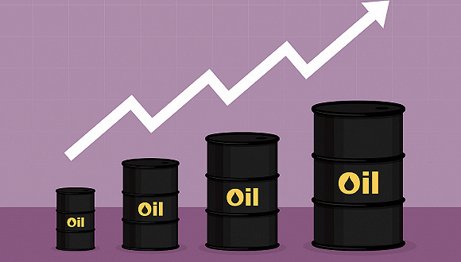

# 国内成品油价四连涨，加一箱油多花约9.5元

界面新闻实习记者 | 罗容

成品油价再次出现上涨，下一轮调价仍存在较大上涨概率。

8月9日，国家发改委发布消息称，自24时起，国内汽油价格和柴油价格分别上调240元/吨和230元/吨。折合升价，92号汽油上调0.19元，95号汽油和0号柴油均上调0.2元。

本次成品油价调整后，大部分地区的92号汽油重回“8元时代”。以油箱容量为50升的小型私家车计算，车主们加满一箱油将多花9.5元左右；对满载50吨的大型物流运输车辆而言，平均每行驶一百公里，燃油费用增加8元左右。

本次调价是今年第十六次成品油调价，也是年内第八次上调。此次调价过后，今年成品油调价呈现“八涨六跌两搁浅”的格局。

本轮计价周期内，原油变化率持续正向波动。

卓创资讯成品油分析师仇晓向界面新闻表示，本轮计价周期以来，受沙特等国自愿延长减产等因素影响，供应偏紧张，市场整体涨价情绪浓厚。

“在原油位于高点稍事喘息情况下，WTI原油仍占据82.92美元/桶高位，原油变化率在正值范围内震荡上调。”仇晓称。

隆众资讯成品油分析师刘炳娟指出，沙特能源部表示，将把7月开始实施的每日100万桶的自愿减产协议再延长一个月，且9月之后减产措施可能还会延长或深化；俄罗斯承诺将在9月继续自愿减少原油供应，原油出口将减少30万桶/日。

金联创成品油高级分析师王延婷称，另外，市场整体需求向好，中国石油需求增长存乐观预期；北半球夏季需求旺季期间，欧美能源需求向好均对油价起到支撑作用。

金联创成品油高级分析师张永浩提到，中国7月原油进口环比锐减20.8%，一度拖累油价盘中宽幅下跌，不过沙特重申限产承诺重振市场信心，EIA大幅调高油价预期也施加利好。

截至北京时间8月8日凌晨收盘，WTI 9月原油期货报82.92美元/桶，涨1.2%；布伦特10月原油期货报86.17美元/桶，涨0.97%。

据金联创测算，截至8月9日第十个工作日，参考原油品种均价为82.47美元/桶，变化率为5.03%。

_图片来源：隆众资讯_

成品油价经历四连涨后，下一轮调价的上涨概率仍然较大。

王延婷称，短期内，国际原油依然维持高位，新一轮变化率延续正向波动，上调预期对后期行情尚有支撑。

隆众资讯指出，目前来看，OPEC+产油国的减产氛围仍在，美国夏季出行高峰尚未结束，基本面利好支撑延续，预计下一轮成品油调价上调的概率较大。

仇晓也表示，沙特自愿减产时间的延长，不仅为油市提供了较强的底部支撑，同时也给市场注入了更多的信心，特别是底线油价的进一步走高，更是令市场偏向看涨。

按照当前成品油调价周期测算，下一次调价窗口将在8月23日24时开启。

