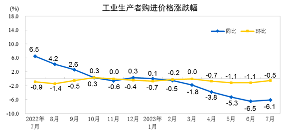
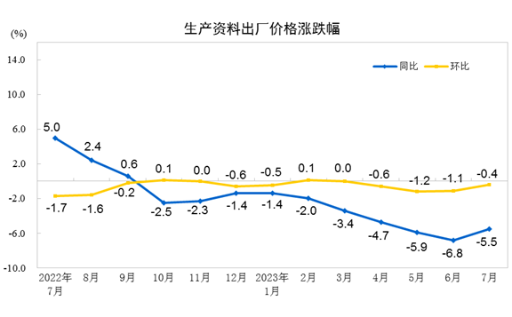
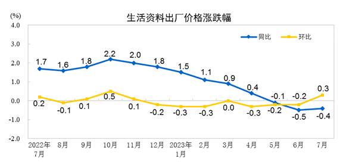

# 国家统计局：7月PPI同比下降4.4% 环比下降0.2%

2023年7月份，全国工业生产者出厂价格同比下降4.4%，环比下降0.2%；工业生产者购进价格同比下降6.1%，环比下降0.5%。1—7月平均，工业生产者出厂价格比上年同期下降3.2%，工业生产者购进价格下降3.5%。

**一、7月份工业生产者价格同比变动情况**

工业生产者出厂价格中，生产资料价格下降5.5%，影响工业生产者出厂价格总水平下降约4.25个百分点。其中，采掘工业价格下降14.7%，原材料工业价格下降7.6%，加工工业价格下降3.8%。生活资料价格下降0.4%，影响工业生产者出厂价格总水平下降约0.11个百分点。其中，食品价格下降0.9%，衣着价格上涨1.5%，一般日用品价格上涨0.8%，耐用消费品价格下降1.5%。

工业生产者购进价格中，化工原料类价格下降13.3%，燃料动力类价格下降12.2%，黑色金属材料类价格下降8.1%，建筑材料及非金属类、农副产品类价格均下降5.6%，有色金属材料及电线类价格下降0.1%。

**二、7月份工业生产者价格环比变动情况**

工业生产者出厂价格中，生产资料价格下降0.4%，影响工业生产者出厂价格总水平下降约0.27个百分点。其中，采掘工业价格下降0.1%，原材料工业和加工工业价格均下降0.4%。生活资料价格上涨0.3%，影响工业生产者出厂价格总水平上涨约0.07个百分点。其中，食品价格上涨0.3%，衣着价格上涨0.6%，一般日用品和耐用消费品价格均上涨0.2%。

工业生产者购进价格中，建筑材料及非金属类价格下降1.9%，化工原料类价格下降1.5%，燃料动力类价格下降1.4%，黑色金属材料类价格下降0.3%，农副产品类价格下降0.1%；有色金属材料及电线类价格上涨0.3%。

**附注**

1.指标解释

工业生产者价格指数包括工业生产者出厂价格指数（Producer Price Index for Industrial Products，
简称PPI）和工业生产者购进价格指数。

工业生产者出厂价格指数反映工业企业产品第一次出售时的出厂价格的变化趋势和变动幅度。

工业生产者购进价格指数反映工业企业作为中间投入产品的购进价格的变化趋势和变动幅度。

2.统计范围

工业生产者出厂价格统计调查涵盖40个工业行业大类、1300多个基本分类的工业产品价格；工业生产者购进价格统计调查涵盖9大类、800多个基本分类的工业产品价格。

3.调查方法

工业生产者价格调查采取重点调查与典型调查相结合的调查方法，涉及全国4万多家工业企业。

4.统计标准

工业行业划分标准的依据是《国民经济行业分类》（GB/T4754-2017）。

5.数据说明

由于“四舍五入”原因，有时会出现合计数据与分类数据高值或低值相同的情况。部分分类或行业价格变动幅度较小，按“四舍五入”保留1位小数后涨跌幅为，在表述价格变动情况时视为持平。

