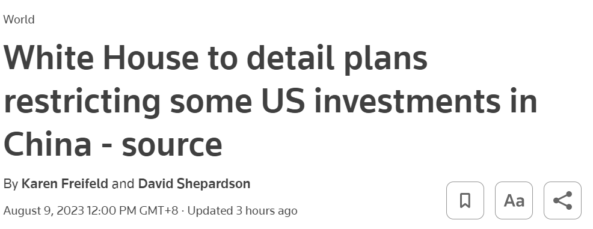
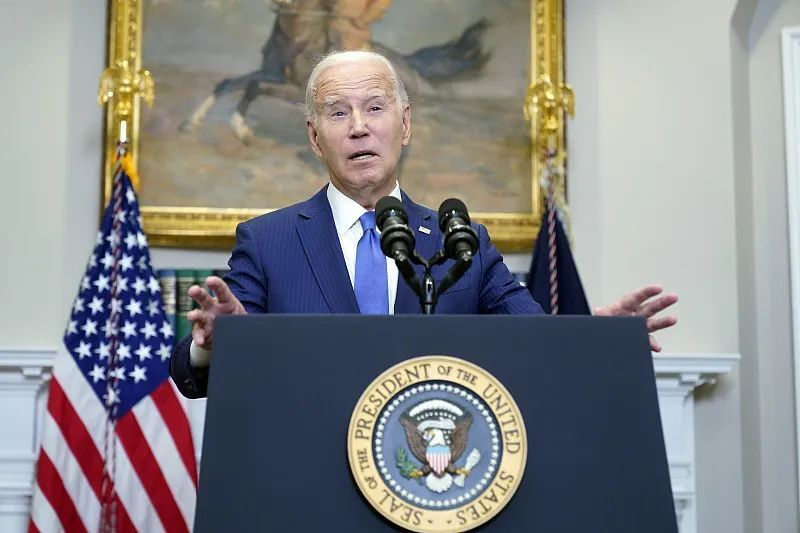

# 白宫将发涉华禁限令，美官员称“不想限制过宽，否则会损害工人利益”

既妄图遏制中国尖端产业发展，又不愿得罪美国投资人……

综合外媒报道，美国一位高级政府消息人士8日透露，白宫将在当地时间9日公布禁止美企在华某些先进行业投资敏感技术的细节。

报道称，这项行政命令已经酝酿了一年多，是拜登政府限制“中国获得美国技术和资金”的又一举措。美方此前声称，此举是“保护国家安全”的必要之举。

_报道截图_

据悉，此举是美国在与中国的经济竞争中采取的首批重要措施之一，将禁止私募股权和风险投资公司对某些高科技领域进行投资，例如量子计算、人工智能和先进半导体等，旨在“阻止美国资本和专业知识帮助开发可能支持中国军事现代化并威胁美国国家安全”的技术，并遏制资金外流。

消息人士称，该命令涉及的大多数投资都需要通知政府，某些交易将被禁止。

美国消费者新闻与商业频道（CNBC）称，拜登的行政令预计不会立即生效，在最终敲定之前会考虑行业反馈。

美国政府官员强调，对投资的直接限制只针对于“有可能威胁美国国家安全”的行业，不会干扰两国间的合法商业往来。

美国商务部长吉娜·雷蒙多今年3月表示，美国政府“不想让限制范围过于宽泛，否则会损害美国工人的利益和经济”。

然而，路透社报道称，该限制也要求美企在对华其他领域投资时必须向美国政府报备，以便政府更好地了解美中之间的金融交流。

目前，白宫方面拒绝对此报道置评。

_拜登资料图。图源：视觉中国_

路透社4日报道称，预计这项行政命令将于近期正式公布，但因此前已经多次推迟，不排除再次延期的可能。

《纽约时报》此前报道称，拜登政府的官员们去年花费了很长时间权衡实施投资限制的范围，并征求了相关企业高管对该限制措施的看法。与此同时，行业团体和风险投资家积极游说，反对广泛禁止对华投资，担心此举将搅乱商贸关系，最终损害美国经济。

对于拜登政府或出台一系列政策限制对华投资，中国外交部发言人毛宁在7月18日的例行记者会上表示，中方一贯反对美方将经贸科技问题政治化、武器化，我们认为对正常的技术合作和经贸往来人为设置障碍，这种做法违反市场经济原则，扰乱全球产供链稳定，不符合任何一方的利益。我们希望美方将拜登总统无意对华“脱钩”、无意阻挠中国经济发展、无意围堵中国的承诺落到实处，为中美经贸合作创造良好的环境。

