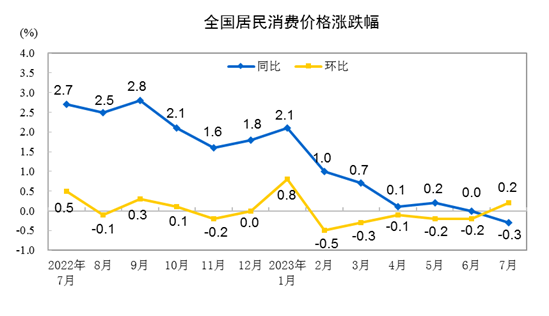
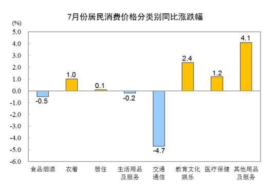
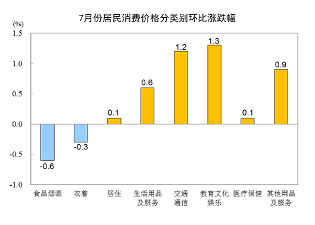

# 统计局：7月份居民消费价格同比下降0.3%，猪肉价格下降26%

2023年7月份，全国居民消费价格同比下降0.3%。其中，城市下降0.2%，农村下降0.6%；食品价格下降1.7%，非食品价格持平；消费品价格下降1.3%，服务价格上涨1.2%。1—7月平均，全国居民消费价格比上年同期上涨0.5%。

7月份，全国居民消费价格环比上涨0.2%。其中，城市上涨0.3%，农村持平；食品价格下降1.0%，非食品价格上涨0.5%；消费品价格下降0.1%，服务价格上涨0.8%。

**一、各类商品及服务价格同比变动情况**

7月份，食品烟酒类价格同比下降0.5%，影响CPI（居民消费价格指数）下降约0.14个百分点。

食品中，畜肉类价格下降14.0%，影响CPI下降约0.48个百分点，其中猪肉价格下降26.0%，影响CPI下降约0.41个百分点；鲜菜价格下降1.5%，影响CPI下降约0.03个百分点；鲜果价格上涨5.0%，影响CPI上涨约0.10个百分点；水产品价格上涨0.4%，影响CPI上涨约0.01个百分点；粮食价格上涨0.3%，影响CPI上涨约0.01个百分点。

其他七大类价格同比五涨两降。其中，其他用品及服务、教育文化娱乐、医疗保健价格分别上涨4.1%、2.4%和1.2%，衣着、居住价格分别上涨1.0%和0.1%；交通通信、生活用品及服务价格分别下降4.7%和0.2%。

**二、各类商品及服务价格环比变动情况**

7月份，食品烟酒类价格环比下降0.6%，影响CPI下降约0.17个百分点。

食品中，鲜果价格下降5.1%，影响CPI下降约0.11个百分点；鲜菜价格下降1.9%，影响CPI下降约0.04个百分点；蛋类价格下降0.8%，影响CPI下降约0.01个百分点；畜肉类价格下降0.6%，影响CPI下降约0.02个百分点；水产品价格上涨0.3%，影响CPI上涨约0.01个百分点。

其他七大类价格环比六涨一降。其中，教育文化娱乐、交通通信、其他用品及服务价格分别上涨1.3%、1.2%和0.9%，生活用品及服务、居住、医疗保健价格分别上涨0.6%、0.1%和0.1%；衣着价格下降0.3%。

**2023年7月份CPI环比由降转涨 PPI环比降幅收窄**

——国家统计局城市司首席统计师董莉娟解读2023年7月份CPI和PPI数据

国家统计局今天发布了2023年7月份全国CPI（居民消费价格指数）和PPI（工业生产者出厂价格指数）数据。对此，国家统计局城市司首席统计师董莉娟进行了解读。

**一、CPI环比由降转涨，同比有所回落**

7月份，居民消费需求持续恢复，CPI环比由降转涨，但受上年同期基数较高影响，同比有所回落。扣除食品和能源价格的核心CPI明显回升，同比上涨0.8%，涨幅比上月扩大0.4个百分点。

从环比看，CPI由上月下降0.2%转为上涨0.2%。其中，食品价格下降1.0%，降幅比上月扩大0.5个百分点，影响CPI下降约0.18个百分点。食品中，应季果蔬大量上市，鲜果和鲜菜价格分别下降5.1%和1.9%；市场供应充足，猪肉价格持平，鸡蛋、食用油、牛羊肉和禽肉类价格下降，降幅在0.4%—1.4%之间。非食品价格由上月下降0.1%转为上涨0.5%，影响CPI上涨约0.40个百分点。非食品中，服务价格上涨0.8%，涨幅比上月扩大0.7个百分点，主要受出行类服务价格上涨带动，其中暑期出游大幅增加，飞机票、旅游和宾馆住宿价格分别上涨26.0%、10.1%和6.5%。工业消费品价格由上月下降0.4%转为上涨0.3%，其中受国际油价上行影响，国内汽油价格上涨1.9%；“618”促销活动结束，大型家用器具、家庭日用杂品和个人护理用品等价格有所回升，涨幅在0.7%—1.2%之间。

从同比看，CPI由上月持平转为下降0.3%。同比由平转降，主要是受上年同期对比基数较高影响。其中，食品价格由上月上涨2.3%转为下降1.7%，影响CPI下降约0.31个百分点。食品中，猪肉价格下降26.0%，降幅比上月扩大18.8个百分点；鲜菜价格由上月上涨10.8%转为下降1.5%；鸡蛋、牛羊肉和虾蟹类价格降幅在1.5%—4.8%之间，降幅均有扩大；鲜果、薯类和禽肉类价格涨幅在2.2%—8.8%之间，涨幅均有回落。非食品价格由上月下降0.6%转为持平。非食品中，服务价格上涨1.2%，涨幅比上月扩大0.5个百分点，其中飞机票价格由上月下降5.8%转为上涨11.9%，宾馆住宿、旅游、电影及演出票价格分别上涨13.2%、13.1%和5.9%，涨幅均有扩大；工业消费品价格下降1.9%，降幅收窄0.8个百分点，其中能源价格下降6.9%，扣除能源的工业消费品价格下降0.3%，降幅均有收窄。

据测算，在7月份0.3%的CPI同比降幅中，上年价格变动的翘尾影响约为0，上月为0.5个百分点；今年价格变动的新影响约为-0.3个百分点，上月为-0.5个百分点。

总体看，CPI同比回落是阶段性的。下阶段，随着我国经济恢复向好，市场需求稳步扩大，供求关系持续改善，加之上年同期高基数影响逐步消除，CPI有望逐步回升。

**二、PPI环比、同比降幅均收窄**

7月份，受国内生产供应总体充足、部分行业需求改善及国际大宗商品价格传导等因素影响，PPI环比、同比降幅均收窄。

从环比看，PPI下降0.2%，降幅比上月收窄0.6个百分点。其中，生产资料价格下降0.4%，降幅收窄0.7个百分点；生活资料价格由上月下降0.2%转为上涨0.3%。国内煤炭、钢材供应充足，需求有所增加，煤炭开采和洗选业、黑色金属冶炼和压延加工业价格分别下降2.0%、0.1%，降幅分别收窄4.4、2.1个百分点。受国际市场原油、有色金属等价格上行影响，国内石油和天然气开采业、有色金属冶炼和压延加工业价格均由降转涨，分别上涨4.2%、0.4%。另外，计算机制造、智能消费设备制造价格均上涨0.4%，锂离子电池制造价格上涨0.3%；文教工美体育和娱乐用品制造业价格上涨0.7%，纺织服装服饰业价格上涨0.6%；水泥制造价格下降6.5%，玻璃制造价格下降2.9%。

从同比看，PPI下降4.4%，降幅比上月收窄1.0个百分点。其中，生产资料价格下降5.5%，降幅收窄1.3个百分点；生活资料价格下降0.4%，降幅收窄0.1个百分点。主要行业价格降幅收窄，石油和天然气开采业下降21.5%，收窄4.1个百分点；煤炭开采和洗选业下降19.1%，收窄0.2个百分点；石油煤炭及其他燃料加工业下降18.3%，收窄1.8个百分点；化学原料和化学制品制造业下降14.2%，收窄0.7个百分点；黑色金属冶炼和压延加工业下降10.6%，收窄5.4个百分点；有色金属冶炼和压延加工业下降1.0%，收窄6.2个百分点。上述6个行业合计影响PPI同比下降约3.21个百分点，占总降幅的七成多，较上月影响减少0.87个百分点。另外，文教工美体育和娱乐用品制造业价格上涨6.3%，电力热力生产和供应业价格上涨1.8%，纺织服装服饰业价格上涨1.2%。

据测算，在7月份4.4%的PPI同比降幅中，上年价格变动的翘尾影响约为-1.6个百分点，上月为-2.8个百分点；今年价格变动的新影响约为-2.8个百分点，上月为-2.6个百分点。

相关数据

国家统计局：7月PPI同比下降4.4% 环比下降0.2%

**附注**

1.指标解释

居民消费价格指数（Consumer Price
Index，简称CPI）是度量居民生活消费品和服务价格水平随着时间变动的相对数，综合反映居民购买的生活消费品和服务价格水平的变动情况。

2.统计范围

居民消费价格统计调查涵盖全国城乡居民生活消费的食品烟酒、衣着、居住、生活用品及服务、交通通信、教育文化娱乐、医疗保健、其他用品及服务等8大类、268个基本分类的商品与服务价格。

3.调查方法

采用抽样调查方法抽选确定调查网点，按照“定人、定点、定时”的原则，直接派人到调查网点或从互联网采集原始价格。数据来源于全国31个省（区、市）约500个市县、近10万家价格调查点，包括商场（店）、超市、农贸市场、服务网点和互联网电商等。

4.数据说明

由于“四舍五入”原因，有时会出现合计数据与分类数据高值或低值相同的情况。

