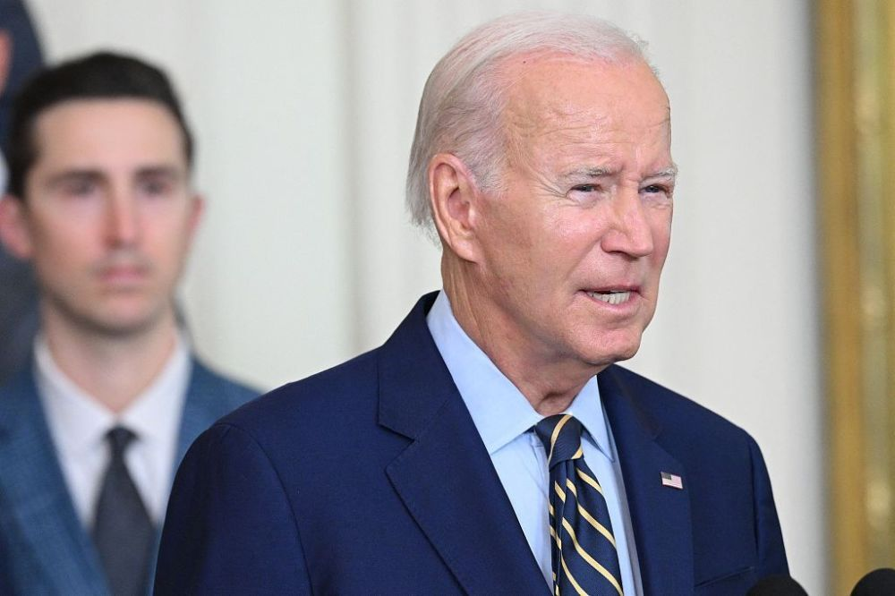

# 美涉台法案违宪？台湾关注后续进展，专家：折射美“府会之争”

【环球时报记者 倪浩 环球时报特约记者
陈立非】美国国会日前通过“美台21世纪贸易倡议首批协议实施法案”，并获总统拜登签署通过。不过美国白宫同时表示，该倡议部分条文有违宪之虞。

_美国总统拜登 资料图_

据台湾“中央社”8日报道，经过一年的协商谈判，美台6月1日通过美国在台协会（AIT）与台北驻美代表处，在华盛顿签署“美台21世纪贸易倡议”首批协议，涵盖关务行政及贸易便捷化、良好法制作业、服务业规章、反贪腐、中小企业五项议题。根据法案规定，协议生效前，美国总统须先向国会报告。法案同时要求美国行政部门，未来与台湾达成的任何进一步协议须符合公开透明原则，并征询国会意见。

6月21日，美国众议院以口头表决方式通过法案，参议院7月18日通过。法案经众议院议长麦卡锡签署后，于7月27日正式送交白宫。美国当地时间8月7日，拜登签署通过。

不过，拜登稍后又发表声明，对法案第七条中若干针对美台后续协商部分规定表达关切。拜登强调，若法案侵犯美国政府（白宫）与境外伙伴谈判的宪法权力，“美国行政当局将视其为不具约束性”。

至于拜登为什么强调“违宪”，复旦大学美国研究中心副主任、台湾研究中心主任信强接受《环球时报》记者采访时表示，拜登的声明折射的是美国历史上常常发生的“府会之争”。但在实际的操作过程当中，拜登不会顾及甚至无视国会在法案中的相应条款。

信强分析说，美国宪法有国会管理外贸权限的规定，美国政府对外的贸易协定则以行政协定的名义签订，从而绕开国会的批准。因此，对于美国政府的做法，美国国会常常表示不满，并在法案中设计一些条款，以对行政部门进行掣肘和监督。

信强表示，拜登照例发布声明，对法案保留意见，提出异议，但是仍然会签署法案，并在实际过程当中“不接受，也不照办”。实际上，只要总统不是太弱，一般都是我行我素，并不顾及国会的相关规定。

有外媒分析称，拜登此次声明谨慎地强调了“违宪”，是为了保证自己作为对外事务主要协商人的权力。“美国之音”日前引用专家意见称，该立法在两党共识下通过，美国行政部门就必须遵守，听取国会意见，这会增加未来双边谈判的复杂程度。不过信强分析说，在美台贸易实际操作过程当中，白宫和国会无疑将会沆瀣一气。

台湾地区领导人蔡英文曾声称，“台美21世纪贸易倡议”是台美双方自1979年以来结构最完整的贸易协定。不过，岛内对贸易倡议有诸多疑虑。“立委”洪申翰质疑称，台湾与新西兰签署“台新经济合作协议”，将于2025年生效，台湾现在鲜乳自给率已经掉到八成以下，如果协议生效，自给率只会更低。洪申翰提到，美国是台湾份额最大的进口地，如果台新之间的鲜乳已经让台湾酪农业捉襟见肘，担心“台美21世纪贸易倡议”带来的冲击恐会更大。

民众党“立委”张其禄质询时称，“台美21世纪贸易倡议”第一阶段是行政协议，审议程序只是送“立法院”备查，但第二阶段谈判涉及农业、劳工和环境等“深水区”，不可能不涉及修法，冲击产业更多。不少岛内工商界人士直言，贸易倡议不涉及关税，对台湾经济实质帮助有限，直批“不谈关税，我们为什么要吃莱猪、跟美国买军购？”

台湾《旺报》的社评认为，台美贸易倡议并非自由贸易协定，不能带来关税减让与市场准入好处，也无法保证台湾可以借此与其他地区签署自贸协定或加入CPTPP（全面与进步跨太平洋伙伴关系协定）等区域经贸组织。更严肃的问题是：单一押注美国会让台湾暴露在更大风险之中。

有台媒痛批，民进党当局只是想交出一张看似亮丽的“成绩单”，营造台美经贸关系“重大突破”的假象，为民进党明年选举加分。台湾中时电子报刊登的一篇评论分析称，2022年拜登宣布启动“印太经济框架”（IPEF），除了想弥补特朗普退出TPP导致的损失外，也想争夺亚太地区的影响力。然而当时美国创立IPEF却排除邀请台湾，如今“台美21世纪贸易倡议”谈判议题被视为与IPEF高度重叠，意味着美方将更为积极重掌亚太地区的经济主导权。至于台湾签署该倡议，主要目的是增加所谓的国际能见度。文章认为，位处地缘政治前线的台湾，加入国际各大经贸整合组织的关键仍在于改善两岸关系。

**相关报道：**

拜登签“美台21世纪贸易倡议首批协议实施法案”，华盛顿“内讧”？岛内网民：演技绝伦

