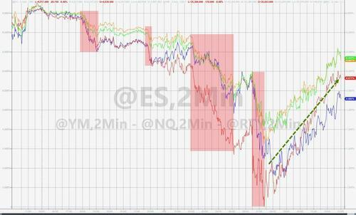
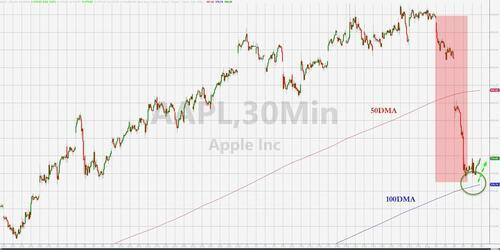
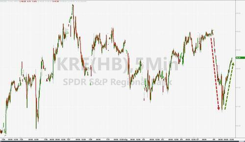
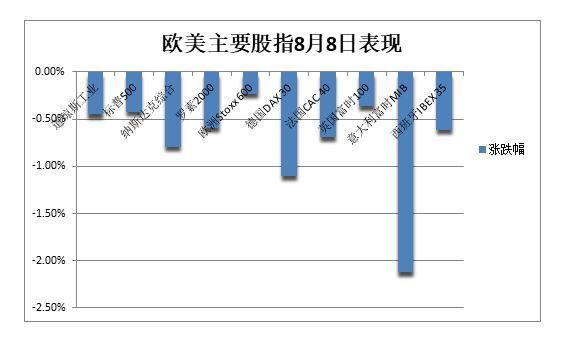
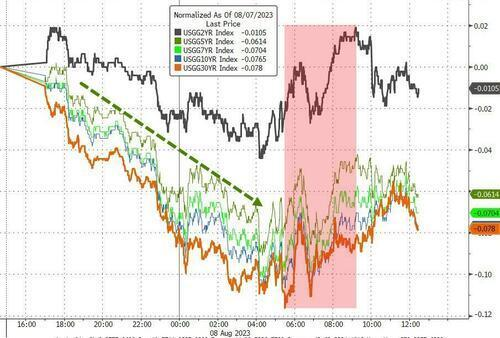
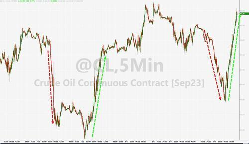
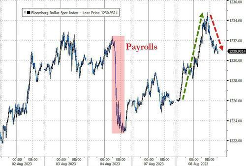

# 美股收盘：美股回落，欧洲银行股大跌，离岸人民币一度跌近500点

今年票委、费城联储主席哈克称，从现在到9月中旬若没有任何令人担忧的新数据，美联储或将结束加息、处在可维持利率不变的节点，呼应了市场对7月是本轮周期最后一次加息的预期。

明年票委、里士满联储主席巴尔金称，在9月FOMC会议前将监控数据，不想预判利率走向，美国熟练工人仍然“结构性短缺”，通胀率依旧过高，对AI显著提高生产力持怀疑态度。

美国6月份贸易逆差收窄至655亿美元创三个月最低，进口降1%至2021年以来最低，反映出消费者的商品需求进一步放缓，出口也跌0.1%。6月批发销售和库存环比均下滑并逊于预期。

德国7月通胀如期降温，欧洲央行9月暂停加息的预期进一步升温。欧央行调查显示，6月欧元区消费者预计未来几个月和几年通胀会继续降温，但对实际收入增长和房价态度悲观。

芝商所的美联储观察工具显示，交易员预计9 月不加息的概率维持在高达86%，明年1月前利率不变的概率接近47%，降息25个基点的概率接近31%

标普和纳指在六个交易日中第五天下跌，盘中美股齐跌超1%，理想汽车失守新高

8月8日周二，亚洲贸易数据疲软、穆迪下调美国10家中小型银行信用评级，以及意大利政府拟对银行征收“暴利税”等多重因素严重打压风险偏好。

美股集体低开，道指和纳指开盘便齐跌约120点，20分钟后纳指跌超1%，开盘近一小时，道指跌幅扩大至超460点或跌1.3%，下逼3.5万点整数位，美股主要指数全线跌超1%。

标普大盘最深跌1.2%并跌穿4500点，纳指最深跌1.6%，罗素小盘股最深跌1.8%。 **尾盘时美股跌幅显著收窄，**
均脱离一周高位，标普和纳指昨日曾止步四日连跌，道指昨日止步三连跌并创6月15日来最佳表现，逼近上周二所创的去年2月9日以来最高。小盘股创近四周最低：

标普500指数收跌19.06点，跌幅0.42%，报4499.38点。道指收跌158.64点，跌幅0.45%，报35314.49点。纳指收跌110.07点，跌幅0.79%，报13884.32点。纳指100跌0.9%，罗素2000小盘股指数跌0.6%。

_盘中美股齐跌超1%，尾盘跌幅显著收窄，纳指全天领跌主要指数_

标普11个板块普跌，原材料跌超1%，可选消费和金融跌0.9%，信息技术/科技跌0.8%，电信服务跌0.2%跌幅最小，能源和公用事业板块则涨0.5%，医疗保健板块涨0.8%。

不少华尔街主流分析师表达对股市的谨慎情绪。

瑞信全球股策略师Andrew Garthwaite称其对股市的看法“越发悲观”，美国明年或出现经济衰退。美国银行的Stephen
Suttmeier称，战术回调已在进行中。摩根大通首席全球市场策略师Marko Kolanovic建议投资者继续减持股票，并称人们对经济状况可能过于乐观。

但外汇经纪商Oanda的高级市场分析师Ed Moya称，突然“黯淡”的全球宏观经济背景令美联储停止加息的希望升温，9 月和 11
月加息的可能性继续走低，2024年起降息的概率不断增大。

**明星科技股普跌但尾盘跌幅收窄。**
元宇宙”Meta跌超1%，亚马逊跌1.6%脱离一年高位，奈飞跌0.6%，微软跌1.2%重返两个月低位，谷歌A几乎抹去1.5%的跌幅接近转涨，特斯拉跌0.7%，连跌三日至六周最低；苹果跌0.7%后转涨0.5%，止步五日连跌脱离两个月最低。

_苹果止步五日连跌，收高于100日均线关键技术位_

**芯片股同样齐跌但尾盘跌幅收窄。** 费城半导体指数跌1.6%失守3700点，AMD跌3%，均脱离月内高位。英特尔跌0.6%，英伟达和台积电美股跌近2%。

**AI概念股回调** 。C3.ai跌近2%，连跌五日至近六周最低，Palantir
Technologies跌超5%，从2021年11月以来最高连跌五日，BigBear.ai跌超3%，SoundHound.ai跌2%，均接近四个半月最低。

消息面上，数据分析公司Palantir
Technologies周一盘后公布利好二季报并上调全年营收指引，称看到人工智能平台AIP的商业化机会，但也有分析师对其是否为“地道的AI股”提出质疑。

**热门中概普跌且尾盘跌幅收窄，追随美股大盘走势。** ETF
KWEB和CQQQ跌2%，纳斯达克金龙中国指数（HXC）跌超4%后收跌2.4%，失守7400点，至7月27日以来的近两周最低。

纳斯达克100成份股中，京东、百度和拼多多均跌超2%。其他个股中，阿里巴巴和B站跌2.4%，腾讯ADR跌超1%。蔚来和小鹏汽车跌5%至近两周新低，财报利好的理想汽车跌8.6%脱离昨日所创历史新高。每日优鲜跌近19%，周一曾涨近32%，上周五涨近285%。理想Q2创史上最佳季度盈利，预计Q3交付将突破10万辆。

**银行股指均跌4%后收跌超1%，至一周最低。**
行业基准费城证交所KBW银行指数（BKX）5月4日曾创2020年10月以来最低。KBW纳斯达克地区银行指数（KRX）脱离3月9日来高位，5月11日曾创2020年11月来最低；SPDR标普地区银行ETF（KRE）脱离3月10日来高位，5月4日曾创2020年10月来最低。

_银行股指均跌4%后收跌超1%，至一周最低_

“美国四大行”齐跌且美国银行跌2%最差，高盛最深跌3.8%并领跌道指成分股。 **重点地区银行中，** 西太平洋合众银行（PacWest
Bancorp）跌4%后收跌1.4%，阿莱恩斯西部银行（Western Alliance Bancorp）跌5%后收跌超1%，Zions
Bancorporation跌近6%后小幅转涨。

消息面上，穆迪下调M&T Bank、Pinnacle Financial、BOK Financial 、Webster
Financial等10家美国中小型银行评级，理由是存款风险、潜在衰退和商业地产陷入困境，将大型金融机构纽约梅隆银行、美国合众银行、道富银行、Truist
Financial、Cullen/Frost Bankers 和 Northern Trust列入降级观察名单，将第一资本、Citizens
Financial和Fifth Third Bancorp等 11 家银行的前景调整为负面。

**其他变动较大的个股包括：**

美国网约车公司Lyft二季度EBITDA净盈利好于预期，市场原本预计亏损，盘后涨13%。

美国超导跌近16%后收跌超13%，至7月27日以来的近两周最低。室温超导概念或“被判死刑”，北大国科大等力证LK-99半悬浮样品不是超导，竟是铁磁材料；韩国所谓超导技术突破也遭到美国同行驳斥，令韩国超导概念股周二暴跌。

全球货运巨头UPS跌超3%后收跌近1%，至一个月最低，二季度EPS超预期，但收入同比跌11%且不及预期，首席财务官称为降低成本裁减了2500名管理人员，并下调全年营收和利润率展望。公司预计劳资谈判和与卡车司机工会达成临时协议将抬升成本和影响货运量。

“美股人造肉第一股”Beyond
Meat跌22%后收跌超14%，连跌三日至逾五周最低，因美国市场需求疲软，二季度净营收逊于预期且下调全年业绩指引，当季每股亏损略强于预期。

教育科技公司Chegg涨近31%后收涨超4%，逼近两个月高位，二季度营收超预期，并概述了整合以人工智能为重点的战略计划，但当季每股收益略逊于预期。

豪华电动车制造商Lucid
Group转涨超12%脱离六周低位，由于Air电动豪华轿车交付量不佳，二季度营收逊于预期、亏损也超预期并同比扩大，但重审年产有望超过1万辆汽车。

制药股今日波动较大。诺瓦瓦克斯医药盘前一度大涨逾30%，高开超17%后转跌近4%，连跌六日至一个月新低，二季度营收远超市场预估。礼来制药涨超18%后收涨近15%，创盘中和收盘历史新高，二季度营收和盈利均好于预期，今年累涨超40%。

带动礼来制药大涨的因素还有丹麦竞争对手诺和诺德（Novo
Nordisk）的欧股和美股均涨超17%，美股创历史新高，关键试验数据显示，其减肥药Wegovy可将肥胖成人罹患心脏病或中风等重大心血管疾病的风险降低20%，提振了欧美制药板块，令欧洲医疗保健类股逆市涨超3%。

欧股普跌，泛欧Stoxx 600指数收跌0.23%，欧元区Stoxx
50指数和德国股指均跌超1%，意大利股指跌超2%，被“暴利税”计划重创的意大利银行板块暴跌7.6%。欧洲银行指数跌2.7%，基础资源指数跌1.8%，汽车、科技、工业和金融板块均跌约1%。

欧美长债收益率大幅走低，10年期美债收益率最深跌近10个基点并一度失守4%

美股盘初，美债收益率恢复跌势且长端收益率跌幅更深。午盘后，对货币政策更敏感的两年期收益率一度小幅转涨重返4.76%，仍徘徊7月20日以来的三周低位。

“全球资产定价之锚”的10年期基准美债收益率最深跌近10个基点并一度失守4%关口，午盘后跌幅砍半，基本抹去上周三以来涨幅。7至30年期美债收益率均跌超7个基点。

_10年期美债收益率最深跌近10个基点并一度失守4%_

欧元区基准的10年和30年期德国长债收益率均跌超13个基点，10年期收益率下逼2.44%创7月27日以来的近两周低位，两年期收益率跌7个基点，与基债息差倒挂接近两个月最窄。

负债较深外围国家基准的10年期意债收益率也跌超10个基点，较上周五的三周高点大幅下滑，两年期收益率跌超9个基点至近两个月最低。10年期以上的英国长债收益率普跌超7个基点。

有分析称，避险需求升温压低欧美国债收益率。同时，欧洲经济背景更令人担忧，令欧元区降息的预期加速抬升，不乏有人预计欧洲央行将在美联储之前开启降息，也加速收益率下行走势。

需求前景担忧令油价日内齐跌2美元，尾盘时转涨并涨超1%，美油重上80美元

亚洲贸易数据发布后，需求前景担忧令国际油价日内齐跌2美元，尾盘时转涨并涨超1%。

WTI 9月原油期货收涨0.98美元，涨幅1.20%，报82.92美元/桶。布伦特10月期货收涨0.83美元，涨幅0.97%，报86.17美元/桶。

美油WTI最深跌2.4%并一度跌穿80美元心理整数位，转涨后重上83美元，布伦特最深跌2.4%并下逼83美元，转涨后重上86美元，均接近昨日盘中所创的4月初以来四个月最高。

_油价日内齐跌2美元，尾盘时转涨并涨超1%_

美国能源信息署EIA的月报预计，2023年美国GDP增长1.9%，高于此前预测的1.5%，预计下半年布油均价86美元，较此前预测上调约7美元，但美国油产今年或创新高至1276万桶/日。

稍早压低油价的因素则包括：中国7月石油进口量环比下降18.8%，创1月份以来日均最低，但同比仍增长17%。因季风降雨限制出行，全球第三大石油进口与消费国印度的7月份燃油消费量跌至十个月最低。但一些分析师仍对中国8月至10月初的燃料需求前景乐观。还有人称，由于利比亚和委内瑞拉等OPEC成员国增加产量，OPEC+实际减少市场供应量的力度或低于预期。

欧洲基准的TTF荷兰天然气期货涨近2%，站稳30欧元/兆瓦时整数位上方，7月曾跌超25%。昨日涨6%的ICE英国天然气再涨2%，7月曾跌超27%，并一度逼近2021年9月以来的近两年最低。

非美货币普跌，美元两周最大涨幅、近一个月高位，离岸人民币一度跌近500点失守7.25元

受避险需求提振，美元兑非美货币普涨。衡量兑六种主要货币的一篮子美元指数DXY最高涨0.7%至102.80，接近上周四所创的7月7日以来近一个月盘中最高，和两周来最大单日涨幅。

_美元两周最大涨幅、近一个月高位_

欧元兑美元跌0.5%并失守1.10关口，基本抹去上周五以来涨幅，英镑兑美元最深跌0.8%或跌近百点，一度失守1.27，调查显示，英国零售商7月的销售额增长为11个月以来最慢。

日元兑美元跌0.7%并失守143，至7月7日以来最低。对风险情绪敏感的瑞典克朗和挪威克朗均下滑，澳元和新西兰纽元均跌1%至两个月最低。

离岸人民币一度跌穿7.25元，较上日收盘最深跌近490点或跌0.7%，美股午盘后重上7.24元，仍创7月7日以来的逾四周低位，在岸人民币兑美元一度跌穿7.22元触及三周低点。

纽约杰富瑞集团（Jefferies）的全球外汇主管贝克特尔（Brad
Bechtel）称，最新经济数据显示全球前景恶化，提振对美元的避险需求，“整个亚洲的出口数据都非常低迷”。

**主流加密货币齐涨。**
市值最大的龙头比特币涨2.5%并上逼3万美元整数位关口，显著脱离七周低位并创7月23日以来的两周新高。第二大的以太坊也涨2%并升破1850美元。

 _比特币涨2.5%并上逼3万美元_

现货黄金跌穿1930美元至四周最低，伦敦工业金属全线跌超1%，伦铜近一个月低位

美元走高打压大宗商品价格。COMEX
9月黄金期货收跌0.51%，报1930.80美元/盎司；10月期货跌0.51%，报1940.50美元/盎司。白银期货跌1.8%并失守23美元/盎司。

现货黄金最深跌近14美元或跌0.7%，跌穿1930美元整数位至7月10日以来的四周新低，且连跌两日，均反应市场情绪不振。

_现货黄金跌穿1930美元至四周最低_

丹麦盛宝银行大宗商品策略主管Ole Hansen称，近期美债收益率上升以及美联储票委鲍曼表示可能需要进一步加息，令金价面临压力。全球最大黄金ETF
GLD的持有量周一跌至五个月最低。

需求前景不确定和美元走强令伦敦工业基本金属普跌。经济风向标“铜博士”跌137美元或跌1.6%，失守8400美元至7月11日以来的近一个月新低，且连跌三日。

伦铝跌1.3%至2200美元，伦铅跌0.6%，均创三周新低，伦锌跌1.6%至近两周低位。伦镍跌1.2%并失守2.1万美元，至逾两周最低。伦锡跌1.6%至7月份以来的逾一个月最低。

