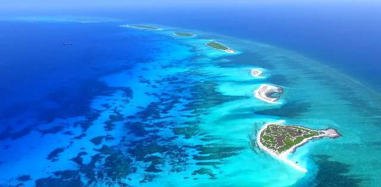

# 美菲重新炒作仁爱礁问题，评论员：中菲南海分歧有三大难题需对症下药

**直新闻：仁爱礁应该是一个老话题，您如何看待现在美菲两国又重新炒作这个老话题？**

**特约评论员 庚欣：**
是的，仁爱礁问题是在1999年，也就是24年前，菲律宾将一艘破旧的坦克登陆舰“马德雷山号”，在仁爱礁西南侧的礁坪，故意采用“坐滩”也就是“搁浅”方式使之滞留，希望改变仁爱礁“无人无设施”的现状，实现菲律宾实际控制的目的。中方执法船则在附近执法。菲律宾一直有十个人左右在那里驻守，然后以空投或海运方式提供物资。在二十多年间，也曾发生过数次争议。例如2021年，菲律宾也是派两条补给船去仁爱礁，当时中国海警船即予以正当阻拦，并以发射水炮等方式使其中止行动。当时菲律宾官方就提出，菲律宾公务船将受到《美菲共同防御条约》保护，并强调2016年所谓南海仲裁案中，是将仁爱礁定位为菲律宾“专属经济区”内，再次炒作“仲裁”话题。当然，对于这一仲裁闹剧，中方一开始就不承认。

今年以来，围绕仁爱礁又出现了多次博弈，包括8月5号这个案例。事实很清楚，美菲再次挑起事端，并炒作这个老话题，是别有用心。而中方正常应对的操作，是专业、克制、无可非议的。

问题的由来很清楚，仁爱礁是中国南沙群岛领土的一部分。虽然有声索争议，但基本的法理、事实都很清晰。应该指出的是，本来仁爱礁“无人无设施”，问题比较简单。但被菲律宾从24年前率先以这种无理方式打破了相互关系的均衡，中方不得已采取必要的行动。过去二十多年中也有一些零星纠纷，但基本还是平稳的。

仁爱礁问题目前具有这样几个性质，首先是“长期性”，它是一个长期形成的问题，至少从菲军舰“坐滩”开始已经有24年，所以可能不会马上得到妥善解决，但至少是可以搁置，可以通过相互谅解、长期磨合来妥善解决的问题。

第二是“复杂性”，因为它不仅涉及到双边主权关系等，还涉及到当地资源的占有和开发等经济物质利益，同时也涉及到背后的大国博弈。特别是美国近日强势介入菲律宾、扩建基地等。这种复杂性，就使得问题很难用简单方式予以解决。

第三就是“可控性”，历史实践证明这个地区形势是可控的，今后也并没有发生冲突的必然性和紧迫感。这次事发之后，马科斯总统也明确说，虽然要继续维护菲律宾的主权，但是也需要继续和中方保持沟通和交流，以便有一个定论性的共识。中方对于仁爱礁问题，更是一直采取了和菲律宾和平谅解协商的方式，比如个别渔民在岛礁附近休息，中方也并未采取什么拦阻行动，可见双方都还是有分寸的。虽然由于菲律宾国内政局变动，会出现一些不必要的麻烦纠纷，美国等大国在背后插手，或刻意炒作渲染，也会造成事态的复杂性等。但总的来看，这样的问题，完全可以通过中国和菲律宾双边协商，管控分歧，避免冲突。

**直新闻：在仁爱礁这样的问题上，到底存在着哪些难题，怎样才能得到妥善的解决？**

**特约评论员 庚欣：** 仁爱礁的事情表面上是一个很小的纠纷，但其实背后隐藏着三个大的难题。

首先，就是涉及到中菲双边关系中的“岛礁声索争议”问题。这个原则的坚持，加上特别是菲律宾内外的各种渲染炒作，以及舆论操作等，就使得这个问题成为了一个很敏感的政治性争议。即使是中菲关系比较好的时候，也很难真正“一步到位”地彻底解决。

其次，就是涉及到了南海地区有油气资源，这就使得各方既难割舍但又希望开发获利，就成为一种复杂的经济和物质利益问题。希望获利就有争斗，但合作开发又需要双方在政治上达成一些共识谅解。

再次，就是深刻的大国博弈背景。从历史上来看，中国几乎所有的领土纠纷，都和当时中国国力衰弱，列强或直接或以代理人方式与中国挑起领土纠纷有关。从今天看，重点是中美之间，当然也包括欧洲日本等与中国之间的相处之道，如果仅仅是中菲之间，问题比较简单，易于解决，但是有了大国博弈的背景，就使得问题复杂化、国际化，这也是显而易见的一个事实。

针对这三大难题，我们应该分类管理，对症下药，同时统筹兼顾，协调对应。

针对“资源开发”等经济物质利益问题，可以采用中方一直强调、并得到相关方认可的“搁置争议，共同开发”的方针，合作发展的实践，会证明我们共同的利益大大超过我们之间的分歧。在这样的磨合中逐渐形成命运和利益的共同体，缓解彼此的排他情绪，把合作的蛋糕越做越大，这样，就有利于逐渐找到一个妥善解决的办法。很多人都认为“油气资源”是引发矛盾的一个负面因素，但我们可以通过努力，使它变成一个我们加强合作的正面因素。

针对“岛礁声索争议”问题，这确实是一个零和性的难题。但是我们可以通过中国政府一贯强调的“搁置争议，和平共处，妥善协商”的方式，采取“和为贵，忍为高，谈为上，信为先”的方针。“和为贵”就是“不冲突”。“忍为高”，就是相互都要增大战略忍耐力。“谈为上”，就是无论什么情况，都坚持以谈判为主。最后是“信为先”，就是谈了之后要诚信守诺。由于中国在南海争议中，始终秉承上述“和平谅解”的建设性态度，所以各方才达成了《南海各方行为宣言》，我们各国的和平发展合作是大主题，我们之间不是只有几个小岛的纠纷，即使有些纠纷也是可以搁置的。实践证明，南海虽时有波澜，但建设“和平之海”、“合作之海”是完全可能的。

针对中美等大国关系问题，这就更需要一把钥匙开一把锁，比如中美之间就要构建中美正确的相处之道。其中就包括了像类似南海这类问题。虽然美国是域外大国，但美国自己认为它有介入的机会。在中国周边有很多类似情况，中美之间怎样才能找到一个最妥善，而且有系统性的设计和安排？这也是一个长期的课题，中美就是在这样的起浮波动中一步步走到今天的，前五十年我们可以化敌为友，今后五十年我们当然有能力构建正确的相处之道。像中欧、中日之间等，都可以分别妥善处理。

面对三大难题，要“三套锣鼓一起敲”，要“搁置争议，缓解矛盾”为先，以“共同开发，合作共赢”为主，以“构建大国正确相处之道”为纲，以“和平发展”作为南海包括仁爱礁问题的解决方向，以此构建“南海行为准则”共识。

**直新闻：中国在南海问题上一直有自己的方针和立场，您觉得怎样做才能在实践中化消极因素为积极因素？真正把南海建设成“和平之海”、“合作之海”呢？**

**特约评论员 庚欣：**
首先，南海毕竟是在中国的家门口。而且中国和其他南海各国之间都具有很好的和平发展、合作共赢的关系。这是解决南海纠纷重要的政治和地缘基础。这与现在欧洲一些地方，由于冷战等遗留因素，依然在刀枪相见的情况有很大的不同之处。

具体到仁爱礁，由于中国和菲律宾两国领导人都希望妥善解决问题。虽然，菲律宾方面，由于政局变动，可能会出现一些政策的调整和变化，但总体来说还是可以协调的。比如前几年有的领导人炒作仲裁案等，恶化了中菲关系，但杜特尔特总统上台之后就实现了很好的转圜；马科斯总统具有一些多面性，但是他也很清楚地表明了依然要保持与中方的沟通和交流，争取达成共识，这样的态度就是合作、协商的基础。

说到美国等大国因素，比如《美菲共同防御条约》等，但是美国毕竟是域外国家，在亚洲，中国和南海各国，我们才是南海的主人。中美也正在走向正确的相处之道。《美菲共同防御条约》当然在亚洲，美国还有其他这样的条约，但是都改变不了东亚人才是东亚主人的基本事实。几十年来南海纠纷等实践证明，这个地区的所有问题，包括中菲关系，都是一种可控的矛盾，都不是一定要诉诸武力才能解决的。这是这个地区的力量、利益和风险关系的综合互动所决定的，不是一个两个域外大国可以撼动的。

今天，我们所有相关国家，第一应该避免南海纠纷过分的国际化，应避免过多的域外国家来介入。这样只会使地区形势更加复杂。第二，应避免南海问题过分的政治化，比如不要过分强调炒作明显带有零和对抗因素的一些话题，而应该就事论事寻找合情合理的解决办法。第三就是避免过分的情绪化，比如舆论和政府官员发言的管控和分寸的掌握。有利于解决问题的话，就可以多说，而不利于解决问题的煽情的话，应尽量少说。

南海问题总是要解决的，总是要逐渐找到一个大家都能接受的办法，和平妥善地予以解决。因为我们各国都是好邻居、好兄弟、好伙伴，有一些问题也大都是历史遗留的问题。从历史到今天再到未来，我们都是友好合作的邻居和伙伴，要实现人类命运共同体的目标，应该从东亚做起。这不仅是中国政府最主要的外交方针，也是南海各国的共同利益所在。

**直新闻：日本又要大幅度增加防卫费用了，日本为什么要这样做？**

**特约评论员 庚欣：**
近年来，日本在防卫领域动作频频。2022年12月出台了《国家安全保障战略》等安保三文件，提出要大幅增加防卫预算、发展远程打击能力，而且将中国定位为“前所未有的最大战略挑战”，以此为自己强军备战制造根据。

今年5月，七国集团广岛峰会上，日本作为东道主，竭力配合美国推动阵营对抗，在这次峰会中大肆炒作渲染“中俄朝威胁日本论”，恰好在美国和中俄等关系出现较大的变局时，日本以此为契机讨好美国,主动配合美国的所谓“印太战略”，同时渲染日本的防务危机，迫使美国对日本松绑，使得日本可以摆脱和平宪法的束缚，从“二战阴影中走出来”，以此为日本强军备战创造宽松的国际环境。

其实，日本的这些变化，根本上还是近年来“日本式焦虑”的集中反映。

首先，在百年变局背景下，美日欧等发达国家的整体优势在下降。日本与中国十几年来经济实力的逆转性变化、以及伴随这些变化中日政治及情感关系的不断下滑，而且这种结构性变局依然在向前快速演进，这些都使得日本的“焦虑”与日俱增。

其次，由于美国的内外交困、实力日衰和政策多变，日本长期在防卫上依赖美国的格局不断受到撼动。特朗普时期对日美同盟的轻视，美国在阿富汗表现出的“失败主义”大撤退，和近来俄乌战事中既挑拨离间又投机闪躲的“外强中干”的本质暴露，都使得日本感受到很大压力。日本很难在美国这里“一棵树吊死”，必须寻求自己的出路。日本一方面是和其他发达国家，例如欧洲各国及澳大利亚等也建立正式的军事合作关系，例如在人、财、物全面实现双边军事准入的协定，与北约建立特殊伙伴关系等。

但是，日本这些做法，实际上并不是解决问题的正道。因为，从日本的国力和国际社会的格局来看，日本很难以强军搞对抗，来缓解安全上的困境。例如，俄乌开战后，岸田一改过去安倍与俄罗斯和解的路线，以便更加与美欧捆绑，但恶化了日俄关系，这就使日本在军事、能源等受到更大压力，可能会面对“三面受敌”的困境。同时，美国近来正在缓和中美关系，日本似乎又感受到了当年尼克松“越顶外交”式的压力。所以，最近岸田也两次提出希望访问中国，并且将“稳定中日关系”作为日本下半年外交工作重点。

今年是中日友好45周年，当年冷战背景下，中日都可以摒弃前嫌，搁置争议，构建友好合作大局，今天，日本一直以中国作为最大贸易伙伴，中日贸易额是美日贸易额的两倍，在华日企盈利率大大高于其他日本企业。实践证明，日本要解困，只能靠“和平发展合作”，扩军备战的老路是走不通的。

作者丨庚欣，深圳卫视《直播港澳台》特约评论员

编辑丨张思南，深圳卫视直新闻主编

排版丨季靳玮，深圳卫视直新闻编辑

