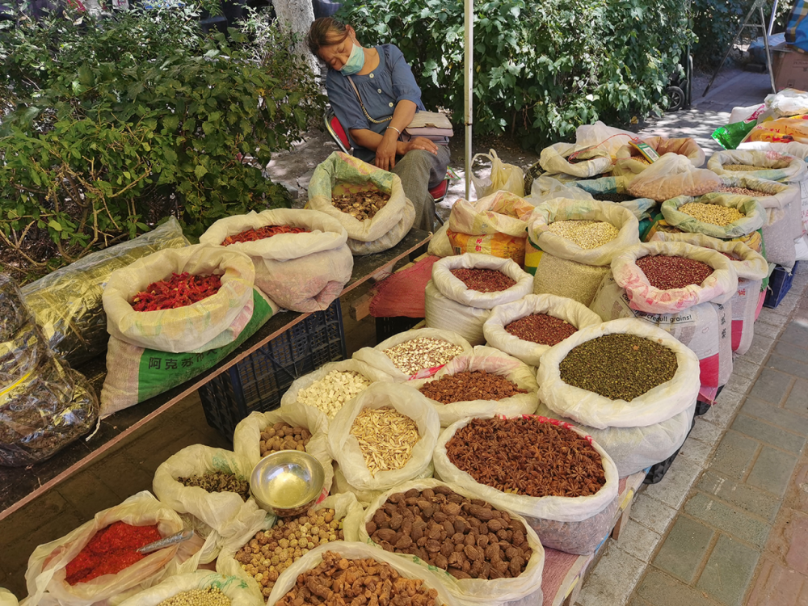
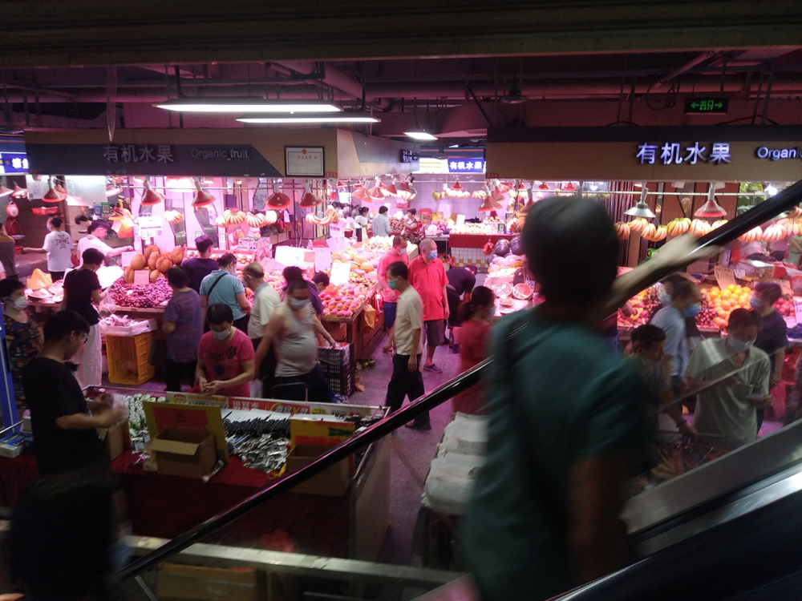

# 遭遇高价罚单与职业打假人，小农小商贩该何去何从？｜餐桌上的物种

核心要点：

  * _1_ 有利可图，于是产生了打假职业。食品安全法引入惩罚性赔偿制度之后，从3倍赔偿提高到了10倍赔偿，原先无利可图的食品领域开始涌入了大量的职业打假人。职业打假，对于食品企业经营的规范起到了一定的作用，但也存在制假打假的行为。
  * _2_ 生态农业在我们这里还属于一个萌芽状态，但在国外已经构成了一个很大的体系，叫做替代性食物系统。它主张建立消费者与生产者的直接链接，因为中间环节越多，我们面临的食品安全风险就越大。
  * _3_ 一个分级管理制度会更合适，毕竟小规模家庭生产和大规模工厂生产区别很大，希望针对小农、小作坊等小规模经营能做出相应更友好的标准和要求。

_食通社供图_

近期，食品安全又引起了不少公众的关注，不过却不是以安全事故的形式。

一方面是新闻报道中屡次出现的“高价罚单”：浙江一农民宰杀自养猪分售700元被罚5万、河南洛阳一大爷卖菜获利21元被罚11万、因在凉皮里加黄瓜丝多家餐饮店被罚5000元……这些和日常经验割裂的事件让读者也思考：高额罚款对于小本经营的普通农民、小商贩、小餐饮公平吗？

另一方面，争议也引起了法规修订中的积极响应。最近，市监总局先后修订了《食品经营许可和备案管理办法》和《食用农产品市场销售质量安全监督管理办法》，其中对于“拍黄瓜”、“卖干货”等此前引起争议的行为开了绿灯。

尽管如此，我们仍然能够看到，有些农民在从事加工品生产时遇到了难以获得资质的困难。法规严厉的处罚制度也让小贩、餐厅、商店乃至线上销售平台都面临着被“打假”的风险，甚至成为让被执法者和执法者双方都感到“头疼”的问题。

本期《一起来唠科》联合食通社，邀请食通社编辑王昊、研究菜市场和可持续食物系统的人类学者钟淑如，专家型律师、北京市食品药品安全法治研究会常务理事兼副秘书长张学明以及乡村创业者李洁，分别从法律监管、职业打假、生态农业等角度共同来探讨高价罚单与职业打假下，小农、小商贩、小餐饮的困境与生存之道。

_食通社供图_

职业打假人：吹哨人VS图利者

**王昊**
（食通社编辑）：从河南一大爷卖菜获利21元被罚11万，到浙江一农民宰杀自养猪分售700元被罚5万，我们能看到现有的食品安全法规与人的日常经验会存在一些割裂。这两个案例事后也确实得到了纠偏。事实上，如果我们的监管者对生产者没有很深的了解，在具体执法的时候，可能就会出现问题和偏差。关于食品安全执法，不只涉及菜贩摊贩，也包括很多小农生产者。李洁是一个农村合作社的负责人，我们请她说说在食品安全领域，作为小生产者在实际工作中可能会遇到哪些难题？

**李洁** （合作社负责人，乡村创业者）：我们自己遭遇的一个相关经历，就是被职业打假。

青梅在我们那里是很传统的一个农作物，很多村民自己在家会拿来泡青梅酒，当地的餐馆、农家乐也会卖这种散装的青梅酒。我们合作社之前也有在做这种青梅酒，我们自己也喝，食品安全是没问题的。可在网上平台帮助我们售卖的一个合作伙伴，后来就被职业打假人投诉了。镇上的工商进来调查之后，我们的合作伙伴被罚了挺多钱，虽然我们作为生产者没有被罚，但合作社的人也很害怕和担心。青梅酒属于农产品加工，没有证就属于是违法。我们也跟镇上来调查的工商咨询该怎么改进，结果发现只有那种蒸馏的白酒在广东那边才可以办小作坊证，像这种泡的酒没有办法办小作坊证，要办证的话，就需要建厂，可能要投入近一百万元，这已经超出了我们的能力。镇上当时还建议我们去找已经有的小作坊一起投资升级成为酒厂，但对我们来说成本还是太高了。

早前也有人建议我们转给外边的加工厂加工，我们也咨询过很多酒厂，但考虑过后还是决定自己加工。一个是价格原因。当地新鲜的青梅其实收购很便宜，这两年每斤也就八九毛，连一块钱都不到。我们合作社收青梅会稍微给高一点，然后自己来做加工，如果是转到外面的加工厂，价格上未必合适。另外，我们也想着加工如果留在村里，这个劳动收益的部分也就可以留在村里。还有，我们自己是在做生态农业，所以也还是希望用生态的方式去做加工，对环境更友好的一些方式，而不是一揽子丢给加工厂。

但现在由于种种原因吧，我们最后还是只能找加工厂做委托生产。

**王昊**
：在李洁的故事里，合作社的产品最终是被“职业打假人”盯上了。现在很多打假人越来越职业化，我们应该怎么看待那些职业打假人呢？有人将之视为食品安全机制里的吹哨人，也有人认为他们就是为了索要一个高额赔偿故意挑刺儿。

**张学明** （专家型律师、北京市食品药品安全法治研究会常务理事兼副秘书长）： **食品安全打假，不论在学术上还是在实务上，都是争议很大的一个问题。**

职业打假的产生首先是源自于我们国家在立法上引用了惩罚性赔偿制度。在这个法律没有出台之前，我们国家的法律中所有的赔偿案件，都适用填补原则。比如，一块平地由于侵权行为变成了坑，赔偿就是把坑填平，挖多少就赔多少，不会从中盈利。《中华人民共和国消费者权益保护法》在上世纪九十年代引入惩罚性赔偿制度之后，规定了三倍的赔偿，也就是说损失是一，可以获赔三，能挣俩。
**有利可图，于是产生了打假职业。**

2009年，《中华人民共和国食品安全法》出台，又把消费者权益保护法中货值三倍的赔偿提高到了十倍。赔偿利润进一步拉大。2014年食品安全法第二次修订以后，把原先500元的最低赔偿提高到了1000元，也就是说一包方便面涉假，即使按10倍赔偿也没有多少，但现在有了最低赔偿，至少也是1000元。于是
**原先无利可图的食品领域开始涌入了大量的职业打假人，也因此涌现了大量食品安全打假的案子。**
对此，相关企业很头疼，尤其是进口食品，一旦被打假成功，产品就会从国内市场出局，哪怕只是标签上的小小瑕疵。

_职业打假人盯上“海外代购”食品 （图源：北京晚报）_

实事求是地讲，
**职业打假，对于食品企业经营的规范起到了一定的作用。但打假案件在执行过程中也确实存在过度、重复的情况，案子多，耗费的精力和审判资源又比较大，导致法院和企业的疲惫感增加；同时，部分打假人也存在制假打假的行为，使食品行业受到严重影响。**
比如在货架上发现一个产品还有几天就到期了，他就给藏起来，塞到货架的一个旮旯里，超市的理货员也看不到。然后到期限了，他去拿出来买再要求赔偿。这种打假人就很招人恨，包括有些打假人自己也恨这样的人，属于“不讲武德”了。

不过，说回来。作为食品企业，要应对职业打假的问题，首先还是应该从自我做起，加强自律和规范经营行为，依法依规经营。同时，对那些制假打假的人，食品企业也要及时报警，坚决打击，让公安来介入按照欺诈等进行处理。

**王昊**
：从执法的角度，基层市场监管部门遇到“职业打假人”的问题时也会感到犯难，所以出现了“民不举、官不究”的现象。这让我想到最近的一个新闻，有些小餐馆没有经营冷食的执照，但店里做了拍黄瓜这道菜，于是被打假了。一盘拍黄瓜不值几个钱，罚金却是好几千。这里面就有职业打假人的身影。这种针对小商贩小餐饮的打假，会不会导致处罚与实际过错不相匹配的问题？如何看待这类执法中的自由裁量基准？

**张学明** ：针对小商贩，监管上确实应该有区别。

首先，这种案例一般应该纳入由省里制定的“三小”管理。 **一般来说，纳入“三小”管理之后，处罚应该是比较轻的。**
第二，各省的市场监管局都制定了食品行政处罚法的自由裁量基准，其中有从轻减轻和免于处罚的具体规定，各省也相应发出了文件和政策。

之所以出现现在对小商贩“小过重罚”的问题，一方面可能是个人需要确认是否申请了小商小贩的认定，有没有被纳入“三小管理”；另一方面也是宏观管理上，这些从轻的政策法规没有利用好实施好。我认为这些情况是可以解决的。

_食通社供图_

小农、小商贩、小餐饮何去何从？

**王昊**
：与李洁的故事相似，我之前也听说过一些案例，比如有的农民合作社想把自己的鲜花椒加工成花椒油，一种路径是代工，一种是自己建厂。代工的话，当地就没有合适的工厂；自己建厂投入成本又太高，所以最后就不了了之。钟老师平常在人类学调查中也会接触很多农民，对这类事情平常有关注吗？

**钟淑如**
（研究菜市场和可持续食物系统的人类学者）：这其实是挺普遍的情况。现在做生态农业的，卖菜是最不赚钱的。因为从消费者对食品的价格期待来说，他们可能觉得菜顶多三四块钱一斤，结果突然卖十块、十五块一斤，大家就接受不了；而且菜又容易损耗，赚钱就更难了。所以，我特别理解像李洁这样做生态农业的，都想通过农产品加工，增加一些产品附加值让自己活下来。可能卖青梅就几毛钱一斤，保存还困难，基本就不挣钱，做成青梅酒附加值就能高一点，有些收益。

但确实 **加工是个很大的问题，小农缺乏相关资质和资金来运行。**
比如卖面粉是很便宜的，但是要加工成饼干，就要自己建工厂，需要拿出一两百万建工厂，可小农怎么可能一下子掏出这么多资金来建厂呢？即使贴牌到别的工厂加工，又会面临各种各样的要求，比如产量够不够、原材料规格有没有达标等等，因为他们帮你加工，用了他们的牌子，就等于他们要承担一部分风险。那其中涉及的信任关系，以及资金和质量协调的东西就会很多很多。

_食通社供图_

目前来看，整个生产环境对生态农业，特别是在加工这方面并不是很友好。一些简单的粗加工，比如把自己腌制的腊肉拿出来卖，一般不会有问题。因为这类粗加工的产品基本上每个市场都有，越是在城乡结合部或者农村的市场就越多。如果这种都要严格执法起来的话，这个边界就变得很宽泛。我觉得一个关键的分界点，是它加工后有没有改变它原来的性状。

**张学明**
：《中华人民共和国食品安全法》第36条第3款明确规定，食品生产加工小作坊和食品摊贩等的具体管理办法由省、自治区、直辖市制定。事实上，小作坊、小商、小贩的入门许可条件以及具体的处罚办法等等，每个省也会有每个省的特点。

有些地方已经制定了小作坊、小商、小贩“三小”的具体管理办法，但有的地方并没有及时跟进。而且对于“三小”的范围和适用条件，各地也有不同的解释，比如有的地方没有将自家酿酒、小饭馆酿酒列入“三小”，就会按照食品安全法需要办理生产许可证，相对门槛高、处罚也重。

此外，也是希望能多些渠道让小农小商和普通人参与到立法和法律法规修订中来。我们知道，在法律和立法参与这一块，大的企业一般都是通过协会或者通过律师来实现。但像李洁他们这样的合作社，或者其他规模比较小的企业，相对机会更少。

首先，可以考虑由地方政府或者由企业自发发起协会，比如建立小作坊协会的群众性组织，或者是通过跟消协等行业协会加强联系，在有关部门制定法律的时候，积极参与立法过程。

其次，建议关注政府部门发布的立法计划和标准计划，比如关注市场监管局、人大、政府等的网站或者一些标准制定机构的信息，及时提出意见和建议，参与修订和完善相关法规。

此外，应该关注媒体的相关报道，了解相关法律法规的变化情况，以便更好地应对食品安全问题。

**王昊**
：食通社之前也研究过一些国家对于食品安全的管理的例子，比如小农生产经营，在美国法会被定义为家庭食品经营，相应的标准也会比企业销售要低很多。只要销售食品的年总收入为5万美元或以下，可以在家生产烘焙食品、罐装果酱或果冻等特定食品，直接向消费者销售。虽然国情不同，不能简单照搬，但是国内是否有可能借鉴类似的管理手段？

**钟淑如**
：这当然是有的，包括像李洁他们的合作社，也属于是直接面对消费者的，很多情况下自己做酒自己卖，没有经过中间商。生态农业在我们这里还属于一个萌芽状态，但在国外已经构成了一个很大的体系，叫做替代性食物系统。它是在以超市、菜市场以及网络电商等主流系统之外搭建起来的另一个网络，主张要建立消费者与生产者的直接链接。
**因为中间环节越多，我们面临的食品安全风险就越大。**

菜市场里面的摊贩或者超市里面的东西，从产地到销地，至少会经过三到六个不同的层级。这个层级越多，链条越长，信息就越模糊越容易被掩盖，到末端的消费者就容易陷在一个信息盲盒里面。比如说今天晚上我吃了番茄炒蛋，如果这个番茄我是从超市里买来的，我就不太了解它是哪里生产的，但如果我是直接从认识的农户那里买的，那它的信息就相对清晰。这就是为什么
**我们要鼓励各种形式的短链销售，越短，信息可能就越透明。**

_食通社供图_

但目前短链销售在整个市场的规模比较小。一个原因是很多消费者不知道有哪些渠道可以买到这样的健康食品；另外一个原因，生态农业的种植要求比较高，产量、规模都不够，因此市场占有率比较低。
**在欧美国家，可以占到5%左右，但是在国内可能连1%的市场都没有。**

这里有个矛盾在于，短链的生产本来就是基于生产者跟消费者之间的信任，很多时候没有标准来框定，也没有标签为自己背书。这种非正式的基于人和人之间、人和物之间的信任的体系，同时要符合很多市场监管和法律上面的规则，就容易产生冲突。

怎么使这种小规模的、非正式的东西得到更多超市、电商等正规渠道进行合作？在信任的机制完全不匹配的情况下，这种链接是学术和实践上都没有解决的问题。

**李洁** ：作为一个小农生产者，其实我对监管体系这些法律知识并不是太懂。从我们自身的视角来看，我觉得
**如果能有一个分级管理制度确实会更合适，毕竟小规模家庭生产和大规模工厂生产有着很大的区别**
。在能够保障基本的卫生、安全条件基础上，希望针对小农、小作坊等小规模经营能做出相应更友好的标准和要求，帮助解决我们资质获取难的问题。比如刚刚提到美国的家庭食品经营政策，它对小规模的农业经营就会有更贴合实际的规定和要求，而不是在管理上一刀切。

**嘉宾信息：**

整理：胡芸雯

版权声明：本文系腾讯新闻《一起来唠科》独家稿件，未经授权禁止媒体转载，但欢迎转发至个人朋友圈。

