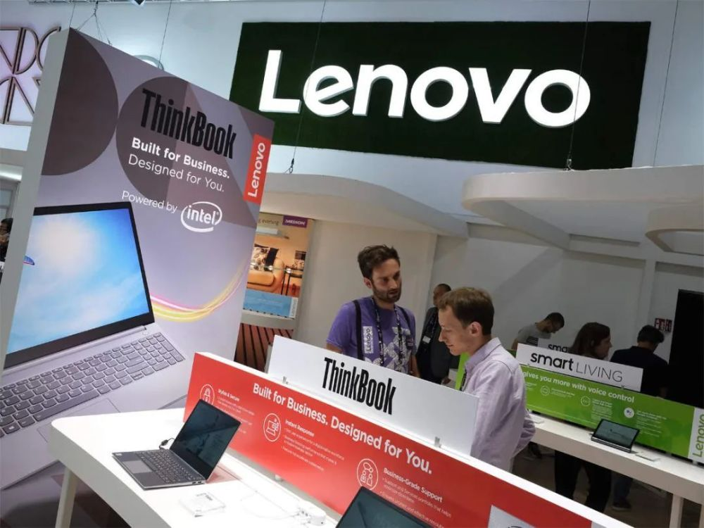
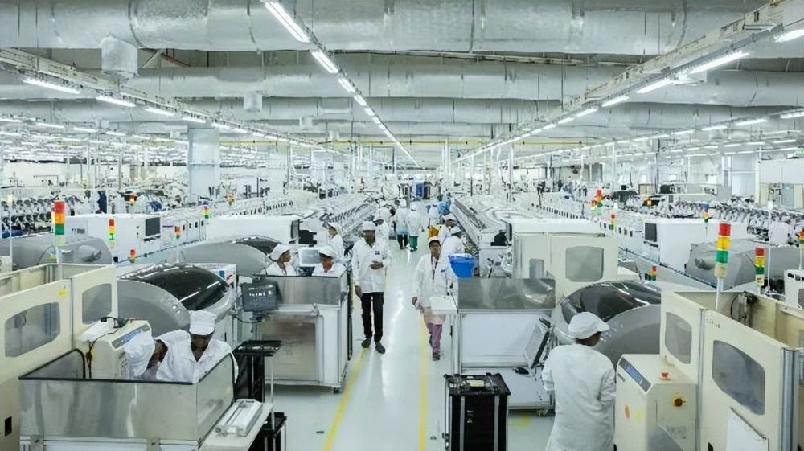

# 中企还会上当吗？“外资坟场”印度故技重施，驱赶电脑厂商“入场”

**正如《印度快报》的报道，印度据此想要复制既往的成功，恐怕并不容易。**

为了实现“印度制造”的夙愿，印度政府又出狠招了。

近日，印度政府突然发布公告，宣布将限制个人台式机与笔记本电脑的进口。除非取得许可证，否则印度境内企业及个人将无法再购买产自国外的个人电脑。

这种以行政令和市场壁垒强行推动本土制造的举措，令全球电脑企业措手不及，且中国企业受到的影响尤为明显。据彭博社报道，目前苹果、三星和惠普等企业已经暂停了向印度出口个人电脑。

印度政府很快就会发现，这种损人不利己的短视行为无法承载他们的“印度梦”。

损伤中企市场份额

当地时间8月3日，印度政府突然发布个人电脑进口限制令，并声称立即生效。由于市场反应过大，时隔一天后，印度政府又宣布了为期近3个月的过渡期，允许企业在11月1日前照旧进口相关产品，并申请进口许可证。

对于这项禁令，印度电子行业协会前总干事阿里·阿克塔尔·贾夫直言：“此举旨在推动印度制造业发展。这不是轻推，而是强推。”

需要说明的是，印度作为全球个人电子产品增长最快的市场之一，几乎没有独立生产与制造个人电脑的能力，仅能依托惠普和戴尔等外国企业进行有限的本土组装。

_联想等中国电脑品牌在印度拥有巨大市场份额。图源：economictimes_

印度电子和信息技术部国务部长钱德拉塞卡称，莫迪政府新规的目标在于“确保获得值得信赖的电脑硬件和系统”，并减少对进口产品的依赖。

全球分析公司Counterpoint的数据显示，印度大约65%的笔记本电脑等个人电脑产品依赖进口。其中，中国企业产品所占的比例很大。

根据印度商业和工业部数据，近5年以来，中国占印度进口各类个人电脑产品的比例稳定在75%左右。在2022年印度台式和笔记本电脑的各品牌市场份额里，前五名分别是惠普、联想、戴尔、宏碁与华硕，其中三家为中国企业。在2022年印度平板电脑市场中，市场份额排名前三的分别是三星、苹果和联想。

今年前5个月，中国笔记本电脑累计出口294.20亿美元，出口额排名前五的国家/地区分别为美国、荷兰、德国、日本、印度。

难以复制手机路径

进口限制令出台后，印度本土电子企业备受鼓舞。市值超过25亿美元的迪克森科技一周以来股价已涨超10%。

印度政府的这一做法，很容易让人联想到印度此前吸引智能手机制造落地的“套路”：莫迪政府上台后，一方面对进口智能手机加税，另一方面对外资采取“以市场换技术”的策略，鼓励外国智能手机品牌在印开设工厂。

数年以来，为抢占印度巨大的市场份额，从苹果到华为，从小米到OPPO，中外智能手机厂商纷纷在印投资设厂。然而，在这些厂商与印度市场紧密捆绑后，印度又屡屡挥舞税收或准入大棒，对外商尤其是中资企业进行打压。

印度此番收紧个人电脑进口，明显想要故伎重演，意图靠自身庞大市场的“饵”再钓“大鱼”。但印度政府计划2026年实现3000亿美元的电子产品产值的目标，推动印度成为“全球电子制造业中心”，面临不少现实阻碍。

_印度渴望复制发展智能手机制造业的成功，图为小米印度工厂。图源：indiatoday_

首先，印度政府虽然通过高关税与市场壁垒显著提高了智能手机与智能电视的本土化生产产量，但是电脑生产的复杂程度远非前两者。印度的管理水平能否支撑电脑的本土化生产，有待观察。

其次，印度电子产品制造仍停留在较为初级的组装阶段，不少电脑零部件都是由中国企业生产和提供的。印度政府强推进口限制令，实际上有可能损及其本土企业的正常发展。

再次，虽然全球产业链与供应链正在重构，但产能转移的对象并非只有印度。印度“外资坟场”的名声远扬，外国企业对印度市场再心动恐怕也会望而却步。

正如《印度快报》的报道，印度据此想要复制既往的成功，恐怕并不容易。

**出品 深海区工作室**

**撰稿 深海龟**

**编辑 陈浩睿**

