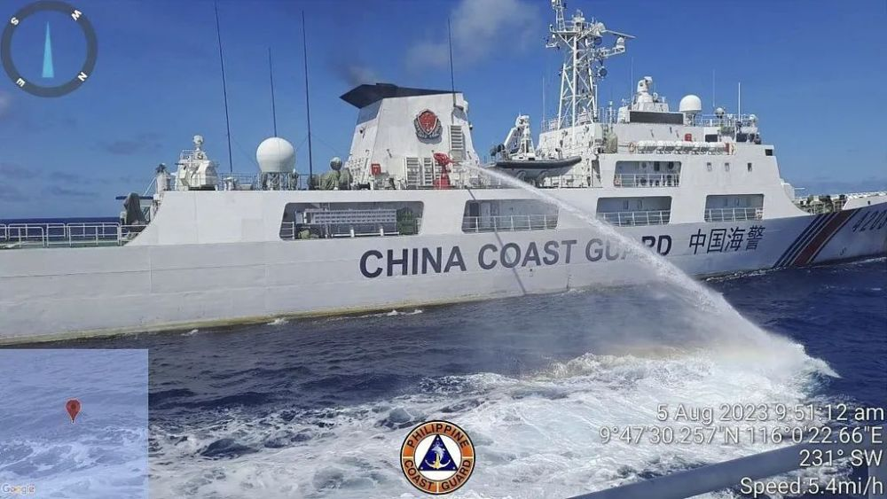

# 仁爱礁风波又起，美国会直接下场帮菲律宾？

8月5日，菲律宾船只再度擅闯仁爱礁海域，说辞很“老套”：向非法“坐滩”24年之久的菲方军舰运送建筑物资。中国海警已经依法使用水炮警示。

菲律宾仁爱礁“坐滩”军舰是个老问题。1999年5月9日，美军轰炸中国驻南联盟大使馆的第二天，菲律宾一艘陈旧军舰驶往仁爱礁，恰好“漏水”，于是就地“坐滩”。中方多次要求菲方拖走军舰，菲方不仅没照办，还一再企图对旧船进行大规模维修加固，企图把一时“坐滩”搞成“永久据点”。

近期仁爱礁补给风波发生后，美国国务院、国防部发表声明指责中方“违反国际法”，称“中方对菲船只的武装攻击将触发《美菲共同防御条约》”。近年来，美国频频拿该《条约》说事，这个《条约》到底含金量几何？又将如何影响仁爱礁局势？

_8月5日，中国海警依法实施必要管控，对菲律宾搭载违规建材的船只进行了拦阻。图/视觉中国_

**“模糊有弹性”的防御条约**

《美菲共同防御条约》到底讲了啥？要知道，美国与亚太地区盟国均订有双边防御条约。而《美菲共同防御条约》的重点是第4条和第5条，核心内容是军事相互援助和共同行动。

比如《条约》第4条规定，“任何一方在太平洋地区遭到的武装攻击，都可能危害本方的和平与安全，并可宣布依据本国宪法程序采取行动，应对共同的危险。”第5条规定，“对任何一方的武装攻击被认为是，攻击任何一方的宗主领土或领地、管辖岛屿的领土或领地，以及在太平洋的武装力量、公共性质的航海器或飞行器。”

但《条约》怎么履行，却是美方说了算。多年来，美国在缔结双边防御条约时格外谨慎：触发条约的条件一定要“模糊有弹性”；宗旨必须是“既充分利用盟国、又避免因盟国无端卷入武装冲突”。意思就是，盟国遇上事，如美国想帮忙，没条件可以创造条件，可要是美国不想介入，也可以找出N种理由拒绝。

拿1951年签订的《美菲共同防御条约》来说，双方认定的防御范围有很大不同：美方将共同防御的菲领土范围限于1898年的《美西条约》，签订条约时菲律宾还没开始声索南沙岛礁，南沙岛礁自然不在范围之内。尽管菲方多次要求将所谓“卡拉延群岛”和“西菲律宾海”纳入《条约》防御范围，但美方直到2010年前后都没给个准话。

不过这几年，美国立场有所松动，宣称“在南沙活动的菲武装力量受《条约》保护。尽管这些岛礁对于美国而言没太大价值，但为了将菲律宾绑上印太战略的战车，同时牵制恐吓中国，美国就必须对仁爱礁等相关事态有所表示，哪怕只是喊两嗓子做做样子。

**试图“倚美抗华”只会适得其反**

问题是，眼下美国真要触发《美菲共同防御条约》吗？

技术层面而言，美国内部分歧很大。较为流行的说辞是“在太平洋上发生对菲船只或船员的‘武装袭击’可触发《条约》，但在使用水炮或激光设备时，是否触发仍存在模糊性”。抛开地理范围，“武装袭击”如何界定也是众说纷纭。

战略及政策方面，不同于口头和外交宣示，除非自身认定的利益造受重大挑战，否则美在通过军事行动为盟友出头极为慎重，事实上极不愿意为盟友火中取栗。毫无疑问，美国想借南海问题限制打压中国，推高地区紧张局势，以能在谋划布局时获得更大的战略空间，但菲律宾觊觎的这些岛礁对于美国而言并无太大价值。美国希望南海“天天有事”，想利用南海问题牵制遏制中国，却不希望现阶段的南海出大事。理由很简单：因仁爱礁与中国爆发武装冲突，并不符合美国利益；而且，当前美国还寄希望在中美竞争中“不战而屈人之兵”，暂时也没有主动对华进行军事摊牌的决心。

近10余年，尽管美方在外交、法理、舆论等方面积极支持菲方在南海的侵权行径，但鲜有直接军事介入，比如黄岩岛事件和多次的仁爱礁摩擦中，美军虽积极提供情报支援，但并未如菲律宾所愿直接提供现场支持。

问题在于，菲律宾方面有着自己的章程，对美国有着不切实际的期望。小马科斯政府试图利用中美竞争，加强其在所谓“西菲律宾海”的主权和海洋权益声索。今年以来，菲律宾在南海问题上几乎是全线出击，除了试图加固仁爱礁“坐滩”军舰，还不停在黄岩岛、铁线礁和牛轭礁等方向制造摩擦。

但菲律宾注定难以如愿，既误判了美国的可能支持，也误判了中国的决心。要知道，当前南海博弈形势，显然还没有到美国要直接军事介入的程度，包括美国决策层在内，任何人都无法确切预料《美菲共同防御条约》将因何触发。长期以来，中方愿保持克制，主要是着眼于中菲关系及南海的和平稳定，而非忌惮《条约》及美军威胁。

对于菲律宾而言，对话协商才是管控与中国南海争议的最优解，试图“倚美抗华”只会适得其反，加剧问题的复杂和形势的紧张。

（作者系“南海战略态势感知计划”主任）

作者：胡波

