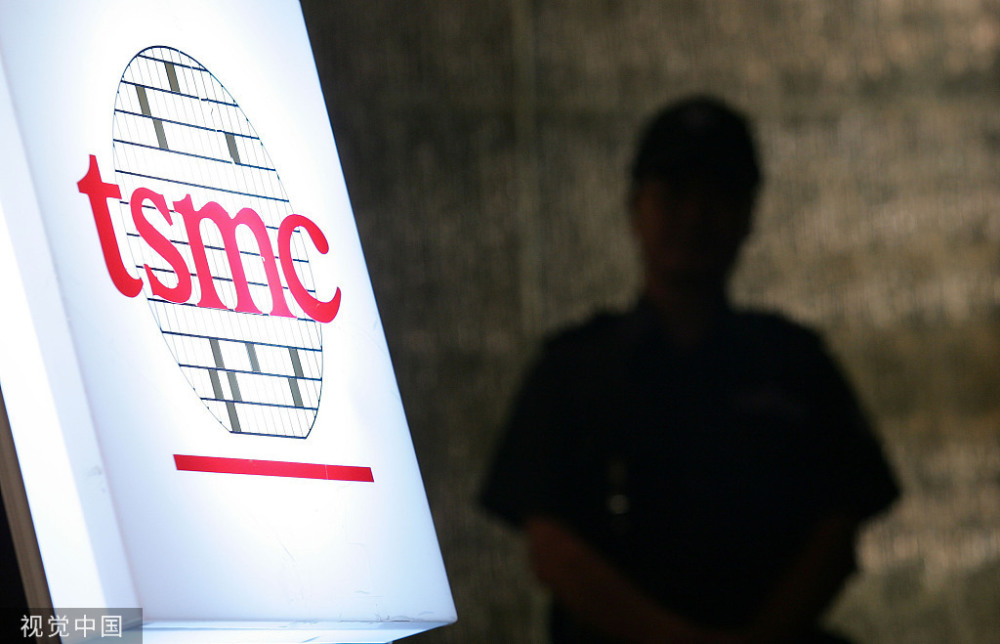

# 台积电百亿欧元项目在德国落地 专家：想把芯片的价格“打”下来很难

【环球时报驻德国特约记者 青木 环球时报记者
王冬】“对未来的赌注——经济学家对台积电获补助持有意见。”德国《世界报》9日报道称，全球最大芯片代工企业台积电决定在德国投资100亿欧元建厂，这将成为其在欧洲投资兴建的第一个芯片代工厂。据称，台积电将持有新工厂70%的股份，合作方德国博世、英飞凌和荷兰芯片制造商恩智浦各持股10%，新工厂将被称为欧洲半导体制造公司（ESMC）。德国联邦政府已承诺提供50亿欧元支持工厂建设。但对于此次合作的前景，一些专业人士并不看好。

_台积电资料图（视觉中国）_

据报道，该工厂计划于2024年下半年开始建设，自2027年年底开始生产。计划生产汽车和其他工业领域的半导体产品，包含22至28纳米和12至16纳米的芯片。欧盟国家此前一直希望在芯片生产方面更加独立于亚洲和美国，而一些企业也希望通过在欧洲和美国的投资来提高“供应链安全性”。近期，经过漫长的谈判，美国英特尔公司获得了在德国马格德堡建设芯片工厂的合同。

德国经济研究所所长马塞尔·弗拉茨舍尔将台积电和英特尔的在德芯片工厂计划视为“对未来的不确定赌注”，仅这两家工厂就花费了德国150亿欧元的补贴。他表示，只有当这两项投资能够推动地区经济并在其他行业和供应商中创造价值和新就业机会时，才会带来回报。这些项目意在帮助德国东部地区发展经济，然而要实现这一目标，必须创造更好的基础设施以及更多的教育、创新投资。

中国通信行业专家项立刚对记者分析称，企业要想在欧洲发展出芯片产业链，摆脱不了生产、运营成本高的挑战，而且很难找到相关人才，欧洲现在所有芯片制造公司基本上都处于亏损状态，“
**台积电到欧洲去很难把芯片的成本降下来。** 所以能不能最终实现一个非常好的商业目标，获得很好的市场机会，需要打一个问号。”

